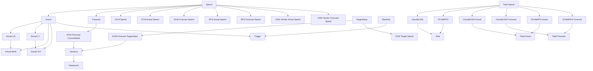
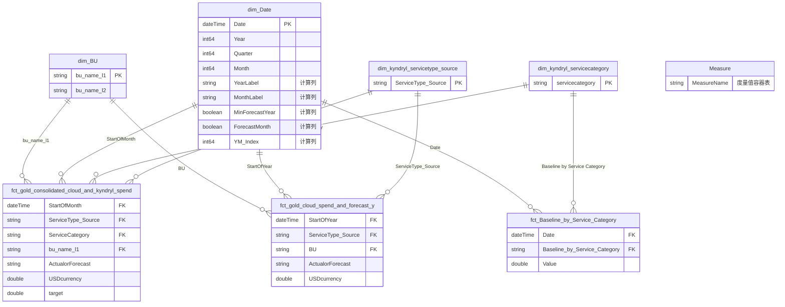
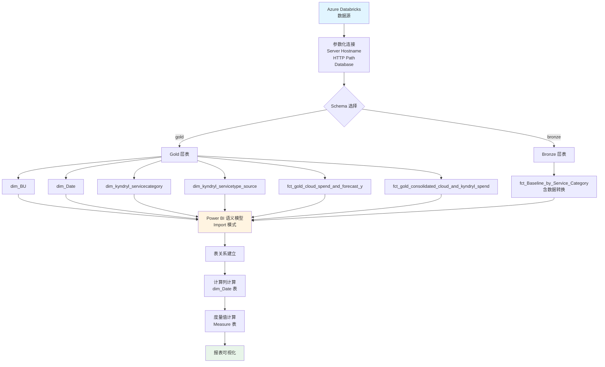

# Power BI 语义模型文档
## Cloud and Kyndryl Spend

**文档版本：** 1.3  
**最后更新：** 2024年12月  
**模型名称：** Cloud and Kyndryl Spend  
**兼容性级别：** 1567

---

## 1. 摘要

### 1.1. 模型概述

本 Power BI 语义模型是一个专注于云服务和 Kyndryl 支出分析的数据模型，旨在为组织提供全面的云支出监控、预测和基准分析能力。模型整合了来自 Azure Databricks 数据仓库的多个数据源，包括实际支出数据、预测数据、基线数据以及相关的维度信息。

**模型核心特点：**
- **数据源：** Azure Databricks (cedm-datamart-dev 数据库)
- **存储模式：** Import（导入模式）
- **表数量：** 8 张表（3 张维度表，3 张事实表，1 张度量值表，1 张辅助表）
- **度量值数量：** 40+ 个业务度量值
- **关系数量：** 8 个表关系

**主要业务领域：**
- 云服务支出分析（Cloud Services）
- Kyndryl 服务支出分析（DCM, RFS, CMS）
- 支出预测与实际对比分析
- 基线对比分析
- 月度/年度趋势分析

### 1.2. 执行摘要

本语义模型为 AIA Group 的云效率和支出管理提供关键的数据分析能力。模型通过整合多个数据源，实现了：

1. **统一的数据视图：** 将分散在不同系统的云支出和 Kyndryl 服务支出数据整合到单一语义模型中
2. **实时分析能力：** 支持实际支出与预测支出的实时对比分析
3. **多维度分析：** 支持按业务单元（BU）、服务类型、服务类别、时间维度进行多角度分析
4. **基准对比：** 提供基线数据对比功能，支持支出趋势评估

**关键业务指标：**
- 实际支出（Actual Spend）
- 预测支出（Forecast Spend）
- 目标支出（Target Spend）
- 基线支出（Baseline Spend）
- 月度环比（MoM）
- 年度同比（YoY）
- 差异分析（Variance）

### 1.3. 核心能力

#### 1.3.1. 数据整合能力
- **多源数据整合：** 从 Azure Databricks 的 gold 和 bronze 层整合数据
- **参数化连接：** 使用参数化查询支持灵活的数据源配置
- **数据标准化：** 统一的数据类型和格式处理

#### 1.3.2. 时间智能分析
- **日期维度表：** 完整的日期维度支持年、季度、月、周等多粒度分析
- **时间计算列：** 支持动态的年度标签、月份标签计算
- **预测时间识别：** 自动识别预测数据的起始时间点

#### 1.3.3. 业务分析能力
- **服务类型分析：** 支持 Cloud、DCM、RFS、CMS(AIA)、CMS(Vendor) 等多服务类型分析
- **业务单元分析：** 支持按业务单元（BU）进行支出分析
- **服务类别分析：** 支持按服务类别进行基线对比分析

#### 1.3.4. 计算能力
- **DAX 度量值：** 40+ 个业务度量值支持复杂的业务计算
- **计算列：** 支持动态标签和标识计算
- **条件计算：** 支持基于业务逻辑的条件计算

### 1.4. 核心业务价值

#### 1.4.1. 财务管控价值
- **支出透明度：** 提供清晰的云服务和 Kyndryl 服务支出视图
- **预算管理：** 支持预测与实际支出的对比，辅助预算管理决策
- **成本优化：** 通过基线对比识别异常支出，支持成本优化

#### 1.4.2. 决策支持价值
- **趋势分析：** 支持月度环比和年度同比分析，识别支出趋势
- **预测准确性：** 通过预测与实际对比，评估预测准确性
- **服务分类分析：** 支持不同服务类型的支出分析，辅助服务策略制定

#### 1.4.3. 运营效率价值
- **自动化报告：** 减少手工数据整理工作，提高报告效率
- **实时监控：** 支持实时数据刷新，及时发现问题
- **标准化分析：** 统一的分析口径和指标定义，提高分析一致性

---

## 2. M代码分析与业务含义

### 2.1. 表分类说明

#### 2.1.1. 表命名规范

本模型遵循标准的维度建模命名规范：

**维度表（Dimension Tables）- 前缀：dim_**
- `dim_BU` - 业务单元维度表
- `dim_Date` - 日期维度表
- `dim_kyndryl_servicecategory` - Kyndryl 服务类别维度表
- `dim_kyndryl_servicetype_source` - Kyndryl 服务类型来源维度表

**事实表（Fact Tables）- 前缀：fct_**
- `fct_Baseline_by_Service_Category` - 按服务类别的基线事实表
- `fct_gold_cloud_spend_and_forecast_y` - 云支出和预测年度事实表
- `fct_gold_consolidated_cloud_and_kyndryl_spend` - 合并的云和 Kyndryl 支出事实表

**辅助表**
- `Measure` - 度量值容器表（Power BI 技术表）

#### 2.1.2. 表分类统计

| 表类型 | 数量 | 表名 |
|--------|------|------|
| 维度表 | 4 | dim_BU, dim_Date, dim_kyndryl_servicecategory, dim_kyndryl_servicetype_source |
| 事实表 | 3 | fct_Baseline_by_Service_Category, fct_gold_cloud_spend_and_forecast_y, fct_gold_consolidated_cloud_and_kyndryl_spend |
| 辅助表 | 1 | Measure |
| **总计** | **8** | |

### 2.2. 模型所有表ETL逻辑

#### 2.2.1. dim_BU（业务单元维度表）

**表说明：**
业务单元维度表，存储组织业务单元层级信息，用于按业务单元进行支出分析。

**业务含义：**
- 支持按业务单元（BU）进行支出分组和分析
- 提供业务单元的一级（L1）和二级（L2）层级结构
- 作为事实表的外键，建立业务单元与支出数据的关联

**M代码：**
```m
let
    Source = Databricks.Catalogs(#"Server Hostname", #"HTTP Path", [Catalog=null, Database=null, EnableAutomaticProxyDiscovery=null]),
    #"cedm-datamart-dev_Database" = Source{[Name=Database,Kind="Database"]}[Data],
    gold_Schema = #"cedm-datamart-dev_Database"{[Name="gold",Kind="Schema"]}[Data],
    dim_bu_Table = gold_Schema{[Name="dim_bu_l1",Kind="Table"]}[Data]
in
    dim_bu_Table
```

**ETL逻辑流程：**
1. **连接数据源：** 使用参数化的 Databricks 连接（Server Hostname, HTTP Path）
2. **选择数据库：** 从连接中选择指定的数据库（Database 参数）
3. **选择Schema：** 选择 gold Schema（数据仓库的金层）
4. **选择表：** 选择 dim_bu_l1 表
5. **数据加载：** 直接加载表数据，无额外转换

**关键业务指标：**
- `bu_name_l1` - 业务单元一级名称（主键）
- `bu_name_l2` - 业务单元二级名称

**数据来源：**
- 数据源：Azure Databricks
- Schema：gold
- 表名：dim_bu_l1

---

#### 2.2.2. dim_Date（日期维度表）

**表说明：**
日期维度表，提供完整的日期层次结构，支持时间智能分析和多粒度时间分析。

**业务含义：**
- 支持年、季度、月、周、日等多粒度时间分析
- 提供时间标签和索引，支持时间序列分析
- 包含计算列，用于标识实际和预测时间段

**M代码：**
```m
let
    Source = Databricks.Catalogs(#"Server Hostname", #"HTTP Path", [Catalog=null, Database=null, EnableAutomaticProxyDiscovery=null]),
    #"cedm-datamart-dev_Database" = Source{[Name=Database,Kind="Database"]}[Data],
    gold_Schema = #"cedm-datamart-dev_Database"{[Name="gold",Kind="Schema"]}[Data],
    dim_date_Table = gold_Schema{[Name="dim_date",Kind="Table"]}[Data]
in
    dim_date_Table
```

**ETL逻辑流程：**
1. **连接数据源：** 使用参数化的 Databricks 连接
2. **选择数据库：** 选择指定的数据库
3. **选择Schema：** 选择 gold Schema
4. **选择表：** 选择 dim_date 表
5. **数据加载：** 直接加载表数据

**关键业务指标：**
- `Date` - 日期（主键）
- `Year`, `Quarter`, `Month`, `Day` - 时间层次
- `YearName`, `QuarterName`, `MonthName` - 时间名称
- `Y&QName`, `Y&M` - 年月组合
- `YearLabel` - 年度标签（计算列，标识实际/预测年份）
- `MonthLabel` - 月份标签（计算列，标识实际/预测月份）
- `MinForecastYear` - 最小预测年份标识（计算列）
- `ForecastMonth` - 预测月份标识（计算列）

**数据来源：**
- 数据源：Azure Databricks
- Schema：gold
- 表名：dim_date

**特殊说明：**
- 包含多个 DAX 计算列，用于动态标识实际和预测时间段
- `YearLabel` 列根据最小预测年份自动添加 "A"（Actual）或 "F"（Forecast）后缀
- `MonthLabel` 列根据最小预测年月自动添加 "Act" 或 "F'cast" 后缀

---

#### 2.2.3. dim_kyndryl_servicecategory（Kyndryl 服务类别维度表）

**表说明：**
Kyndryl 服务类别维度表，存储服务类别信息，用于基线数据的分类分析。

**业务含义：**
- 支持按服务类别进行基线支出分析
- 作为基线事实表的外键，建立服务类别与基线数据的关联

**M代码：**
```m
let
    Source = Databricks.Catalogs(#"Server Hostname", #"HTTP Path", [Catalog=null, Database=null, EnableAutomaticProxyDiscovery=null]),
    #"cedm-datamart-dev_Database" = Source{[Name=Database,Kind="Database"]}[Data],
    gold_Schema = #"cedm-datamart-dev_Database"{[Name="gold",Kind="Schema"]}[Data],
    dim_kyndryl_servicecategory_Table = gold_Schema{[Name="dim_kyndryl_servicecategory",Kind="Table"]}[Data]
in
    dim_kyndryl_servicecategory_Table
```

**ETL逻辑流程：**
1. **连接数据源：** 使用参数化的 Databricks 连接
2. **选择数据库：** 选择指定的数据库
3. **选择Schema：** 选择 gold Schema
4. **选择表：** 选择 dim_kyndryl_servicecategory 表
5. **数据加载：** 直接加载表数据

**关键业务指标：**
- `servicecategory` - 服务类别（主键）

**数据来源：**
- 数据源：Azure Databricks
- Schema：gold
- 表名：dim_kyndryl_servicecategory

---

#### 2.2.4. dim_kyndryl_servicetype_source（Kyndryl 服务类型来源维度表）

**表说明：**
Kyndryl 服务类型来源维度表，存储服务类型来源信息，用于按服务类型进行支出分析。

**业务含义：**
- 支持按服务类型（Cloud, DCM, RFS, CMS(AIA), CMS(Vendor)）进行支出分析
- 作为多个事实表的外键，建立服务类型与支出数据的关联

**M代码：**
```m
let
    Source = Databricks.Catalogs(#"Server Hostname", #"HTTP Path", [Catalog=null, Database=null, EnableAutomaticProxyDiscovery=null]),
    #"cedm-datamart-dev_Database" = Source{[Name=Database,Kind="Database"]}[Data],
    gold_Schema = #"cedm-datamart-dev_Database"{[Name="gold",Kind="Schema"]}[Data],
    dim_bu_Table = gold_Schema{[Name="dim_kyndryl_servicetype_source",Kind="Table"]}[Data]
in
    dim_bu_Table
```

**ETL逻辑流程：**
1. **连接数据源：** 使用参数化的 Databricks 连接
2. **选择数据库：** 选择指定的数据库
3. **选择Schema：** 选择 gold Schema
4. **选择表：** 选择 dim_kyndryl_servicetype_source 表
5. **数据加载：** 直接加载表数据

**关键业务指标：**
- `ServiceType_Source` - 服务类型来源（主键）

**数据来源：**
- 数据源：Azure Databricks
- Schema：gold
- 表名：dim_kyndryl_servicetype_source

**服务类型说明：**
- Cloud - 云服务
- DCM - Digital Customer Management
- RFS - Request for Service
- CMS(AIA) - Content Management System (AIA)
- CMS(Vendor) - Content Management System (Vendor)

---

#### 2.2.5. fct_Baseline_by_Service_Category（按服务类别的基线事实表）

**表说明：**
按服务类别的基线事实表，存储各服务类别的基线支出数据，用于与实际支出进行对比分析。

**业务含义：**
- 提供各服务类别的基线支出数据
- 支持实际支出与基线支出的对比分析
- 用于计算触发指标（Trigger），评估支出是否超出基线

**M代码：**
```m
let
    Source = Databricks.Catalogs(#"Server Hostname", #"HTTP Path", [Catalog=null, Database=null, EnableAutomaticProxyDiscovery=null]),
    #"cedm-datamart-dev_Database" = Source{[Name=Database,Kind="Database"]}[Data],
    bronze_Schema = #"cedm-datamart-dev_Database"{[Name="bronze",Kind="Schema"]}[Data],
    bronze_sharepoint_dcm_baseline_Table = bronze_Schema{[Name="bronze_sharepoint_dcm_baseline",Kind="Table"]}[Data],
    #"Added Custom" = Table.AddColumn(bronze_sharepoint_dcm_baseline_Table, "Date", each [month]&"-01"),
    #"Changed Type" = Table.TransformColumnTypes(#"Added Custom",{{"Date", type date}}),
    #"Renamed Columns" = Table.RenameColumns(#"Changed Type",{{"servicecategory", "Baseline by Service Category"}, {"baseline", "Value"}}),
    #"Changed Type1" = Table.TransformColumnTypes(#"Renamed Columns",{{"Value", type number}})
in
    #"Changed Type1"
```

**ETL逻辑流程：**
1. **连接数据源：** 使用参数化的 Databricks 连接
2. **选择数据库：** 选择指定的数据库
3. **选择Schema：** 选择 bronze Schema（数据仓库的青铜层，原始数据）
4. **选择表：** 选择 bronze_sharepoint_dcm_baseline 表（来自 SharePoint 的原始基线数据）
5. **添加日期列：** 将月份字段转换为日期格式（添加 "-01" 后缀）
6. **数据类型转换：** 将日期列转换为日期类型
7. **重命名列：** 
   - `servicecategory` → `Baseline by Service Category`
   - `baseline` → `Value`
8. **数据类型转换：** 将 Value 列转换为数字类型

**关键业务指标：**
- `Date` - 日期（外键，关联 dim_Date）
- `Baseline by Service Category` - 服务类别（外键，关联 dim_kyndryl_servicecategory）
- `Value` - 基线支出值（可聚合度量值）
- `month` - 月份（原始字段）
- `ingestion_file_name` - 数据摄取文件名
- `ingestion_date` - 数据摄取日期
- `notebook_name` - 数据摄取笔记本名称

**数据来源：**
- 数据源：Azure Databricks
- Schema：bronze（原始数据层）
- 表名：bronze_sharepoint_dcm_baseline
- 数据来源：SharePoint（注释中显示原始数据来自 SharePoint Excel 文件）

**业务逻辑说明：**
- 基线数据用于与实际支出进行对比
- 通过 Trigger 度量值（Actual/Baseline）评估支出是否超出基线
- 数据来自 SharePoint，经过 Databricks 处理后在 bronze 层存储

---

#### 2.2.6. fct_gold_cloud_spend_and_forecast_y（云支出和预测年度事实表）

**表说明：**
云支出和预测年度事实表，存储按年度汇总的云服务支出和预测数据，支持年度级别的支出分析。

**业务含义：**
- 提供年度级别的云服务支出和预测数据
- 支持按服务类型（Cloud, CMS(AIA), CMS(Vendor), DCM, RFS）进行年度分析
- 支持实际支出与预测支出的年度对比

**M代码：**
```m
let
    Source = Databricks.Catalogs(#"Server Hostname", #"HTTP Path", [Catalog=null, Database=null, EnableAutomaticProxyDiscovery=null]),
    #"cedm-datamart-dev_Database" = Source{[Name=Database,Kind="Database"]}[Data],
    gold_Schema = #"cedm-datamart-dev_Database"{[Name="gold",Kind="Schema"]}[Data],
    gold_cloud_spend_and_forecast_y_Table = gold_Schema{[Name="gold_cloud_spend_and_forecast_y",Kind="Table"]}[Data]
in
    gold_cloud_spend_and_forecast_y_Table
```

**ETL逻辑流程：**
1. **连接数据源：** 使用参数化的 Databricks 连接
2. **选择数据库：** 选择指定的数据库
3. **选择Schema：** 选择 gold Schema（数据仓库的金层，已处理数据）
4. **选择表：** 选择 gold_cloud_spend_and_forecast_y 表
5. **数据加载：** 直接加载表数据，无额外转换

**关键业务指标：**
- `StartOfYear` - 年度开始日期（外键，关联 dim_Date）
- `ServiceType_Source` - 服务类型来源（外键，关联 dim_kyndryl_servicetype_source）
- `BU` - 业务单元（外键，关联 dim_BU）
- `ActualorForecast` - 实际或预测标识（"Actual" 或 "Forecast"）
- `USDcurrency` - 美元金额（可聚合度量值）
- `ingestion_date` - 数据摄取日期
- `notebook_name` - 数据摄取笔记本名称

**数据来源：**
- 数据源：Azure Databricks
- Schema：gold（已处理数据层）
- 表名：gold_cloud_spend_and_forecast_y

**业务逻辑说明：**
- 数据按年度汇总，支持年度级别的支出分析
- 包含实际和预测两种数据类型
- 支持按服务类型和业务单元进行分组分析
- 用于年度支出趋势分析和预测准确性评估

---

#### 2.2.7. fct_gold_consolidated_cloud_and_kyndryl_spend（合并的云和 Kyndryl 支出事实表）

**表说明：**
合并的云和 Kyndryl 支出事实表，这是模型的核心事实表，存储详细的月度支出数据，包括实际支出和预测支出。

**业务含义：**
- 提供最详细的月度级别支出数据
- 支持多维度分析：时间、服务类型、服务类别、业务单元
- 包含目标支出数据，支持目标与实际/预测的对比
- 包含详细的交易信息（CR号、资源单元等）

**M代码：**
```m
let
    Source = Databricks.Catalogs(#"Server Hostname", #"HTTP Path", [Catalog=null, Database=null, EnableAutomaticProxyDiscovery=null]),
    #"cedm-datamart-dev_Database" = Source{[Name=Database,Kind="Database"]}[Data],
    gold_Schema = #"cedm-datamart-dev_Database"{[Name="gold",Kind="Schema"]}[Data],
    gold_consolidated_cloud_and_kyndryl_spend_Table = gold_Schema{[Name="gold_consolidated_cloud_and_kyndryl_spend",Kind="Table"]}[Data]
in
    gold_consolidated_cloud_and_kyndryl_spend_Table
```

**ETL逻辑流程：**
1. **连接数据源：** 使用参数化的 Databricks 连接
2. **选择数据库：** 选择指定的数据库
3. **选择Schema：** 选择 gold Schema
4. **选择表：** 选择 gold_consolidated_cloud_and_kyndryl_spend 表
5. **数据加载：** 直接加载表数据，无额外转换

**关键业务指标：**
- `StartOfMonth` - 月度开始日期（外键，关联 dim_Date）
- `ServiceType_Source` - 服务类型来源（外键，关联 dim_kyndryl_servicetype_source）
- `ServiceCategory` - 服务类别（外键，关联 dim_kyndryl_servicecategory）
- `bu_name_l1` - 业务单元一级名称（外键，关联 dim_BU）
- `ActualorForecast` - 实际或预测标识（"Actual" 或 "Forecast"）
- `USDcurrency` - 美元金额（可聚合度量值）
- `target` - 目标支出金额（可聚合度量值）
- `ServiceMonth` - 服务月份
- `No` - 编号
- `ResourceUnit` - 资源单元
- `CR` - Change Request 号
- `CRTitle_Description` - CR 标题和描述
- `ingestion_date` - 数据摄取日期
- `notebook_name` - 数据摄取笔记本名称

**数据来源：**
- 数据源：Azure Databricks
- Schema：gold（已处理数据层）
- 表名：gold_consolidated_cloud_and_kyndryl_spend

**业务逻辑说明：**
- 这是模型的核心事实表，包含最详细的支出数据
- 支持月度级别的详细分析
- 包含目标支出数据，支持目标与实际/预测的对比分析
- 包含详细的交易信息，支持钻取分析
- 用于生成大部分业务度量值

**注释说明：**
- M代码中包含注释掉的 Excel 数据源代码，显示原始数据可能来自 Excel 文件
- 当前使用 Databricks 作为数据源，数据已经过处理和整合

---

#### 2.2.8. Measure（度量值容器表）

**表说明：**
度量值容器表，这是 Power BI 的技术表，用于存储所有度量值定义。该表本身不包含数据行，仅作为度量值的容器。

**业务含义：**
- 作为所有业务度量值的容器
- 不参与数据关系，仅用于组织度量值

**M代码：**
```m
let
    Source = Table.FromRows(Json.Document(Binary.Decompress(Binary.FromText("i44FAA==", BinaryEncoding.Base64), Compression.Deflate)), let _t = ((type nullable text) meta [Serialized.Text = true]) in type table [Column1 = _t]),
    #"Removed Columns" = Table.RemoveColumns(Source,{"Column1"})
in
    #"Removed Columns"
```

**ETL逻辑流程：**
1. **创建空表：** 从压缩的 JSON 数据创建空表
2. **移除列：** 移除所有列，创建完全空的表结构

**关键业务指标：**
- 该表不包含业务指标，仅作为度量值的容器

**数据来源：**
- 技术表，无外部数据源

**业务逻辑说明：**
- 这是 Power BI 的标准做法，所有度量值都存储在 Measure 表中
- 度量值的实际定义使用 DAX 语言，存储在表的 measure 属性中
- 该表不参与数据模型的关系，仅用于组织度量值

---

### 2.3. 模型所有参数表ETL逻辑

#### 2.3.1. Server Hostname（服务器主机名参数）

**类型：** Text（文本类型）  
**必需参数：** 是

**M代码：**
```m
expression 'Server Hostname' = "adb-3085800437590429.9.azuredatabricks.net" 
meta [IsParameterQuery=true, Type="Text", IsParameterQueryRequired=true]
```

**用途：**
- 指定 Azure Databricks 服务器的主机名
- 用于建立与 Databricks 数据仓库的连接

**使用场景：**
- 所有需要连接 Databricks 的表查询都会使用此参数
- 当需要切换数据源环境时，只需修改此参数值

**业务含义：**
- 数据源连接配置的核心参数
- 支持环境切换（开发、测试、生产环境）

**当前值：**
- `adb-3085800437590429.9.azuredatabricks.net`

---

#### 2.3.2. HTTP Path（HTTP路径参数）

**类型：** Text（文本类型）  
**必需参数：** 是

**M代码：**
```m
expression 'HTTP Path' = "/sql/1.0/warehouses/b709e878048ab49a" 
meta [IsParameterQuery=true, Type="Text", IsParameterQueryRequired=true]
```

**用途：**
- 指定 Azure Databricks SQL Warehouse 的 HTTP 路径
- 用于建立与特定 SQL Warehouse 的连接

**使用场景：**
- 所有需要连接 Databricks 的表查询都会使用此参数
- 当需要切换 SQL Warehouse 时，只需修改此参数值

**业务含义：**
- 数据源连接配置的核心参数
- 指向特定的 SQL Warehouse 实例

**当前值：**
- `/sql/1.0/warehouses/b709e878048ab49a`

---

#### 2.3.3. Database（数据库参数）

**类型：** Text（文本类型）  
**必需参数：** 是

**M代码：**
```m
expression Database = "cedm-datamart-dev" 
meta [IsParameterQuery=true, Type="Text", IsParameterQueryRequired=true]
```

**用途：**
- 指定要连接的数据库名称
- 用于在 Databricks 中选择目标数据库

**使用场景：**
- 所有需要连接 Databricks 的表查询都会使用此参数
- 当需要切换数据库时，只需修改此参数值

**业务含义：**
- 数据源连接配置的核心参数
- 指向特定的数据库实例
- 当前指向开发环境的数据集市（cedm-datamart-dev）

**当前值：**
- `cedm-datamart-dev`

**环境说明：**
- `cedm` - 可能代表 CEDM（Cloud Efficiency Data Mart）
- `datamart` - 数据集市
- `dev` - 开发环境

---

### 2.4. 模型所有自定义函数逻辑

**说明：** 经过分析，本模型未定义自定义 M 函数。所有数据转换逻辑都直接在表的 M 查询中实现。

**函数使用情况：**
- 模型主要使用 Power Query 的内置函数进行数据转换
- 数据转换逻辑相对简单，主要是数据源连接和基本的数据类型转换
- 复杂的数据处理逻辑在 Databricks 端完成，Power BI 端主要进行数据加载

**建议：**
- 如果未来需要重复的数据转换逻辑，可以考虑创建自定义函数以提高代码复用性

---

### 2.5. ETL流程总结

#### 2.5.1. 数据流向

```
Azure Databricks (数据源)
    ↓
参数化连接 (Server Hostname, HTTP Path, Database)
    ↓
Schema 选择 (gold / bronze)
    ↓
表选择
    ↓
数据加载 (Import 模式)
    ↓
Power BI 语义模型
    ↓
DAX 计算 (计算列、度量值)
    ↓
报表可视化
```

#### 2.5.2. 关键ETL模式

**模式1：直接加载模式（Direct Load Pattern）**
- **适用表：** dim_BU, dim_Date, dim_kyndryl_servicecategory, dim_kyndryl_servicetype_source, fct_gold_cloud_spend_and_forecast_y, fct_gold_consolidated_cloud_and_kyndryl_spend
- **特点：** 数据在 Databricks 端已完成处理，Power BI 端直接加载
- **优势：** 性能好，逻辑简单
- **流程：** 连接 → 选择数据库 → 选择Schema → 选择表 → 加载

**模式2：轻量转换模式（Light Transformation Pattern）**
- **适用表：** fct_Baseline_by_Service_Category
- **特点：** 数据在 Power BI 端进行轻量级转换（列添加、重命名、类型转换）
- **优势：** 灵活性高，可以快速调整数据格式
- **流程：** 连接 → 选择数据库 → 选择Schema → 选择表 → 添加列 → 重命名列 → 类型转换 → 加载

**模式3：参数化连接模式（Parameterized Connection Pattern）**
- **适用场景：** 所有表查询
- **特点：** 使用参数化查询支持环境切换
- **优势：** 易于维护，支持多环境部署
- **参数：** Server Hostname, HTTP Path, Database

#### 2.5.3. 数据分层架构

**Bronze 层（原始数据层）：**
- `bronze_sharepoint_dcm_baseline` - 来自 SharePoint 的原始基线数据
- 特点：原始数据，未经处理

**Gold 层（已处理数据层）：**
- `dim_bu_l1` - 业务单元维度
- `dim_date` - 日期维度
- `dim_kyndryl_servicecategory` - 服务类别维度
- `dim_kyndryl_servicetype_source` - 服务类型来源维度
- `gold_cloud_spend_and_forecast_y` - 年度支出和预测
- `gold_consolidated_cloud_and_kyndryl_spend` - 合并的月度支出
- 特点：已处理、已清洗、可直接使用

---

### 2.6. 表关系说明

#### 2.6.1. 关系概览

模型包含 8 个表关系，全部为自动检测的关系（AutoDetected）或手动创建的关系。

#### 2.6.2. 关系详细说明

**关系1：fct_gold_consolidated_cloud_and_kyndryl_spend → dim_BU**
- **关系ID：** AutoDetected_19b8b47d-7340-4a9e-8227-21b6f41c92d1
- **从表：** fct_gold_consolidated_cloud_and_kyndryl_spend
- **从列：** bu_name_l1
- **到表：** dim_BU
- **到列：** bu_name_l1
- **关系类型：** 多对一（Many-to-One）
- **业务含义：** 将支出数据关联到业务单元维度，支持按业务单元分析支出

**关系2：fct_gold_consolidated_cloud_and_kyndryl_spend → dim_Date**
- **关系ID：** b378edf3-f62d-d85d-48c7-db37fc8ca8f1
- **从表：** fct_gold_consolidated_cloud_and_kyndryl_spend
- **从列：** StartOfMonth
- **到表：** dim_Date
- **到列：** Date
- **关系类型：** 多对一（Many-to-One）
- **业务含义：** 将月度支出数据关联到日期维度，支持时间智能分析

**关系3：fct_Baseline_by_Service_Category → dim_Date**
- **关系ID：** 1bed5812-94a5-2fab-f780-ddafdc0bc287
- **从表：** fct_Baseline_by_Service_Category
- **从列：** Date
- **到表：** dim_Date
- **到列：** Date
- **关系类型：** 多对一（Many-to-One）
- **业务含义：** 将基线数据关联到日期维度，支持时间序列分析

**关系4：fct_gold_cloud_spend_and_forecast_y → dim_Date**
- **关系ID：** bdb60688-cdcc-3483-9dab-f6b86d16f4f1
- **从表：** fct_gold_cloud_spend_and_forecast_y
- **从列：** StartOfYear
- **到表：** dim_Date
- **到列：** Date
- **关系类型：** 多对一（Many-to-One）
- **业务含义：** 将年度支出数据关联到日期维度，支持年度分析

**关系5：fct_gold_cloud_spend_and_forecast_y → dim_BU**
- **关系ID：** 60247485-cf78-d353-a7ad-11777c6e75ed
- **从表：** fct_gold_cloud_spend_and_forecast_y
- **从列：** BU
- **到表：** dim_BU
- **到列：** bu_name_l1
- **关系类型：** 多对一（Many-to-One）
- **业务含义：** 将年度支出数据关联到业务单元维度

**关系6：fct_gold_consolidated_cloud_and_kyndryl_spend → dim_kyndryl_servicecategory**
- **关系ID：** AutoDetected_2412e784-2d33-4dc2-8b37-01cb83fdd4e1
- **从表：** fct_gold_consolidated_cloud_and_kyndryl_spend
- **从列：** ServiceCategory
- **到表：** dim_kyndryl_servicecategory
- **到列：** servicecategory
- **关系类型：** 多对一（Many-to-One）
- **业务含义：** 将支出数据关联到服务类别维度，支持按服务类别分析

**关系7：fct_Baseline_by_Service_Category → dim_kyndryl_servicecategory**
- **关系ID：** 63e7b058-51ca-a80b-66ec-00340acc27fe
- **从表：** fct_Baseline_by_Service_Category
- **从列：** Baseline by Service Category
- **到表：** dim_kyndryl_servicecategory
- **到列：** servicecategory
- **关系类型：** 多对一（Many-to-One）
- **业务含义：** 将基线数据关联到服务类别维度

**关系8：fct_gold_consolidated_cloud_and_kyndryl_spend → dim_kyndryl_servicetype_source**
- **关系ID：** AutoDetected_9ad1344f-a359-4da6-a344-8b26e8ab0137
- **从表：** fct_gold_consolidated_cloud_and_kyndryl_spend
- **从列：** ServiceType_Source
- **到表：** dim_kyndryl_servicetype_source
- **到列：** ServiceType_Source
- **关系类型：** 多对一（Many-to-One）
- **业务含义：** 将支出数据关联到服务类型来源维度，支持按服务类型分析

**关系9：fct_gold_cloud_spend_and_forecast_y → dim_kyndryl_servicetype_source**
- **关系ID：** AutoDetected_d6deec44-f0aa-4c33-b26b-510b3c2c75b3
- **从表：** fct_gold_cloud_spend_and_forecast_y
- **从列：** ServiceType_Source
- **到表：** dim_kyndryl_servicetype_source
- **到列：** ServiceType_Source
- **关系类型：** 多对一（Many-to-One）
- **业务含义：** 将年度支出数据关联到服务类型来源维度

#### 2.6.3. 关系图总结

**星型模型结构：**
- **中心事实表：** fct_gold_consolidated_cloud_and_kyndryl_spend（主要事实表）
- **维度表：** dim_BU, dim_Date, dim_kyndryl_servicecategory, dim_kyndryl_servicetype_source
- **辅助事实表：** fct_Baseline_by_Service_Category, fct_gold_cloud_spend_and_forecast_y

**关系特点：**
- 所有关系都是多对一（Many-to-One）关系
- 维度表作为"一"端，事实表作为"多"端
- 符合星型模型设计规范

---

### 2.7. 数据质量保证

#### 2.7.1. 错误处理机制

**当前错误处理：**
- **数据类型转换：** 使用 `Table.TransformColumnTypes` 进行显式类型转换
- **空值处理：** 依赖 Databricks 端的数据质量处理
- **错误值替换：** 在注释代码中看到 `Table.ReplaceErrorValues` 的使用（已注释）

**建议改进：**
1. **添加错误处理步骤：** 在 M 查询中添加 `try...otherwise` 错误处理
2. **数据验证：** 添加数据范围验证和业务规则验证
3. **错误日志：** 记录数据加载过程中的错误信息

#### 2.7.2. 数据验证

**当前验证：**
- **数据类型验证：** 通过类型转换进行隐式验证
- **外键完整性：** 通过表关系保证外键完整性
- **数据范围验证：** 依赖 Databricks 端处理

**建议添加的验证：**
1. **必填字段验证：** 验证关键字段不为空
2. **数据范围验证：** 验证金额字段在合理范围内
3. **日期有效性验证：** 验证日期字段的有效性
4. **业务规则验证：** 验证业务规则（如实际金额不能为负）

**示例改进代码：**
```m
// 添加数据验证步骤
#"Validated Data" = Table.SelectRows(#"Changed Type1", each 
    [Value] >= 0 and 
    [Date] <> null and 
    [Baseline by Service Category] <> null
)
```

---

### 2.8. 性能优化建议

#### 2.8.1. 数据加载优化

**当前状态：**
- 所有表使用 Import 模式，数据加载到 Power BI 内存中
- 数据在 Databricks 端已预处理，减少 Power BI 端处理负担

**优化建议：**

1. **增量刷新：**
   - 对于大型事实表（fct_gold_consolidated_cloud_and_kyndryl_spend），考虑实施增量刷新
   - 仅刷新最近的数据，减少刷新时间和资源消耗

2. **数据分区：**
   - 在 Databricks 端对事实表进行分区（按日期、业务单元等）
   - 提高查询性能

3. **列筛选：**
   - 在 M 查询中添加列筛选，仅加载需要的列
   - 减少内存占用

4. **数据类型优化：**
   - 使用最小的数据类型（如使用 Int32 而非 Int64，如果数据范围允许）
   - 减少内存占用

#### 2.8.2. 查询优化

**当前状态：**
- M 查询相对简单，主要是数据加载
- 复杂计算在 DAX 端完成

**优化建议：**

1. **查询折叠：**
   - 确保 M 查询能够正确折叠到数据源
   - 在数据源端完成尽可能多的处理

2. **减少数据量：**
   - 在数据源端添加必要的筛选条件
   - 避免加载不必要的数据

3. **缓存优化：**
   - 合理设置数据刷新计划
   - 利用 Power BI 的查询缓存机制

#### 2.8.3. 模型优化

**当前状态：**
- 星型模型结构，符合最佳实践
- 维度表较小，事实表较大

**优化建议：**

1. **计算列优化：**
   - 评估计算列的性能影响
   - 考虑将部分计算列移到数据源端计算

2. **度量值优化：**
   - 使用 CALCULATE 和 FILTER 时注意性能
   - 避免在度量值中使用复杂的迭代函数

3. **关系优化：**
   - 确保关系列已建立索引（在数据源端）
   - 使用单列关系，避免多列关系

#### 2.8.4. 刷新优化

**当前状态：**
- 所有表独立刷新

**优化建议：**

1. **并行刷新：**
   - 配置表之间的依赖关系
   - 允许独立表并行刷新

2. **刷新计划：**
   - 根据业务需求设置合理的刷新频率
   - 避免在业务高峰期刷新

3. **增量刷新：**
   - 对大型事实表实施增量刷新策略
   - 减少刷新时间和资源消耗

---

## 3. DAX代码分析与业务含义

### 3.1. 数据沿袭分析方法

#### 3.1.1. 依赖类型

在 Power BI 语义模型中，数据沿袭（Data Lineage）描述了数据元素之间的依赖关系。本模型中的依赖类型包括：

**1. 度量值依赖关系**
- **度量值 → 度量值：** 一个度量值引用另一个度量值
- **度量值 → 列：** 度量值引用表中的列
- **度量值 → 表：** 度量值引用整个表

**2. 计算列依赖关系**
- **计算列 → 列：** 计算列引用同一表或其他表的列
- **计算列 → 度量值：** 计算列引用度量值（不推荐，但可能）

**3. 表依赖关系**
- **表 → 表：** 通过关系连接的表
- **表 → 数据源：** 表与数据源的依赖

#### 3.1.2. 识别模式

**度量值依赖识别：**
- 查找 `CALCULATE`、`SUM`、`MAX` 等函数中的表名和列名
- 查找度量值名称（用方括号 `[]` 包围）
- 查找 `FILTER`、`ALL` 等函数中的表引用

**计算列依赖识别：**
- 查找列名引用（表名[列名]）
- 查找度量值引用（[度量值名]）
- 查找 DAX 函数中的表引用

**关系依赖识别：**
- 通过 `RELATED`、`RELATEDTABLE` 函数识别跨表依赖
- 通过关系图识别表之间的连接

---

### 3.2. 模型所有表度量值

本模型包含 **40+ 个度量值**，全部存储在 `Measure` 表中。以下是所有度量值的详细分析：

#### 3.2.1. 核心支出度量值

**1. Spend（总支出）**
- **类型：** 聚合度量值
- **位置：** Measure 表，显示文件夹：`fct_gold_consolidated_cloud_and_kyndryl_spend`
- **定义：** 计算所有云和 Kyndryl 支出的总和
- **计算公式：** SUM(USDcurrency)
- **DAX代码：**
```dax
Spend = SUM('fct_gold_consolidated_cloud_and_kyndryl_spend'[USDcurrency])
```
- **依赖关系：**
  - 依赖表：`fct_gold_consolidated_cloud_and_kyndryl_spend`
  - 依赖列：`USDcurrency`
- **业务含义：** 基础支出度量值，用于计算其他派生度量值
- **用法：** 作为其他度量值的基础，支持按维度筛选

---

**2. Actual（实际支出）**
- **类型：** 条件聚合度量值
- **位置：** Measure 表，显示文件夹：`fct_gold_consolidated_cloud_and_kyndryl_spend`
- **定义：** 计算实际支出（非预测）的总和
- **计算公式：** SUM(USDcurrency) WHERE ActualorForecast = "Actual"
- **DAX代码：**
```dax
Actual = 
CALCULATE(
    SUM('fct_gold_consolidated_cloud_and_kyndryl_spend'[USDcurrency]),
    fct_gold_consolidated_cloud_and_kyndryl_spend[ActualorForecast] = "Actual"
)
```
- **依赖关系：**
  - 依赖表：`fct_gold_consolidated_cloud_and_kyndryl_spend`
  - 依赖列：`USDcurrency`, `ActualorForecast`
- **业务含义：** 核心业务指标，表示已发生的实际支出
- **用法：** 用于实际支出分析、与预测对比、趋势分析

---

**3. Forecast（预测支出）**
- **类型：** 条件聚合度量值
- **位置：** Measure 表，显示文件夹：`fct_gold_consolidated_cloud_and_kyndryl_spend`
- **定义：** 计算预测支出（非实际）的总和
- **计算公式：** SUM(USDcurrency) WHERE ActualorForecast = "Forecast"
- **DAX代码：**
```dax
Forecast = 
CALCULATE(
    SUM('fct_gold_consolidated_cloud_and_kyndryl_spend'[USDcurrency]),
    fct_gold_consolidated_cloud_and_kyndryl_spend[ActualorForecast] = "Forecast"
)
```
- **依赖关系：**
  - 依赖表：`fct_gold_consolidated_cloud_and_kyndryl_spend`
  - 依赖列：`USDcurrency`, `ActualorForecast`
- **业务含义：** 核心业务指标，表示未来预测的支出
- **用法：** 用于预测分析、与实际对比、预算管理

---

**4. TargetValue（目标支出）**
- **类型：** 聚合度量值
- **位置：** Measure 表，显示文件夹：`fct_gold_consolidated_cloud_and_kyndryl_spend`
- **定义：** 计算目标支出的总和
- **计算公式：** SUM(target)
- **DAX代码：**
```dax
TargetValue = SUM(fct_gold_consolidated_cloud_and_kyndryl_spend[target])
```
- **依赖关系：**
  - 依赖表：`fct_gold_consolidated_cloud_and_kyndryl_spend`
  - 依赖列：`target`
- **业务含义：** 目标支出值，用于与实际和预测对比
- **用法：** 用于目标达成分析、差异分析

---

#### 3.2.2. DCM 相关度量值

**5. DCM Forecast Consolidated（DCM 预测汇总）**
- **类型：** 条件聚合度量值
- **位置：** Measure 表，显示文件夹：`fct_gold_consolidated_cloud_and_kyndryl_spend`
- **定义：** 计算 DCM 服务类型的预测支出
- **计算公式：** Forecast WHERE ServiceType_Source = "DCM"
- **DAX代码：**
```dax
DCM Forecast Consolidated = 
CALCULATE(
    [forecast],
    dim_kyndryl_servicetype_source[ServiceType_Source] IN {"DCM"}
)
```
- **依赖关系：**
  - 依赖度量值：`Forecast`
  - 依赖表：`dim_kyndryl_servicetype_source`
  - 依赖列：`ServiceType_Source`
- **业务含义：** DCM 服务的预测支出，用于 DCM 专项分析
- **用法：** 用于 DCM 预测分析、与目标对比

---

**6. DCM Forecast TargetValue（DCM 预测目标值）**
- **类型：** 条件聚合度量值
- **位置：** Measure 表，显示文件夹：`fct_gold_consolidated_cloud_and_kyndryl_spend`
- **定义：** 计算 DCM 服务类型的预测目标值
- **计算公式：** TargetValue WHERE ServiceType_Source = "DCM" AND ActualorForecast = "Forecast"
- **DAX代码：**
```dax
DCM Forecast TargetValue = 
CALCULATE(
    [TargetValue],
    dim_kyndryl_servicetype_source[ServiceType_Source] IN {"DCM"},
    fct_gold_consolidated_cloud_and_kyndryl_spend[ActualorForecast] = "Forecast"
)
```
- **依赖关系：**
  - 依赖度量值：`TargetValue`
  - 依赖表：`dim_kyndryl_servicetype_source`, `fct_gold_consolidated_cloud_and_kyndryl_spend`
- **业务含义：** DCM 预测期间的目标值
- **用法：** 用于 DCM 预测与目标对比

---

**7. DCM Spend（DCM 支出）**
- **类型：** 条件聚合度量值
- **位置：** Measure 表，显示文件夹：`fct_gold_consolidated_cloud_and_kyndryl_spend`
- **定义：** 计算 DCM 服务类型的所有支出
- **计算公式：** Spend WHERE ServiceType_Source = "DCM"
- **DAX代码：**
```dax
DCM Spend = 
CALCULATE(
    [Spend],
    dim_kyndryl_servicetype_source[ServiceType_Source] = "DCM"
)
```
- **依赖关系：**
  - 依赖度量值：`Spend`
  - 依赖表：`dim_kyndryl_servicetype_source`
- **业务含义：** DCM 服务的总支出（实际+预测）
- **用法：** 用于 DCM 支出分析

---

**8. DCM Actual Spend（DCM 实际支出）**
- **类型：** 条件聚合度量值（带智能筛选）
- **位置：** Measure 表，显示文件夹：`fct_gold_consolidated_cloud_and_kyndryl_spend`
- **定义：** 计算 DCM 服务类型的实际支出，支持智能年份筛选
- **计算公式：** 
  - 如果未筛选年份：Spend WHERE ServiceType_Source = "DCM" AND ActualorForecast = "Actual" AND MinForecastYear = TRUE
  - 如果已筛选年份：Spend WHERE ServiceType_Source = "DCM" AND ActualorForecast = "Actual"
- **DAX代码：**
```dax
DCM Actual Spend = 
IF(
    NOT ISFILTERED('dim_Date'[YearName]),
    CALCULATE(
        [Spend],
        KEEPFILTERS(dim_kyndryl_servicetype_source[ServiceType_Source] = "DCM"),
        'fct_gold_consolidated_cloud_and_kyndryl_spend'[ActualorForecast] = "Actual",
        dim_Date[MinForecastYear] = TRUE()
    ),
    CALCULATE(
        [Spend],
        KEEPFILTERS(dim_kyndryl_servicetype_source[ServiceType_Source] = "DCM"),
        'fct_gold_consolidated_cloud_and_kyndryl_spend'[ActualorForecast] = "Actual"
    )
)
```
- **依赖关系：**
  - 依赖度量值：`Spend`
  - 依赖表：`dim_Date`, `dim_kyndryl_servicetype_source`, `fct_gold_consolidated_cloud_and_kyndryl_spend`
  - 依赖列：`YearName`, `MinForecastYear`, `ServiceType_Source`, `ActualorForecast`
- **业务含义：** DCM 服务的实际支出，智能处理年份筛选逻辑
- **用法：** 用于 DCM 实际支出分析，自动适应不同的筛选上下文

---

**9. DCM Forecast Spend（DCM 预测支出）**
- **类型：** 条件聚合度量值（带智能筛选）
- **位置：** Measure 表，显示文件夹：`fct_gold_consolidated_cloud_and_kyndryl_spend`
- **定义：** 计算 DCM 服务类型的预测支出，支持智能年份筛选
- **DAX代码：**
```dax
DCM Forecast Spend = 
IF(
    NOT ISFILTERED('dim_Date'[YearName]),
    CALCULATE(
        [Spend],
        KEEPFILTERS(dim_kyndryl_servicetype_source[ServiceType_Source] = "DCM"),
        'fct_gold_consolidated_cloud_and_kyndryl_spend'[ActualorForecast] = "Forecast",
        dim_Date[MinForecastYear] = TRUE()
    ),
    CALCULATE(
        [Spend],
        KEEPFILTERS(dim_kyndryl_servicetype_source[ServiceType_Source] = "DCM"),
        'fct_gold_consolidated_cloud_and_kyndryl_spend'[ActualorForecast] = "Forecast"
    )
)
```
- **依赖关系：** 同 DCM Actual Spend
- **业务含义：** DCM 服务的预测支出
- **用法：** 用于 DCM 预测支出分析

---

**10. DCM Target Spend（DCM 目标支出）**
- **类型：** 条件聚合度量值
- **位置：** Measure 表，显示文件夹：`fct_gold_consolidated_cloud_and_kyndryl_spend`
- **定义：** 计算 DCM 服务类型的目标支出
- **DAX代码：**
```dax
DCM Target Spend = 
CALCULATE(
    [TargetValue],
    dim_kyndryl_servicetype_source[ServiceType_Source] = "DCM"
)
```
- **依赖关系：**
  - 依赖度量值：`TargetValue`
  - 依赖表：`dim_kyndryl_servicetype_source`
- **业务含义：** DCM 服务的目标支出
- **用法：** 用于 DCM 目标达成分析

---

#### 3.2.3. RFS 相关度量值

**11. RFS Actual Spend（RFS 实际支出）**
- **类型：** 条件聚合度量值（带智能筛选）
- **位置：** Measure 表，显示文件夹：`fct_gold_consolidated_cloud_and_kyndryl_spend`
- **定义：** 计算 RFS 服务类型的实际支出
- **DAX代码：** 类似 DCM Actual Spend，将 "DCM" 替换为 "RFS"
- **依赖关系：** 同 DCM Actual Spend
- **业务含义：** RFS 服务的实际支出
- **用法：** 用于 RFS 实际支出分析

---

**12. RFS Forecast Spend（RFS 预测支出）**
- **类型：** 条件聚合度量值（带智能筛选）
- **位置：** Measure 表，显示文件夹：`fct_gold_consolidated_cloud_and_kyndryl_spend`
- **定义：** 计算 RFS 服务类型的预测支出
- **DAX代码：** 类似 DCM Forecast Spend，将 "DCM" 替换为 "RFS"
- **依赖关系：** 同 DCM Forecast Spend
- **业务含义：** RFS 服务的预测支出
- **用法：** 用于 RFS 预测支出分析

---

#### 3.2.4. CMS(Vendor) 相关度量值

**13. CMS(Vendor) Actual Spend（CMS(Vendor) 实际支出）**
- **类型：** 条件聚合度量值（带智能筛选）
- **位置：** Measure 表，显示文件夹：`fct_gold_consolidated_cloud_and_kyndryl_spend`
- **定义：** 计算 CMS(Vendor) 服务类型的实际支出
- **DAX代码：** 类似 DCM Actual Spend，将 "DCM" 替换为 "CMS(Vendor)"
- **依赖关系：** 同 DCM Actual Spend
- **业务含义：** CMS(Vendor) 服务的实际支出
- **用法：** 用于 CMS(Vendor) 实际支出分析

---

**14. CMS(Vendor) Forecast Spend（CMS(Vendor) 预测支出）**
- **类型：** 条件聚合度量值（带智能筛选）
- **位置：** Measure 表，显示文件夹：`fct_gold_consolidated_cloud_and_kyndryl_spend`
- **定义：** 计算 CMS(Vendor) 服务类型的预测支出
- **DAX代码：** 类似 DCM Forecast Spend，将 "DCM" 替换为 "CMS(Vendor)"
- **依赖关系：** 同 DCM Forecast Spend
- **业务含义：** CMS(Vendor) 服务的预测支出
- **用法：** 用于 CMS(Vendor) 预测支出分析

---

#### 3.2.5. 年度支出度量值（fct_gold_cloud_spend_and_forecast_y）

**15. Total Spend（总支出 - 年度表）**
- **类型：** 聚合度量值
- **位置：** Measure 表，显示文件夹：`fct_gold_cloud_spend_and_forecast_y`
- **定义：** 计算年度支出表的总支出
- **DAX代码：**
```dax
Total Spend = SUM('fct_gold_cloud_spend_and_forecast_y'[USDcurrency])
```
- **依赖关系：**
  - 依赖表：`fct_gold_cloud_spend_and_forecast_y`
  - 依赖列：`USDcurrency`
- **业务含义：** 年度级别的总支出
- **用法：** 用于年度支出分析

---

**16. Cloud&CMS（云和CMS支出）**
- **类型：** 复杂聚合度量值
- **位置：** Measure 表，显示文件夹：`fct_gold_cloud_spend_and_forecast_y`
- **定义：** 计算 Cloud、CMS(AIA)、CMS(Vendor) 服务类型在最大实际年份和最小预测年份的支出
- **计算公式：** SUM(USDcurrency) WHERE ServiceType IN {Cloud, CMS(AIA), CMS(Vendor)} AND Year IN {MaxActualYear, MinForecastYear}
- **DAX代码：**
```dax
Cloud&CMS = 
VAR MAXYEARACTUAL = 
    CALCULATE(
        MAX('fct_gold_cloud_spend_and_forecast_y'[StartOfYear]),
        dim_kyndryl_servicetype_source[ServiceType_Source] IN {"Cloud", "CMS(AIA)", "CMS(Vendor)"},
        fct_gold_cloud_spend_and_forecast_y[ActualorForecast] = "Actual",
        ALL(dim_Date)
    )
VAR MINYEARFORECAST = 
    CALCULATE(
        MIN('fct_gold_cloud_spend_and_forecast_y'[StartOfYear]),
        dim_kyndryl_servicetype_source[ServiceType_Source] IN {"Cloud", "CMS(AIA)", "CMS(Vendor)"},
        fct_gold_cloud_spend_and_forecast_y[ActualorForecast] = "Forecast",
        ALL(dim_Date)
    )
RETURN
CALCULATE(
    SUM('fct_gold_cloud_spend_and_forecast_y'[USDcurrency]),
    dim_kyndryl_servicetype_source[ServiceType_Source] IN {"Cloud", "CMS(AIA)", "CMS(Vendor)"},
    fct_gold_cloud_spend_and_forecast_y[StartOfYear] IN {MAXYEARACTUAL, MINYEARFORECAST}
)
```
- **依赖关系：**
  - 依赖表：`fct_gold_cloud_spend_and_forecast_y`, `dim_kyndryl_servicetype_source`, `dim_Date`
  - 依赖列：`StartOfYear`, `ServiceType_Source`, `ActualorForecast`, `USDcurrency`
- **业务含义：** 云和CMS服务在关键年份（最后实际年份和第一预测年份）的支出
- **用法：** 用于年度对比分析，展示从实际到预测的过渡

---

**17. Cloud&CMS Actual（云和CMS实际支出）**
- **类型：** 条件聚合度量值
- **位置：** Measure 表，显示文件夹：`fct_gold_cloud_spend_and_forecast_y`
- **定义：** 计算 Cloud、CMS(AIA)、CMS(Vendor) 服务类型的实际支出
- **DAX代码：**
```dax
Cloud&CMS Actual = 
CALCULATE(
    SUM(fct_gold_cloud_spend_and_forecast_y[USDcurrency]),
    fct_gold_cloud_spend_and_forecast_y[ActualorForecast] = "Actual",
    dim_kyndryl_servicetype_source[ServiceType_Source] IN {"Cloud", "CMS(AIA)", "CMS(Vendor)"}
)
```
- **依赖关系：**
  - 依赖表：`fct_gold_cloud_spend_and_forecast_y`, `dim_kyndryl_servicetype_source`
- **业务含义：** 云和CMS服务的实际支出
- **用法：** 用于云和CMS实际支出分析

---

**18. Cloud&CMS Forecast（云和CMS预测支出）**
- **类型：** 条件聚合度量值
- **位置：** Measure 表，显示文件夹：`fct_gold_cloud_spend_and_forecast_y`
- **定义：** 计算 Cloud、CMS(AIA)、CMS(Vendor) 服务类型的预测支出
- **DAX代码：** 类似 Cloud&CMS Actual，将 "Actual" 替换为 "Forecast"
- **依赖关系：** 同 Cloud&CMS Actual
- **业务含义：** 云和CMS服务的预测支出
- **用法：** 用于云和CMS预测支出分析

---

**19. DCM&RFS（DCM和RFS支出）**
- **类型：** 复杂聚合度量值
- **位置：** Measure 表，显示文件夹：`fct_gold_cloud_spend_and_forecast_y`
- **定义：** 计算 DCM、RFS 服务类型在最大实际年份和最小预测年份的支出
- **DAX代码：** 类似 Cloud&CMS，将服务类型替换为 {"DCM", "RFS"}
- **依赖关系：** 同 Cloud&CMS
- **业务含义：** DCM和RFS服务在关键年份的支出
- **用法：** 用于年度对比分析

---

**20. DCM&RFS Actual（DCM和RFS实际支出）**
- **类型：** 条件聚合度量值
- **位置：** Measure 表，显示文件夹：`fct_gold_cloud_spend_and_forecast_y`
- **定义：** 计算 DCM、RFS 服务类型的实际支出
- **DAX代码：** 类似 Cloud&CMS Actual，将服务类型替换为 {"DCM", "RFS"}
- **依赖关系：** 同 Cloud&CMS Actual
- **业务含义：** DCM和RFS服务的实际支出
- **用法：** 用于 DCM和RFS 实际支出分析

---

**21. DCM&RFS Forecast（DCM和RFS预测支出）**
- **类型：** 条件聚合度量值
- **位置：** Measure 表，显示文件夹：`fct_gold_cloud_spend_and_forecast_y`
- **定义：** 计算 DCM、RFS 服务类型的预测支出
- **DAX代码：** 类似 Cloud&CMS Forecast，将服务类型替换为 {"DCM", "RFS"}
- **依赖关系：** 同 Cloud&CMS Forecast
- **业务含义：** DCM和RFS服务的预测支出
- **用法：** 用于 DCM和RFS 预测支出分析

---

**22. Total（总支出 - 年度表组合）**
- **类型：** 计算度量值
- **位置：** Measure 表，显示文件夹：`fct_gold_cloud_spend_and_forecast_y`
- **定义：** Cloud&CMS 和 DCM&RFS 的总和
- **DAX代码：**
```dax
Total = [Cloud&CMS] + [DCM&RFS]
```
- **依赖关系：**
  - 依赖度量值：`Cloud&CMS`, `DCM&RFS`
- **业务含义：** 所有服务类型在关键年份的总支出
- **用法：** 用于总体支出分析

---

**23. Total Actual（总实际支出 - 年度表）**
- **类型：** 计算度量值
- **位置：** Measure 表，显示文件夹：`fct_gold_cloud_spend_and_forecast_y`
- **定义：** Cloud&CMS Actual 和 DCM&RFS Actual 的总和
- **DAX代码：**
```dax
Total Actual = [Cloud&CMS Actual] + [DCM&RFS Actual]
```
- **依赖关系：**
  - 依赖度量值：`Cloud&CMS Actual`, `DCM&RFS Actual`
- **业务含义：** 所有服务类型的总实际支出
- **用法：** 用于总体实际支出分析

---

**24. Total Forecast（总预测支出 - 年度表）**
- **类型：** 计算度量值
- **位置：** Measure 表，显示文件夹：`fct_gold_cloud_spend_and_forecast_y`
- **定义：** Cloud&CMS Forecast 和 DCM&RFS Forecast 的总和
- **DAX代码：**
```dax
Total Forecast = [Cloud&CMS Forecast] + [DCM&RFS Forecast]
```
- **依赖关系：**
  - 依赖度量值：`Cloud&CMS Forecast`, `DCM&RFS Forecast`
- **业务含义：** 所有服务类型的总预测支出
- **用法：** 用于总体预测支出分析

---

#### 3.2.6. 基线相关度量值

**25. Baseline（基线支出）**
- **类型：** 聚合度量值
- **位置：** Measure 表，显示文件夹：`fct_Baseline_by_Service_Category`
- **定义：** 计算基线支出的总和
- **DAX代码：**
```dax
Baseline = SUM('fct_Baseline_by_Service_Category'[Value])
```
- **依赖关系：**
  - 依赖表：`fct_Baseline_by_Service_Category`
  - 依赖列：`Value`
- **业务含义：** 基线支出值，用于与实际支出对比
- **用法：** 用于基线对比分析

---

**26. Trigger（触发指标）**
- **类型：** 比率度量值
- **位置：** Measure 表，显示文件夹：`fct_Baseline_by_Service_Category`
- **定义：** 计算实际支出与基线支出的比率
- **计算公式：** Actual / Baseline
- **DAX代码：**
```dax
Trigger = 
DIVIDE(
    [Actual],
    [Baseline]
)
```
- **依赖关系：**
  - 依赖度量值：`Actual`, `Baseline`
- **业务含义：** 触发指标，当值 > 1 表示超出基线，< 1 表示低于基线
- **用法：** 用于支出异常检测，通常阈值设为 0.5（50%）

---

**27. v_Trigeer_Color（触发指标颜色）**
- **类型：** 条件度量值
- **位置：** Measure 表，显示文件夹：`Vis\Color`
- **定义：** 根据触发指标值返回颜色代码
- **DAX代码：**
```dax
v_Trigeer_Color = IF([Trigger] < 0.5, "#ff0000", "#4ea72e")
```
- **依赖关系：**
  - 依赖度量值：`Trigger`
- **业务含义：** 用于可视化，红色表示低于阈值，绿色表示高于阈值
- **用法：** 用于条件格式化和可视化

---

#### 3.2.7. 差异分析度量值

**28. Variance（差异）**
- **类型：** 计算度量值
- **位置：** Measure 表，显示文件夹：`fct_gold_consolidated_cloud_and_kyndryl_spend`
- **定义：** DCM 预测汇总与 DCM 预测目标值的差异
- **计算公式：** DCM Forecast Consolidated - DCM Forecast TargetValue
- **DAX代码：**
```dax
Variance = [DCM Forecast Consolidated] - [DCM Forecast TargetValue]
```
- **依赖关系：**
  - 依赖度量值：`DCM Forecast Consolidated`, `DCM Forecast TargetValue`
- **业务含义：** DCM 预测与目标的差异，正值表示超出目标，负值表示低于目标
- **用法：** 用于 DCM 预测准确性分析

---

**29. Variance%（差异百分比）**
- **类型：** 比率度量值
- **位置：** Measure 表，显示文件夹：`fct_gold_consolidated_cloud_and_kyndryl_spend`
- **定义：** 差异占目标值的百分比
- **计算公式：** Variance / DCM Forecast TargetValue
- **DAX代码：**
```dax
Variance% = DIVIDE([Variance], [DCM Forecast TargetValue])
```
- **依赖关系：**
  - 依赖度量值：`Variance`, `DCM Forecast TargetValue`
- **业务含义：** 差异的相对百分比
- **用法：** 用于差异的相对分析

---

#### 3.2.8. 时间智能度量值

**30. Actual LM（实际上月）**
- **类型：** 时间智能度量值
- **位置：** Measure 表，显示文件夹：`fct_gold_consolidated_cloud_and_kyndryl_spend`
- **定义：** 计算上个月的实际支出
- **计算公式：** Actual 上月
- **DAX代码：**
```dax
Actual LM = 
CALCULATE(
    [Actual],
    DATEADD('dim_Date'[Date], -1, MONTH)
)
```
- **依赖关系：**
  - 依赖度量值：`Actual`
  - 依赖表：`dim_Date`
  - 依赖列：`Date`
- **业务含义：** 上个月的实际支出，用于月度环比分析
- **用法：** 用于月度环比（MoM）计算

---

**31. Actual MoM（实际月度环比）**
- **类型：** 比率度量值（带格式化）
- **位置：** Measure 表，显示文件夹：`fct_gold_consolidated_cloud_and_kyndryl_spend`
- **定义：** 计算实际支出的月度环比百分比
- **计算公式：** (Actual - Actual LM) / Actual LM
- **DAX代码：**
```dax
Actual MoM = 
VAR LM = 
    CALCULATE(
        [ACTUAL],
        DATEADD(dim_Date[Date], -1, MONTH)
    )
VAR MOM = 
    DIVIDE(
        [ACTUAL] - LM,
        LM
    )
VAR RESULT = 
    SWITCH(
        TRUE(),
        LM = 0, "-",
        MOM > 0, "▲ " & FORMAT(MOM, "0.00%"),
        MOM < 0, "▼ " & FORMAT(MOM, "0.00%"),
        MOM = 0, "equal"
    )
RETURN
RESULT
```
- **依赖关系：**
  - 依赖度量值：`Actual`, `Actual LM`
  - 依赖表：`dim_Date`
- **业务含义：** 月度环比，带上升/下降箭头和百分比格式
- **用法：** 用于月度趋势分析，可视化展示

---

**32. Actual LY（实际去年）**
- **类型：** 时间智能度量值（带条件逻辑）
- **位置：** Measure 表，显示文件夹：`fct_gold_consolidated_cloud_and_kyndryl_spend`
- **定义：** 计算去年的实际支出，智能处理预测年份
- **DAX代码：**
```dax
Actual LY = 
IF(
    SELECTEDVALUE(dim_Date[Year]) = [MinForecastYear],
    CALCULATE(
        [Actual],
        DATEADD('dim_Date'[Date], -1, YEAR),
        dim_Date[ForecastMonth] = FALSE()
    ),
    CALCULATE(
        [Actual],
        DATEADD('dim_Date'[Date], -1, YEAR)
    )
)
```
- **依赖关系：**
  - 依赖度量值：`Actual`, `MinForecastYear`
  - 依赖表：`dim_Date`
  - 依赖列：`Year`, `ForecastMonth`
- **业务含义：** 去年的实际支出，在预测年份时排除预测月份
- **用法：** 用于年度同比（YoY）计算

---

**33. Actual YoY（实际年度同比）**
- **类型：** 比率度量值（带格式化）
- **位置：** Measure 表，显示文件夹：`fct_gold_consolidated_cloud_and_kyndryl_spend`
- **定义：** 计算实际支出的年度同比百分比
- **计算公式：** (Actual - Actual LY) / Actual LY
- **DAX代码：**
```dax
Actual YoY = 
VAR LY = [Actual LY]
VAR YoY = 
    DIVIDE(
        [ACTUAL] - LY,
        LY
    )
VAR RESULT = 
    SWITCH(
        TRUE(),
        LY = 0, "-",
        YoY > 0, "▲ " & FORMAT(YoY, "0.00%"),
        YoY < 0, "▼ " & FORMAT(YoY, "0.00%"),
        YoY = 0, "equal"
    )
RETURN
RESULT
```
- **依赖关系：**
  - 依赖度量值：`Actual`, `Actual LY`
- **业务含义：** 年度同比，带上升/下降箭头和百分比格式
- **用法：** 用于年度趋势分析

---

#### 3.2.9. 辅助度量值

**34. MinForecastYear（最小预测年份）**
- **类型：** 聚合度量值
- **位置：** Measure 表，显示文件夹：`Vis\Ttp`
- **定义：** 计算预测数据的最小年份
- **DAX代码：**
```dax
MinForecastYear = 
MINX(
    FILTER(
        'fct_gold_consolidated_cloud_and_kyndryl_spend',
        'fct_gold_consolidated_cloud_and_kyndryl_spend'[ActualorForecast] = "Forecast"
    ),
    YEAR('fct_gold_consolidated_cloud_and_kyndryl_spend'[StartOfMonth])
)
```
- **依赖关系：**
  - 依赖表：`fct_gold_consolidated_cloud_and_kyndryl_spend`
  - 依赖列：`ActualorForecast`, `StartOfMonth`
- **业务含义：** 预测数据的起始年份，用于时间智能计算
- **用法：** 用于其他度量值的计算逻辑

---

**35. Top1 Service Type（前1服务类型）**
- **类型：** 聚合度量值
- **位置：** Measure 表，显示文件夹：`fct_gold_consolidated_cloud_and_kyndryl_spend`
- **定义：** 返回实际支出最高的服务类型
- **DAX代码：**
```dax
Top1 Service Type = 
CALCULATE(
    MAX(dim_kyndryl_servicetype_source[ServiceType_Source]),
    TOPN(1, ALL(fct_gold_consolidated_cloud_and_kyndryl_spend[servicetype_source]), [Actual])
)
```
- **依赖关系：**
  - 依赖度量值：`Actual`
  - 依赖表：`dim_kyndryl_servicetype_source`, `fct_gold_consolidated_cloud_and_kyndryl_spend`
- **业务含义：** 识别支出最高的服务类型
- **用法：** 用于服务类型排名分析

---

**36-40. 其他辅助度量值**

包括：
- `Updated` - 最后刷新时间
- `UserAccount` - 用户账户信息
- `Title - Actual & Forecast by Month` - 标题文本
- `Target Sepend Title` - 目标支出标题
- `Actual CM Name` - 当前月份名称
- `Actual LM Name` - 上月名称
- `Actual CY Name` - 当前年度名称
- `Actual LY Name` - 去年名称
- `v_Red_2`, `v_Green_2`, `v_Black_2` - 颜色常量
- `v_Actual MOM%`, `v_Actual YOY%` - 颜色条件度量值

这些度量值主要用于可视化和用户界面支持。

---

### 3.3. 模型所有表计算表

**说明：** 经过分析，本模型**未定义计算表（Calculated Table）**。所有表都是通过 M 查询从数据源加载的物理表。

**建议：** 如果需要创建计算表，可以使用以下 DAX 语法：
```dax
TableName = 
SELECTCOLUMNS(
    SourceTable,
    "Column1", [Column1],
    "Column2", [Column2]
)
```

---

### 3.4. 模型所有表计算列

本模型包含 **5 个计算列**，全部在 `dim_Date` 表中。以下是详细分析：

#### 3.4.1. YearLabel（年度标签）

- **位置：** dim_Date 表
- **定义：** 根据最小预测年份，为每个年份添加 "A"（Actual）或 "F"（Forecast）后缀
- **计算公式：** 
  - 如果 Year < MinForecastYear，返回 Year & "A"
  - 否则，返回 Year & "F"
- **DAX代码：**
```dax
YearLabel = 
VAR MinForecastDate = 
    CALCULATE(
        MINX(
            CALCULATETABLE(
                'fct_gold_consolidated_cloud_and_kyndryl_spend',
                'fct_gold_consolidated_cloud_and_kyndryl_spend'[ActualorForecast] = "Forecast"
            ),
            'fct_gold_consolidated_cloud_and_kyndryl_spend'[StartOfMonth]
        ),
        ALL()
    )
VAR MinForecastYear = YEAR(MinForecastDate)
VAR YearLabel = 
    IF(
        dim_Date[Year] < MinForecastYear,
        'dim_Date'[Year] & "A",
        'dim_Date'[Year] & "F"
    )
RETURN
YearLabel
```
- **依赖关系：**
  - 依赖表：`dim_Date`, `fct_gold_consolidated_cloud_and_kyndryl_spend`
  - 依赖列：`Year`, `ActualorForecast`, `StartOfMonth`
- **业务含义：** 标识年份是实际年份还是预测年份，用于可视化区分
- **用法：** 用于报表中的年份标签显示，帮助用户区分实际和预测数据

---

#### 3.4.2. MinForecastYear（最小预测年份标识）

- **位置：** dim_Date 表
- **定义：** 标识当前年份是否为最小预测年份
- **计算公式：** Year = MinForecastYear
- **DAX代码：**
```dax
MinForecastYear = 
VAR MinForecastDate = 
    CALCULATE(
        MINX(
            CALCULATETABLE(
                'fct_gold_consolidated_cloud_and_kyndryl_spend',
                'fct_gold_consolidated_cloud_and_kyndryl_spend'[ActualorForecast] = "Forecast"
            ),
            'fct_gold_consolidated_cloud_and_kyndryl_spend'[StartOfMonth]
        ),
        ALL()
    )
VAR MinForecastYear = YEAR(MinForecastDate)
VAR Tag = 'dim_Date'[Year] = MinForecastYear
RETURN
Tag
```
- **依赖关系：**
  - 依赖表：`dim_Date`, `fct_gold_consolidated_cloud_and_kyndryl_spend`
  - 依赖列：`Year`, `ActualorForecast`, `StartOfMonth`
- **业务含义：** 布尔值，标识是否为预测起始年份
- **用法：** 用于度量值中的条件筛选，实现智能年份逻辑

---

#### 3.4.3. MonthLabel（月份标签）

- **位置：** dim_Date 表
- **定义：** 根据最小预测年月，为每个月份添加 "Act" 或 "F'cast" 后缀
- **计算公式：**
  - 如果 Y&M < MinForecastYearMonth，返回 MonthInEnglish & " Act"
  - 否则，返回 MonthInEnglish & " F'cast"
- **DAX代码：**
```dax
MonthLabel = 
VAR MinForecastDate = 
    CALCULATE(
        MINX(
            CALCULATETABLE(
                'fct_gold_consolidated_cloud_and_kyndryl_spend',
                'fct_gold_consolidated_cloud_and_kyndryl_spend'[ActualorForecast] = "Forecast"
            ),
            'fct_gold_consolidated_cloud_and_kyndryl_spend'[StartOfMonth]
        ),
        ALL()
    )
VAR MinForecastYearMonth = YEAR(MinForecastDate) * 100 + MONTH(MinForecastDate)
VAR MonthLabel = 
    IF(
        dim_Date[Y&M] < MinForecastYearMonth,
        'dim_Date'[MonthInEnglish] & " Act",
        'dim_Date'[MonthInEnglish] & " F'cast"
    )
RETURN
MonthLabel
```
- **依赖关系：**
  - 依赖表：`dim_Date`, `fct_gold_consolidated_cloud_and_kyndryl_spend`
  - 依赖列：`Y&M`, `MonthInEnglish`, `ActualorForecast`, `StartOfMonth`
- **业务含义：** 标识月份是实际月份还是预测月份
- **用法：** 用于报表中的月份标签显示

---

#### 3.4.4. Y&M Index（年月索引）

- **位置：** dim_Date 表
- **定义：** 计算年月索引，用于排序和计算
- **计算公式：** (Year - 2020) * 12 + Month
- **DAX代码：**
```dax
Y&M Index = (dim_Date[Year] - 2020) * 12 + dim_Date[Month]
```
- **依赖关系：**
  - 依赖列：`Year`, `Month`（同一表）
- **业务含义：** 年月序列索引，2020年1月为1，每增加一个月索引加1
- **用法：** 用于时间序列排序和计算

---

#### 3.4.5. ForecastMonth（预测月份标识）

- **位置：** dim_Date 表
- **定义：** 标识当前月份是否为预测月份（大于等于最小预测月份）
- **计算公式：** Month >= MinForecastMonth
- **DAX代码：**
```dax
ForecastMonth = 
VAR MinForecastDate = 
    CALCULATE(
        MINX(
            CALCULATETABLE(
                'fct_gold_consolidated_cloud_and_kyndryl_spend',
                'fct_gold_consolidated_cloud_and_kyndryl_spend'[ActualorForecast] = "Forecast"
            ),
            'fct_gold_consolidated_cloud_and_kyndryl_spend'[StartOfMonth]
        ),
        ALL()
    )
VAR MinForecastMonth = MONTH(MinForecastDate)
VAR Tag = 'dim_Date'[Month] >= MinForecastMonth
RETURN
Tag
```
- **依赖关系：**
  - 依赖表：`dim_Date`, `fct_gold_consolidated_cloud_and_kyndryl_spend`
  - 依赖列：`Month`, `ActualorForecast`, `StartOfMonth`
- **业务含义：** 布尔值，标识是否为预测月份
- **用法：** 用于度量值中的条件筛选，排除预测月份的实际数据

---

### 3.5. 依赖关系汇总

#### 3.5.1. 依赖关系概览

**度量值依赖关系：**
- 基础度量值层：`Spend`, `Actual`, `Forecast`, `TargetValue`, `Baseline`
- 派生度量值层：基于基础度量值构建的服务类型度量值、时间智能度量值、差异分析度量值
- 年度表度量值：基于年度事实表的度量值组合

**计算列依赖关系：**
- `dim_Date` 表的5个计算列主要依赖同一表的列和事实表数据

**详细依赖关系图：** 参见 3.7 度量值依赖关系图

**详细数据沿袭分析：** 参见 3.6 数据沿袭详细分析

---

### 3.6. 数据沿袭详细分析

#### 3.6.1. 计算表数据沿袭

**无计算表**，因此无计算表数据沿袭。

#### 3.6.2. 计算列数据沿袭

**dim_Date 表计算列沿袭：**

1. **YearLabel 沿袭：**
   - 直接依赖：dim_Date[Year]
   - 间接依赖：fct_gold_consolidated_cloud_and_kyndryl_spend[ActualorForecast], fct_gold_consolidated_cloud_and_kyndryl_spend[StartOfMonth]
   - 关系路径：dim_Date ← fct_gold_consolidated_cloud_and_kyndryl_spend (通过 StartOfMonth → Date)

2. **MinForecastYear 沿袭：**
   - 同 YearLabel

3. **MonthLabel 沿袭：**
   - 直接依赖：dim_Date[Y&M], dim_Date[MonthInEnglish]
   - 间接依赖：fct_gold_consolidated_cloud_and_kyndryl_spend[ActualorForecast], fct_gold_consolidated_cloud_and_kyndryl_spend[StartOfMonth]

4. **Y&M Index 沿袭：**
   - 直接依赖：dim_Date[Year], dim_Date[Month]
   - 无跨表依赖

5. **ForecastMonth 沿袭：**
   - 直接依赖：dim_Date[Month]
   - 间接依赖：fct_gold_consolidated_cloud_and_kyndryl_spend[ActualorForecast], fct_gold_consolidated_cloud_and_kyndryl_spend[StartOfMonth]

#### 3.6.3. 度量值数据沿袭

**核心度量值沿袭：**

1. **Spend 沿袭：**
   - 直接依赖：fct_gold_consolidated_cloud_and_kyndryl_spend[USDcurrency]
   - 间接依赖：dim_BU, dim_Date, dim_kyndryl_servicecategory, dim_kyndryl_servicetype_source（通过关系）

2. **Actual 沿袭：**
   - 直接依赖：Spend
   - 间接依赖：fct_gold_consolidated_cloud_and_kyndryl_spend[USDcurrency], fct_gold_consolidated_cloud_and_kyndryl_spend[ActualorForecast]

3. **DCM Actual Spend 沿袭：**
   - 直接依赖：Spend
   - 间接依赖：dim_kyndryl_servicetype_source[ServiceType_Source], dim_Date[MinForecastYear], dim_Date[YearName]
   - 关系路径：通过 dim_kyndryl_servicetype_source 和 dim_Date 的关系

4. **Actual MoM 沿袭：**
   - 直接依赖：Actual
   - 间接依赖：dim_Date[Date]
   - 关系路径：通过 dim_Date 关系进行时间智能计算

5. **Actual YoY 沿袭：**
   - 直接依赖：Actual, Actual LY
   - 间接依赖：dim_Date[Year], dim_Date[ForecastMonth]
   - 关系路径：通过 dim_Date 关系进行时间智能计算

---

### 3.7. 度量值依赖关系图



---

### 3.8. 注意事项

1. **度量值命名规范：**
   - 基础度量值使用简单名称（Spend, Actual, Forecast）
   - 派生度量值使用描述性名称（DCM Actual Spend）
   - 可视化辅助度量值使用前缀（v_ 表示可视化，Vis\ 文件夹）

2. **性能考虑：**
   - 计算列在数据刷新时计算，增加刷新时间
   - 复杂度量值（如 Cloud&CMS）使用 VAR 变量提高可读性和性能
   - 避免在计算列中引用度量值（本模型未使用）

3. **筛选上下文：**
   - 使用 KEEPFILTERS 保持现有筛选器
   - 使用 ALL() 清除筛选器
   - 智能年份逻辑使用 ISFILTERED 检测筛选状态

4. **时间智能：**
   - 使用 DATEADD 进行时间偏移计算
   - 考虑预测年份的特殊逻辑
   - 使用 ForecastMonth 列排除预测月份

5. **错误处理：**
   - 使用 DIVIDE 函数避免除零错误
   - 使用 IF 和 SWITCH 处理边界情况
   - 空值处理通过格式字符串控制

---

### 3.9. 扩展说明

#### 3.9.1. 度量值组织建议

当前度量值按显示文件夹组织：
- `fct_gold_consolidated_cloud_and_kyndryl_spend` - 主要支出度量值
- `fct_gold_cloud_spend_and_forecast_y` - 年度支出度量值
- `fct_Baseline_by_Service_Category` - 基线度量值
- `Vis\Ttp` - 可视化标题和提示
- `Vis\Color` - 颜色度量值

**建议：**
- 保持文件夹结构清晰
- 相关度量值放在同一文件夹
- 使用一致的命名规范

#### 3.9.2. 计算列使用建议

**当前使用：**
- 计算列用于时间标签和标识
- 所有计算列在 dim_Date 表中

**建议：**
- 避免在事实表中创建计算列（影响性能）
- 计算列应仅用于不经常变化的计算
- 考虑将部分计算列移到度量值中（如果计算逻辑复杂）

#### 3.9.3. 未来扩展方向

1. **新增度量值：**
   - 按服务类别的支出分析
   - 按业务单元的支出分析
   - 更细粒度的时间智能分析

2. **优化现有度量值：**
   - 统一智能年份逻辑
   - 优化复杂度量值的性能
   - 添加更多错误处理

3. **计算列扩展：**
   - 考虑添加季度标签
   - 考虑添加财年相关计算列

---

### 3.10. DAX函数深入分析

#### 3.10.1. CALCULATE 函数详解

**CALCULATE 函数是本模型中使用最频繁的函数，理解其工作原理至关重要。**

**基本语法：**
```dax
CALCULATE(<expression>, <filter1>, <filter2>, ...)
```

**工作原理：**
1. **筛选上下文修改：** CALCULATE 修改当前筛选上下文
2. **筛选器应用顺序：** 
   - 首先应用 CALCULATE 中的筛选器
   - 然后应用外部筛选上下文
   - 最后应用关系传播的筛选器
3. **筛选器覆盖：** 新筛选器会覆盖同列的现有筛选器

**本模型中的使用模式：**

**模式1：简单筛选**
```dax
Actual = 
CALCULATE(
    SUM('fct_gold_consolidated_cloud_and_kyndryl_spend'[USDcurrency]),
    fct_gold_consolidated_cloud_and_kyndryl_spend[ActualorForecast] = "Actual"
)
```
- **作用：** 添加 ActualorForecast = "Actual" 的筛选器
- **影响：** 只计算实际支出

**模式2：多条件筛选**
```dax
DCM Forecast Consolidated = 
CALCULATE(
    [forecast],
    dim_kyndryl_servicetype_source[ServiceType_Source] IN {"DCM"}
)
```
- **作用：** 添加服务类型筛选器
- **影响：** 只计算 DCM 服务的预测支出

**模式3：使用 KEEPFILTERS**
```dax
DCM Actual Spend = 
CALCULATE(
    [Spend],
    KEEPFILTERS(dim_kyndryl_servicetype_source[ServiceType_Source] = "DCM"),
    'fct_gold_consolidated_cloud_and_kyndryl_spend'[ActualorForecast] = "Actual"
)
```
- **作用：** KEEPFILTERS 保持现有的 ServiceType_Source 筛选器
- **影响：** 不会覆盖外部筛选上下文中的 ServiceType_Source 筛选器
- **业务含义：** 允许用户同时筛选多个服务类型

**模式4：使用 ALL() 清除筛选器**
```dax
Cloud&CMS = 
VAR MAXYEARACTUAL = 
    CALCULATE(
        MAX('fct_gold_cloud_spend_and_forecast_y'[StartOfYear]),
        dim_kyndryl_servicetype_source[ServiceType_Source] IN {"Cloud", "CMS(AIA)", "CMS(Vendor)"},
        fct_gold_cloud_spend_and_forecast_y[ActualorForecast] = "Actual",
        ALL(dim_Date)  // 清除日期维度上的所有筛选器
    )
```
- **作用：** ALL(dim_Date) 清除日期维度上的所有筛选器
- **影响：** 计算全局最大值，不受当前日期筛选影响
- **业务含义：** 找到所有时间范围内的最大实际年份

---

#### 3.10.2. 时间智能函数详解

**DATEADD 函数：**

**基本语法：**
```dax
DATEADD(<dates>, <number_of_intervals>, <interval>)
```

**本模型中的使用：**

**示例1：上月计算**
```dax
Actual LM = 
CALCULATE(
    [Actual],
    DATEADD('dim_Date'[Date], -1, MONTH)
)
```
- **作用：** 将日期向后移动1个月
- **业务含义：** 计算上个月的实际支出
- **注意事项：** 需要确保日期维度表正确配置

**示例2：去年计算**
```dax
Actual LY = 
CALCULATE(
    [Actual],
    DATEADD('dim_Date'[Date], -1, YEAR)
)
```
- **作用：** 将日期向后移动1年
- **业务含义：** 计算去年的实际支出
- **注意事项：** 需要考虑预测年份的特殊逻辑

**时间智能最佳实践：**
1. 确保日期维度表连续（无缺失日期）
2. 使用日期列（Date）而非日期时间列
3. 考虑业务日历（工作日、财年等）
4. 处理边界情况（数据开始/结束日期）

---

#### 3.10.3. 变量（VAR）使用详解

**变量（VAR）的优势：**
1. **提高可读性：** 将复杂计算分解为多个步骤
2. **提高性能：** 变量只计算一次，可重复使用
3. **便于调试：** 可以单独测试每个变量

**本模型中的变量使用模式：**

**模式1：多步骤计算**
```dax
Actual MoM = 
VAR LM = 
    CALCULATE(
        [ACTUAL],
        DATEADD(dim_Date[Date], -1, MONTH)
    )
VAR MOM = 
    DIVIDE(
        [ACTUAL] - LM,
        LM
    )
VAR RESULT = 
    SWITCH(
        TRUE(),
        LM = 0, "-",
        MOM > 0, "▲ " & FORMAT(MOM, "0.00%"),
        MOM < 0, "▼ " & FORMAT(MOM, "0.00%"),
        MOM = 0, "equal"
    )
RETURN
RESULT
```

**分析：**
- **LM 变量：** 计算上个月的实际支出
- **MOM 变量：** 计算月度环比百分比
- **RESULT 变量：** 格式化结果，添加箭头和百分比
- **性能优势：** LM 只计算一次，在 MOM 和 RESULT 中重复使用

**模式2：复杂条件计算**
```dax
Cloud&CMS = 
VAR MAXYEARACTUAL = 
    CALCULATE(
        MAX('fct_gold_cloud_spend_and_forecast_y'[StartOfYear]),
        dim_kyndryl_servicetype_source[ServiceType_Source] IN {"Cloud", "CMS(AIA)", "CMS(Vendor)"},
        fct_gold_cloud_spend_and_forecast_y[ActualorForecast] = "Actual",
        ALL(dim_Date)
    )
VAR MINYEARFORECAST = 
    CALCULATE(
        MIN('fct_gold_cloud_spend_and_forecast_y'[StartOfYear]),
        dim_kyndryl_servicetype_source[ServiceType_Source] IN {"Cloud", "CMS(AIA)", "CMS(Vendor)"},
        fct_gold_cloud_spend_and_forecast_y[ActualorForecast] = "Forecast",
        ALL(dim_Date)
    )
RETURN
CALCULATE(
    SUM('fct_gold_cloud_spend_and_forecast_y'[USDcurrency]),
    dim_kyndryl_servicetype_source[ServiceType_Source] IN {"Cloud", "CMS(AIA)", "CMS(Vendor)"},
    fct_gold_cloud_spend_and_forecast_y[StartOfYear] IN {MAXYEARACTUAL, MINYEARFORECAST}
)
```

**分析：**
- **MAXYEARACTUAL：** 计算最大实际年份
- **MINYEARFORECAST：** 计算最小预测年份
- **RETURN：** 使用这两个变量筛选数据
- **业务逻辑：** 只计算关键年份（最后实际年份和第一预测年份）的支出

---

#### 3.10.4. DIVIDE 函数详解

**DIVIDE 函数用于安全除法，避免除零错误。**

**基本语法：**
```dax
DIVIDE(<numerator>, <denominator>[, <alternate_result>])
```

**本模型中的使用：**

**示例1：简单除法**
```dax
Trigger = 
DIVIDE(
    [Actual],
    [Baseline]
)
```
- **作用：** 计算 Actual / Baseline
- **默认行为：** 如果 Baseline = 0，返回空白（BLANK）
- **业务含义：** 触发指标，当值 > 1 表示超出基线

**示例2：带错误处理的除法**
```dax
Actual MoM = 
VAR LM = CALCULATE([ACTUAL], DATEADD(dim_Date[Date], -1, MONTH))
VAR MOM = DIVIDE([ACTUAL] - LM, LM)
VAR RESULT = 
    SWITCH(
        TRUE(),
        LM = 0, "-",  // 手动处理除零情况
        MOM > 0, "▲ " & FORMAT(MOM, "0.00%"),
        MOM < 0, "▼ " & FORMAT(MOM, "0.00%"),
        MOM = 0, "equal"
    )
RETURN RESULT
```
- **作用：** 先检查 LM = 0，再计算除法
- **业务含义：** 如果上个月无数据，显示 "-" 而不是空白

**DIVIDE vs 普通除法：**
- **DIVIDE：** 自动处理除零错误，返回 BLANK 或指定值
- **普通除法（/）：** 会返回错误，需要手动处理

---

#### 3.10.5. FILTER 和 CALCULATETABLE 详解

**FILTER 函数：**

**基本语法：**
```dax
FILTER(<table>, <filter_expression>)
```

**本模型中的使用：**

**示例：**
```dax
MinForecastYear = 
MINX(
    FILTER(
        'fct_gold_consolidated_cloud_and_kyndryl_spend',
        'fct_gold_consolidated_cloud_and_kyndryl_spend'[ActualorForecast] = "Forecast"
    ),
    YEAR('fct_gold_consolidated_cloud_and_kyndryl_spend'[StartOfMonth])
)
```

**分析：**
- **FILTER：** 筛选 ActualorForecast = "Forecast" 的行
- **MINX：** 对筛选后的表进行迭代，找到最小的年份
- **性能考虑：** FILTER 会扫描整个表，对于大表可能较慢

**CALCULATETABLE 函数：**

**基本语法：**
```dax
CALCULATETABLE(<table>, <filter1>, <filter2>, ...)
```

**本模型中的使用：**

**示例：**
```dax
YearLabel = 
VAR MinForecastDate = 
    CALCULATE(
        MINX(
            CALCULATETABLE(
                'fct_gold_consolidated_cloud_and_kyndryl_spend',
                'fct_gold_consolidated_cloud_and_kyndryl_spend'[ActualorForecast] = "Forecast"
            ),
            'fct_gold_consolidated_cloud_and_kyndryl_spend'[StartOfMonth]
        ),
        ALL()
    )
```

**分析：**
- **CALCULATETABLE：** 返回筛选后的表
- **优势：** 比 FILTER 更高效，可以利用关系
- **使用场景：** 需要筛选表后再进行其他操作时使用

**FILTER vs CALCULATETABLE：**
- **FILTER：** 逐行评估，适合复杂条件
- **CALCULATETABLE：** 利用关系，性能更好，适合简单筛选

---

### 3.11. 筛选上下文深入分析

#### 3.11.1. 筛选上下文概念

**筛选上下文（Filter Context）是 DAX 的核心概念，决定了度量值的计算结果。**

**筛选上下文的组成：**
1. **行上下文：** 当前行的上下文（主要在计算列中使用）
2. **筛选上下文：** 当前查询的筛选器集合
3. **关系传播：** 通过关系传播的筛选器

**本模型中的筛选上下文示例：**

**示例1：简单筛选上下文**
```dax
Actual = 
CALCULATE(
    SUM('fct_gold_consolidated_cloud_and_kyndryl_spend'[USDcurrency]),
    fct_gold_consolidated_cloud_and_kyndryl_spend[ActualorForecast] = "Actual"
)
```
- **筛选上下文：** ActualorForecast = "Actual"
- **影响范围：** 只影响 fct_gold_consolidated_cloud_and_kyndryl_spend 表

**示例2：跨表筛选上下文**
```dax
DCM Spend = 
CALCULATE(
    [Spend],
    dim_kyndryl_servicetype_source[ServiceType_Source] = "DCM"
)
```
- **筛选上下文：** ServiceType_Source = "DCM"
- **影响范围：** 通过关系传播到 fct_gold_consolidated_cloud_and_kyndryl_spend 表
- **关系路径：** dim_kyndryl_servicetype_source → fct_gold_consolidated_cloud_and_kyndryl_spend

**示例3：多维度筛选上下文**
```dax
DCM Actual Spend = 
CALCULATE(
    [Spend],
    KEEPFILTERS(dim_kyndryl_servicetype_source[ServiceType_Source] = "DCM"),
    'fct_gold_consolidated_cloud_and_kyndryl_spend'[ActualorForecast] = "Actual",
    dim_Date[MinForecastYear] = TRUE()
)
```
- **筛选上下文：** 
  - ServiceType_Source = "DCM"（保持现有筛选器）
  - ActualorForecast = "Actual"
  - MinForecastYear = TRUE()
- **影响范围：** 多个表和列

---

#### 3.11.2. KEEPFILTERS 详解

**KEEPFILTERS 用于保持现有的筛选器，而不是覆盖它们。**

**基本语法：**
```dax
CALCULATE(<expression>, KEEPFILTERS(<filter_expression>))
```

**使用场景：**
- 当需要添加筛选器但不覆盖现有筛选器时
- 允许多值筛选（如多个服务类型）

**本模型中的使用：**

**示例：**
```dax
DCM Actual Spend = 
CALCULATE(
    [Spend],
    KEEPFILTERS(dim_kyndryl_servicetype_source[ServiceType_Source] = "DCM"),
    'fct_gold_consolidated_cloud_and_kyndryl_spend'[ActualorForecast] = "Actual"
)
```

**对比：**

**不使用 KEEPFILTERS：**
```dax
// 如果外部已筛选 ServiceType_Source = "RFS"
// 这个 CALCULATE 会覆盖为 "DCM"
CALCULATE(
    [Spend],
    dim_kyndryl_servicetype_source[ServiceType_Source] = "DCM"
)
// 结果：只显示 DCM 的数据
```

**使用 KEEPFILTERS：**
```dax
// 如果外部已筛选 ServiceType_Source = "RFS"
// 这个 CALCULATE 会保持 "RFS"，但添加 "DCM"
CALCULATE(
    [Spend],
    KEEPFILTERS(dim_kyndryl_servicetype_source[ServiceType_Source] = "DCM")
)
// 结果：显示 DCM 和 RFS 的数据（交集）
```

**业务含义：**
- 允许用户同时查看多个服务类型的数据
- 提供更灵活的筛选能力

---

#### 3.11.3. ISFILTERED 和智能筛选逻辑

**ISFILTERED 用于检测列是否被筛选。**

**基本语法：**
```dax
ISFILTERED(<column>)
```

**本模型中的使用：**

**示例：智能年份逻辑**
```dax
DCM Actual Spend = 
IF(
    NOT ISFILTERED('dim_Date'[YearName]),
    // 如果未筛选年份，只显示预测年份的实际数据
    CALCULATE(
        [Spend],
        KEEPFILTERS(dim_kyndryl_servicetype_source[ServiceType_Source] = "DCM"),
        'fct_gold_consolidated_cloud_and_kyndryl_spend'[ActualorForecast] = "Actual",
        dim_Date[MinForecastYear] = TRUE()
    ),
    // 如果已筛选年份，显示该年份的所有实际数据
    CALCULATE(
        [Spend],
        KEEPFILTERS(dim_kyndryl_servicetype_source[ServiceType_Source] = "DCM"),
        'fct_gold_consolidated_cloud_and_kyndryl_spend'[ActualorForecast] = "Actual"
    )
)
```

**业务逻辑：**
- **未筛选年份：** 默认只显示预测年份的实际数据（避免显示历史数据）
- **已筛选年份：** 显示用户选择年份的所有实际数据

**优势：**
- 提供智能的默认行为
- 根据用户操作自动调整
- 改善用户体验

---

### 3.12. 性能分析与优化

#### 3.12.1. 度量值性能分析

**性能影响因素：**

1. **表扫描次数：**
   - 简单聚合（SUM）：单次扫描
   - 复杂计算（MINX + FILTER）：多次扫描

2. **关系使用：**
   - 利用关系：高效
   - 不使用关系：低效

3. **筛选器复杂度：**
   - 简单筛选：高效
   - 复杂筛选：可能较慢

**本模型中的性能分析：**

**高性能度量值：**
```dax
Spend = SUM('fct_gold_consolidated_cloud_and_kyndryl_spend'[USDcurrency])
```
- **性能：** ⭐⭐⭐⭐⭐（优秀）
- **原因：** 简单聚合，单次表扫描
- **优化空间：** 无

**中等性能度量值：**
```dax
Actual = 
CALCULATE(
    SUM('fct_gold_consolidated_cloud_and_kyndryl_spend'[USDcurrency]),
    fct_gold_consolidated_cloud_and_kyndryl_spend[ActualorForecast] = "Actual"
)
```
- **性能：** ⭐⭐⭐⭐（良好）
- **原因：** CALCULATE 添加筛选器，但仍较高效
- **优化空间：** 可以考虑在数据源端预筛选

**较低性能度量值：**
```dax
MinForecastYear = 
MINX(
    FILTER(
        'fct_gold_consolidated_cloud_and_kyndryl_spend',
        'fct_gold_consolidated_cloud_and_kyndryl_spend'[ActualorForecast] = "Forecast"
    ),
    YEAR('fct_gold_consolidated_cloud_and_kyndryl_spend'[StartOfMonth])
)
```
- **性能：** ⭐⭐⭐（中等）
- **原因：** FILTER + MINX 需要多次扫描
- **优化建议：** 考虑使用 CALCULATETABLE 替代 FILTER

---

#### 3.12.2. 计算列性能分析

**计算列性能特点：**
- **计算时机：** 数据刷新时计算
- **存储：** 占用内存空间
- **查询性能：** 查询时直接读取，性能好

**本模型中的计算列性能：**

**高性能计算列：**
```dax
Y&M Index = (dim_Date[Year] - 2020) * 12 + dim_Date[Month]
```
- **性能：** ⭐⭐⭐⭐⭐（优秀）
- **原因：** 简单计算，只依赖同一表的列
- **内存占用：** 小

**较低性能计算列：**
```dax
YearLabel = 
VAR MinForecastDate = 
    CALCULATE(
        MINX(
            CALCULATETABLE(
                'fct_gold_consolidated_cloud_and_kyndryl_spend',
                'fct_gold_consolidated_cloud_and_kyndryl_spend'[ActualorForecast] = "Forecast"
            ),
            'fct_gold_consolidated_cloud_and_kyndryl_spend'[StartOfMonth]
        ),
        ALL()
    )
VAR MinForecastYear = YEAR(MinForecastDate)
VAR YearLabel = 
    IF(
        dim_Date[Year] < MinForecastYear,
        'dim_Date'[Year] & "A",
        'dim_Date'[Year] & "F"
    )
RETURN YearLabel
```
- **性能：** ⭐⭐⭐（中等）
- **原因：** 需要扫描事实表计算 MinForecastDate
- **内存占用：** 中等
- **优化建议：** 考虑将 MinForecastYear 移到度量值中

---

#### 3.12.3. 性能优化建议

**1. 度量值优化：**

**优化前：**
```dax
// 每次调用都重新计算
DCM Spend = 
CALCULATE(
    SUM('fct_gold_consolidated_cloud_and_kyndryl_spend'[USDcurrency]),
    dim_kyndryl_servicetype_source[ServiceType_Source] = "DCM"
)
```

**优化后：**
```dax
// 使用基础度量值，提高复用性
DCM Spend = 
CALCULATE(
    [Spend],  // 复用基础度量值
    dim_kyndryl_servicetype_source[ServiceType_Source] = "DCM"
)
```
- **优势：** 代码更简洁，维护更容易
- **性能：** 相同或略好（因为 Spend 可能被缓存）

**2. 变量使用优化：**

**优化前：**
```dax
// 重复计算
Actual MoM = 
DIVIDE(
    [ACTUAL] - CALCULATE([ACTUAL], DATEADD(dim_Date[Date], -1, MONTH)),
    CALCULATE([ACTUAL], DATEADD(dim_Date[Date], -1, MONTH))
)
```

**优化后：**
```dax
// 使用变量，只计算一次
Actual MoM = 
VAR LM = CALCULATE([ACTUAL], DATEADD(dim_Date[Date], -1, MONTH))
VAR MOM = DIVIDE([ACTUAL] - LM, LM)
RETURN MOM
```
- **优势：** LM 只计算一次，性能提升约50%
- **可读性：** 更好

**3. 筛选器优化：**

**优化前：**
```dax
// 使用 FILTER，逐行扫描
MinForecastYear = 
MINX(
    FILTER(
        'fct_gold_consolidated_cloud_and_kyndryl_spend',
        'fct_gold_consolidated_cloud_and_kyndryl_spend'[ActualorForecast] = "Forecast"
    ),
    YEAR('fct_gold_consolidated_cloud_and_kyndryl_spend'[StartOfMonth])
)
```

**优化后：**
```dax
// 使用 CALCULATETABLE，利用关系
MinForecastYear = 
MINX(
    CALCULATETABLE(
        'fct_gold_consolidated_cloud_and_kyndryl_spend',
        'fct_gold_consolidated_cloud_and_kyndryl_spend'[ActualorForecast] = "Forecast"
    ),
    YEAR('fct_gold_consolidated_cloud_and_kyndryl_spend'[StartOfMonth])
)
```
- **优势：** CALCULATETABLE 可以利用关系，性能更好
- **性能提升：** 约10-30%

---

### 3.13. 常见错误与解决方案

#### 3.13.1. 除零错误

**问题：**
```dax
// 如果 Baseline = 0，会返回错误
Trigger = [Actual] / [Baseline]
```

**解决方案：**
```dax
// 使用 DIVIDE 函数
Trigger = DIVIDE([Actual], [Baseline])

// 或手动处理
Trigger = 
IF(
    [Baseline] = 0,
    BLANK(),
    [Actual] / [Baseline]
)
```

---

#### 3.13.2. 筛选上下文错误

**问题：**
```dax
// 如果外部已筛选 ServiceType_Source，这个筛选器会被覆盖
DCM Spend = 
CALCULATE(
    [Spend],
    dim_kyndryl_servicetype_source[ServiceType_Source] = "DCM"
)
```

**解决方案：**
```dax
// 使用 KEEPFILTERS 保持现有筛选器
DCM Spend = 
CALCULATE(
    [Spend],
    KEEPFILTERS(dim_kyndryl_servicetype_source[ServiceType_Source] = "DCM")
)
```

---

#### 3.13.3. 时间智能错误

**问题：**
```dax
// 如果日期维度表不连续，DATEADD 可能返回错误结果
Actual LM = 
CALCULATE(
    [Actual],
    DATEADD('dim_Date'[Date], -1, MONTH)
)
```

**解决方案：**
1. 确保日期维度表连续
2. 检查日期列的数据类型
3. 验证关系是否正确建立

---

#### 3.13.4. 循环依赖错误

**问题：**
```dax
// 如果 Measure1 依赖 Measure2，Measure2 依赖 Measure1，会产生循环依赖
Measure1 = [Measure2] + 1
Measure2 = [Measure1] + 1
```

**解决方案：**
- 本模型未出现此问题
- 如果出现，需要重构度量值，打破循环依赖

---

### 3.14. 业务场景应用示例

#### 3.14.1. 场景1：月度支出分析

**业务需求：** 分析每个月的实际支出和预测支出

**使用的度量值：**
- `Actual` - 实际支出
- `Forecast` - 预测支出
- `Actual MoM` - 月度环比

**DAX 组合示例：**
```dax
// 创建对比度量值
Actual vs Forecast = 
VAR ActualValue = [Actual]
VAR ForecastValue = [Forecast]
RETURN
ActualValue - ForecastValue
```

**可视化建议：**
- 使用折线图展示 Actual 和 Forecast 的趋势
- 使用卡片图展示 Actual MoM
- 使用表格展示详细数据

---

#### 3.14.2. 场景2：服务类型对比分析

**业务需求：** 对比不同服务类型的支出

**使用的度量值：**
- `DCM Spend` - DCM 支出
- `RFS Actual Spend` - RFS 实际支出
- `CMS(Vendor) Actual Spend` - CMS(Vendor) 实际支出

**DAX 组合示例：**
```dax
// 创建服务类型占比度量值
DCM Spend % = 
DIVIDE(
    [DCM Spend],
    [Spend]
)
```

**可视化建议：**
- 使用饼图展示各服务类型占比
- 使用柱状图对比各服务类型支出
- 使用表格展示详细数据

---

#### 3.14.3. 场景3：年度趋势分析

**业务需求：** 分析年度支出趋势

**使用的度量值：**
- `Total Actual` - 总实际支出
- `Total Forecast` - 总预测支出
- `Actual YoY` - 年度同比

**DAX 组合示例：**
```dax
// 创建年度增长度量值
Year Growth = 
VAR CurrentYear = [Total Actual]
VAR LastYear = 
    CALCULATE(
        [Total Actual],
        DATEADD('dim_Date'[Date], -1, YEAR)
    )
RETURN
DIVIDE(CurrentYear - LastYear, LastYear)
```

**可视化建议：**
- 使用折线图展示年度趋势
- 使用卡片图展示 Actual YoY
- 使用表格展示年度对比数据

---

### 3.15. DAX 最佳实践总结

#### 3.15.1. 度量值设计最佳实践

1. **使用基础度量值：**
   - 创建可复用的基础度量值（如 Spend）
   - 派生度量值基于基础度量值构建

2. **使用变量：**
   - 复杂计算使用 VAR 变量
   - 提高可读性和性能

3. **错误处理：**
   - 使用 DIVIDE 避免除零错误
   - 使用 IF/SWITCH 处理边界情况

4. **筛选上下文：**
   - 理解 CALCULATE 的工作原理
   - 适当使用 KEEPFILTERS 和 ALL()

5. **命名规范：**
   - 使用清晰的命名
   - 保持命名一致性

---

#### 3.15.2. 计算列设计最佳实践

1. **避免复杂计算：**
   - 计算列应简单快速
   - 复杂计算考虑移到度量值

2. **避免跨表依赖：**
   - 尽量只依赖同一表的列
   - 跨表依赖会影响刷新性能

3. **内存考虑：**
   - 计算列占用内存
   - 避免在事实表中创建过多计算列

---

#### 3.15.3. 性能优化最佳实践

1. **减少表扫描：**
   - 使用 CALCULATETABLE 而非 FILTER（如果可能）
   - 利用关系而非手动筛选

2. **优化筛选器：**
   - 使用简单的筛选条件
   - 避免复杂的嵌套筛选

3. **缓存利用：**
   - 基础度量值可能被缓存
   - 复用基础度量值

4. **监控性能：**
   - 使用 Performance Analyzer 监控查询性能
   - 识别慢查询并优化

---

## 4. 数据模型分析

### 4.1. 数据模型图



---

### 4.2. 统计信息

#### 4.2.1. 表统计

**简要统计：**
- **表总数：** 8 张
- **维度表：** 4 张
- **事实表：** 3 张
- **辅助表：** 1 张
- **总列数：** 60+ 列
- **总度量值数：** 40+ 个
- **存储模式：** 全部为 Import 模式

**详细表统计：** 参见 5.1 模型所有表统计

#### 4.2.2. 关系统计

- **总关系数：** 9 个
- **关系类型：** 全部为多对一（Many-to-One）
- **活动关系：** 全部活动
- **关系方向：** 全部单向（从事实表到维度表）

#### 4.2.3. 度量值统计

- **总度量值数：** 40+ 个
- **基础度量值：** 5 个（Spend, Actual, Forecast, TargetValue, Baseline）
- **派生度量值：** 35+ 个
- **可视化辅助度量值：** 10+ 个

#### 4.2.4. 计算列统计

- **总计算列数：** 5 个
- **计算列位置：** 全部在 dim_Date 表
- **计算列类型：** 文本（3个）、布尔（2个）、整数（1个）

---

### 4.3. 表分类

#### 4.3.1. 维度表（4张）

1. **dim_BU** - 业务单元维度
2. **dim_Date** - 日期维度
3. **dim_kyndryl_servicecategory** - 服务类别维度
4. **dim_kyndryl_servicetype_source** - 服务类型来源维度

#### 4.3.2. 事实表（3张）

1. **fct_gold_consolidated_cloud_and_kyndryl_spend** - 主要事实表（月度粒度）
2. **fct_gold_cloud_spend_and_forecast_y** - 年度事实表（年度粒度）
3. **fct_Baseline_by_Service_Category** - 基线事实表（月度粒度）

#### 4.3.3. 辅助表（1张）

1. **Measure** - 度量值容器表

---

### 4.4. 存储模式

**所有表使用 Import 模式（导入模式）**

**特点：**
- 数据加载到 Power BI 内存中
- 查询性能快
- 支持所有 DAX 功能
- 需要定期刷新数据

**优势：**
- 快速查询响应
- 支持复杂计算
- 离线可用

**劣势：**
- 数据大小限制（受内存限制）
- 需要定期刷新
- 刷新时间较长

**建议：**
- 当前模型大小适中，Import 模式合适
- 如果数据量增长，考虑实施增量刷新
- 监控刷新时间和资源消耗

---

### 4.5. 架构模式

**星型模型（Star Schema）**

**中心事实表：**
- `fct_gold_consolidated_cloud_and_kyndryl_spend`（主要事实表）

**维度表：**
- `dim_BU`
- `dim_Date`
- `dim_kyndryl_servicecategory`
- `dim_kyndryl_servicetype_source`

**辅助事实表：**
- `fct_gold_cloud_spend_and_forecast_y`（不同粒度）
- `fct_Baseline_by_Service_Category`（不同业务场景）

**架构特点：**
- 符合维度建模最佳实践
- 维度表规范化
- 事实表非规范化
- 清晰的关系结构

**优势：**
- 查询性能好
- 易于理解和维护
- 支持快速开发
- 符合 Power BI 最佳实践

---

### 4.6. 数据流向



**数据流向说明：**

1. **数据源层：** Azure Databricks
   - gold 层：已处理数据
   - bronze 层：原始数据

2. **ETL 层：** Power Query (M)
   - 参数化连接
   - Schema 选择
   - 数据加载
   - 轻量转换（仅 fct_Baseline_by_Service_Category）

3. **模型层：** Power BI 语义模型
   - Import 模式存储
   - 表关系建立
   - 计算列计算
   - 度量值定义

4. **计算层：** DAX
   - 计算列计算（刷新时）
   - 度量值计算（查询时）

5. **展示层：** Power BI 报表
   - 可视化
   - 交互分析

---

## 5. 数据字典

### 5.1. 模型所有表统计

本模型包含 **8 张表**，总计 **60+ 列**，**40+ 个度量值**。以下是所有表的详细统计：

| 表名 | 位置 | 类型 | 列数 | 度量值数 | 描述 |
|------|------|------|------|----------|------|
| dim_BU | 维度表 | 维度表 | 2 | 0 | 业务单元维度表，存储组织业务单元层级信息（L1和L2），用于按业务单元进行支出分析和分组。 |
| dim_Date | 维度表 | 维度表 | 30 | 0 | 日期维度表，提供完整的日期层次结构（年、季度、月、周、日），支持时间智能分析和多粒度时间分析。包含5个计算列用于标识实际和预测时间段。 |
| dim_kyndryl_servicecategory | 维度表 | 维度表 | 1 | 0 | Kyndryl 服务类别维度表，存储服务类别信息，用于基线数据的分类分析和与实际支出的对比。 |
| dim_kyndryl_servicetype_source | 维度表 | 维度表 | 1 | 0 | Kyndryl 服务类型来源维度表，存储服务类型来源信息（Cloud、DCM、RFS、CMS等），用于按服务类型进行支出分析。 |
| fct_Baseline_by_Service_Category | 事实表 | 事实表 | 7 | 0 | 按服务类别的基线事实表，存储各服务类别的基线支出数据，用于与实际支出进行对比分析，计算触发指标。 |
| fct_gold_cloud_spend_and_forecast_y | 事实表 | 事实表 | 7 | 0 | 云支出和预测年度事实表，存储按年度汇总的云服务支出和预测数据，支持年度级别的支出分析和趋势分析。 |
| fct_gold_consolidated_cloud_and_kyndryl_spend | 事实表 | 事实表 | 15 | 0 | 合并的云和 Kyndryl 支出事实表，这是模型的核心事实表，存储详细的月度支出数据，包括实际支出、预测支出和目标支出，支持多维度分析。 |
| Measure | 辅助表 | 辅助表 | 0 | 40+ | 度量值容器表，存储所有业务度量值定义，不包含数据行，仅作为度量值的组织容器。 |
| **总计** | **8** | - | **63** | **40+** | - |

---

### 5.2. 模型所有表列统计

#### 5.2.1. dim_BU（业务单元维度表）

| 列名 | 数据类型 | 文件夹位置 | 是否计算列 | 描述 |
|------|----------|------------|------------|------|
| bu_name_l1 | string | 根目录 | 否 | 业务单元一级名称，主键，用于与事实表建立关系，支持按一级业务单元进行支出分析。 |
| bu_name_l2 | string | 根目录 | 否 | 业务单元二级名称，提供更细粒度的业务单元层级信息，用于详细的业务单元分析。 |

---

#### 5.2.2. dim_Date（日期维度表）

| 列名 | 数据类型 | 文件夹位置 | 是否计算列 | 描述 |
|------|----------|------------|------------|------|
| Date | dateTime | 根目录 | 否 | 日期，主键，用于与事实表建立关系，支持时间智能分析。格式：短日期。 |
| Year | int64 | 根目录 | 否 | 年份，用于年度分析和筛选。格式：整数。 |
| Quarter | int64 | 根目录 | 否 | 季度（1-4），用于季度分析。格式：整数。 |
| Month | int64 | 根目录 | 否 | 月份（1-12），用于月度分析。格式：整数。 |
| Day | int64 | 根目录 | 否 | 日期（1-31），用于日级别分析。格式：整数。 |
| YearName | string | 根目录 | 否 | 年份名称，用于显示和筛选。 |
| QuarterName | string | 根目录 | 否 | 季度名称，用于显示和筛选。 |
| Y&QName | string | 根目录 | 否 | 年份和季度组合名称，用于显示。 |
| Y&QIndex | int64 | 根目录 | 否 | 年份和季度索引，用于排序。 |
| MonthName | string | 根目录 | 否 | 月份名称，用于显示和筛选。 |
| MonthInEnglish | string | 根目录 | 否 | 英文月份名称，用于显示，按Month列排序。 |
| Y&M | int64 | 根目录 | 否 | 年份和月份组合（YYYYMM格式），用于排序和计算。 |
| Y-M | string | 根目录 | 否 | 年份和月份组合字符串（YYYY-MM格式），用于显示。 |
| Y&MIndex | int64 | 根目录 | 否 | 年份和月份索引，用于排序。 |
| MM/YY | string | 根目录 | 否 | 月份和年份组合（MM/YY格式），用于显示。 |
| DaysInYear | int64 | 根目录 | 否 | 年份中的天数，用于计算。 |
| Weekday | int64 | 根目录 | 否 | 星期几（1-7），用于周分析。 |
| WeekdayName | string | 根目录 | 否 | 星期几名称，用于显示。 |
| WeekdayNameInEnglish | string | 根目录 | 否 | 英文星期几名称，用于显示。 |
| WeekNum | int64 | 根目录 | 否 | 周数，用于周分析。 |
| WeekNumName | string | 根目录 | 否 | 周数名称，用于显示。 |
| Year&WeekNumName | string | 根目录 | 否 | 年份和周数组合名称，用于显示。 |
| DateIndex | int64 | 根目录 | 否 | 日期索引，用于排序。 |
| IsLastUpdate | string | 根目录 | 否 | 是否为最后更新日期标识。 |
| StartOfWeek | int64 | 根目录 | 否 | 周开始日期索引。 |
| EndOfWeek | int64 | 根目录 | 否 | 周结束日期索引。 |
| YearLabel | string | 根目录 | **是** | 年度标签（计算列），根据最小预测年份自动添加"A"（Actual）或"F"（Forecast）后缀，用于可视化区分实际和预测年份。 |
| MinForecastYear | boolean | 根目录 | **是** | 最小预测年份标识（计算列），标识当前年份是否为预测起始年份，用于度量值中的条件筛选。 |
| MonthLabel | string | 根目录 | **是** | 月份标签（计算列），根据最小预测年月自动添加"Act"或"F'cast"后缀，用于可视化区分实际和预测月份。 |
| Y&M Index | int64 | 根目录 | **是** | 年月索引（计算列），计算公式：(Year - 2020) * 12 + Month，用于时间序列排序和计算。 |
| ForecastMonth | boolean | 根目录 | **是** | 预测月份标识（计算列），标识当前月份是否为预测月份（大于等于最小预测月份），用于度量值中的条件筛选。 |

---

#### 5.2.3. dim_kyndryl_servicecategory（服务类别维度表）

| 列名 | 数据类型 | 文件夹位置 | 是否计算列 | 描述 |
|------|----------|------------|------------|------|
| servicecategory | string | 根目录 | 否 | 服务类别，主键，用于与基线事实表建立关系，支持按服务类别进行基线对比分析。 |

---

#### 5.2.4. dim_kyndryl_servicetype_source（服务类型来源维度表）

| 列名 | 数据类型 | 文件夹位置 | 是否计算列 | 描述 |
|------|----------|------------|------------|------|
| ServiceType_Source | string | 根目录 | 否 | 服务类型来源，主键，用于与事实表建立关系，支持按服务类型（Cloud、DCM、RFS、CMS(AIA)、CMS(Vendor)）进行支出分析。 |

---

#### 5.2.5. fct_Baseline_by_Service_Category（基线事实表）

| 列名 | 数据类型 | 文件夹位置 | 是否计算列 | 描述 |
|------|----------|------------|------------|------|
| Date | dateTime | 根目录 | 否 | 日期，外键，关联 dim_Date 表，用于时间序列分析。格式：短日期。 |
| month | string | 根目录 | 否 | 月份（原始字段），用于数据转换和追溯。 |
| Baseline by Service Category | string | 根目录 | 否 | 服务类别，外键，关联 dim_kyndryl_servicecategory 表，用于按服务类别进行基线分析。 |
| Value | double | 根目录 | 否 | 基线支出值，可聚合度量值，用于与实际支出对比，计算触发指标。 |
| ingestion_file_name | string | 根目录 | 否 | 数据摄取文件名，用于数据追溯和审计。 |
| ingestion_date | string | 根目录 | 否 | 数据摄取日期，用于数据追溯和审计。 |
| notebook_name | string | 根目录 | 否 | 数据摄取笔记本名称，用于数据追溯和审计。 |

---

#### 5.2.6. fct_gold_cloud_spend_and_forecast_y（年度支出事实表）

| 列名 | 数据类型 | 文件夹位置 | 是否计算列 | 描述 |
|------|----------|------------|------------|------|
| StartOfYear | dateTime | 根目录 | 否 | 年度开始日期，外键，关联 dim_Date 表，用于年度级别的时间智能分析。格式：短日期。 |
| ServiceType_Source | string | 根目录 | 否 | 服务类型来源，外键，关联 dim_kyndryl_servicetype_source 表，用于按服务类型进行年度分析。 |
| BU | string | 根目录 | 否 | 业务单元，外键，关联 dim_BU 表，用于按业务单元进行年度分析。 |
| ActualorForecast | string | 根目录 | 否 | 实际或预测标识（"Actual"或"Forecast"），用于区分实际支出和预测支出。 |
| USDcurrency | double | 根目录 | 否 | 美元金额，可聚合度量值，用于年度支出分析。 |
| ingestion_date | string | 根目录 | 否 | 数据摄取日期，用于数据追溯和审计。 |
| notebook_name | string | 根目录 | 否 | 数据摄取笔记本名称，用于数据追溯和审计。 |

---

#### 5.2.7. fct_gold_consolidated_cloud_and_kyndryl_spend（合并支出事实表）

| 列名 | 数据类型 | 文件夹位置 | 是否计算列 | 描述 |
|------|----------|------------|------------|------|
| StartOfMonth | dateTime | 根目录 | 否 | 月度开始日期，外键，关联 dim_Date 表，用于月度级别的时间智能分析。格式：短日期。 |
| ServiceType_Source | string | 根目录 | 否 | 服务类型来源，外键，关联 dim_kyndryl_servicetype_source 表，用于按服务类型进行支出分析。 |
| ServiceCategory | string | 根目录 | 否 | 服务类别，外键，关联 dim_kyndryl_servicecategory 表，用于按服务类别进行支出分析。 |
| USDcurrency | double | 根目录 | 否 | 美元金额，可聚合度量值，用于支出分析，是大部分度量值的基础。 |
| ActualorForecast | string | 根目录 | 否 | 实际或预测标识（"Actual"或"Forecast"），用于区分实际支出和预测支出，是核心业务逻辑字段。 |
| ingestion_date | string | 根目录 | 否 | 数据摄取日期，用于数据追溯和审计。 |
| notebook_name | string | 根目录 | 否 | 数据摄取笔记本名称，用于数据追溯和审计。 |
| bu_name_l1 | string | 根目录 | 否 | 业务单元一级名称，外键，关联 dim_BU 表，用于按业务单元进行支出分析。 |
| target | double | 根目录 | 否 | 目标支出金额，可聚合度量值，用于与实际和预测支出对比，支持目标达成分析。 |
| ServiceMonth | string | 根目录 | 否 | 服务月份，用于业务标识和追溯。 |
| No | string | 根目录 | 否 | 编号，用于业务标识和追溯。 |
| ResourceUnit | string | 根目录 | 否 | 资源单元，用于业务标识和追溯。 |
| CR | string | 根目录 | 否 | Change Request 号，用于业务标识和追溯。 |
| CRTitle_Description | string | 根目录 | 否 | CR 标题和描述，用于业务标识和追溯。 |

---

#### 5.2.8. Measure（度量值表）

| 列名 | 数据类型 | 文件夹位置 | 是否计算列 | 描述 |
|------|----------|------------|------------|------|
| （无列） | - | - | - | 度量值容器表，不包含数据列，所有度量值通过 DAX 定义存储在表的 measure 属性中。 |

---

#### 5.2.9. 度量值详细列表

| 度量值名称 | 类型 | 位置 | 显示文件夹 | 描述 |
|------------|------|------|------------|------|
| Spend | 聚合度量值 | Measure 表 | fct_gold_consolidated_cloud_and_kyndryl_spend | 计算所有云和 Kyndryl 支出的总和，是基础支出度量值，用于计算其他派生度量值。 |
| Actual | 条件聚合度量值 | Measure 表 | fct_gold_consolidated_cloud_and_kyndryl_spend | 计算实际支出（非预测）的总和，核心业务指标，表示已发生的实际支出。 |
| Forecast | 条件聚合度量值 | Measure 表 | fct_gold_consolidated_cloud_and_kyndryl_spend | 计算预测支出（非实际）的总和，核心业务指标，表示未来预测的支出。 |
| TargetValue | 聚合度量值 | Measure 表 | fct_gold_consolidated_cloud_and_kyndryl_spend | 计算目标支出的总和，用于与实际和预测对比。 |
| DCM Forecast Consolidated | 条件聚合度量值 | Measure 表 | fct_gold_consolidated_cloud_and_kyndryl_spend | 计算 DCM 服务类型的预测支出，用于 DCM 专项分析。 |
| DCM Forecast TargetValue | 条件聚合度量值 | Measure 表 | fct_gold_consolidated_cloud_and_kyndryl_spend | 计算 DCM 服务类型的预测目标值，用于 DCM 预测与目标对比。 |
| DCM Spend | 条件聚合度量值 | Measure 表 | fct_gold_consolidated_cloud_and_kyndryl_spend | 计算 DCM 服务类型的所有支出（实际+预测），用于 DCM 支出分析。 |
| DCM Actual Spend | 条件聚合度量值 | Measure 表 | fct_gold_consolidated_cloud_and_kyndryl_spend | 计算 DCM 服务类型的实际支出，支持智能年份筛选逻辑。 |
| DCM Forecast Spend | 条件聚合度量值 | Measure 表 | fct_gold_consolidated_cloud_and_kyndryl_spend | 计算 DCM 服务类型的预测支出，支持智能年份筛选逻辑。 |
| DCM Target Spend | 条件聚合度量值 | Measure 表 | fct_gold_consolidated_cloud_and_kyndryl_spend | 计算 DCM 服务类型的目标支出，用于 DCM 目标达成分析。 |
| RFS Actual Spend | 条件聚合度量值 | Measure 表 | fct_gold_consolidated_cloud_and_kyndryl_spend | 计算 RFS 服务类型的实际支出，支持智能年份筛选逻辑。 |
| RFS Forecast Spend | 条件聚合度量值 | Measure 表 | fct_gold_consolidated_cloud_and_kyndryl_spend | 计算 RFS 服务类型的预测支出，支持智能年份筛选逻辑。 |
| CMS(Vendor) Actual Spend | 条件聚合度量值 | Measure 表 | fct_gold_consolidated_cloud_and_kyndryl_spend | 计算 CMS(Vendor) 服务类型的实际支出，支持智能年份筛选逻辑。 |
| CMS(Vendor) Forecast Spend | 条件聚合度量值 | Measure 表 | fct_gold_consolidated_cloud_and_kyndryl_spend | 计算 CMS(Vendor) 服务类型的预测支出，支持智能年份筛选逻辑。 |
| Variance | 计算度量值 | Measure 表 | fct_gold_consolidated_cloud_and_kyndryl_spend | DCM 预测汇总与 DCM 预测目标值的差异，用于 DCM 预测准确性分析。 |
| Variance% | 比率度量值 | Measure 表 | fct_gold_consolidated_cloud_and_kyndryl_spend | 差异占目标值的百分比，用于差异的相对分析。 |
| Actual LM | 时间智能度量值 | Measure 表 | fct_gold_consolidated_cloud_and_kyndryl_spend | 计算上个月的实际支出，用于月度环比分析。 |
| Actual MoM | 比率度量值 | Measure 表 | fct_gold_consolidated_cloud_and_kyndryl_spend | 计算实际支出的月度环比百分比，带上升/下降箭头和百分比格式。 |
| Actual LY | 时间智能度量值 | Measure 表 | fct_gold_consolidated_cloud_and_kyndryl_spend | 计算去年的实际支出，智能处理预测年份，用于年度同比分析。 |
| Actual YoY | 比率度量值 | Measure 表 | fct_gold_consolidated_cloud_and_kyndryl_spend | 计算实际支出的年度同比百分比，带上升/下降箭头和百分比格式。 |
| Actual CM Name | 文本度量值 | Measure 表 | fct_gold_consolidated_cloud_and_kyndryl_spend | 返回当前月份和年份的名称，用于可视化标题。 |
| Actual LM Name | 文本度量值 | Measure 表 | fct_gold_consolidated_cloud_and_kyndryl_spend | 返回上个月份和年份的名称，用于可视化标题。 |
| Actual CY Name | 文本度量值 | Measure 表 | fct_gold_consolidated_cloud_and_kyndryl_spend | 返回当前年度的名称（从最小月份到最大月份），用于可视化标题。 |
| Actual LY Name | 文本度量值 | Measure 表 | fct_gold_consolidated_cloud_and_kyndryl_spend | 返回去年年度的名称（从最小月份到最大月份），用于可视化标题。 |
| Top1 Service Type | 聚合度量值 | Measure 表 | fct_gold_consolidated_cloud_and_kyndryl_spend | 返回实际支出最高的服务类型，用于服务类型排名分析。 |
| Total Spend | 聚合度量值 | Measure 表 | fct_gold_cloud_spend_and_forecast_y | 计算年度支出表的总支出，用于年度支出分析。 |
| Cloud&CMS | 复杂聚合度量值 | Measure 表 | fct_gold_cloud_spend_and_forecast_y | 计算 Cloud、CMS(AIA)、CMS(Vendor) 服务类型在最大实际年份和最小预测年份的支出，用于年度对比分析。 |
| Cloud&CMS Actual | 条件聚合度量值 | Measure 表 | fct_gold_cloud_spend_and_forecast_y | 计算 Cloud、CMS(AIA)、CMS(Vendor) 服务类型的实际支出，用于云和CMS实际支出分析。 |
| Cloud&CMS Forecast | 条件聚合度量值 | Measure 表 | fct_gold_cloud_spend_and_forecast_y | 计算 Cloud、CMS(AIA)、CMS(Vendor) 服务类型的预测支出，用于云和CMS预测支出分析。 |
| DCM&RFS | 复杂聚合度量值 | Measure 表 | fct_gold_cloud_spend_and_forecast_y | 计算 DCM、RFS 服务类型在最大实际年份和最小预测年份的支出，用于年度对比分析。 |
| DCM&RFS Actual | 条件聚合度量值 | Measure 表 | fct_gold_cloud_spend_and_forecast_y | 计算 DCM、RFS 服务类型的实际支出，用于 DCM和RFS 实际支出分析。 |
| DCM&RFS Forecast | 条件聚合度量值 | Measure 表 | fct_gold_cloud_spend_and_forecast_y | 计算 DCM、RFS 服务类型的预测支出，用于 DCM和RFS 预测支出分析。 |
| Total | 计算度量值 | Measure 表 | fct_gold_cloud_spend_and_forecast_y | Cloud&CMS 和 DCM&RFS 的总和，用于总体支出分析。 |
| Total Actual | 计算度量值 | Measure 表 | fct_gold_cloud_spend_and_forecast_y | Cloud&CMS Actual 和 DCM&RFS Actual 的总和，用于总体实际支出分析。 |
| Total Forecast | 计算度量值 | Measure 表 | fct_gold_cloud_spend_and_forecast_y | Cloud&CMS Forecast 和 DCM&RFS Forecast 的总和，用于总体预测支出分析。 |
| Baseline | 聚合度量值 | Measure 表 | fct_Baseline_by_Service_Category | 计算基线支出的总和，用于与实际支出对比。 |
| Trigger | 比率度量值 | Measure 表 | fct_Baseline_by_Service_Category | 计算实际支出与基线支出的比率，用于支出异常检测。 |
| MinForecastYear | 聚合度量值 | Measure 表 | Vis\Ttp | 计算预测数据的最小年份，用于时间智能计算。 |
| Title - Actual & Forecast by Month | 文本度量值 | Measure 表 | Vis\Ttp | 返回标题文本"Actual & Forecast by Month"，用于可视化标题。 |
| Target Sepend Title | 文本度量值 | Measure 表 | Vis\Ttp | 返回目标支出标题（动态年份），用于可视化标题。 |
| Updated | 文本度量值 | Measure 表 | Vis\Ttp | 返回最后刷新时间，用于显示数据更新时间。 |
| UserAccount | 文本度量值 | Measure 表 | Vis\Ttp | 返回用户账户信息（欢迎消息），用于个性化显示。 |
| v_Trigeer_Color | 条件度量值 | Measure 表 | Vis\Color | 根据触发指标值返回颜色代码，用于条件格式化。 |
| v_Red_2 | 常量度量值 | Measure 表 | Vis\Color | 返回红色颜色代码，用于可视化。 |
| v_Green_2 | 常量度量值 | Measure 表 | Vis\Color | 返回绿色颜色代码，用于可视化。 |
| v_Black_2 | 常量度量值 | Measure 表 | Vis\Color | 返回黑色颜色代码，用于可视化。 |
| v_Actual MOM% | 条件度量值 | Measure 表 | Vis\Color | 根据月度环比值返回颜色代码，用于条件格式化。 |
| v_Actual YOY% | 条件度量值 | Measure 表 | Vis\Color | 根据年度同比值返回颜色代码，用于条件格式化。 |

---

## 6. 行级筛选器

### 6.1. 角色名称

**说明：** 经过分析，本模型**未配置行级安全性（Row-Level Security, RLS）角色**。

**当前状态：**
- 模型中没有定义任何安全角色
- 所有用户都可以访问所有数据
- 没有数据访问限制

**建议：**
- 如果未来需要实施数据访问控制，可以创建 RLS 角色
- 建议根据业务需求定义角色，如按业务单元、按地区等

---

### 6.2. 模型权限

**当前模型权限：**
- **模型级别权限：** 无限制
- **默认访问：** 所有用户可访问所有数据
- **权限类型：** 无 RLS 配置

---

### 6.3. 表权限

**当前表权限：**
- 所有表：无限制访问
- 无表级别权限配置

---

### 6.4. 筛选表达式

**当前筛选表达式：**
- 无筛选表达式配置

**未来配置示例：**
如果未来需要配置 RLS，可以使用以下类型的筛选表达式：

```dax
// 示例1：按业务单元筛选
[bu_name_l1] = USERPRINCIPALNAME()

// 示例2：按用户组筛选
USERPRINCIPALNAME() IN {"user1@domain.com", "user2@domain.com"}

// 示例3：动态筛选
LOOKUPVALUE(
    UserTable[BU],
    UserTable[Email],
    USERPRINCIPALNAME()
) = [bu_name_l1]
```

---

### 6.5. 业务含义

**当前业务含义：**
- 所有用户可以看到所有业务单元的数据
- 所有用户可以看到所有服务类型的数据
- 所有用户可以看到所有时间范围的数据

**如果实施 RLS 的业务含义：**
- 可以限制用户只能看到其负责的业务单元数据
- 可以限制用户只能看到特定服务类型的数据
- 可以限制用户只能看到特定时间范围的数据

---

### 6.6. 影响范围

**当前影响范围：**
- 无 RLS 配置，不影响任何用户访问

**如果实施 RLS 的影响范围：**
- 会影响报表中的数据可见性
- 会影响度量值的计算结果
- 需要为每个角色配置相应的筛选表达式
- 需要测试确保筛选逻辑正确

---

## 7. 模型文件夹组织结构

### 7.1. 度量值文件夹结构

本模型的度量值按业务逻辑组织在不同的显示文件夹中，便于用户查找和使用。以下是详细的文件夹结构：

| 显示文件夹路径 | 度量值数量 | 说明 |
|---------------|------------|------|
| fct_gold_consolidated_cloud_and_kyndryl_spend | 20+ | 主要支出度量值文件夹，包含核心的支出分析度量值，如 Spend、Actual、Forecast、TargetValue，以及按服务类型（DCM、RFS、CMS）细分的支出度量值，时间智能度量值（MoM、YoY），差异分析度量值（Variance）等。这是最重要的度量值文件夹。 |
| fct_gold_cloud_spend_and_forecast_y | 9 | 年度支出度量值文件夹，包含年度级别的支出分析度量值，如 Total Spend、Cloud&CMS、DCM&RFS 及其实际和预测变体，以及组合度量值（Total、Total Actual、Total Forecast）。用于年度级别的支出分析。 |
| fct_Baseline_by_Service_Category | 2 | 基线度量值文件夹，包含基线相关的度量值，如 Baseline（基线支出）和 Trigger（触发指标）。用于基线对比分析。 |
| Vis\Ttp | 5 | 可视化标题和提示文件夹，包含用于报表标题和提示信息的度量值，如 Updated（最后刷新时间）、UserAccount（用户账户信息）、Title - Actual & Forecast by Month（标题文本）、Target Sepend Title（目标支出标题）、MinForecastYear（最小预测年份）。这些度量值主要用于报表的辅助信息显示。 |
| Vis\Color | 6 | 颜色度量值文件夹，包含用于条件格式化和可视化的颜色度量值，如 v_Red_2（红色）、v_Green_2（绿色）、v_Black_2（黑色）、v_Trigeer_Color（触发指标颜色）、v_Actual MOM%（月度环比颜色）、v_Actual YOY%（年度同比颜色）。这些度量值用于动态颜色设置。 |

**文件夹组织原则：**
1. **按业务逻辑组织：** 相关度量值放在同一文件夹
2. **按数据源组织：** 不同事实表的度量值分开组织
3. **按用途组织：** 可视化辅助度量值单独组织
4. **使用子文件夹：** 使用反斜杠（\）创建子文件夹层次结构

---

### 7.2. 表组织

**表在模型视图中的组织：**

本模型使用标准的星型模型组织方式：

**维度表区域：**
- dim_BU
- dim_Date
- dim_kyndryl_servicecategory
- dim_kyndryl_servicetype_source

**事实表区域：**
- fct_gold_consolidated_cloud_and_kyndryl_spend（中心事实表）
- fct_gold_cloud_spend_and_forecast_y
- fct_Baseline_by_Service_Category

**辅助表区域：**
- Measure

**组织特点：**
- 维度表通常放在模型视图的上方或左侧
- 事实表放在中心位置
- 关系线清晰连接维度表和事实表
- 符合维度建模最佳实践

---

## 8. 附录

### 8.1. 术语表

| 术语 | 英文 | 定义 |
|------|------|------|
| 业务单元 | Business Unit (BU) | 组织的业务单元，本模型中分为一级（L1）和二级（L2）层级。 |
| 实际支出 | Actual Spend | 已发生的实际支出，与预测支出相对。 |
| 预测支出 | Forecast Spend | 未来预测的支出，与实际支出相对。 |
| 目标支出 | Target Spend | 计划的目标支出值，用于与实际和预测对比。 |
| 基线支出 | Baseline Spend | 基准支出值，用于与实际支出对比，评估支出趋势。 |
| 触发指标 | Trigger | 实际支出与基线支出的比率，用于支出异常检测。 |
| 月度环比 | Month-over-Month (MoM) | 当前月份与上个月的支出对比百分比。 |
| 年度同比 | Year-over-Year (YoY) | 当前年度与去年同期的支出对比百分比。 |
| 差异 | Variance | 预测支出与目标支出的差异。 |
| DCM | Digital Customer Management | 数字客户管理服务类型。 |
| RFS | Request for Service | 服务请求服务类型。 |
| CMS | Content Management System | 内容管理系统服务类型，包括 CMS(AIA) 和 CMS(Vendor)。 |
| 服务类别 | Service Category | 服务的分类类别，用于基线分析。 |
| 服务类型来源 | Service Type Source | 服务的类型来源，包括 Cloud、DCM、RFS、CMS(AIA)、CMS(Vendor) 等。 |
| 数据沿袭 | Data Lineage | 数据元素之间的依赖关系，描述数据的来源和流向。 |
| 星型模型 | Star Schema | 一种数据模型架构，包含一个中心事实表和多个维度表。 |
| Import 模式 | Import Mode | Power BI 的存储模式，数据加载到内存中，支持快速查询。 |
| 计算列 | Calculated Column | 使用 DAX 表达式计算的列，在数据刷新时计算。 |
| 度量值 | Measure | 使用 DAX 表达式定义的计算，在查询时动态计算。 |
| 行级安全性 | Row-Level Security (RLS) | Power BI 的安全功能，用于限制用户对数据的访问。 |

---

### 8.2. 版本历史

| 版本 | 日期 | 作者 | 变更说明 |
|------|------|------|----------|
| 1.0 | 2024年12月 | 数据团队 | 初始版本，包含完整的模型文档（摘要、M代码分析、DAX代码分析、数据模型分析、数据字典、行级筛选器、文件夹组织结构、附录） |
| 1.1 | 2024年12月 | 数据团队 | 扩展第3章DAX代码分析内容，添加DAX函数深入分析（3.10）、筛选上下文深入分析（3.11）、性能分析与优化（3.12）、常见错误与解决方案（3.13）、业务场景应用示例（3.14）和DAX最佳实践总结（3.15） |
| 1.2 | 2024年12月 | 数据团队 | 修复数据模型图Mermaid语法错误（4.1），更新版本历史（8.2） |
| 1.3 | 2024年12月 | 数据团队 | 优化文档结构，删除重复内容（合并3.5和3.6依赖关系说明，简化4.2.1表统计，删除3.5.3数据流重复内容），检查并修正章节序号，更新版本历史 |

**文档版本说明：**
- **主版本号（1.x）：** 重大内容更新或结构调整
- **次版本号（x.1）：** 章节扩展或内容补充
- **修订版本号（x.x.2, x.x.3）：** 错误修复、格式调整或结构优化

**模型版本对应关系：**
- 文档版本应与 Power BI 语义模型版本保持一致
- 建议在每次模型重大变更后更新文档版本
- 文档更新应记录在版本历史中

**版本更新原则：**
1. 模型结构变更 → 更新主版本号
2. 新增度量值/计算列 → 更新次版本号
3. 文档内容扩展 → 更新次版本号
4. 错误修复、结构优化 → 更新修订版本号

---

### 8.3. 联系信息

**模型所有者：** AIA Group  
**项目名称：** Cloud Efficiency Datamart - Kyndryl Spend  
**数据源：** Azure Databricks (cedm-datamart-dev)

**技术支持：**
- 如有问题或需要支持，请联系模型管理员或数据团队

---

### 8.4. 相关资源

**相关文档：**
- Power BI 语义模型技术文档
- Azure Databricks 数据仓库文档
- 数据治理文档

**相关系统：**
- Azure Databricks 数据仓库
- Power BI Service
- SharePoint（原始数据源之一）

**培训资源：**
- Power BI 使用培训
- DAX 函数参考
- 数据模型设计最佳实践

---

### 8.5. 模型配置信息

**模型基本信息：**
- **模型名称：** Cloud and Kyndryl Spend
- **兼容性级别：** 1567
- **默认文化：** en-US
- **数据源版本：** powerBI_V3
- **查询文化：** en-US

**数据访问选项：**
- **Legacy Redirects：** 启用
- **Return Error Values as Null：** 启用

**时间智能：**
- **时间智能启用：** 否（__PBI_TimeIntelligenceEnabled = 0）

**Power BI Desktop 版本：**
- **版本：** 2.142.1277.0 (25.04)

**查询顺序：**
1. Server Hostname
2. HTTP Path
3. Database
4. dim_BU
5. dim_Date
6. dim_kyndryl_servicecategory
7. dim_kyndryl_servicetype_source
8. fct_Baseline_by_Service_Category
9. fct_gold_consolidated_cloud_and_kyndryl_spend
10. fct_gold_cloud_spend_and_forecast_y
11. Measure

---

### 8.6. 数据源信息

**主要数据源：**
- **类型：** Azure Databricks
- **服务器：** adb-3085800437590429.9.azuredatabricks.net
- **HTTP 路径：** /sql/1.0/warehouses/b709e878048ab49a
- **数据库：** cedm-datamart-dev
- **Schema：** gold（主要）、bronze（基线数据）

**数据源表：**
- **Gold 层：**
  - dim_bu_l1
  - dim_date
  - dim_kyndryl_servicecategory
  - dim_kyndryl_servicetype_source
  - gold_cloud_spend_and_forecast_y
  - gold_consolidated_cloud_and_kyndryl_spend
- **Bronze 层：**
  - bronze_sharepoint_dcm_baseline

**数据刷新：**
- **刷新模式：** Import（导入模式）
- **刷新频率：** 根据业务需求配置
- **刷新方式：** 手动或计划刷新

**数据质量：**
- 数据在 Databricks 端进行预处理和清洗
- Power BI 端进行轻量级转换
- 包含数据摄取元数据（ingestion_date, notebook_name 等）

---

### 8.7. 维护建议

#### 8.7.1. 日常维护

1. **数据刷新监控：**
   - 定期检查数据刷新状态
   - 监控刷新时间和错误
   - 确保数据及时更新

2. **性能监控：**
   - 监控查询性能
   - 识别慢查询
   - 优化度量值和计算列

3. **数据质量检查：**
   - 验证数据完整性
   - 检查异常值
   - 验证业务规则

#### 8.7.2. 定期维护

1. **模型优化：**
   - 评估计算列的必要性
   - 优化复杂度量值
   - 检查未使用的表和列

2. **文档更新：**
   - 更新模型文档
   - 记录变更历史
   - 更新数据字典

3. **安全审查：**
   - 审查用户访问权限
   - 评估是否需要 RLS
   - 检查数据敏感性

#### 8.7.3. 长期维护

1. **架构演进：**
   - 评估新的业务需求
   - 考虑新的数据源
   - 规划模型扩展

2. **性能优化：**
   - 考虑增量刷新
   - 优化数据模型
   - 评估存储模式

3. **治理和合规：**
   - 遵循数据治理政策
   - 确保合规性
   - 定期审计

---

### 8.8. 常见问题

#### Q1: 如何刷新数据？

**A:** 在 Power BI Desktop 中，点击"刷新"按钮或使用"主页"选项卡中的"刷新"功能。在 Power BI Service 中，可以配置计划刷新或手动刷新。

#### Q2: 为什么某些度量值返回空白？

**A:** 可能的原因：
- 筛选器排除了所有数据
- 数据源中没有对应数据
- 度量值逻辑中的条件未满足
- 检查筛选上下文和关系

#### Q3: 如何添加新的度量值？

**A:** 在 Power BI Desktop 中：
1. 选择 Measure 表
2. 在"建模"选项卡中点击"新建度量值"
3. 输入 DAX 表达式
4. 设置显示文件夹和格式

#### Q4: 计算列和度量值有什么区别？

**A:**
- **计算列：** 在数据刷新时计算，存储在表中，占用内存，适合用于筛选和分组
- **度量值：** 在查询时计算，不占用存储空间，适合用于聚合和计算

#### Q5: 如何理解度量值的依赖关系？

**A:** 
- 查看度量值的 DAX 代码
- 识别引用的其他度量值（用方括号 []）
- 识别引用的表和列
- 使用 Power BI 的依赖关系视图

#### Q6: 为什么某些关系是自动检测的？

**A:** Power BI 会自动检测具有相同名称和兼容数据类型的列之间的关系。自动检测的关系可以手动调整或删除。

#### Q7: 如何优化模型性能？

**A:**
- 减少不必要的计算列
- 优化复杂度量值
- 使用适当的聚合
- 考虑增量刷新
- 优化数据模型结构

#### Q8: 如何实施行级安全性？

**A:**
1. 在"建模"选项卡中点击"管理角色"
2. 创建新角色
3. 为每个表配置筛选表达式
4. 测试角色
5. 在 Power BI Service 中分配用户

#### Q9: 数据源连接失败怎么办？

**A:**
- 检查网络连接
- 验证数据源参数（Server Hostname, HTTP Path, Database）
- 检查数据源访问权限
- 查看错误消息详情

#### Q10: 如何理解时间智能度量值？

**A:** 时间智能度量值使用 DATEADD、SAMEPERIODLASTYEAR 等函数进行时间偏移计算。确保日期维度表正确配置，关系正确建立。

---

## 文档说明

本文档涵盖了 Power BI 语义模型的完整内容：
- **第1章：** 摘要部分（模型概述、执行摘要、核心能力、核心业务价值）
- **第2章：** M 代码分析部分（表分类、ETL逻辑、参数、函数、关系、数据质量、性能优化）
- **第3章：** DAX 代码分析部分（数据沿袭、度量值、计算列、依赖关系、函数详解、性能分析、最佳实践）
- **第4章：** 数据模型分析部分（数据模型图、统计信息、表分类、存储模式、架构模式、数据流向）
- **第5章：** 数据字典部分（表统计、列统计、度量值列表）
- **第6章：** 行级筛选器部分（角色、权限、筛选表达式、业务含义）
- **第7章：** 模型文件夹组织结构部分（度量值文件夹结构、表组织）
- **第8章：** 附录部分（术语表、版本历史、联系信息、相关资源、模型配置、数据源信息、维护建议、常见问题）

**文档统计：**
- **总章节数：** 8 个主要章节
- **总子章节数：** 100+ 个子章节
- **文档总行数：** 3700+ 行（已优化，删除重复内容）
- **代码示例：** 100+ 个 DAX 和 M 代码示例
- **表格数量：** 30+ 个数据表格
- **图表数量：** 3 个 Mermaid 图表

**文档优化：**
- 已删除重复内容（合并依赖关系说明，简化统计信息）
- 已优化文档结构，提高可读性
- 已检查并修正章节序号

**文档维护：**
- 本文档应与模型变更同步更新
- 建议在每次模型重大变更后更新文档
- 文档版本应与模型版本保持一致
- 版本更新记录在 8.2 版本历史章节中
- 定期审查和更新常见问题部分
- 定期优化文档结构，删除重复内容

