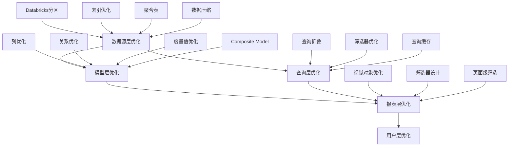
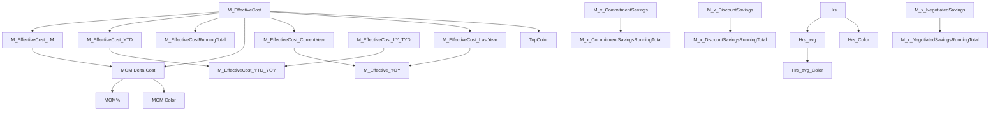
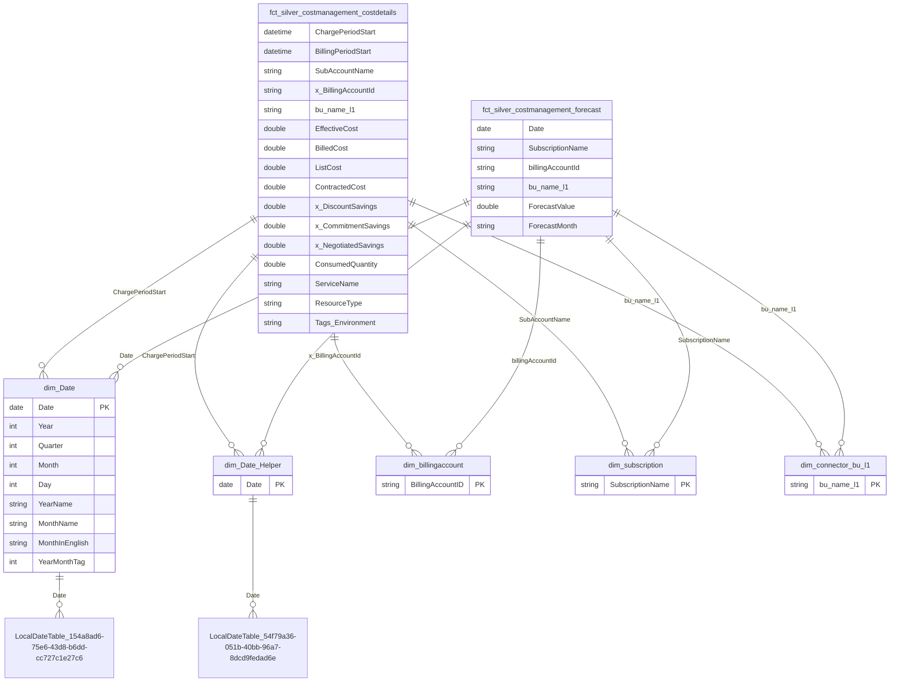
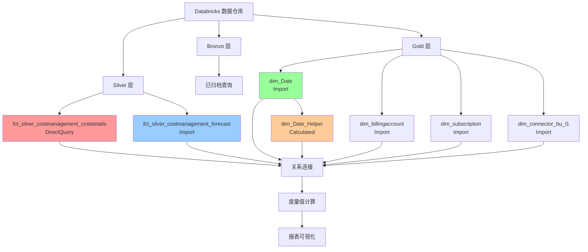

# Power BI 语义模型技术文档

## 1. 摘要

### 1.1 模型概述

本 Power BI 语义模型（Semantic Model）是一个**成本管理连接器（Cost Management Connector）**，专门用于管理和分析云成本数据。模型采用星型架构设计，支持从 Azure Cost Management API 和 Databricks 数据仓库中提取、转换和加载（ETL）成本数据，为组织提供全面的云成本分析和预测能力。

**模型基本信息**:
- **模型名称**: CostManagementConnector
- **兼容性级别**: 1567
- **模型类型**: Tabular（表格模型）
- **数据源**: Databricks (Azure Databricks)
- **表数量**: 11 个表
- **度量值数量**: 36 个度量值
- **关系数量**: 12 个关系
- **命名表达式数量**: 10 个（3个参数，7个已归档表达式）

### 1.2 执行摘要

本语义模型实现了以下核心功能:

1. **多源数据集成**: 整合来自 Azure Cost Management 和 Databricks 的云成本数据
2. **实时与历史数据分析**: 支持 DirectQuery 和 Import 两种模式，平衡实时性和性能
3. **成本预测**: 基于历史数据提供成本预测功能
4. **多维度分析**: 支持按业务单元（BU）、订阅、服务、日期等多个维度进行成本分析
5. **成本优化洞察**: 提供折扣节省、承诺节省、协商节省等成本优化指标

### 1.3 核心能力

**数据集成能力**
- **Databricks 连接**: 通过 Databricks.Catalogs 连接器访问 Databricks 数据仓库
- **多层数据访问**: 支持 bronze、silver、gold 三层数据架构
- **参数化连接**: 使用参数化查询实现灵活的数据库连接配置

**分析能力**
- **时间序列分析**: 支持年、季度、月、周、日等多粒度时间分析
- **同比环比分析**: 提供 YTD、YOY、MOM 等时间对比分析
- **成本分类分析**: 支持按服务、资源类型、SKU、定价类别等维度分析
- **预测分析**: 基于历史数据提供成本预测

**业务洞察能力**
- **成本节省分析**: 识别折扣节省、承诺节省、协商节省
- **资源利用率分析**: 提供 CPU 使用小时数、承诺利用率等指标
- **业务单元分析**: 支持按业务单元（BU）进行成本分配和分析

### 1.4 核心业务价值

1. **成本透明度**: 提供全面的云成本可见性，帮助组织了解云资源使用情况
2. **成本优化**: 识别成本节省机会，包括折扣、承诺和协商节省
3. **预算管理**: 支持成本预测和预算对比，帮助进行财务规划
4. **资源优化**: 通过资源利用率分析，识别未充分利用的资源
5. **决策支持**: 为云资源采购、优化和治理提供数据驱动的决策支持

---

## 2. M代码分析与业务含义

### 2.1 表分类说明

模型中的表按照数据仓库分层架构和业务用途进行分类:

#### 2.1.1 表命名规范

模型遵循以下命名规范:

- **事实表（Fact Tables）**: 以 `fct_` 前缀
  - `fct_silver_*`: Silver 层事实表（清洗后的明细数据）

- **维度表（Dimension Tables）**: 以 `dim_` 前缀
  - `dim_Date`: 主日期维度表
  - `dim_Date_Helper`: 日期辅助维度表（计算表）
  - `dim_billingaccount`: 账单账户维度表
  - `dim_subscription`: 订阅维度表
  - `dim_connector_bu_l1`: 业务单元维度表

- **度量值表**: `Measure` - 存储所有 DAX 度量值

- **日期模板表**: `DateTableTemplate_*` 和 `LocalDateTable_*` - Power BI 自动生成的日期表模板（隐藏表）

#### 2.1.2 表分类详情

**事实表（Fact Tables）**:
1. `fct_silver_costmanagement_costdetails` - 成本明细事实表（DirectQuery，85列）
2. `fct_silver_costmanagement_forecast` - 成本预测事实表（Import，11列）

**维度表（Dimension Tables）**:
1. `dim_Date` - 主日期维度表（Import，31列）
2. `dim_Date_Helper` - 日期辅助维度表（Calculated Table，31列）
3. `dim_billingaccount` - 账单账户维度表（Import，1列）
4. `dim_subscription` - 订阅维度表（Import，1列）
5. `dim_connector_bu_l1` - 业务单元 L1 维度表（Import，1列）

**辅助表**:
1. `Measure` - 度量值表（Import，0列，36个度量值）
2. `DateTableTemplate_985d5d91-7702-4beb-a626-b2183ba6683a` - 日期表模板（Hidden，7列）
3. `LocalDateTable_154a8ad6-75e6-43d8-b6dd-cc727c1e27c6` - 本地日期表（Hidden，7列）
4. `LocalDateTable_54f79a36-051b-40bb-96a7-8dcd9fedad6e` - 本地日期表（Hidden，7列）

**已归档命名表达式**:
- RecommendationsSingle（已归档）
- RecommendationsShared（已归档）
- InstanceSizeFlexibility（已归档）
- fct_silver_reservationorders（已归档）
- fct_gold_cloud_spend_and_forecast（已归档）
- fct_gold_cloud_spend_and_forecast_dupe（已归档）
- fct_silver_sharepoint_cloud_spend_alicloud（已归档）

---

### 2.2 模型所有表ETL逻辑

#### 2.2.1 fct_silver_costmanagement_costdetails（成本明细事实表）

**表说明**:
这是模型的核心事实表，包含来自 Azure Cost Management API 的详细成本数据。该表采用 DirectQuery 模式，确保数据的实时性。

**业务含义**:
存储每个云资源在特定计费周期内的详细成本信息，包括实际成本、折扣、承诺节省等关键财务指标。该表是成本分析的主要数据源，支持细粒度的成本分析和报告。

**M代码**:
```m
let
    Source = Databricks.Catalogs(#"Server Hostname", #"HTTP Path", [Catalog = null, Database = null, EnableAutomaticProxyDiscovery = null]),
    #"cedm-datamart-dev_Database" = Source{[Name=Database,Kind="Database"]}[Data],
    silver_Schema = #"cedm-datamart-dev_Database"{[Name="silver",Kind="Schema"]}[Data],
    silver_costmanagement_costdetails_Table = silver_Schema{[Name="silver_costmanagement_costdetails",Kind="Table"]}[Data]
in
    silver_costmanagement_costdetails_Table
```

**ETL逻辑流程**:
1. **连接阶段**: 使用 `Databricks.Catalogs` 连接器连接到 Databricks 服务器
   - 使用参数 `Server Hostname` 和 `HTTP Path` 建立连接
2. **数据库导航**: 通过参数 `Database` 导航到目标数据库 `cedm-datamart-dev`
3. **Schema 导航**: 导航到 `silver` schema（数据仓库的清洗层）
4. **表选择**: 选择 `silver_costmanagement_costdetails` 表
5. **数据返回**: 直接返回表数据（DirectQuery 模式，不进行本地缓存）

**关键业务指标**:
- `EffectiveCost`: 有效成本（考虑折扣后的实际成本）- 核心指标
- `BilledCost`: 账单成本 - 实际支付金额
- `ListCost`: 标价成本 - 未折扣前的价格
- `ContractedCost`: 合同成本 - 合同约定的价格
- `x_DiscountSavings`: 折扣节省 - 通过折扣节省的金额
- `x_CommitmentSavings`: 承诺节省 - 通过预留实例等承诺节省的金额
- `x_NegotiatedSavings`: 协商节省 - 通过协商获得的节省
- `ConsumedQuantity`: 消耗数量 - 资源使用量
- `ChargePeriodStart`: 费用周期开始日期 - 用于时间分析
- `BillingPeriodStart`: 计费周期开始日期 - 用于计费分析

> **注**: 完整的列信息请参考 **5.2.1 fct_silver_costmanagement_costdetails** 章节。

**数据模式**: DirectQuery（实时查询）

**性能考虑**:
- 由于采用 DirectQuery 模式，查询性能依赖于 Databricks 端的表性能和网络延迟
- 建议在 Databricks 端对表进行适当的索引和分区优化

---

#### 2.2.2 fct_silver_costmanagement_forecast（成本预测事实表）

**表说明**:
存储基于历史数据生成的成本预测值，用于预算规划和成本预测分析。

**业务含义**:
提供未来期间的成本预测数据，支持财务规划和预算管理。预测数据通常基于过去12个月的历史实际成本数据，使用线性回归等统计方法生成。

**M代码**:
```m
let
    Source = Databricks.Catalogs(#"Server Hostname", #"HTTP Path", [Catalog = null, Database = null, EnableAutomaticProxyDiscovery = null]),
    #"cedm-datamart-dev_Database" = Source{[Name=Database,Kind="Database"]}[Data],
    silver_Schema = #"cedm-datamart-dev_Database"{[Name="silver",Kind="Schema"]}[Data],
    silver_costmanagement_costdetails_Table = silver_Schema{[Name="silver_costmanagement_forecast",Kind="Table"]}[Data],
    #"Inserted Merged Column" = Table.AddColumn(silver_costmanagement_costdetails_Table, "Date", each Text.Combine({[ForecastMonth], "-01"}), type text),
    #"Changed Type" = Table.TransformColumnTypes(#"Inserted Merged Column", {"Date", type date}, {"ForecastValue", type number})
in
    #"Changed Type"
```

**ETL逻辑流程**:
1. **连接阶段**: 连接到 Databricks 数据仓库
2. **数据提取**: 从 `silver_costmanagement_forecast` 表提取预测数据
3. **日期转换**:
   - 将 `ForecastMonth`（文本格式，如 "2024-01"）转换为日期格式
   - 使用 `Text.Combine` 将月份字符串与 "-01" 组合（例如: "2024-01" + "-01" = "2024-01-01"）
   - 转换为日期类型，便于与日期维度表建立关系
4. **数据类型转换**: 确保 `ForecastValue` 为数字类型，支持聚合计算
5. **数据导入**: Import 模式，数据缓存在模型中以提高查询性能

**关键业务指标**:
- `ForecastValue`: 预测成本值 - 核心预测指标
- `ForecastMonth`: 预测月份（文本格式，如 "2024-01"）
- `Date`: 预测日期（转换后的日期格式，用于建立关系）

> **注**: 完整的列信息请参考 **5.2.2 fct_silver_costmanagement_forecast** 章节。

**数据模式**: Import（导入模式）

**业务应用**:
- 预算规划和对比
- 成本趋势预测
- 财务预测报告

---

#### 2.2.3 dim_Date（主日期维度表）

**表说明**:
标准的日期维度表，包含完整的日期层次结构，支持时间序列分析。

**业务含义**:
提供标准化的日期维度，支持各种时间分析场景，如 YTD（年初至今）、YOY（同比）、MOM（环比）等。该表是时间智能分析的基础。

**M代码**:
```m
let
    Source = Databricks.Catalogs(#"Server Hostname", #"HTTP Path", [Catalog=null, Database=null, EnableAutomaticProxyDiscovery=null]),
    #"cedm-datamart-dev_Database" = Source{[Name=Database,Kind="Database"]}[Data],
    gold_Schema = #"cedm-datamart-dev_Database"{[Name="gold",Kind="Schema"]}[Data],
    dim_date_Table = gold_Schema{[Name="dim_date",Kind="Table"]}[Data]
in
    dim_date_Table
```

**ETL逻辑流程**:
1. **连接阶段**: 连接到 Databricks 数据仓库
2. **Gold 层访问**: 从 `gold` schema 获取日期维度表（数据仓库的聚合层）
3. **表选择**: 选择 `dim_date` 表
4. **数据导入**: Import 模式，提高查询性能

**关键业务指标**:
- `Date`: 日期（主键）- 用于建立关系
- `Year`, `Quarter`, `Month`, `Day`: 年、季度、月、日（数字）
- `YearName`, `QuarterName`, `MonthName`: 年、季度、月名称（文本）
- `YearMonthTag`: DAX 计算列，标识最近3年的月份（用于筛选）

> **注**: 完整的列信息请参考 **5.2.3 dim_Date** 章节。

**数据模式**: Import（导入模式）

**特殊功能**:
- 支持日期层次结构（Date Hierarchy）
- 与 `LocalDateTable_154a8ad6-75e6-43d8-b6dd-cc727c1e27c6` 建立关系，支持时间智能函数

---

#### 2.2.4 dim_Date_Helper（日期辅助维度表）

**表说明**:
基于 `dim_Date` 表的计算表，用于支持某些特定的日期关系场景，解决日期筛选上下文冲突问题。

**业务含义**:
当需要同时使用不同的日期列（如 `ChargePeriodStart` 和 `Date`）进行筛选时，如果都连接到同一个 `dim_Date` 表，会导致筛选上下文冲突。使用 `dim_Date_Helper` 可以避免这个问题，实现独立的日期筛选。

**计算表定义**:
```dax
dim_Date
```

**ETL逻辑流程**:
1. **计算表**: 这是一个计算表（Calculated Table），不是从数据源加载
2. **数据源**: 直接引用 `dim_Date` 表
3. **列继承**: 所有列都从 `dim_Date` 继承（使用 `isNameInferred`）
4. **数据导入**: Import 模式

**关键业务指标**: 与 `dim_Date` 相同

**数据模式**: Calculated Table（计算表）

**使用场景**:
- `fct_silver_costmanagement_costdetails` 通过 `ChargePeriodStart` 关联到此表
- `fct_silver_costmanagement_forecast` 通过 `Date` 关联到此表
- 避免与主日期关系产生筛选上下文冲突

---

#### 2.2.5 dim_billingaccount（账单账户维度表）

**表说明**:
账单账户维度表，包含所有唯一的账单账户ID。

**业务含义**:
提供账单账户的维度，支持按账户进行成本分析。每个账单账户代表一个独立的计费实体，通常对应一个企业客户或部门。

**M代码**:
```m
let
    Source = Databricks.Catalogs(#"Server Hostname", #"HTTP Path", [Catalog=null, Database=null, EnableAutomaticProxyDiscovery=null]),
    #"cedm-datamart-dev_Database" = Source{[Name=Database,Kind="Database"]}[Data],
    gold_Schema = #"cedm-datamart-dev_Database"{[Name="gold",Kind="Schema"]}[Data],
    dim_date_Table = gold_Schema{[Name="dim_billingaccount",Kind="Table"]}[Data]
in
    dim_date_Table
```

**ETL逻辑流程**:
1. **连接阶段**: 连接到 Databricks 数据仓库
2. **Gold 层访问**: 从 `gold` schema 获取维度表
3. **表选择**: 选择 `dim_billingaccount` 表
4. **数据导入**: Import 模式

**关键业务指标**:
- `BillingAccountID`: 账单账户ID（主键）

**数据模式**: Import（导入模式）

**关系**:
- 与 `fct_silver_costmanagement_costdetails` 通过 `x_BillingAccountId` 建立关系
- 与 `fct_silver_costmanagement_forecast` 通过 `billingAccountId` 建立关系

---

#### 2.2.6 dim_subscription（订阅维度表）

**表说明**:
订阅维度表，包含所有唯一的订阅名称。

**业务含义**:
提供订阅的维度，支持按订阅进行成本分析。每个订阅代表一个 Azure 订阅，是成本分配和管理的基本单位。

**M代码**:
```m
let
    Source = Databricks.Catalogs(#"Server Hostname", #"HTTP Path", [Catalog=null, Database=null, EnableAutomaticProxyDiscovery=null]),
    #"cedm-datamart-dev_Database" = Source{[Name=Database,Kind="Database"]}[Data],
    gold_Schema = #"cedm-datamart-dev_Database"{[Name="gold",Kind="Schema"]}[Data],
    dim_date_Table = gold_Schema{[Name="dim_subscription",Kind="Table"]}[Data]
in
    dim_date_Table
```

**ETL逻辑流程**:
1. **连接阶段**: 连接到 Databricks 数据仓库
2. **Gold 层访问**: 从 `gold` schema 获取维度表
3. **表选择**: 选择 `dim_subscription` 表
4. **数据导入**: Import 模式

**关键业务指标**:
- `SubscriptionName`: 订阅名称（主键）

**数据模式**: Import（导入模式）

**关系**:
- 与 `fct_silver_costmanagement_costdetails` 通过 `SubAccountName` 建立关系
- 与 `fct_silver_costmanagement_forecast` 通过 `SubscriptionName` 建立关系

---

#### 2.2.7 dim_connector_bu_l1（业务单元维度表）

**表说明**:
业务单元 L1 层级维度表，包含所有唯一的业务单元名称。

**业务含义**:
提供业务单元的维度，支持按业务单元进行成本分配和分析。业务单元是组织内部成本分配的基本单位，用于将云成本分配到不同的业务部门。

**M代码**:
```m
let
    Source = Databricks.Catalogs(#"Server Hostname", #"HTTP Path", [Catalog=null, Database=null, EnableAutomaticProxyDiscovery=null]),
    #"cedm-datamart-dev_Database" = Source{[Name=Database,Kind="Database"]}[Data],
    gold_Schema = #"cedm-datamart-dev_Database"{[Name="gold",Kind="Schema"]}[Data],
    dim_date_Table = gold_Schema{[Name="dim_connector_bu_l1",Kind="Table"]}[Data]
in
    dim_date_Table
```

**ETL逻辑流程**:
1. **连接阶段**: 连接到 Databricks 数据仓库
2. **Gold 层访问**: 从 `gold` schema 获取维度表
3. **表选择**: 选择 `dim_connector_bu_l1` 表
4. **数据导入**: Import 模式

**关键业务指标**:
- `bu_name_l1`: 业务单元 L1 名称（主键）

**数据模式**: Import（导入模式）

**关系**:
- 与 `fct_silver_costmanagement_costdetails` 通过 `bu_name_l1` 建立关系
- 与 `fct_silver_costmanagement_forecast` 通过 `bu_name_l1` 建立关系

---

#### 2.2.8 Measure（度量值表）

**表说明**:
这是一个特殊的表，用于存储所有 DAX 度量值。该表本身不包含数据行，仅作为度量值的容器。

**业务含义**:
集中管理所有业务度量值，便于组织和维护。度量值是实现业务逻辑和计算的核心组件。

**M代码**:
```m
let
    Source = Table.FromRows(Json.Document(Binary.Decompress(Binary.FromText("i44FAA==", BinaryEncoding.Base64), Compression.Deflate)), let _t = (type nullable text) meta [Serialized.Text = true] in type table [Column1 = _t]),
    #"Removed Columns" = Table.RemoveColumns(Source, {"Column1"})
in
    #"Removed Columns"
```

**ETL逻辑流程**:
1. **空表创建**: 创建一个空表作为度量值的容器
2. **列移除**: 移除所有列，生成一个完全空的表
3. **数据导入**: Import 模式

**关键业务指标**:
该表包含 36 个度量值，分为以下文件夹:
- **Basic（基础度量值）**: 16个度量值
- **Adv（高级分析度量值）**: 5个度量值
- **Vis\Color（可视化颜色度量值）**: 4个度量值
- **Vis\Ttp（工具提示度量值）**: 3个度量值

> **注**: 详细的度量值信息请参考 **3.2 模型所有表度量值** 和 **7.1 度量值文件夹结构** 章节。

**数据模式**: Import（导入模式）

---

### 2.3 模型所有参数表ETL逻辑

模型中共有 **10 个命名表达式（Named Expressions）**，其中 **3 个是参数（Parameters）**，**7 个是已归档的表达式**。

#### 2.3.1 Server Hostname（服务器主机名参数）

**类型**: Power Query 参数（Text）

**M代码**:
```m
"adb-3085800437590429.9.azuredatabricks.net"
```

**用途**:
存储 Databricks 服务器的主机名，用于建立数据库连接。

**使用场景**:
- 所有需要连接 Databricks 的查询都会引用此参数
- 当需要切换环境（开发/测试/生产）时，只需修改此参数值
- 支持多环境部署和管理

**业务含义**:
提供灵活的连接配置，支持多环境部署。通过参数化配置，可以在不同环境之间快速切换，而无需修改每个查询的代码。

**查询组**: FinOps toolkit

**状态**: 活动

---

#### 2.3.2 HTTP Path（HTTP 路径参数）

**类型**: Power Query 参数（Text）

**M代码**:
```m
"/sql/1.0/warehouses/b709e878048ab49a"
```

**用途**:
存储 Databricks SQL Warehouse 的 HTTP 路径，用于建立连接。

**使用场景**:
- 与 `Server Hostname` 参数配合使用，构建完整的 Databricks 连接字符串
- 当 SQL Warehouse 配置变更时，只需修改此参数
- 支持不同 SQL Warehouse 之间的切换

**业务含义**:
支持灵活的 SQL Warehouse 配置管理。SQL Warehouse 是 Databricks 提供的计算资源，通过参数化可以灵活切换不同的计算资源。

**查询组**: FinOps toolkit

**状态**: 活动

---

#### 2.3.3 Database（数据库参数）

**类型**: Power Query 参数（Text）

**M代码**:
```m
"cedm-datamart-dev"
```

**用途**:
存储目标数据库名称，用于导航到正确的数据库。

**使用场景**:
- 所有查询在连接 Databricks 后，都会使用此参数导航到目标数据库
- 支持在不同数据库之间切换（如 dev、test、prod）
- 实现数据库级别的环境隔离

**业务含义**:
实现数据库级别的环境隔离。通过参数化数据库名称，可以在开发、测试和生产环境之间快速切换，确保数据隔离和安全性。

**查询组**: FinOps toolkit

**状态**: 活动

---

#### 2.3.4 RecommendationsSingle（已归档）

**类型**: 命名表达式（M）

**M代码**:
```m
let
    Source = Databricks.Catalogs(#"Server Hostname", #"HTTP Path", [Catalog = null, Database = null, EnableAutomaticProxyDiscovery = null]),
    #"Navigation 1" = Source{[Name = Database, Kind = "Database"]}[Data],
    #"Navigation 2" = #"Navigation 1"{[Name = "silver", Kind = "Schema"]}[Data],
    silver_reservation_recommendations_single_Table = #"Navigation 2"{[Name="silver_reservation_recommendations_single",Kind="Table"]}[Data]
in
    silver_reservation_recommendations_single_Table
```

**用途**:
用于获取单个预留实例推荐数据（已归档，不再使用）。

**业务含义**:
历史功能，用于预留实例优化建议。预留实例（Reserved Instances）是云服务提供商提供的预付费折扣方案，该表达式用于获取针对单个实例的预留建议。

**查询组**: Achived

**状态**: 已归档

---

#### 2.3.5 RecommendationsShared（已归档）

**类型**: 命名表达式（M）

**M代码**:
```m
let
    Source = Databricks.Catalogs(#"Server Hostname", #"HTTP Path", [Catalog = null, Database = null, EnableAutomaticProxyDiscovery = null]),
    #"Navigation 1" = Source{[Name = Database, Kind = "Database"]}[Data],
    #"Navigation 2" = #"Navigation 1"{[Name = "silver", Kind = "Schema"]}[Data],
    silver_reservation_recommendations_shared_Table = #"Navigation 2"{[Name="silver_reservation_recommendations_shared",Kind="Table"]}[Data]
in
    silver_reservation_recommendations_shared_Table
```

**用途**:
用于获取共享预留实例推荐数据（已归档，不再使用）。

**业务含义**:
历史功能，用于共享预留实例优化建议。共享预留实例可以在多个订阅之间共享，提供更大的灵活性。

**查询组**: Achived

**状态**: 已归档

---

#### 2.3.6 InstanceSizeFlexibility（已归档）

**类型**: 命名表达式（M）

**M代码**:
```m
let
    Source = Databricks.Catalogs(#"Server Hostname", #"HTTP Path", [Catalog = null, Database = null, EnableAutomaticProxyDiscovery = null]),
    #"cedm-datamart-dev_Database" = Source{[Name=Database,Kind="Database"]}[Data],
    bronze_Schema = #"cedm-datamart-dev_Database"{[Name="bronze",Kind="Schema"]}[Data],
    bronze_instancesizeflexibility_Table = bronze_Schema{[Name="bronze_instancesizeflexibility",Kind="Table"]}[Data]
in
    bronze_instancesizeflexibility_Table
```

**用途**:
用于获取实例大小灵活性数据（已归档，不再使用）。

**业务含义**:
历史功能，用于实例大小优化分析。实例大小灵活性（Instance Size Flexibility）允许在相同实例系列内调整实例大小，以获得更好的成本效益。

**查询组**: Achived

**状态**: 已归档

---

#### 2.3.7 fct_silver_reservationorders（已归档）

**类型**: 命名表达式（M）

**M代码**:
```m
let
    Source = Databricks.Catalogs(#"Server Hostname", #"HTTP Path", [Catalog = null, Database = null, EnableAutomaticProxyDiscovery = null]),
    #"cedm-datamart-dev_Database" = Source{[Name=Database,Kind="Database"]}[Data],
    silver_Schema = #"cedm-datamart-dev_Database"{[Name="silver",Kind="Schema"]}[Data],
    silver_costmanagement_costdetails_Table = silver_Schema{[Name="silver_reservationorders",Kind="Table"]}[Data]
in
    silver_costmanagement_costdetails_Table
```

**用途**:
用于获取预留实例订单数据（已归档，不再使用）。

**业务含义**:
历史功能，用于预留实例订单管理。该表达式用于获取已购买的预留实例订单信息。

**查询组**: Achived

**状态**: 已归档

---

#### 2.3.8 fct_gold_cloud_spend_and_forecast（已归档）

**类型**: 命名表达式（M）

**M代码**:
```m
let
    Source = Databricks.Catalogs(#"Server Hostname", #"HTTP Path", [Catalog=null, Database=null, EnableAutomaticProxyDiscovery=null]),
    #"cedm-datamart-dev_Database" = Source{[Name="cedm-datamart-dev",Kind="Database"]}[Data],
    gold_Schema = #"cedm-datamart-dev_Database"{[Name="gold",Kind="Schema"]}[Data],
    gold_cloud_spend_and_forecast_m_Table = gold_Schema{[Name="gold_cloud_spend_and_forecast_m",Kind="Table"]}[Data],
    #"Renamed Columns" = Table.RenameColumns(gold_cloud_spend_and_forecast_m_Table, {"Service", "service"}, {"ActualorForecast", "Type"}, {"CostWithRI", "sum"})
in
    #"Renamed Columns"
```

**用途**:
用于获取 Gold 层的云支出和预测汇总数据（已归档，不再使用）。

**业务含义**:
历史功能，用于高层次的成本汇总分析。该表达式从 Gold 层获取按服务、业务单元、类型（实际/预测）汇总的云支出数据。

**查询组**: Achived

**状态**: 已归档

---

#### 2.3.9 fct_gold_cloud_spend_and_forecast_dupe（已归档）

**类型**: 命名表达式（M）

**M代码**:
```m
let
    Source = fct_gold_cloud_spend_and_forecast
in
    Source
```

**用途**:
`fct_gold_cloud_spend_and_forecast` 的副本（已归档，不再使用）。

**业务含义**:
历史功能，用于在某些 DAX 计算中避免筛选上下文冲突。

**查询组**: Achived

**状态**: 已归档

---

#### 2.3.10 fct_silver_sharepoint_cloud_spend_alicloud（已归档）

**类型**: 命名表达式（M）

**M代码**:
```m
let
    Source = Databricks.Catalogs(#"Server Hostname", #"HTTP Path", [Catalog = null, Database = null, EnableAutomaticProxyDiscovery = null]),
    #"cedm-datamart-dev_Database" = Source{[Name=Database,Kind="Database"]}[Data],
    silver_Schema = #"cedm-datamart-dev_Database"{[Name="silver",Kind="Schema"]}[Data],
    silver_costmanagement_costdetails_Table = silver_Schema{[Name="silver_sharepoint_cloud_spend_alicloud",Kind="Table"]}[Data]
in
    silver_costmanagement_costdetails_Table
```

**用途**:
用于获取来自 SharePoint 的阿里云成本数据（已归档，不再使用）。

**业务含义**:
历史功能，用于多云环境下的成本管理，整合阿里云的支出数据。

**查询组**: Achived

**状态**: 已归档

---

### 2.4 模型所有自定义函数逻辑

**当前状态**: 模型中**没有自定义函数**（User-Defined Functions）。

**说明**:
所有数据处理逻辑都通过 M 查询和 DAX 度量值实现，没有创建可重用的 M 函数。

**建议**:
如果未来有重复的数据处理逻辑，可以考虑创建自定义函数以提高代码复用性和可维护性。例如:
- 日期转换函数
- 数据验证函数
- 错误处理函数

---

### 2.5 ETL流程总结

#### 2.5.1 数据流向

```
数据源层 (Source)
    ↓
Databricks Bronze 层 (原始数据)
    ↓
Databricks Silver 层 (清洗数据)
    ↓
Databricks Gold 层 (聚合数据)
    ↓
Power BI 语义模型
    ├── DirectQuery 表 (实时查询)
    │   └── fct_silver_costmanagement_costdetails
    │
    ├── Import 表 (导入缓存)
    │   ├── fct_silver_costmanagement_forecast
    │   ├── dim_Date
    │   ├── dim_billingaccount
    │   ├── dim_subscription
    │   └── dim_connector_bu_l1
    │
    └── Calculated 表 (计算表)
        └── dim_Date_Helper
```

#### 2.5.2 关键ETL模式

**1. 参数化连接模式**
- 使用参数（`Server Hostname`, `HTTP Path`, `Database`）实现灵活的连接配置
- 支持多环境部署（开发/测试/生产）
- 便于环境切换和维护

**2. 分层数据访问模式**
- **Bronze 层**: 原始数据（已归档功能使用）
- **Silver 层**: 清洗后的明细数据（主要事实表来源）
- **Gold 层**: 聚合后的汇总数据（维度表来源）

**3. 混合存储模式**
- **DirectQuery**: 用于需要实时数据的大型事实表
  - `fct_silver_costmanagement_costdetails` (85 列)
  - 优势: 数据实时性，无需刷新
  - 劣势: 查询性能依赖于数据源
- **Import**: 用于维度表和小型事实表，提高查询性能
  - 所有维度表
  - 预测事实表
  - 优势: 查询性能好，支持复杂计算
  - 劣势: 需要定期刷新

**4. 数据转换模式**
- **日期转换**: 在 `fct_silver_costmanagement_forecast` 中将文本月份转换为日期
- **计算表**: `dim_Date_Helper` 作为 `dim_Date` 的计算表副本，用于避免筛选上下文冲突

**5. 表复制模式（已移除）**
- 之前使用 `fct_gold_cloud_spend_and_forecast_dupe` 作为原表的副本
- 当前模型已简化，移除了此类重复表

---

### 2.6 表关系说明

模型中共有 **12 个关系**，采用星型架构设计:

#### 2.6.1 关系概览

| 关系ID | 从表 | 从列 | 到表 | 到列 | 基数 | 交叉筛选 | 说明 |
|--------|------|------|------|------|------|----------|------|
| 63c3016b-52eb-64ad-41db-1bd5b1c19797 | fct_silver_costmanagement_costdetails | ChargePeriodStart | dim_Date | Date | Many-to-One | OneDirection | 费用周期日期关系 |
| f5b85f16-8b03-43c0-a66f-94af7efa0f4b | dim_Date | Date | LocalDateTable_154a8ad6-75e6-43d8-b6dd-cc727c1e27c6 | Date | Many-to-One | OneDirection | 日期表变体关系 |
| 3d5ff5e0-7dab-34c6-b6ee-7fff35a47f49 | fct_silver_costmanagement_forecast | SubscriptionName | dim_subscription | SubscriptionName | Many-to-One | OneDirection | 预测订阅关系 |
| 13d9e678-d825-36d8-b924-2a8477d97881 | fct_silver_costmanagement_costdetails | bu_name_l1 | dim_connector_bu_l1 | bu_name_l1 | Many-to-One | OneDirection | 成本明细业务单元关系 |
| 1878c0eb-5e7b-06f8-7639-e58edf8367af | fct_silver_costmanagement_forecast | Date | dim_Date | Date | Many-to-One | OneDirection | 预测日期关系 |
| 2a7fb3c6-39be-8264-1a28-d28511ac6b3f | fct_silver_costmanagement_costdetails | x_BillingAccountId | dim_billingaccount | BillingAccountID | Many-to-One | OneDirection | 成本明细账单账户关系 |
| 157d5465-4bb1-70d4-a9db-b3863988c78d | fct_silver_costmanagement_costdetails | SubAccountName | dim_subscription | SubscriptionName | Many-to-One | OneDirection | 成本明细订阅关系 |
| 10500b32-638c-57e6-c7a0-138f124d202e | fct_silver_costmanagement_forecast | billingAccountId | dim_billingaccount | BillingAccountID | Many-to-One | OneDirection | 预测账单账户关系 |
| 6d079579-dd47-331d-1c74-533cd96cb983 | fct_silver_costmanagement_forecast | bu_name_l1 | dim_connector_bu_l1 | bu_name_l1 | Many-to-One | OneDirection | 预测业务单元关系 |
| 55f851cd-0f6e-4d10-b0ca-81ec0aeb6605 | dim_Date_Helper | Date | LocalDateTable_54f79a36-051b-40bb-96a7-8dcd9fedad6e | Date | Many-to-One | OneDirection | 日期辅助表变体关系 |
| 4d5470fe-4179-94c3-c9bb-c5d11a644130 | fct_silver_costmanagement_costdetails | ChargePeriodStart | dim_Date_Helper | Date | Many-to-One | OneDirection | 费用周期日期辅助关系 |
| e290231e-5ff0-1638-78c8-0f012ab40248 | fct_silver_costmanagement_forecast | Date | dim_Date_Helper | Date | Many-to-One | OneDirection | 预测日期辅助关系 |

#### 2.6.2 关系设计说明

**1. 日期关系设计**

- **主日期关系**: 事实表通过 `ChargePeriodStart` 关联到 `dim_Date`
- **辅助日期关系**: 事实表通过 `ChargePeriodStart` 关联到 `dim_Date_Helper`
- **设计原因**: 区分费用周期和计费周期，支持不同的时间分析场景
- **日期表变体**: 与 Power BI 自动生成的日期表变体建立关系，支持时间智能函数

**2. 维度关系设计**
- 所有关系都是 **Many-to-One**（多对一），符合星型架构设计
- 所有关系都采用 **OneDirection**（单向筛选），从事实表到维度表
- **设计原因**: 避免意外的筛选传播，确保查询性能和正确的业务逻辑

**3. 关系完整性**
- 所有关系都处于活动状态（`isActive=true`）
- 关系方向明确，确保正确的筛选行为

---

### 2.7 数据质量保证

#### 2.7.1 错误处理机制

**1. 参数验证**
- 所有参数都标记为 `IsParameterQueryRequired=true`，确保必须提供值
- 参数类型明确（Text），避免类型错误
- 如果参数未设置，查询会明确报错

**2. 连接错误处理**
- Databricks 连接器会自动处理连接失败的情况
- 如果连接失败，查询会返回错误信息，而不是静默失败
- 错误信息包含连接失败的具体原因

**3. 数据转换错误处理**
- 在 `fct_silver_costmanagement_forecast` 中，日期转换使用 `Text.Combine` 和类型转换
- 如果数据格式不正确，转换步骤会失败并显示明确的错误信息
- 建议在数据源端进行数据验证，确保数据格式正确

**4. DirectQuery 错误处理**
- DirectQuery 表在查询时如果数据源不可用，会返回错误
- 用户可以看到具体的错误信息，便于排查问题
- 建议监控 DirectQuery 查询的执行状态

#### 2.7.2 数据验证

**1. 数据类型验证**
- 所有列都明确定义了数据类型（`dataType`）
- 日期列使用 `UnderlyingDateTimeDataType` 注解确保正确的日期处理
- 数字列使用 `formatString` 确保正确的格式显示

**2. 关系完整性**
- 所有关系都定义了明确的基数和筛选方向
- 使用 `isActive=true` 确保关系处于活动状态
- 建议定期验证关系完整性，确保没有孤立记录

**3. 数据源验证**
- 通过参数化连接，确保连接到正确的数据源
- 使用明确的 Schema 和表名，避免访问错误的表
- 建议在数据源端实施数据质量检查

**4. 度量值验证**
- 所有度量值都定义了明确的格式字符串
- 使用 `PBI_FormatHint` 注解确保正确的显示格式
- 建议定期验证度量值的计算结果

#### 2.7.3 数据质量建议

**1. 添加数据质量检查**
- 建议在 M 查询中添加数据质量检查步骤
- 例如: 检查空值、检查数据范围、检查数据完整性
- 使用 `Table.ValidateRows` 或自定义验证逻辑

**2. 错误日志记录**
- 建议添加错误日志记录机制
- 记录数据加载失败的情况，便于问题排查
- 可以使用 Power BI 的刷新历史功能监控数据加载状态

**3. 数据刷新监控**
- 建议监控数据刷新状态
- 设置数据刷新失败时的告警机制
- 使用 Power BI Premium 的刷新监控功能

**4. 数据完整性验证**
- 建议定期验证数据完整性
- 检查记录数量变化，识别异常情况
- 验证关键业务指标的数据范围

---

### 2.8 性能优化建议

#### 2.8.1 查询性能优化

**1. DirectQuery vs Import 选择**
- ✅ **当前设计合理**: 大型事实表使用 DirectQuery，维度表和小型事实表使用 Import
- 💡 **建议**:
  - 如果 `fct_silver_costmanagement_costdetails` 查询性能不佳，可以考虑:
    - 在 Databricks 端创建聚合表
    - 使用增量刷新（如果支持）
    - 考虑使用 Composite Model（混合模型）进行部分聚合
  - 监控 DirectQuery 查询的执行时间，识别慢查询

**2. 关系优化**
- ✅ **当前设计合理**: 所有关系都是单向筛选，避免不必要的筛选传播
- 💡 **建议**:
  - 确保维度表的键列已建立索引（在 Databricks 端）
  - 考虑使用 `relyOnReferentialIntegrity=true` 提高查询性能（如果数据完整性有保证）
  - 定期验证关系的基数是否正确

**3. 度量值优化**
- 💡 **建议**:
  - 避免在度量值中使用 `ALLSELECTED` 等复杂函数（如果可能）
  - 使用 `CALCULATE` 时明确指定筛选器，避免隐式筛选
  - 考虑使用计算组（Calculation Groups）简化度量值逻辑
  - 优化复杂度量值，避免重复计算

**4. 筛选器优化**
- 💡 **建议**:
  - 在报表中使用适当的筛选器，减少查询数据量
  - 使用切片器时，考虑使用层次结构筛选器
  - 避免在 DirectQuery 表上使用过于复杂的筛选器

#### 2.8.2 数据模型优化

**1. 列优化**
- ✅ **当前设计合理**: 只加载必要的列
- 💡 **建议**:
  - 定期审查未使用的列，考虑隐藏或删除
  - 对于大型文本列，考虑是否需要在模型中保留
  - 隐藏技术性列（如 `ingestion_date`, `notebook_name` 等），仅保留业务相关列

**2. 表优化**
- ✅ **当前设计合理**: 模型已简化，移除了重复表
- 💡 **建议**:
  - 评估是否真的需要两个日期维度表（`dim_Date` 和 `dim_Date_Helper`）
  - 如果可能，考虑合并某些维度表

**3. 分区优化**
- 💡 **建议**:
  - 对于 Import 表，考虑使用增量刷新
  - 对于 DirectQuery 表，确保 Databricks 端的表已正确分区
  - 使用分区可以显著提高查询性能

#### 2.8.3 数据刷新优化

**1. 刷新策略**
- 💡 **建议**:
  - 设置合理的刷新计划，避免在业务高峰期刷新
  - 对于 Import 表，考虑使用增量刷新减少刷新时间
  - 对于 DirectQuery 表，确保 Databricks 端有足够的计算资源
  - 使用 Power BI Premium 的增量刷新功能

**2. 参数优化**
- ✅ **当前设计合理**: 使用参数化连接，便于环境切换
- 💡 **建议**:
  - 考虑使用 Power BI 数据源凭据管理，避免在参数中存储敏感信息
  - 使用网关连接本地数据源（如果需要）
  - 考虑使用 Azure Key Vault 管理敏感参数

**3. 并发刷新**
- 💡 **建议**:
  - 对于大型模型，考虑使用并发刷新
  - 使用 Power BI Premium 的并发刷新功能
  - 优化刷新顺序，先刷新依赖表

#### 2.8.4 监控和诊断

**1. 性能监控**
- 💡 **建议**:
  - 使用 Power BI Premium 的性能分析器监控查询性能
  - 定期审查慢查询，优化相关度量值或关系
  - 监控 DirectQuery 查询的执行时间
  - 使用 Power BI 的查询诊断功能

**2. 数据质量监控**
- 💡 **建议**:
  - 设置数据刷新失败告警
  - 监控数据行数变化，识别异常情况
  - 定期验证数据完整性
  - 使用 Power BI 的刷新历史功能

**3. 容量监控**
- 💡 **建议**:
  - 监控模型大小，确保在容量限制内
  - 监控内存使用情况
  - 使用 Power BI Premium 的容量监控功能

#### 2.8.5 大数据量表性能优化（fct_silver_costmanagement_costdetails）

**背景**: `fct_silver_costmanagement_costdetails` 表数据量达到上亿级别，使用 DirectQuery 模式。针对如此大规模的数据，需要采用多层次、多维度的优化策略。

**优化策略总览**:



**1. 数据源层优化（Databricks）**

- ✅ **必须实施**: 对 `silver_costmanagement_costdetails` 表进行分区
- 💡 **建议分区列**:
  - **主分区**: `ChargePeriodStart`（按日期分区，如按月或按季度）
  - **二级分区**: `x_BillingAccountId` 或 `SubAccountName`（如果数据分布不均匀）
- 💡 **分区粒度**:
  - 按月分区: 适合时间序列查询，每个分区约数百万到千万行
  - 按季度分区: 适合长期趋势分析，减少分区数量
  - 混合分区: 按日期分区 + 按业务单元分区（如果业务单元数据量差异大）

- ✅ **必须实施**: 在 Databricks 端创建适当的索引
- 💡 **建议索引列**:
  - **主键索引**: `ResourceId` + `ChargePeriodStart`（复合索引）
  - **外键索引**:
    - `x_BillingAccountId`（用于连接到 dim_billingaccount）
    - `SubAccountName`（用于连接到 dim_subscription）
    - `bu_name_l1`（用于连接到 dim_connector_bu_l1）
    - `ChargePeriodStart`（用于连接到 dim_Date）
  - **常用筛选列索引**:
    - `ServiceName`（服务筛选）
    - `ResourceType`（资源类型筛选）
    - `Tags_Environment`（环境筛选）
    - `RegionName`（区域筛选）
- 💡 **索引类型选择**:
  - Delta Lake 自动维护索引（Z-Order）
  - 对于高基数列，使用 Bloom Filter 索引
  - 对于低基数列，使用 Bitmap 索引

- ✅ **强烈建议**: 在 Databricks 端创建预聚合表
- 💡 **聚合表设计**:
  - **月度聚合表**: 按 `ChargePeriodStart`（月）、`ServiceName`、`SubAccountName`、`bu_name_l1` 聚合
    - 聚合字段: `SUM(EffectiveCost)`, `SUM(BilledCost)`, `SUM(ConsumedQuantity)` 等
    - 数据量减少: 从亿级减少到百万级
  - **季度聚合表**: 按季度、服务、订阅、业务单元聚合
    - 用于长期趋势分析
    - 数据量减少: 从亿级减少到十万级
  - **年度聚合表**: 按年度、服务、订阅、业务单元聚合
    - 用于年度对比分析
    - 数据量减少: 从亿级减少到万级

- 💡 **建议**:
  - 使用 Delta Lake 格式（已使用），支持列式存储和压缩
  - 启用 Delta Lake 的 Z-Order 优化，提高查询性能
  - 定期运行 `OPTIMIZE` 和 `VACUUM` 命令
  - 考虑使用 Delta Lake 的 Liquid Clustering（如果可用）

- 💡 **建议**:
  - 实施数据归档策略: 将超过2年的详细数据归档到冷存储
  - 保留最近2年的详细数据用于明细查询
  - 使用聚合表提供历史数据查询
  - 定期清理测试数据和无效数据

**2. 模型层优化（Power BI）**

- ✅ **强烈建议**: 使用 Composite Model 结合 DirectQuery 和 Import
- 💡 **实施策略**:
  - **DirectQuery**: 保留 `fct_silver_costmanagement_costdetails` 为 DirectQuery，用于明细查询
  - **Import 聚合表**: 创建基于 Databricks 聚合表的 Import 表
    - `fct_costdetails_monthly_agg`（月度聚合，Import 模式）
    - `fct_costdetails_quarterly_agg`（季度聚合，Import 模式）
  - **智能路由**: 使用计算组或度量值逻辑，自动选择使用聚合表还是明细表
- 💡 **优势**:
  - 明细查询: 使用 DirectQuery，数据实时
  - 汇总查询: 使用 Import 聚合表，查询速度快
  - 自动优化: Power BI 自动选择最优数据源

- ✅ **必须实施**: 减少不必要的列
- 💡 **优化策略**:
  - **隐藏技术列**: 隐藏 `ingestion_date`, `notebook_name`, `report_month` 等技术性列
  - **移除冗余列**: 如果 `ResourceName` 和 `ResourceNameUnique` 功能重复，考虑只保留一个
  - **列分组**: 使用显示文件夹组织列，减少字段列表混乱
  - **列描述**: 为所有列添加描述，帮助用户理解列用途
- 💡 **建议隐藏的列**（如果不需要在报表中使用）:
  - `x_CostAllocationRuleName`
  - `x_ResourceGroupNameUnique`
  - `x_ResourceMachineName`
  - `SubAccountNameUnique`
  - `x_CommitmentDiscountKey`
  - `x_SkuMeterName`, `x_SkuMeterCategory`, `x_SkuMeterSubcategory`
  - `x_SkuDescription`, `x_SkuType`, `x_SkuImageType`
  - `x_SkuOrderName`, `x_SkuPartNumber`, `x_SkuRegion`
  - `x_PricingSubcategory`
  - `x_PublisherType`
  - `Tags`（原始JSON，如果已提取所有需要的标签列）

- 💡 **建议**:
  - 确保所有关系都是单向筛选（OneDirection），避免不必要的筛选传播
  - 考虑使用 `relyOnReferentialIntegrity=true`（如果数据完整性有保证）
  - 验证关系的基数是否正确（Many-to-One）
  - 确保维度表的键列是唯一的，避免关系错误

- 💡 **关键优化点**:
  - **避免全表扫描**: 不要在度量值中使用 `ALL('fct_silver_costmanagement_costdetails')`
  - **使用筛选器**: 使用 `FILTER` 时明确指定筛选条件，避免扫描整个表
  - **优化 CALCULATE**: 在 `CALCULATE` 中明确指定筛选器，避免隐式筛选
  - **避免复杂迭代**: 避免在度量值中使用 `SUMX`, `AVERAGEX` 等迭代器遍历大表
  - **使用变量**: 使用 `VAR` 存储中间结果，避免重复计算

**3. 查询层优化**

- ✅ **必须确保**: 所有 M 代码查询都能正确折叠到 Databricks
- 💡 **检查方法**:
  - 在 Power Query 编辑器中查看查询步骤
  - 确保没有使用 `Table.Buffer` 等阻止查询折叠的函数
  - 确保筛选和聚合操作在 Databricks 端执行
- 💡 **优化建议**:
  - 在 M 代码中尽早应用筛选器
  - 使用 `Table.SelectRows` 在数据源端筛选
  - 避免在 Power Query 中进行大量数据转换

- 💡 **报表筛选器设计**:
  - **页面级筛选器**: 始终设置日期范围筛选器，限制查询数据量
    - 建议默认筛选最近3-6个月的数据
    - 使用 `dim_Date[YearMonthTag] = 1` 筛选最近3年
  - **视觉对象级筛选器**: 在视觉对象上应用必要的筛选器
  - **切片器优化**: 使用层次结构切片器，减少筛选器数量
- 💡 **筛选器优先级**:
  1. 日期筛选器（最重要，必须设置）
  2. 业务单元筛选器（如果用户只需要特定业务单元）
  3. 订阅筛选器（如果用户只需要特定订阅）
  4. 服务筛选器（如果分析特定服务）

- 💡 **建议**:
  - 使用 Power BI Premium 的查询缓存功能
  - 设置合理的缓存过期时间
  - 对于常用查询，考虑使用 DirectQuery 缓存

**4. 报表层优化**

- 💡 **建议**:
  - **减少视觉对象数量**: 每个页面不超过5-8个视觉对象
  - **使用卡片图**: 对于简单数值，使用卡片图而非表格
  - **避免大表格**: 避免显示包含大量行的表格，使用分页或筛选
  - **使用聚合视觉对象**: 优先使用图表而非明细表格
  - **禁用不必要的交互**: 禁用视觉对象之间的交叉筛选（如果不需要）

- 💡 **建议**:
  - **按需刷新**: 对于 DirectQuery 表，使用按需刷新而非自动刷新
  - **增量查询**: 如果可能，使用增量查询减少数据量
  - **后台刷新**: 使用 Power BI Premium 的后台刷新功能

- 💡 **建议**:
  - **加载提示**: 为报表添加加载提示，告知用户数据量大
  - **默认筛选**: 设置合理的默认筛选器，减少初始加载数据量
  - **分页加载**: 对于表格，使用分页加载
  - **异步加载**: 使用异步加载提高响应速度

**5. 监控和诊断**

- 💡 **关键指标**:
  - **查询响应时间**: 目标 < 3秒（汇总查询），< 10秒（明细查询）
  - **数据扫描量**: 监控每次查询扫描的数据行数
  - **缓存命中率**: 监控查询缓存命中率
  - **并发查询数**: 监控同时执行的查询数量
- 💡 **监控工具**:
  - Power BI Premium 性能分析器
  - Databricks 查询历史和分析
  - Power BI 查询诊断工具

- 💡 **分析方法**:
  - 使用 Power BI 性能分析器识别慢查询
  - 分析查询计划，找出性能瓶颈
  - 检查是否使用了正确的索引
  - 验证查询折叠是否成功
- 💡 **常见问题**:
  - 全表扫描: 添加适当的筛选器或索引
  - 复杂度量值: 简化度量值逻辑
  - 关系问题: 验证关系是否正确
  - 数据倾斜: 检查数据分布是否均匀

**6. 优化优先级和实施路线图**

**阶段1: 立即实施（高优先级，快速见效）**
1. ✅ 在 Databricks 端创建表分区（按 `ChargePeriodStart` 分区）
2. ✅ 创建必要的索引（外键列和常用筛选列）
3. ✅ 在报表中设置默认日期筛选器（最近3-6个月）
4. ✅ 隐藏不必要的列
5. ✅ 优化度量值，避免全表扫描

**阶段2: 短期实施（1-2周）**
1. ✅ 创建月度聚合表
2. ✅ 实施 Composite Model，使用聚合表
3. ✅ 优化报表视觉对象，减少数量
4. ✅ 实施查询缓存策略
5. ✅ 设置性能监控和告警

**阶段3: 中期实施（1-2月）**
1. ✅ 创建季度和年度聚合表
2. ✅ 实施数据归档策略
3. ✅ 优化 Databricks 集群配置
4. ✅ 实施 Liquid Clustering（如果可用）
5. ✅ 完善性能监控和诊断体系

**阶段4: 长期优化（持续改进）**
1. ✅ 定期审查和优化查询性能
2. ✅ 根据使用模式调整聚合表设计
3. ✅ 优化数据模型结构
4. ✅ 持续监控和优化

**7. 预期效果**

**性能提升目标**:
- **汇总查询**: 从 10-30秒 降低到 < 3秒（使用聚合表）
- **明细查询**: 从 30-60秒 降低到 < 10秒（优化后）
- **报表加载**: 从 1-2分钟 降低到 < 10秒（优化后）
- **并发查询**: 支持更多并发用户（通过缓存和聚合表）

**数据量减少**:
- **月度聚合表**: 从亿级减少到百万级（减少 90-99%）
- **季度聚合表**: 从亿级减少到十万级（减少 99%+）
- **年度聚合表**: 从亿级减少到万级（减少 99.9%+）

---

## 3. DAX代码分析与业务含义

### 3.1 数据沿袭分析方法

数据沿袭（Data Lineage）是追踪数据从源到目标的完整路径的过程。在 Power BI 语义模型中，数据沿袭分析帮助我们理解:

#### 3.1.1 依赖类型

**1. 度量值依赖关系**
- **直接依赖**: 度量值直接引用其他度量值
- **表依赖**: 度量值引用表中的列
- **计算依赖**: 度量值使用其他度量值进行计算

**2. 计算列依赖关系**
- **表列依赖**: 计算列引用同一表的其他列
- **相关表依赖**: 计算列通过关系引用其他表的列
- **度量值依赖**: 计算列引用度量值（较少见）

**3. 计算表依赖关系**
- **源表依赖**: 计算表基于其他表创建
- **度量值依赖**: 计算表使用度量值进行筛选或计算

#### 3.1.2 识别模式

**模式1: 简单聚合模式**
```
度量值 = SUM(表[列])
```
- **识别**: 直接使用聚合函数
- **依赖**: 单一表和列
- **示例**: `M_EffectiveCost = SUM(fct_silver_costmanagement_costdetails[EffectiveCost])`

**模式2: 时间智能模式**
```
度量值 = CALCULATE(基础度量值, 时间函数)
```
- **识别**: 使用 CALCULATE 和时间函数（DATEADD, DATESYTD 等）
- **依赖**: 基础度量值 + 日期维度表
- **示例**: `M_EffectiveCost_LM = CALCULATE([M_EffectiveCost], DATEADD(dim_Date[Date],-1,MONTH))`

**模式3: 迭代器模式**
```
度量值 = AVERAGEX(表, 度量值)
```
- **识别**: 使用迭代器函数（AVERAGEX, SUMX, MAXX 等）
- **依赖**: 表 + 度量值
- **示例**: `Hrs_avg = ROUND(AVERAGEX(VALUES('dim_Date'[Date]), [Hrs]), 0)`

**模式4: 条件格式化模式**
```
度量值 = SWITCH(TRUE(), 条件1, 值1, 条件2, 值2, ...)
```
- **识别**: 使用 SWITCH 函数返回格式化值（如颜色代码）
- **依赖**: 条件中引用的列和度量值
- **示例**: `Hrs_Color`, `MOM Color`

**模式5: 运行总计模式**
```
度量值 = CALCULATE(聚合, FILTER(ALLSELECTED(日期列), ISONORAFTER(...)))
```
- **识别**: 使用 ISONORAFTER 或类似函数实现运行总计
- **依赖**: 基础度量值 + 日期列
- **示例**: `M_EffectiveCostRunningTotal`

---

### 3.2 模型所有表度量值

模型中共有 **36 个度量值**，全部存储在 `Measure` 表中。以下是详细的度量值清单:

#### 3.2.1 Basic 文件夹度量值（16个）

| 度量值名称 | 类型 | 位置 | 定义 | 计算公式 | DAX代码 | 依赖关系 | 业务含义 | 用法 |
|-----------|------|------|------|---------|---------|---------|---------|------|
| Amortized Cost | 聚合 | Measure | 摊销成本 | SUM(EffectiveCost) | `SUM(fct_silver_costmanagement_costdetails[EffectiveCost])` | fct_silver_costmanagement_costdetails[EffectiveCost] | 计算所有成本明细的摊销成本总和 | 用于显示总成本 |
| M_BilledCost | 聚合 | Measure | 账单成本 | SUM(BilledCost) | `SUM('fct_silver_costmanagement_costdetails'[BilledCost])` | fct_silver_costmanagement_costdetails[BilledCost] | 计算所有账单成本总和 | 用于显示实际账单金额 |
| M_ConsumedQuantity | 聚合 | Measure | 消耗数量 | SUM(ConsumedQuantity) | `SUM(fct_silver_costmanagement_costdetails[ConsumedQuantity])` | fct_silver_costmanagement_costdetails[ConsumedQuantity] | 计算总消耗数量 | 用于显示资源使用量 |
| M_ContractedCost | 聚合 | Measure | 合同成本 | SUM(ContractedCost) | `SUM(fct_silver_costmanagement_costdetails[ContractedCost])` | fct_silver_costmanagement_costdetails[ContractedCost] | 计算合同约定的成本总和 | 用于对比实际成本与合同成本 |
| M_ContractedUnitPrice | 聚合 | Measure | 合同单价 | SUM(ContractedUnitPrice) | `SUM(fct_silver_costmanagement_costdetails[ContractedUnitPrice])` | fct_silver_costmanagement_costdetails[ContractedUnitPrice] | 计算合同单价总和 | 用于价格分析 |
| M_EffectiveCost | 聚合 | Measure | 有效成本 | SUM(EffectiveCost) | `SUM(fct_silver_costmanagement_costdetails[EffectiveCost])` | fct_silver_costmanagement_costdetails[EffectiveCost] | 计算有效成本总和，考虑折扣和承诺 | 核心成本指标，用于所有成本分析 |
| M_EffectiveCost_LM | 时间智能 | Measure | 上月有效成本 | CALCULATE(上月) | `CALCULATE([M_EffectiveCost], DATEADD(dim_Date[Date],-1,MONTH))` | M_EffectiveCost, dim_Date[Date] | 计算上个月的有效成本 | 用于环比分析 |
| M_EffectiveCostRunningTotal | 运行总计 | Measure | 有效成本运行总计 | CALCULATE + FILTER | `CALCULATE(SUM(fct_silver_costmanagement_costdetails[EffectiveCost]), FILTER(ALLSELECTED(fct_silver_costmanagement_costdetails[ChargePeriodStart]), ISONORAFTER(fct_silver_costmanagement_costdetails[ChargePeriodStart], MAX(fct_silver_costmanagement_costdetails[ChargePeriodStart]), DESC)))` | M_EffectiveCost, fct_silver_costmanagement_costdetails[ChargePeriodStart] | 计算累计有效成本 | 用于趋势分析 |
| M_ListCost | 聚合 | Measure | 标价成本 | SUM(ListCost) | `SUM('fct_silver_costmanagement_costdetails'[ListCost])` | fct_silver_costmanagement_costdetails[ListCost] | 计算标价成本总和 | 用于对比实际成本与标价 |
| M_ListUnitPrice | 聚合 | Measure | 标价单价 | SUM(ListUnitPrice) | `SUM(fct_silver_costmanagement_costdetails[ListUnitPrice])` | fct_silver_costmanagement_costdetails[ListUnitPrice] | 计算标价单价总和 | 用于价格分析 |
| M_x_CommitmentSavings | 聚合 | Measure | 承诺节省 | SUM(x_CommitmentSavings) | `SUM(fct_silver_costmanagement_costdetails[x_CommitmentSavings])` | fct_silver_costmanagement_costdetails[x_CommitmentSavings] | 计算通过承诺节省的成本 | 用于成本优化分析 |
| M_x_CommitmentSavingsRunningTotal | 运行总计 | Measure | 承诺节省运行总计 | CALCULATE + FILTER | `CALCULATE(SUM('fct_silver_costmanagement_costdetails'[x_CommitmentSavings]), FILTER(ALLSELECTED('fct_silver_costmanagement_costdetails'[ChargePeriodStart]), ISONORAFTER('fct_silver_costmanagement_costdetails'[ChargePeriodStart], MAX('fct_silver_costmanagement_costdetails'[ChargePeriodStart]), DESC)))` | M_x_CommitmentSavings, fct_silver_costmanagement_costdetails[ChargePeriodStart] | 计算累计承诺节省 | 用于趋势分析 |
| M_x_DiscountSavings | 聚合 | Measure | 折扣节省 | SUM(x_DiscountSavings) | `SUM('fct_silver_costmanagement_costdetails'[x_DiscountSavings])` | fct_silver_costmanagement_costdetails[x_DiscountSavings] | 计算通过折扣节省的成本 | 用于成本优化分析 |
| M_x_DiscountSavingsRunningTotal | 运行总计 | Measure | 折扣节省运行总计 | CALCULATE + FILTER | `CALCULATE(SUM('fct_silver_costmanagement_costdetails'[x_DiscountSavings]), FILTER(ALLSELECTED('fct_silver_costmanagement_costdetails'[ChargePeriodStart]), ISONORAFTER('fct_silver_costmanagement_costdetails'[ChargePeriodStart], MAX('fct_silver_costmanagement_costdetails'[ChargePeriodStart]), DESC)))` | M_x_DiscountSavings, fct_silver_costmanagement_costdetails[ChargePeriodStart] | 计算累计折扣节省 | 用于趋势分析 |
| M_x_NegotiatedSavings | 聚合 | Measure | 协商节省 | SUM(x_NegotiatedSavings) | `SUM('fct_silver_costmanagement_costdetails'[x_NegotiatedSavings])` | fct_silver_costmanagement_costdetails[x_NegotiatedSavings] | 计算通过协商节省的成本 | 用于成本优化分析 |
| M_x_NegotiatedSavingsRunningTotal | 运行总计 | Measure | 协商节省运行总计 | CALCULATE + FILTER | `CALCULATE(SUM('fct_silver_costmanagement_costdetails'[x_NegotiatedSavings]), FILTER(ALLSELECTED('fct_silver_costmanagement_costdetails'[ChargePeriodStart]), ISONORAFTER('fct_silver_costmanagement_costdetails'[ChargePeriodStart], MAX('fct_silver_costmanagement_costdetails'[ChargePeriodStart]), DESC)))` | M_x_NegotiatedSavings, fct_silver_costmanagement_costdetails[ChargePeriodStart] | 计算累计协商节省 | 用于趋势分析 |
| M_Forecast | 聚合 | Measure | 预测值 | SUM(ForecastValue) | `SUM('fct_silver_costmanagement_forecast'[ForecastValue])` | fct_silver_costmanagement_forecast[ForecastValue] | 计算成本预测总和 | 用于预算和预测分析 |
| M_EffectiveCost_YTD | 时间智能 | Measure | 年初至今有效成本 | CALCULATE + DATESYTD | `CALCULATE([M_EffectiveCost], DATESYTD('dim_Date'[Date])) + 0` | M_EffectiveCost, dim_Date[Date] | 计算从年初到当前日期的有效成本 | 用于年度累计分析 |
| M_EffectiveCost_LY_TYD | 时间智能 | Measure | 去年同期有效成本 | CALCULATE + 日期范围 | `VAR maxdate = MAX('fct_silver_costmanagement_costdetails'[ChargePeriodStart]) VAR mindate = MIN('fct_silver_costmanagement_costdetails'[ChargePeriodStart]) VAR Result = IF(maxdate = BLANK(), CALCULATE([M_EffectiveCost], 'dim_Date'[Date] >= DATE(YEAR(TODAY())-1,1,1) && 'dim_Date'[Date] <= DATE(YEAR(TODAY())-1,MONTH(TODAY()),DAY(TODAY()))), CALCULATE([M_EffectiveCost], 'dim_Date'[Date] >= DATE(YEAR(mindate)-1,MONTH(mindate),DAY(mindate)) && 'dim_Date'[Date] <= DATE(YEAR(maxdate)-1,MONTH(maxdate),DAY(maxdate)))) RETURN Result` | M_EffectiveCost, dim_Date[Date], fct_silver_costmanagement_costdetails[ChargePeriodStart] | 计算去年同期的有效成本 | 用于同比分析 |
| M_EffectiveCost_YTD_YOY | 比率 | Measure | 年初至今同比变化率 | DIVIDE(差值, 去年值) | `DIVIDE([M_EffectiveCost_YTD] - [M_EffectiveCost_LY_TYD], [M_EffectiveCost_LY_TYD])` | M_EffectiveCost_YTD, M_EffectiveCost_LY_TYD | 计算年初至今同比变化百分比 | 用于同比分析 |
| M_EffectiveCost_CurrentYear | 组合 | Measure | 本年度总成本（实际+预测） | 实际成本 + 预测成本 | `VAR Actual = CALCULATE([M_EffectiveCost], 'dim_Date'[Year] = YEAR(TODAY())) VAR Forecast = CALCULATE([M_Forecast], 'dim_Date'[Year] = YEAR(TODAY())) RETURN Actual + Forecast` | M_EffectiveCost, M_Forecast, dim_Date[Year] | 计算本年度总成本（包括预测） | 用于年度预算分析 |
| M_EffectiveCost_LastYear | 时间智能 | Measure | 去年总成本 | CALCULATE + 年份筛选 | `CALCULATE([M_EffectiveCost], ALL('dim_Date'[Date]), 'dim_Date'[Year] = YEAR(TODAY()) - 1)` | M_EffectiveCost, dim_Date[Year] | 计算去年的总有效成本 | 用于年度对比 |
| M_Effective_YOY | 比率 | Measure | 年度同比变化率 | DIVIDE(差值, 去年值) | `DIVIDE([M_EffectiveCost_CurrentYear] - [M_EffectiveCost_LastYear], [M_EffectiveCost_LastYear])` | M_EffectiveCost_CurrentYear, M_EffectiveCost_LastYear | 计算年度同比变化百分比 | 用于年度对比分析 |
| Total Cost | 聚合 | Measure | 总成本 | SUM(BilledCost) | `SUM(fct_silver_costmanagement_costdetails[BilledCost])` | fct_silver_costmanagement_costdetails[BilledCost] | 计算总账单成本 | 用于显示总成本 |

#### 3.2.2 Adv 文件夹度量值（5个）

| 度量值名称 | 类型 | 位置 | 定义 | 计算公式 | DAX代码 | 依赖关系 | 业务含义 | 用法 |
|-----------|------|------|------|---------|---------|---------|---------|------|
| Hrs | 聚合 | Measure | 消耗小时数 | SUM(ConsumedQuantity) | `ROUND(SUM('fct_silver_costmanagement_costdetails'[ConsumedQuantity]), 0)` | fct_silver_costmanagement_costdetails[ConsumedQuantity] | 计算总消耗小时数（四舍五入） | 用于资源使用量分析 |
| Hrs_avg | 迭代器 | Measure | 平均消耗小时数 | AVERAGEX(日期, Hrs) | `ROUND(AVERAGEX(VALUES('dim_Date'[Date]), [Hrs]), 0)` | Hrs, dim_Date[Date] | 计算平均每日消耗小时数 | 用于资源使用效率分析 |
| Hrs_avg_Color | 条件格式化 | Measure | 平均小时数颜色 | SWITCH(条件, 颜色) | `SWITCH(TRUE(), NOT SELECTEDVALUE(fct_silver_costmanagement_costdetails[Tags_Environment]) IN {"P","PROD","PRODUCTION SYSTEM"} && SELECTEDVALUE(fct_silver_costmanagement_costdetails[WeekdayNameInEnglish]) = "Sun" && [Hrs_avg] > 8, "#ffc7ce", NOT SELECTEDVALUE(fct_silver_costmanagement_costdetails[Tags_Environment]) IN {"P","PROD","PRODUCTION SYSTEM"} && SELECTEDVALUE(fct_silver_costmanagement_costdetails[WeekdayNameInEnglish]) = "Sun" && [Hrs_avg] <= 8, "#b2d7b9", NOT SELECTEDVALUE(fct_silver_costmanagement_costdetails[Tags_Environment]) IN {"P","PROD","PRODUCTION SYSTEM"} && SELECTEDVALUE(fct_silver_costmanagement_costdetails[WeekdayNameInEnglish]) <> "Sun" && [Hrs_avg] > 12, "#ffc7ce", NOT SELECTEDVALUE(fct_silver_costmanagement_costdetails[Tags_Environment]) IN {"P","PROD","PRODUCTION SYSTEM"} && SELECTEDVALUE(fct_silver_costmanagement_costdetails[WeekdayNameInEnglish]) <> "Sun" && [Hrs_avg] <= 12, "#b2d7b9")` | Hrs_avg, fct_silver_costmanagement_costdetails[Tags_Environment], fct_silver_costmanagement_costdetails[WeekdayNameInEnglish] | 根据环境和星期几为平均小时数设置颜色 | 用于条件格式化可视化 |
| MOM Delta Cost | 差值 | Measure | 环比成本变化 | 本月 - 上月 | `IF([M_EffectiveCost] = BLANK() || [M_EffectiveCost_LM] = BLANK(), BLANK(), [M_EffectiveCost] - [M_EffectiveCost_LM])` | M_EffectiveCost, M_EffectiveCost_LM | 计算本月与上月的成本差值 | 用于环比分析 |
| MOM% | 比率 | Measure | 环比变化率 | DIVIDE(差值, 上月值) | `DIVIDE([MOM Delta Cost], [M_EffectiveCost_LM])` | MOM Delta Cost, M_EffectiveCost_LM | 计算环比变化百分比 | 用于环比分析 |
| MaxEffectiveCost | 条件 | Measure | 最大有效成本标识 | MAXX + IF | `VAR M = MAXX(ALL(fct_silver_costmanagement_costdetails[ChargePeriodStart]), [M_EffectiveCost]) RETURN IF([M_EffectiveCost] = M, "red")` | M_EffectiveCost, fct_silver_costmanagement_costdetails[ChargePeriodStart] | 标识最大有效成本的日期 | 用于标识峰值成本 |

#### 3.2.3 Vis\Color 文件夹度量值（4个）

| 度量值名称 | 类型 | 位置 | 定义 | 计算公式 | DAX代码 | 依赖关系 | 业务含义 | 用法 |
|-----------|------|------|------|---------|---------|---------|---------|------|
| Hrs_Color | 条件格式化 | Measure | 小时数颜色 | SWITCH(条件, 颜色) | `SWITCH(TRUE(), NOT SELECTEDVALUE(fct_silver_costmanagement_costdetails[Tags_Environment]) IN {"P","PROD","PRODUCTION SYSTEM"} && SELECTEDVALUE(fct_silver_costmanagement_costdetails[WeekdayNameInEnglish]) = "Sun" && [Hrs] > 8, "#ffc7ce", NOT SELECTEDVALUE(fct_silver_costmanagement_costdetails[Tags_Environment]) IN {"P","PROD","PRODUCTION SYSTEM"} && SELECTEDVALUE(fct_silver_costmanagement_costdetails[WeekdayNameInEnglish]) = "Sun" && [Hrs] <= 8, "#b2d7b9", NOT SELECTEDVALUE(fct_silver_costmanagement_costdetails[Tags_Environment]) IN {"P","PROD","PRODUCTION SYSTEM"} && SELECTEDVALUE(fct_silver_costmanagement_costdetails[WeekdayNameInEnglish]) <> "Sun" && [Hrs] > 12, "#ffc7ce", NOT SELECTEDVALUE(fct_silver_costmanagement_costdetails[Tags_Environment]) IN {"P","PROD","PRODUCTION SYSTEM"} && SELECTEDVALUE(fct_silver_costmanagement_costdetails[WeekdayNameInEnglish]) <> "Sun" && [Hrs] <= 12, "#b2d7b9")` | Hrs, fct_silver_costmanagement_costdetails[Tags_Environment], fct_silver_costmanagement_costdetails[WeekdayNameInEnglish] | 根据环境和星期几为小时数设置颜色 | 用于条件格式化可视化 |
| MOM Color | 条件格式化 | Measure | 环比颜色 | SWITCH(差值, 颜色) | `SWITCH(TRUE(), [MOM Delta Cost] > 0, "#ffc7ce", [MOM Delta Cost] < 0, "#c6efce", "#ffffff")` | MOM Delta Cost | 根据环比变化方向设置颜色（红/绿/白） | 用于条件格式化可视化 |
| TopColor | 条件格式化 | Measure | Top排名颜色 | RANKX + SWITCH | `VAR RankedTable = ADDCOLUMNS(ALL('fct_silver_costmanagement_costdetails'[WeekdayNameInEnglish], fct_silver_costmanagement_costdetails[Weekday]), "@Rank", RANKX(ALL(fct_silver_costmanagement_costdetails[WeekdayNameInEnglish], fct_silver_costmanagement_costdetails[Weekday]), [M_EffectiveCost]), "@EffectiveCost", [M_EffectiveCost]) VAR Top1EffectiveCost = MAXX(FILTER(RankedTable, [@Rank] = 1), [@EffectiveCost]) VAR Top2EffectiveCost = MAXX(FILTER(RankedTable, [@Rank] = 2), [@EffectiveCost]) VAR Top3EffectiveCost = MAXX(FILTER(RankedTable, [@Rank] = 3), [@EffectiveCost]) VAR Top4EffectiveCost = MAXX(FILTER(RankedTable, [@Rank] = 4), [@EffectiveCost]) VAR Top5EffectiveCost = MAXX(FILTER(RankedTable, [@Rank] = 5), [@EffectiveCost]) VAR Top6EffectiveCost = MAXX(FILTER(RankedTable, [@Rank] = 6), [@EffectiveCost]) VAR Top7EffectiveCost = MAXX(FILTER(RankedTable, [@Rank] = 7), [@EffectiveCost]) RETURN SWITCH(TRUE(), [M_EffectiveCost] = Top1EffectiveCost, "#fefb00", [M_EffectiveCost] = Top2EffectiveCost, "#d5e80300", [M_EffectiveCost] = Top3EffectiveCost, "#add60500", [M_EffectiveCost] = Top4EffectiveCost, "#8cc70700", [M_EffectiveCost] = Top5EffectiveCost, "#6bb80800", [M_EffectiveCost] = Top6EffectiveCost, "#4eab0a00", [M_EffectiveCost] = Top7EffectiveCost, "#2b9b0c")` | M_EffectiveCost, fct_silver_costmanagement_costdetails[WeekdayNameInEnglish], fct_silver_costmanagement_costdetails[Weekday] | 根据有效成本排名设置颜色（Top 7） | 用于标识Top成本日期 |

#### 3.2.4 Vis\Ttp 文件夹度量值（3个）

| 度量值名称 | 类型 | 位置 | 定义 | 计算公式 | DAX代码 | 依赖关系 | 业务含义 | 用法 |
|-----------|------|------|------|---------|---------|---------|---------|------|
| Tooltips | 文本 | Measure | 工具提示文本 | 文本拼接 | `VAR A = "- Dashboard updated on 14th of every month" VAR B = "- Forecast is based on past 12 months historical actuals using linear regression formula. It does not include new demand" VAR Result = "Note:" & UNICHAR(10) & A & UNICHAR(10) & B RETURN Result` | 无 | 提供仪表板使用说明 | 用于工具提示显示 |
| transparant | 常量 | Measure | 透明颜色 | 颜色代码 | `"#ffffff00"` | 无 | 提供透明颜色代码 | 用于可视化格式化 |
| Updated | 文本 | Measure | 更新日期文本 | 文本拼接 | `"Latest Refreshed: " & UTCTODAY()` | UTCTODAY() | 显示最新刷新日期 | 用于显示数据更新时间 |

---

### 3.3 模型所有表计算表

模型中共有 **1 个计算表**:

#### 3.3.1 dim_Date_Helper（日期辅助计算表）

| 属性 | 值 |
|------|-----|
| **计算表名称** | dim_Date_Helper |
| **表类型** | Calculated Table（计算表） |
| **定义** | 基于 dim_Date 表的计算表副本 |
| **计算公式** | `dim_Date` |
| **DAX代码** | `dim_Date` |
| **依赖关系** | 直接依赖 dim_Date 表（继承所有31列，使用 isNameInferred） |
| **业务含义** | 用于解决日期筛选上下文冲突问题。当需要同时使用不同的日期列（如 ChargePeriodStart 和 Date）进行筛选时，使用此辅助表可以避免筛选上下文冲突 |
| **用法** | 通过关系连接到 fct_silver_costmanagement_costdetails[ChargePeriodStart] 和 fct_silver_costmanagement_forecast[Date]，用于计费周期相关的分析 |

**技术说明**:

- 计算表模式: `Calculated`
- 保留数据: `retainDataTillForceCalculate = false`（默认值）
- 继承列: 继承 dim_Date 的所有31列
- 关系: 通过 `dim_Date_Helper.Date` 连接到 `LocalDateTable_54f79a36-051b-40bb-96a7-8dcd9fedad6e.Date`

---

### 3.4 模型所有表计算列

模型中共有 **1 个计算列**:

#### 3.4.1 dim_Date[YearMonthTag]（年月标签计算列）

| 属性 | 值 |
|------|-----|
| **计算列名称** | YearMonthTag |
| **位置** | dim_Date 表 |
| **定义** | 标识当前年份前后2年范围内的日期 |
| **计算公式** | IF(Year >= CurrentYear-2 && Year <= CurrentYear+1, 1, 0) |
| **DAX代码** | `VAR CurrentYear = YEAR(UTCTODAY()) VAR Result = IF('dim_Date'[Year] >= CurrentYear-2 && 'dim_Date'[Year] <= CurrentYear+1, 1, 0) RETURN Result` |
| **依赖关系** | 依赖 dim_Date[Year] 列和 UTCTODAY() 函数 |
| **业务含义** | 用于筛选和标识最近3年（当前年份前后2年）的数据，过滤掉过旧或过远的数据，提高查询性能和数据相关性 |
| **用法** | 在报表中作为筛选器使用，仅显示最近3年的数据，减少不必要的数据加载和计算 |

**技术说明**:
- 数据类型: 整数（0或1）
- 格式字符串: `0`
- 汇总方式: `sum`
- 返回1表示在范围内，0表示不在范围内

---

### 3.5 依赖关系总结

#### 3.5.1 数据流

```
数据源 (Databricks)
    ↓
M代码查询 (Power Query)
    ↓
表 (Import/DirectQuery)
    ↓
计算列/计算表 (DAX)
    ↓
度量值 (DAX)
    ↓
报表可视化
```

**详细数据流**:

1. **数据源层**: Databricks 数据仓库（bronze/silver/gold 层）
2. **ETL层**: M代码查询提取和转换数据
3. **表层**:
   - Import 表: 数据导入到模型
   - DirectQuery 表: 实时查询数据源
   - Calculated 表: 基于其他表计算
4. **计算层**:
   - 计算列: 在表级别进行计算
   - 度量值: 在查询时动态计算
5. **展示层**: 报表和可视化

#### 3.5.2 度量值依赖关系图

**核心度量值依赖链**:



---

### 3.6 数据沿袭详细分析

#### 3.6.1 计算表数据沿袭

**dim_Date_Helper**:
```
dim_Date (源表)
    ↓ (直接引用)
dim_Date_Helper (计算表)
    ↓ (关系)
fct_silver_costmanagement_costdetails[ChargePeriodStart]
fct_silver_costmanagement_forecast[Date]
```

**沿袭说明**:

- 计算表直接引用 dim_Date，无中间转换
- 继承所有列和数据类型
- 用于解决日期筛选上下文冲突

#### 3.6.2 计算列数据沿袭

**dim_Date[YearMonthTag]**:
```
UTCTODAY() (系统函数)
    ↓
YEAR() (日期函数)
    ↓
dim_Date[Year] (源列)
    ↓ (IF条件判断)
YearMonthTag (计算列)
```

**沿袭说明**:
- 依赖系统函数 UTCTODAY() 获取当前日期
- 依赖源列 dim_Date[Year]
- 通过条件判断生成标签值

#### 3.6.3 度量值数据沿袭

**示例1: M_EffectiveCost（简单聚合）**
```
fct_silver_costmanagement_costdetails[EffectiveCost] (源列)
    ↓ (SUM聚合)
M_EffectiveCost (度量值)
```

**示例2: M_EffectiveCost_LM（时间智能）**
```
M_EffectiveCost (基础度量值)
    ↓
dim_Date[Date] (日期列)
    ↓ (CALCULATE + DATEADD)
M_EffectiveCost_LM (时间智能度量值)
```

**示例3: Hrs_avg（迭代器）**
```
fct_silver_costmanagement_costdetails[ConsumedQuantity] (源列)
    ↓ (SUM聚合)
Hrs (基础度量值)
    ↓
dim_Date[Date] (日期列)
    ↓ (AVERAGEX迭代)
Hrs_avg (迭代器度量值)
```

**示例4: MOM Delta Cost（组合度量值）**
```
M_EffectiveCost (度量值1)
    ↓
M_EffectiveCost_LM (度量值2)
    ↓ (减法运算)
MOM Delta Cost (差值度量值)
```

---

### 3.7 度量值依赖关系图

**完整度量值依赖关系图**:

```mermaid
graph TD
    M_EffectiveCost --> M_EffectiveCost_LM
    M_EffectiveCost --> M_EffectiveCost_YTD
    M_EffectiveCost --> M_EffectiveCostRunningTotal
    M_EffectiveCost --> MOM_Delta_Cost[MOM Delta Cost]
    M_EffectiveCost --> M_EffectiveCost_CurrentYear
    M_EffectiveCost --> M_EffectiveCost_LastYear
    M_EffectiveCost --> TopColor

    M_EffectiveCost_LM --> MOM_Delta_Cost
    MOM_Delta_Cost --> MOM_Percent[MOM%]
    MOM_Delta_Cost --> MOM_Color[MOM Color]

    M_EffectiveCost_YTD --> M_EffectiveCost_YTD_YOY
    M_EffectiveCost_LY_TYD --> M_EffectiveCost_YTD_YOY

    M_EffectiveCost_CurrentYear --> M_Effective_YOY
    M_EffectiveCost_LastYear --> M_Effective_YOY

    Hrs --> Hrs_avg
    Hrs_avg --> Hrs_avg_Color
    Hrs --> Hrs_Color

    M_x_CommitmentSavings --> M_x_CommitmentSavingsRunningTotal
    M_x_DiscountSavings --> M_x_DiscountSavingsRunningTotal
    M_x_NegotiatedSavings --> M_x_NegotiatedSavingsRunningTotal

    Amortized_Cost[Amortized Cost]
    M_BilledCost
    M_ConsumedQuantity
    M_ContractedCost
    M_ContractedUnitPrice
    M_ListCost
    M_ListUnitPrice
    M_Forecast
    Total_Cost[Total Cost]
    MaxEffectiveCost
    Tooltips
    transparant
    Updated
```



---

### 3.8 注意事项

**1. 度量值性能**
- 避免在度量值中使用复杂的嵌套迭代器
- 使用 CALCULATE 时注意筛选上下文的影响
- 时间智能度量值可能影响查询性能，特别是在 DirectQuery 模式下

**2. 依赖关系管理**
- 修改基础度量值会影响所有依赖它的度量值
- 删除度量值前需检查依赖关系
- 建议使用命名规范（如 M_ 前缀）区分度量值

**3. 计算表使用**
- dim_Date_Helper 用于解决日期筛选冲突，不要直接修改
- 计算表在模型刷新时重新计算，注意性能影响

**4. 计算列限制**
- 计算列在表刷新时计算，占用存储空间
- 避免在计算列中使用度量值（可能导致性能问题）
- YearMonthTag 用于数据筛选，建议定期更新逻辑以适应业务需求

---

### 3.9 扩展说明

**1. 度量值命名规范**
- `M_` 前缀: 表示主要业务度量值
- `Color` 后缀: 表示条件格式化度量值
- `RunningTotal` 后缀: 表示运行总计度量值
- `YTD` 后缀: 表示年初至今度量值
- `YOY` 后缀: 表示同比度量值
- `LM` 后缀: 表示上月（Last Month）度量值

**2. 度量值组织**
- Basic 文件夹: 核心业务度量值
- Adv 文件夹: 高级分析度量值
- Vis\Color 文件夹: 可视化格式化度量值
- Vis\Ttp 文件夹: 工具提示和辅助度量值

**3. 最佳实践**
- 基础度量值应该简单、可重用
- 复杂计算应该基于基础度量值构建
- 使用变量（VAR）提高代码可读性和性能
- 避免在度量值中硬编码值，使用参数或配置表

---

## 4. 数据模型分析

### 4.1 数据模型图

使用 Mermaid 图展示数据模型的关系结构:



---

### 4.2 统计信息

| 统计项 | 数量 |
|--------|------|
| **表总数** | 11 |
| **事实表** | 2 |
| **维度表** | 5 |
| **计算表** | 1 |
| **辅助表** | 3 |
| **度量值总数** | 36 |
| **关系总数** | 12 |
| **参数总数** | 3（活动） + 7（已归档） |
| **计算列总数** | 1 |
| **总列数** | 约 180+ |

> **注**: 详细的表分类信息请参考 **2.1 表分类说明** 章节。

---

### 4.3 表分类详情

**1. 事实表（2个）**

| 表名 | 存储模式 | 列数 | 说明 |
|------|---------|------|------|
| fct_silver_costmanagement_costdetails | DirectQuery | 85 | 成本明细事实表，包含来自 Azure Cost Management 的详细成本数据 |
| fct_silver_costmanagement_forecast | Import | 11 | 成本预测事实表，包含基于历史数据的成本预测值 |

**2. 维度表（5个）**

| 表名 | 存储模式 | 列数 | 说明 |
|------|---------|------|------|
| dim_Date | Import | 31 | 主日期维度表，包含完整的日期层次结构 |
| dim_Date_Helper | Calculated | 31 | 日期辅助维度表，基于 dim_Date 的计算表 |
| dim_billingaccount | Import | 1 | 账单账户维度表，包含所有账单账户的唯一标识 |
| dim_subscription | Import | 1 | 订阅维度表，包含所有订阅的唯一名称 |
| dim_connector_bu_l1 | Import | 1 | 业务单元 L1 维度表，包含一级业务单元名称 |

**3. 辅助表（3个）**

| 表名 | 存储模式 | 列数 | 说明 |
|------|---------|------|------|
| Measure | Import | 0 | 度量值表，存储所有 DAX 度量值（36个） |
| DateTableTemplate_985d5d91-7702-4beb-a626-b2183ba6683a | - | 7 | 日期表模板，Power BI 自动生成（隐藏） |
| LocalDateTable_154a8ad6-75e6-43d8-b6dd-cc727c1e27c6 | - | 7 | 本地日期表，Power BI 自动生成（隐藏） |
| LocalDateTable_54f79a36-051b-40bb-96a7-8dcd9fedad6e | - | 7 | 本地日期表，Power BI 自动生成（隐藏） |

---

### 4.4 存储模式

#### 4.4.1 DirectQuery 模式

**使用表**: `fct_silver_costmanagement_costdetails`

**特点**:
- 实时查询数据源
- 数据不存储在模型中
- 查询性能依赖于数据源性能
- 支持大数据量

**优势**:
- 数据实时性高
- 模型大小小
- 无需刷新数据

**劣势**:
- 查询性能受数据源影响
- 不支持某些 DAX 函数
- 复杂计算可能较慢

#### 4.4.2 Import 模式

**使用表**: 所有维度表和预测事实表，以及度量值表
- `dim_Date`
- `dim_Date_Helper`（计算表）
- `dim_billingaccount`
- `dim_subscription`
- `dim_connector_bu_l1`
- `fct_silver_costmanagement_forecast`
- `Measure`

**特点**:
- 数据导入到模型中
- 数据存储在模型内存中
- 查询性能快
- 支持所有 DAX 函数

**优势**:
- 查询性能好
- 支持复杂计算
- 可离线使用

**劣势**:
- 需要定期刷新
- 占用模型存储空间
- 数据可能有延迟

#### 4.4.3 Calculated 模式

**使用表**: `dim_Date_Helper`

**特点**:
- 基于其他表计算
- 在模型刷新时计算
- 数据存储在模型中
- 依赖源表

**优势**:
- 解决筛选上下文冲突
- 无需额外数据源

**劣势**:
- 占用存储空间
- 刷新时重新计算

---

### 4.5 架构模式

模型采用 **星型架构（Star Schema）** 设计:

**中心事实表**:
- `fct_silver_costmanagement_costdetails` - 成本明细事实表
- `fct_silver_costmanagement_forecast` - 成本预测事实表

**维度表**:
- `dim_Date` / `dim_Date_Helper` - 日期维度
- `dim_billingaccount` - 账单账户维度
- `dim_subscription` - 订阅维度
- `dim_connector_bu_l1` - 业务单元维度

**关系类型**:
- 所有关系都是 **Many-to-One**（多对一）
- 交叉筛选方向: **OneDirection**（单向）
- 事实表通过外键连接到维度表

---

### 4.6 数据流向

使用 Mermaid 图展示数据流向:



**数据流向说明**:
1. **数据源**: Databricks 数据仓库（三层架构）
2. **ETL层**: M代码查询提取和转换数据
3. **表层**: 数据加载到不同类型的表
4. **关系层**: 通过关系连接表
5. **计算层**: 度量值进行动态计算
6. **展示层**: 报表和可视化

---

## 5. 数据字典

### 5.1 模型所有表统计

| 表名 | 位置 | 列数 | 度量值数 | 说明 |
|------|------|------|---------|------|
| fct_silver_costmanagement_costdetails | 事实表 | 85 | 0 | 成本明细事实表，包含来自 Azure Cost Management 的详细成本数据。采用 DirectQuery 模式，确保数据实时性。包含资源、服务、SKU、定价、成本、标签等详细信息。 |
| fct_silver_costmanagement_forecast | 事实表 | 11 | 0 | 成本预测事实表，包含基于历史数据的成本预测值。采用 Import 模式，支持快速查询。包含预测月份、订阅、业务单元、账单账户等维度信息。 |
| dim_Date | 维度表 | 31 | 0 | 主日期维度表，包含完整的日期层次结构。支持年、季度、月、周、日等多粒度时间分析。包含日期索引、星期、月份名称等辅助列。包含1个计算列 YearMonthTag。 |
| dim_Date_Helper | 维度表 | 31 | 0 | 日期辅助维度表，基于 dim_Date 的计算表。用于解决日期筛选上下文冲突问题，支持同时使用不同的日期列进行筛选。继承 dim_Date 的所有列。 |
| dim_billingaccount | 维度表 | 1 | 0 | 账单账户维度表，包含所有账单账户的唯一标识。用于按账单账户进行成本分析和筛选。 |
| dim_subscription | 维度表 | 1 | 0 | 订阅维度表，包含所有订阅的唯一名称。用于按订阅进行成本分析和筛选。 |
| dim_connector_bu_l1 | 维度表 | 1 | 0 | 业务单元 L1 维度表，包含一级业务单元名称。用于按业务单元进行成本分析和筛选。 |
| Measure | 度量值表 | 0 | 36 | 度量值容器表，存储所有 DAX 度量值。包含基础成本度量值、时间智能度量值、条件格式化度量值等。 |
| DateTableTemplate_985d5d91-7702-4beb-a626-b2183ba6683a | 辅助表 | 7 | 0 | 日期表模板，Power BI 自动生成的日期表模板。用于支持时间智能功能。隐藏表。 |
| LocalDateTable_154a8ad6-75e6-43d8-b6dd-cc727c1e27c6 | 辅助表 | 7 | 0 | 本地日期表，Power BI 自动生成的本地日期表。用于支持时间智能功能。隐藏表。 |
| LocalDateTable_54f79a36-051b-40bb-96a7-8dcd9fedad6e | 辅助表 | 7 | 0 | 本地日期表，Power BI 自动生成的本地日期表。用于支持时间智能功能。隐藏表。 |

**总计**: 11个表，约 180+ 列，36个度量值

---

### 5.2 模型所有表列统计

#### 5.2.1 fct_silver_costmanagement_costdetails（85列）

**表说明**: 成本明细事实表，包含来自 Azure Cost Management API 的详细成本数据。该表采用 DirectQuery 模式，确保数据的实时性。

**业务含义**: 存储每个云资源在特定计费周期内的详细成本信息，包括实际成本、折扣、承诺节省等关键财务指标。该表是成本分析的主要数据源，支持多维度（时间、资源、服务、订阅、业务单元等）的成本分析。

**数据来源**: Databricks Silver 层的 `silver_costmanagement_costdetails` 表。

**存储模式**: DirectQuery（实时查询，数据不存储在模型中）

**关系连接**:
- `ChargePeriodStart` → `dim_Date.Date` (Many-to-One, OneDirection)
- `ChargePeriodStart` → `dim_Date_Helper.Date` (Many-to-One, OneDirection)
- `SubAccountName` → `dim_subscription.SubscriptionName` (Many-to-One, OneDirection)
- `x_BillingAccountId` → `dim_billingaccount.BillingAccountID` (Many-to-One, OneDirection)
- `bu_name_l1` → `dim_connector_bu_l1.bu_name_l1` (Many-to-One, OneDirection)

**使用场景**:
- 成本明细分析
- 资源使用量分析
- 成本优化分析（折扣、承诺、协商节省）
- 多维度成本报告
- 时间序列成本分析

**详细列信息（按逻辑分组）**:

**1. 日期和时间相关列（6列）**:

| 列名 | 数据类型 | 汇总方式 | 格式字符串 | 源列 | 描述 | 业务含义 | 使用示例 |
|------|---------|---------|-----------|------|------|---------|---------|
| ChargePeriodStart | DateTime | None | Short Date | ChargePeriodStart | 费用周期开始日期 | 标识费用发生的开始日期，用于时间序列分析 | 连接到 dim_Date，支持时间智能分析 |
| ChargePeriodEnd | DateTime | None | Long Date | ChargePeriodEnd | 费用周期结束日期 | 标识费用发生的结束日期 | 用于计算费用周期长度 |
| BillingPeriodStart | DateTime | None | Long Date | BillingPeriodStart | 计费周期开始日期 | 标识计费周期的开始日期 | 用于计费周期分析 |
| BillingPeriodEnd | DateTime | None | Long Date | BillingPeriodEnd | 计费周期结束日期 | 标识计费周期的结束日期 | 用于计算计费周期长度 |
| x_Month | DateTime | None | mmmm yyyy | x_Month | 月份（格式化显示） | 用于按月份显示和筛选 | 用于月份级别的成本汇总 |
| Tags_CreatedOnDate | DateTime | None | General Date | Tags_CreatedOnDate | 资源创建日期（从标签提取） | 标识资源的创建时间 | 用于分析新资源成本 |

**2. 资源相关列（10列）**:

| 列名 | 数据类型 | 汇总方式 | 格式字符串 | 源列 | 描述 | 业务含义 | 使用示例 |
|------|---------|---------|-----------|------|------|---------|---------|
| ResourceId | String | None | - | ResourceId | 资源唯一标识符 | Azure 资源的唯一标识，用于精确追踪资源 | 用于资源级别的成本分析 |
| ResourceName | String | None | - | ResourceName | 资源名称 | 资源的显示名称 | 用于资源列表和筛选 |
| ResourceNameUnique | String | None | - | ResourceNameUnique | 资源唯一名称 | 确保资源名称的唯一性 | 用于去重和精确匹配 |
| x_ResourceGroupName | String | None | - | x_ResourceGroupName | 资源组名称 | 标识资源所属的资源组 | 用于按资源组分析成本 |
| x_ResourceGroupNameUnique | String | None | - | x_ResourceGroupNameUnique | 资源组唯一名称 | 确保资源组名称的唯一性 | 用于资源组级别的成本汇总 |
| x_ResourceMachineName | String | None | - | x_ResourceMachineName | 虚拟机名称 | 标识虚拟机资源的具体名称 | 用于虚拟机成本分析 |
| ResourceType | String | None | - | ResourceType | 资源类型 | 标识资源的类型（如 Microsoft.Compute/virtualMachines） | 用于按资源类型分析成本 |
| ReservationId | String | None | - | ReservationId | 预留实例ID | 标识关联的预留实例（如果有） | 用于分析预留实例的使用情况 |
| x_SkuCPUs | Int64 | **Sum** | 0 | x_SkuCPUs | SKU CPU数量 | 标识SKU的CPU核心数 | 用于计算CPU使用率 |
| x_SkuLicenseCPUs | Double | **Sum** | General Number | x_SkuLicenseCPUs | 许可CPU数量 | 标识许可的CPU数量 | 用于许可合规性分析 |

**3. 订阅和账户相关列（6列）**:

| 列名 | 数据类型 | 汇总方式 | 格式字符串 | 源列 | 描述 | 业务含义 | 使用示例 |
|------|---------|---------|-----------|------|------|---------|---------|
| SubAccountName | String | None | - | SubAccountName | 订阅账户名称 | 标识成本所属的订阅，用于连接到订阅维度表 | 通过关系连接到 dim_subscription，用于按订阅分析 |
| SubAccountNameUnique | String | None | - | SubAccountNameUnique | 订阅账户唯一名称 | 确保订阅名称的唯一性 | 用于订阅级别的成本汇总 |
| SubAccountType | String | None | - | SubAccountType | 订阅账户类型 | 标识订阅的类型（如 Enterprise Agreement） | 用于按订阅类型分析成本 |
| BillingAccountName | String | None | - | BillingAccountName | 账单账户名称 | 标识成本所属的账单账户 | 用于账单账户级别的成本分析 |
| BillingAccountType | String | None | - | BillingAccountType | 账单账户类型 | 标识账单账户的类型 | 用于按账单账户类型分析 |
| x_BillingAccountId | String | None | - | x_BillingAccountId | 账单账户ID | 标识账单账户的唯一ID，用于连接到账单账户维度表 | 通过关系连接到 dim_billingaccount，用于按账单账户筛选 |

**4. 服务相关列（3列）**:

| 列名 | 数据类型 | 汇总方式 | 格式字符串 | 源列 | 描述 | 业务含义 | 使用示例 |
|------|---------|---------|-----------|------|------|---------|---------|
| ServiceName | String | None | - | ServiceName | Azure 服务名称 | 标识成本所属的 Azure 服务（如 Microsoft.Compute、Microsoft.Storage） | 用于按服务分析成本，识别主要成本来源 |
| ServiceCategory | String | None | - | ServiceCategory | 服务类别 | 标识服务的类别（如 Compute、Storage、Networking） | 用于服务类别级别的成本汇总 |
| ProviderName | String | None | - | ProviderName | 提供商名称 | 标识云服务提供商（通常为 Microsoft） | 用于多云环境下的成本分析 |

**5. SKU和定价相关列（15列）**:

| 列名 | 数据类型 | 汇总方式 | 格式字符串 | 源列 | 描述 | 业务含义 | 使用示例 |
|------|---------|---------|-----------|------|------|---------|---------|
| SkuId | String | None | - | SkuId | SKU唯一标识符 | 标识定价SKU的唯一ID | 用于SKU级别的成本分析 |
| x_SkuMeterName | String | None | - | x_SkuMeterName | SKU计量器名称 | 标识SKU的计量器名称 | 用于计量器级别的成本分析 |
| x_SkuMeterCategory | String | None | - | x_SkuMeterCategory | SKU计量器类别 | 标识计量器的类别 | 用于计量器类别分析 |
| x_SkuMeterSubcategory | String | None | - | x_SkuMeterSubcategory | SKU计量器子类别 | 标识计量器的子类别 | 用于更细粒度的计量器分析 |
| x_SkuDescription | String | None | - | x_SkuDescription | SKU描述 | SKU的详细描述信息 | 用于理解SKU的具体用途 |
| x_SkuType | String | None | - | x_SkuType | SKU类型 | 标识SKU的类型 | 用于按SKU类型分析成本 |
| x_SkuImageType | String | None | - | x_SkuImageType | SKU镜像类型 | 标识虚拟机镜像类型 | 用于虚拟机镜像成本分析 |
| x_SkuOrderName | String | None | - | x_SkuOrderName | SKU订单名称 | 标识SKU的订单名称 | 用于订单级别的成本追踪 |
| x_SkuPartNumber | String | None | - | x_SkuPartNumber | SKU部件号 | 标识SKU的部件号 | 用于SKU部件级别的分析 |
| x_SkuRegion | String | None | - | x_SkuRegion | SKU区域 | 标识SKU的区域 | 用于区域级别的成本分析 |
| x_SkuTerm | Int64 | **Sum** | 0 | x_SkuTerm | SKU期限 | 标识SKU的购买期限（月数） | 用于分析长期承诺的影响 |
| x_SkuTermLabel | String | None | - | x_SkuTermLabel | SKU期限标签 | SKU期限的文本标签 | 用于期限类别的成本分析 |
| PricingCategory | String | None | - | PricingCategory | 定价类别 | 标识定价的类别（如 Consumption、Reservation） | 用于按定价类别分析成本 |
| x_PricingSubcategory | String | None | - | x_PricingSubcategory | 定价子类别 | 标识定价的子类别 | 用于更细粒度的定价分析 |
| PricingUnit | String | None | - | PricingUnit | 定价单位 | 标识定价的单位（如 Hour、GB） | 用于理解定价结构 |

**6. 成本相关列（核心度量字段，15列）**:

| 列名 | 数据类型 | 汇总方式 | 格式字符串 | 源列 | 描述 | 业务含义 | 使用示例 |
|------|---------|---------|-----------|------|------|---------|---------|
| ConsumedQuantity | Double | **Sum** | General Number | ConsumedQuantity | 消耗数量 | 资源的使用量，用于计算使用成本 | 通过 Hrs 度量值进行聚合，用于资源使用量分析 |
| ListUnitPrice | Double | **Sum** | General Number | ListUnitPrice | 标价单价 | 未折扣前的单价 | 通过 M_ListUnitPrice 度量值进行聚合，用于价格分析 |
| ContractedUnitPrice | Double | **Sum** | General Number | ContractedUnitPrice | 合同单价 | 合同约定的单价 | 通过 M_ContractedUnitPrice 度量值进行聚合，用于合同价格分析 |
| x_EffectiveUnitPrice | Double | **Sum** | General Number | x_EffectiveUnitPrice | 有效单价 | 考虑折扣后的实际单价 | 用于单价级别的成本分析 |
| EffectiveCost | Double | **Sum** | General Number | EffectiveCost | **有效成本（核心指标）** | 考虑折扣和承诺后的实际成本，是成本分析的核心指标 | 通过 M_EffectiveCost 度量值进行聚合，用于所有成本分析 |
| BilledCost | Double | **Sum** | General Number | BilledCost | 账单成本 | 实际账单金额 | 通过 M_BilledCost 和 Total Cost 度量值进行聚合，用于账单分析 |
| ListCost | Double | **Sum** | General Number | ListCost | 标价成本 | 未折扣前的成本 | 通过 M_ListCost 度量值进行聚合，用于成本节省分析 |
| ContractedCost | Double | **Sum** | General Number | ContractedCost | 合同成本 | 合同约定的成本 | 通过 M_ContractedCost 度量值进行聚合，用于合同成本对比 |
| x_DiscountSavings | Double | **Sum** | General Number | x_DiscountSavings | 折扣节省 | 通过折扣节省的成本金额 | 通过 M_x_DiscountSavings 度量值进行聚合，用于成本优化分析 |
| x_CommitmentSavings | Double | **Sum** | General Number | x_CommitmentSavings | 承诺节省 | 通过承诺（如预留实例）节省的成本金额 | 通过 M_x_CommitmentSavings 度量值进行聚合，用于成本优化分析 |
| x_NegotiatedSavings | Double | **Sum** | General Number | x_NegotiatedSavings | 协商节省 | 通过协商节省的成本金额 | 通过 M_x_NegotiatedSavings 度量值进行聚合，用于成本优化分析 |
| x_CommitmentUtilizationAmount | Double | **Sum** | General Number | x_CommitmentUtilizationAmount | 承诺利用率金额 | 承诺的实际使用金额 | 用于分析承诺的利用率 |
| x_CommitmentUtilizationPotential | Double | **Sum** | General Number | x_CommitmentUtilizationPotential | 承诺利用潜力 | 承诺的潜在使用金额 | 用于分析承诺的利用潜力 |
| x_UsageCPUHours | Double | **Sum** | 0 | x_UsageCPUHours | CPU使用小时数 | CPU的实际使用小时数 | 用于CPU使用率分析 |

**7. 承诺折扣相关列（5列）**:

| 列名 | 数据类型 | 汇总方式 | 格式字符串 | 源列 | 描述 | 业务含义 | 使用示例 |
|------|---------|---------|-----------|------|------|---------|---------|
| CommitmentDiscountType | String | None | - | CommitmentDiscountType | 承诺折扣类型 | 标识承诺折扣的类型（如 Reservation、Savings Plan） | 用于按折扣类型分析成本节省 |
| CommitmentDiscountName | String | None | - | CommitmentDiscountName | 承诺折扣名称 | 标识承诺折扣的具体名称 | 用于折扣级别的成本分析 |
| CommitmentDiscountStatus | String | None | - | CommitmentDiscountStatus | 承诺折扣状态 | 标识承诺折扣的状态（如 Active、Expired） | 用于折扣状态分析 |
| CommitmentDiscountCategory | String | None | - | CommitmentDiscountCategory | 承诺折扣类别 | 标识承诺折扣的类别 | 用于折扣类别分析 |
| x_CommitmentDiscountKey | String | None | - | x_CommitmentDiscountKey | 承诺折扣键 | 承诺折扣的唯一标识键 | 用于折扣的唯一标识和追踪 |

**8. 其他属性列（5列）**:

| 列名 | 数据类型 | 汇总方式 | 格式字符串 | 源列 | 描述 | 业务含义 | 使用示例 |
|------|---------|---------|-----------|------|------|---------|---------|
| RegionName | String | None | - | RegionName | 区域名称 | 标识资源所在的 Azure 区域 | 用于区域级别的成本分析 |
| ChargeDescription | String | None | - | ChargeDescription | 费用描述 | 费用的详细描述信息 | 用于理解费用的具体内容 |
| ChargeCategory | String | None | - | ChargeCategory | 费用类别 | 标识费用的类别（如 Usage、Purchase） | 用于按费用类别分析 |
| ChargeFrequency | String | None | - | ChargeFrequency | 费用频率 | 标识费用的频率（如 OneTime、Recurring） | 用于费用频率分析 |
| BillingCurrency | String | None | - | BillingCurrency | 计费货币 | 标识计费的货币单位 | 用于多币种环境下的成本分析 |

**9. 发布商相关列（2列）**:

| 列名 | 数据类型 | 汇总方式 | 格式字符串 | 源列 | 描述 | 业务含义 | 使用示例 |
|------|---------|---------|-----------|------|------|---------|---------|
| PublisherName | String | None | - | PublisherName | 发布商名称 | 标识服务的发布商 | 用于发布商级别的成本分析 |
| x_PublisherType | String | None | - | x_PublisherType | 发布商类型 | 标识发布商的类型 | 用于发布商类型分析 |

**10. 单位相关列（2列）**:

| 列名 | 数据类型 | 汇总方式 | 格式字符串 | 源列 | 描述 | 业务含义 | 使用示例 |
|------|---------|---------|-----------|------|------|---------|---------|
| ConsumedUnit | String | None | - | ConsumedUnit | 消耗单位 | 标识消耗量的单位（如 Hours、GB） | 用于理解使用量的单位 |
| InvoiceIssuerName | String | None | - | InvoiceIssuerName | 发票签发者名称 | 标识发票的签发者 | 用于发票级别的成本追踪 |

**11. 业务单元和成本分配列（2列）**:

| 列名 | 数据类型 | 汇总方式 | 格式字符串 | 源列 | 描述 | 业务含义 | 使用示例 |
|------|---------|---------|-----------|------|------|---------|---------|
| bu_name_l1 | String | None | - | bu_name_l1 | 一级业务单元名称 | 标识成本所属的一级业务单元，用于连接到业务单元维度表 | 通过关系连接到 dim_connector_bu_l1，用于按业务单元分析 |
| x_CostAllocationRuleName | String | None | - | x_CostAllocationRuleName | 成本分配规则名称 | 标识成本分配规则 | 用于成本分配规则分析 |

**12. 标签列（8列）**:

| 列名 | 数据类型 | 汇总方式 | 格式字符串 | 源列 | 描述 | 业务含义 | 使用示例 |
|------|---------|---------|-----------|------|------|---------|---------|
| Tags | String | None | - | Tags | 所有标签（JSON格式） | 包含所有资源标签的JSON字符串 | 用于标签的原始数据访问 |
| Tags_CostCenter | String | None | - | Tags_CostCenter | 成本中心标签 | 从标签中提取的成本中心信息 | 用于按成本中心分配和分析成本 |
| Tags_WBSCode | String | None | - | Tags_WBSCode | WBS代码标签 | 从标签中提取的工作分解结构代码 | 用于项目级别的成本追踪 |
| Tags_BusinessApplication | String | None | - | Tags_BusinessApplication | 业务应用标签 | 从标签中提取的业务应用信息 | 用于按业务应用分析成本 |
| Tags_ApplicationService | String | None | - | Tags_ApplicationService | 应用服务标签 | 从标签中提取的应用服务信息 | 用于应用服务级别的成本分析 |
| Tags_Environment | String | None | - | Tags_Environment | 环境标签 | 从标签中提取的环境信息（如 P/PROD/PRODUCTION SYSTEM 表示生产环境） | 用于按环境分析成本，在条件格式化中使用 |
| Tags_BusinessOwner | String | None | - | Tags_BusinessOwner | 业务负责人标签 | 从标签中提取的业务负责人信息 | 用于按负责人分配成本 |
| Tags_ServerOwner | String | None | - | Tags_ServerOwner | 服务器负责人标签 | 从标签中提取的服务器负责人信息 | 用于服务器级别的成本分配 |
| Tags_Cms_managed | String | None | - | Tags_Cms_managed | CMS管理标签 | 标识资源是否由CMS管理 | 用于CMS管理资源的成本分析 |

**13. 星期相关列（2列）**:

| 列名 | 数据类型 | 汇总方式 | 格式字符串 | 源列 | 描述 | 业务含义 | 使用示例 |
|------|---------|---------|-----------|------|------|---------|---------|
| WeekdayNameInEnglish | String | None | - | WeekdayNameInEnglish | 星期几英文名称 | 星期几的英文名称（如 Monday、Sunday），用于条件格式化 | 在 Hrs_Color 和 Hrs_avg_Color 度量值中使用，用于条件格式化 |
| Weekday | Int64 | **Sum** | 0 | Weekday | 星期几数字 | 星期几的数字表示（1-7），用于排序 | 用于 WeekdayNameInEnglish 的排序 |

**14. 数据摄取相关列（3列）**:

| 列名 | 数据类型 | 汇总方式 | 格式字符串 | 源列 | 描述 | 业务含义 | 使用示例 |
|------|---------|---------|-----------|------|------|---------|---------|
| report_month | String | None | - | report_month | 报告月份 | 数据报告的月份 | 用于数据质量追踪和报告周期识别 |
| ingestion_date | String | None | - | ingestion_date | 数据摄取日期 | 数据加载到数据仓库的日期 | 用于数据质量监控和刷新历史追踪 |
| notebook_name | String | None | - | notebook_name | 数据摄取笔记本名称 | 生成数据的 Databricks 笔记本名称 | 用于数据血缘追踪和问题排查 |

**关键度量值**:
- `M_EffectiveCost`: 有效成本总和（核心指标）
- `M_BilledCost`: 账单成本总和
- `M_ListCost`: 标价成本总和
- `M_ContractedCost`: 合同成本总和
- `M_x_DiscountSavings`: 折扣节省总和
- `M_x_CommitmentSavings`: 承诺节省总和
- `M_x_NegotiatedSavings`: 协商节省总和
- `Hrs`: 消耗小时数总和
- `M_ConsumedQuantity`: 消耗数量总和

**数据质量注意事项**:
- DirectQuery 模式，数据实时查询，无需刷新
- 某些列可能包含 NULL 值，需要在度量值中处理
- 成本列（EffectiveCost、BilledCost 等）使用 Sum 汇总方式
- 日期列用于时间序列分析和时间智能功能
- 标签列从 JSON 格式的 Tags 列中提取

---

#### 5.2.2 fct_silver_costmanagement_forecast（11列）

**表说明**: 成本预测事实表，包含基于历史数据生成的成本预测值。该表采用 Import 模式，支持快速查询和复杂计算。预测数据通常基于过去12个月的历史实际成本数据，使用线性回归等统计方法生成。

**业务含义**: 该表用于支持成本预算和预测分析，帮助组织进行财务规划和成本控制。预测数据可以与实际成本数据进行对比，识别成本趋势和异常情况。

**数据来源**: Databricks Silver 层的 `silver_costmanagement_forecast` 表。

**ETL转换逻辑**:
- 从 Databricks 提取原始预测数据
- 将 `ForecastMonth`（文本格式，如 "2024-01"）转换为 `Date` 列（日期格式，设置为每月1日）
- 将 `ForecastValue` 转换为数字类型
- 其他列保持原样

**关系连接**:
- `Date` → `dim_Date.Date` (Many-to-One, OneDirection)
- `Date` → `dim_Date_Helper.Date` (Many-to-One, OneDirection)
- `SubscriptionName` → `dim_subscription.SubscriptionName` (Many-to-One, OneDirection)
- `billingAccountId` → `dim_billingaccount.BillingAccountID` (Many-to-One, OneDirection)
- `bu_name_l1` → `dim_connector_bu_l1.bu_name_l1` (Many-to-One, OneDirection)

**使用场景**:
- 成本预算规划
- 成本趋势预测
- 实际成本与预测成本对比分析
- 年度成本预测（结合 M_EffectiveCost_CurrentYear 度量值）

**详细列信息**:

| 列名 | 数据类型 | 汇总方式 | 格式字符串 | 源列 | 描述 | 业务含义 | 使用示例 |
|------|---------|---------|-----------|------|------|---------|---------|
| AggregateLevel | String | None | - | AggregateLevel | 聚合级别，标识预测数据的聚合粒度 | 用于区分不同级别的预测数据（如按订阅、按业务单元等） | 筛选特定聚合级别的预测数据 |
| ForecastMonth | String | None | - | ForecastMonth | 预测月份，文本格式（如 "2024-01" 表示2024年1月） | 原始预测月份标识，用于数据追溯和转换 | 在ETL过程中转换为Date列 |
| Currency | String | None | - | Currency | 货币代码（如 "USD"、"CNY" 等） | 标识预测成本的货币单位，确保多币种环境下的正确分析 | 按货币筛选和对比预测数据 |
| ForecastValue | Double | **Sum** | General Number | ForecastValue | 预测成本值，核心度量字段 | 未来期间的预测成本金额，用于预算和规划分析 | 通过 M_Forecast 度量值进行聚合计算 |
| SubscriptionName | String | None | - | SubscriptionName | 订阅名称，用于连接到订阅维度表 | 标识预测成本所属的订阅，支持按订阅进行成本预测分析 | 通过关系连接到 dim_subscription，用于按订阅筛选 |
| Date | DateTime | None | Long Date | Date | 预测日期，由 ForecastMonth 转换而来，设置为每月1日 | 用于时间序列分析和连接到日期维度表 | 通过关系连接到 dim_Date 和 dim_Date_Helper，支持时间智能分析 |
| bu_name_l1 | String | None | - | bu_name_l1 | 一级业务单元名称，用于连接到业务单元维度表 | 标识预测成本所属的一级业务单元，支持按业务单元进行成本预测分析 | 通过关系连接到 dim_connector_bu_l1，用于按业务单元筛选 |
| bu_name_l2 | String | None | - | bu_name_l2 | 二级业务单元名称 | 标识预测成本所属的二级业务单元，提供更细粒度的业务单元分析 | 用于二级业务单元的成本预测分析（当前无对应维度表） |
| billingAccountId | String | None | - | billingAccountId | 账单账户ID，用于连接到账单账户维度表 | 标识预测成本所属的账单账户，支持按账单账户进行成本预测分析 | 通过关系连接到 dim_billingaccount，用于按账单账户筛选 |
| ingestion_date | String | None | - | ingestion_date | 数据摄取日期，记录数据加载到数据仓库的日期 | 用于数据质量追踪和问题排查，标识数据的时效性 | 用于数据质量监控和刷新历史追踪 |
| notebook_name | String | None | - | notebook_name | 数据摄取笔记本名称，记录生成预测数据的 Databricks 笔记本 | 用于数据血缘追踪，标识预测数据的生成来源和算法 | 用于数据血缘分析和问题排查 |

**数据转换示例**:

原始数据（ForecastMonth）:
```
ForecastMonth: "2024-01"
```

转换后（Date）:
```
Date: 2024-01-01 (DateTime)
```

**M代码转换逻辑**:
```powerquery
#"Inserted Merged Column" = Table.AddColumn(
    silver_costmanagement_costdetails_Table,
    "Date",
    each Text.Combine({[ForecastMonth], "-01"}),
    type text
),
#"Changed Type" = Table.TransformColumnTypes(
    #"Inserted Merged Column",
    {
        {"Date", type date},
        {"ForecastValue", type number}
    }
)
```

**关键度量值**:
- `M_Forecast`: 计算所有预测值的总和
- `M_EffectiveCost_CurrentYear`: 结合实际成本和预测成本计算本年度总成本

**数据质量注意事项**:
- `ForecastValue` 可能包含 NULL 值，需要在度量值中处理
- `Date` 列始终为每月1日，用于时间序列分析
- `ForecastMonth` 格式必须为 "YYYY-MM"，否则转换可能失败
- 预测数据通常每月更新一次，需要定期刷新模型

**与其他表的关联**:
- 与 `fct_silver_costmanagement_costdetails` 表通过日期维度关联，用于对比实际成本与预测成本
- 通过多个维度表（dim_Date、dim_subscription、dim_billingaccount、dim_connector_bu_l1）支持多维度分析

---

#### 5.2.3 dim_Date（31列）

**表说明**: 主日期维度表，包含完整的日期层次结构。支持年、季度、月、周、日等多粒度时间分析。该表采用 Import 模式，支持快速查询和复杂的时间智能计算。

**业务含义**: 提供标准化的日期维度，支持时间序列分析、时间智能功能（YTD、YOY、MOM等）和多粒度时间筛选。是时间分析的基础维度表。

**数据来源**: Databricks Gold 层的 `dim_date` 表。

**存储模式**: Import（数据导入到模型中）

**关系连接**:
- `Date` → `LocalDateTable_154a8ad6-75e6-43d8-b6dd-cc727c1e27c6.Date` (Many-to-One, OneDirection, DatePartOnly)
- 作为事实表的时间维度（通过 ChargePeriodStart、Date 等列）

**使用场景**:
- 时间序列分析
- 时间智能计算（YTD、YOY、MOM等）
- 多粒度时间筛选（年、季度、月、周、日）
- 日期层次结构导航

**详细列信息（按功能分组）**:

**1. 基础日期列（1列）**:

| 列名 | 数据类型 | 汇总方式 | 格式字符串 | 源列 | 描述 | 业务含义 | 使用示例 |
|------|---------|---------|-----------|------|------|---------|---------|
| Date | DateTime | None | Long Date | Date | 日期（主键） | 日期维度表的主键，用于连接到事实表 | 通过关系连接到事实表，支持时间智能功能 |

**2. 年份相关列（3列）**:

| 列名 | 数据类型 | 汇总方式 | 格式字符串 | 源列 | 描述 | 业务含义 | 使用示例 |
|------|---------|---------|-----------|------|------|---------|---------|
| Year | Int64 | **Sum** | 0 | Year | 年份（数字） | 年份的数字表示（如 2024） | 用于年份筛选和计算 |
| YearName | String | None | - | YearName | 年份名称 | 年份的文本表示（如 "2024"） | 用于年份显示和筛选 |
| Year_V | String | None | - | Year_V | 年份变体 | 年份的变体表示，用于排序 | 用于年份的排序显示 |

**3. 季度相关列（4列）**:

| 列名 | 数据类型 | 汇总方式 | 格式字符串 | 源列 | 描述 | 业务含义 | 使用示例 |
|------|---------|---------|-----------|------|------|---------|---------|
| Quarter | Int64 | **Sum** | 0 | Quarter | 季度（数字） | 季度的数字表示（1-4） | 用于季度筛选和计算 |
| QuarterName | String | None | - | QuarterName | 季度名称 | 季度的文本表示（如 "Q1"） | 用于季度显示和筛选 |
| Y&QName | String | None | - | Y&QName | 年季度名称 | 年份和季度的组合（如 "2024 Q1"） | 用于年季度级别的分析 |
| Y&QIndex | Int64 | **Sum** | 0 | Y&QIndex | 年季度索引 | 年季度的数字索引，用于排序 | 用于年季度的排序 |

**4. 月份相关列（7列）**:

| 列名 | 数据类型 | 汇总方式 | 格式字符串 | 源列 | 描述 | 业务含义 | 使用示例 |
|------|---------|---------|-----------|------|------|---------|---------|
| Month | Int64 | **Sum** | 0 | Month | 月份（数字） | 月份的数字表示（1-12） | 用于月份筛选和计算 |
| MonthName | String | None | - | MonthName | 月份名称（中文） | 月份的中文名称（如 "一月"） | 用于月份显示 |
| MonthInEnglish | String | None | - | MonthInEnglish | 月份英文名称 | 月份的英文名称（如 "January"），按 Month 排序 | 用于月份显示和国际化 |
| MonthInEnglish_V | String | None | - | MonthInEnglish_V | 月份英文名称变体 | 月份英文名称的变体，用于排序 | 用于月份的排序显示 |
| Y&M | String | None | - | Y&M | 年月（字符串） | 年份和月份的组合（如 "202401"） | 用于年月级别的分析 |
| Y-M | String | None | - | Y-M | 年月（格式化） | 年份和月份的格式化显示（如 "2024-01"） | 用于年月显示 |
| Y-M_V | String | None | - | Y-M_V | 年月变体 | 年月的变体表示，按 Y&MIndex 排序 | 用于年月的排序显示 |
| Y&MIndex | Int64 | **Sum** | 0 | Y&MIndex | 年月索引 | 年月的数字索引，用于排序 | 用于年月的排序 |
| MM/YY | String | None | - | MM/YY | 月年（格式化） | 月份和年份的格式化显示（如 "01/24"） | 用于月年显示 |

**5. 日期相关列（2列）**:

| 列名 | 数据类型 | 汇总方式 | 格式字符串 | 源列 | 描述 | 业务含义 | 使用示例 |
|------|---------|---------|-----------|------|------|---------|---------|
| Day | Int64 | **Sum** | 0 | Day | 日（数字） | 日期的数字表示（1-31） | 用于日期筛选和计算 |
| DateIndex | Int64 | **Sum** | 0 | DateIndex | 日期索引 | 日期的数字索引，用于排序 | 用于日期的排序 |

**6. 星期相关列（4列）**:

| 列名 | 数据类型 | 汇总方式 | 格式字符串 | 源列 | 描述 | 业务含义 | 使用示例 |
|------|---------|---------|-----------|------|------|---------|---------|
| Weekday | Int64 | **Sum** | 0 | Weekday | 星期几（数字） | 星期几的数字表示（1-7，1=周一） | 用于星期筛选和计算 |
| WeekdayName | String | None | - | WeekdayName | 星期几名称（中文） | 星期几的中文名称（如 "星期一"） | 用于星期显示 |
| WeekdayNameInEnglish | String | None | - | WeekdayNameInEnglish | 星期几英文名称 | 星期几的英文名称（如 "Monday"），按 Weekday 排序 | 用于星期显示和国际化 |

**7. 周相关列（3列）**:

| 列名 | 数据类型 | 汇总方式 | 格式字符串 | 源列 | 描述 | 业务含义 | 使用示例 |
|------|---------|---------|-----------|------|------|---------|---------|
| WeekNum | Int64 | **Sum** | 0 | WeekNum | 周数 | 一年中的周数（1-53） | 用于周级别的分析 |
| WeekNumName | String | None | - | WeekNumName | 周数名称 | 周数的文本表示（如 "Week 1"） | 用于周数显示 |
| Year&WeekNumName | String | None | - | Year&WeekNumName | 年周数名称 | 年份和周数的组合（如 "2024 Week 1"） | 用于年周级别的分析 |
| StartOfWeek | Int64 | **Sum** | 0 | StartOfWeek | 周开始日期索引 | 周开始日期的索引 | 用于周的开始日期计算 |
| EndOfWeek | Int64 | **Sum** | 0 | EndOfWeek | 周结束日期索引 | 周结束日期的索引 | 用于周的结束日期计算 |

**8. 辅助列（3列）**:

| 列名 | 数据类型 | 汇总方式 | 格式字符串 | 源列 | 描述 | 业务含义 | 使用示例 |
|------|---------|---------|-----------|------|------|---------|---------|
| DaysInYear | Int64 | **Sum** | 0 | DaysInYear | 年中天数 | 一年中的总天数（365或366） | 用于年度计算 |
| IsLastUpdate | String | None | - | IsLastUpdate | 是否最后更新 | 标识是否为最后更新的日期 | 用于数据质量追踪 |
| YearName_V | String | None | - | YearName_V | 年份名称变体 | 年份名称的变体 | 用于年份的排序显示 |

**9. 计算列（1列）**:

| 列名 | 数据类型 | 汇总方式 | 格式字符串 | 源列 | DAX公式 | 描述 | 业务含义 | 使用示例 |
|------|---------|---------|-----------|------|---------|------|---------|---------|
| YearMonthTag | Int64 | **Sum** | 0 | - | `VAR CurrentYear = YEAR(UTCTODAY()) VAR Result = IF('dim_Date'[Year] >= CurrentYear-2 && 'dim_Date'[Year] <= CurrentYear+1, 1, 0) RETURN Result` | 年月标签 | 标识最近3年（当前年份前后2年）的数据，1=在范围内，0=不在范围内 | 用于筛选最近3年的数据，提高查询性能 |

**关键特性**:
- 支持时间智能功能（通过 Date 列）
- 提供多层次的日期层次结构（年→季度→月→周→日）
- 包含中英文双语支持
- 提供多种日期格式用于不同显示需求
- 包含计算列 YearMonthTag 用于数据筛选优化

**时间智能支持**:
- 支持 DATESYTD、DATESQTD、DATESMTD 等时间智能函数
- 支持 DATEADD、SAMEPERIODLASTYEAR 等时间比较函数
- 通过 Date 列连接到事实表，启用时间智能功能

---

#### 5.2.4 dim_Date_Helper（31列）

**表说明**: 日期辅助维度表，基于 dim_Date 表的计算表。用于解决日期筛选上下文冲突问题，支持同时使用不同的日期列（如 ChargePeriodStart 和 BillingPeriodStart）进行筛选。

**业务含义**: 当需要同时使用不同的日期列进行筛选时，如果都连接到同一个 dim_Date 表，会导致筛选上下文冲突。使用 dim_Date_Helper 可以避免这个问题，实现独立的日期筛选。

**表类型**: Calculated Table（计算表）

**数据来源**: 直接引用 dim_Date 表（`source = dim_Date`）

**存储模式**: Import（计算表模式）

**关系连接**:
- `Date` → `LocalDateTable_54f79a36-051b-40bb-96a7-8dcd9fedad6e.Date` (Many-to-One, OneDirection, DatePartOnly)
- `fct_silver_costmanagement_costdetails.ChargePeriodStart` → `Date` (Many-to-One, OneDirection)
- `fct_silver_costmanagement_forecast.Date` → `Date` (Many-to-One, OneDirection)

**使用场景**:
- 计费周期相关的日期筛选
- 预测数据的日期筛选
- 需要独立于费用周期日期的筛选场景

**列信息**:
继承 dim_Date 的所有31列，列名、数据类型、格式字符串、汇总方式等属性完全相同。所有列都通过 `isNameInferred` 属性从 dim_Date 表继承。

**主要列**:
- `Date`: 日期（主键），格式字符串为 General Date
- `Year`, `Quarter`, `Month`, `Day`: 日期组成部分
- `YearName`, `QuarterName`, `MonthName`, `MonthInEnglish`: 日期文本表示
- `Weekday`, `WeekdayName`, `WeekdayNameInEnglish`: 星期信息
- `YearMonthTag`: 年月标签（继承自 dim_Date 的计算列）
- 其他所有 dim_Date 的列

**技术说明**:
- 计算表模式: `Calculated`
- 保留数据: `retainDataTillForceCalculate = false`（默认值）
- 所有列通过 `sourceColumn: dim_Date[ColumnName]` 继承
- 用于解决日期筛选上下文冲突，不要直接修改此表

---

#### 5.2.5 dim_billingaccount（1列）

**表说明**: 账单账户维度表，包含所有账单账户的唯一标识。用于按账单账户进行成本分析和筛选。

**业务含义**: 提供账单账户的标准化维度，支持按账单账户进行成本汇总、分析和筛选。每个账单账户代表一个独立的计费实体。

**数据来源**: Databricks Gold 层的 `dim_billingaccount` 表。

**存储模式**: Import（数据导入到模型中）

**关系连接**:
- `BillingAccountID` ← `fct_silver_costmanagement_costdetails.x_BillingAccountId` (One-to-Many, OneDirection)
- `BillingAccountID` ← `fct_silver_costmanagement_forecast.billingAccountId` (One-to-Many, OneDirection)

**使用场景**:
- 按账单账户进行成本汇总
- 账单账户级别的成本分析
- 账单账户筛选和钻取

**详细列信息**:

| 列名 | 数据类型 | 汇总方式 | 格式字符串 | 源列 | 描述 | 业务含义 | 使用示例 |
|------|---------|---------|-----------|------|------|---------|---------|
| BillingAccountID | String | None | - | BillingAccountID | 账单账户唯一标识符（主键） | 账单账户的唯一标识，用于连接到事实表 | 通过关系连接到事实表，用于按账单账户筛选和分析成本 |

**关键特性**:
- 简单的维度表，仅包含主键列
- 支持多对一关系（一个账单账户对应多个成本明细记录）
- 用于账单账户级别的成本聚合和分析

---

#### 5.2.6 dim_subscription（1列）

**表说明**: 订阅维度表，包含所有订阅的唯一名称。用于按订阅进行成本分析和筛选。

**业务含义**: 提供订阅的标准化维度，支持按订阅进行成本汇总、分析和筛选。每个订阅代表一个独立的 Azure 订阅。

**数据来源**: Databricks Gold 层的 `dim_subscription` 表。

**存储模式**: Import（数据导入到模型中）

**关系连接**:
- `SubscriptionName` ← `fct_silver_costmanagement_costdetails.SubAccountName` (One-to-Many, OneDirection)
- `SubscriptionName` ← `fct_silver_costmanagement_forecast.SubscriptionName` (One-to-Many, OneDirection)

**使用场景**:
- 按订阅进行成本汇总
- 订阅级别的成本分析
- 订阅筛选和钻取
- 订阅成本对比

**详细列信息**:

| 列名 | 数据类型 | 汇总方式 | 格式字符串 | 源列 | 描述 | 业务含义 | 使用示例 |
|------|---------|---------|-----------|------|------|---------|---------|
| SubscriptionName | String | None | - | SubscriptionName | 订阅唯一名称（主键） | 订阅的唯一名称，用于连接到事实表 | 通过关系连接到事实表，用于按订阅筛选和分析成本 |

**关键特性**:
- 简单的维度表，仅包含主键列
- 支持多对一关系（一个订阅对应多个成本明细记录）
- 用于订阅级别的成本聚合和分析
- 同时连接到成本明细表和预测表

---

#### 5.2.7 dim_connector_bu_l1（1列）

**表说明**: 业务单元 L1 维度表，包含一级业务单元名称。用于按业务单元进行成本分析和筛选。

**业务含义**: 提供业务单元的标准化维度，支持按业务单元进行成本汇总、分析和筛选。每个业务单元代表组织的一个一级业务部门或业务线。

**数据来源**: Databricks Gold 层的 `dim_connector_bu_l1` 表。

**存储模式**: Import（数据导入到模型中）

**关系连接**:
- `bu_name_l1` ← `fct_silver_costmanagement_costdetails.bu_name_l1` (One-to-Many, OneDirection)
- `bu_name_l1` ← `fct_silver_costmanagement_forecast.bu_name_l1` (One-to-Many, OneDirection)

**使用场景**:
- 按业务单元进行成本汇总
- 业务单元级别的成本分析
- 业务单元成本对比
- 业务单元成本分配和预算管理

**详细列信息**:

| 列名 | 数据类型 | 汇总方式 | 格式字符串 | 源列 | 描述 | 业务含义 | 使用示例 |
|------|---------|---------|-----------|------|------|---------|---------|
| bu_name_l1 | String | None | - | bu_name_l1 | 一级业务单元唯一名称（主键） | 一级业务单元的唯一名称，用于连接到事实表 | 通过关系连接到事实表，用于按业务单元筛选和分析成本 |

**关键特性**:
- 简单的维度表，仅包含主键列
- 支持多对一关系（一个业务单元对应多个成本明细记录）
- 用于业务单元级别的成本聚合和分析
- 同时连接到成本明细表和预测表
- 支持业务单元成本分配和预算管理

---

#### 5.2.8 Measure（0列，36个度量值）

**表说明**: 度量值容器表，存储所有 DAX 度量值。这是 Power BI 的最佳实践，将所有度量值统一管理在一个表中，便于组织和查找。

**业务含义**: 提供统一的度量值管理，包含基础成本度量值、时间智能度量值、条件格式化度量值等。所有度量值都通过 DAX 公式动态计算，在查询时执行。

**表类型**: Import 模式表（空表，仅用于存储度量值）

**存储模式**: Import（数据导入到模型中，但表本身为空）

**关系连接**: 无（度量值表不参与关系）

> **注**: 详细的度量值信息请参考 **3.2 模型所有表度量值** 和 **7.1 度量值文件夹结构** 章节。

---

## 6. 行级筛选器

### 6.1 角色名称

**当前状态**: 模型中**未定义任何安全角色（Security Roles）**。

这意味着:
- 所有用户都可以访问模型中的所有数据
- 没有行级安全性（RLS）限制
- 数据访问控制需要在 Power BI 服务层面或数据源层面实现

### 6.2 模型权限

由于未定义安全角色，当前模型权限为:
- **默认权限**: 所有用户具有完全访问权限
- **数据访问**: 无限制
- **度量值访问**: 无限制

### 6.3 表权限

所有表当前均为**无限制访问**:
- `fct_silver_costmanagement_costdetails`: 无限制
- `fct_silver_costmanagement_forecast`: 无限制
- `dim_Date`: 无限制
- `dim_Date_Helper`: 无限制
- `dim_billingaccount`: 无限制
- `dim_subscription`: 无限制
- `dim_connector_bu_l1`: 无限制
- `Measure`: 无限制

### 6.4 筛选表达式

**当前状态**: 无筛选表达式定义。

### 6.5 业务含义

**当前实现**:
- 模型设计为共享数据集，所有用户查看相同的数据
- 数据访问控制可能在其他层面实现（如 Power BI 工作区权限、数据源权限等）

**建议**:
如果需要实现行级安全性，可以考虑以下场景:

1. **按业务单元筛选**: 用户只能查看自己所属业务单元的数据
   ```dax
   [bu_name_l1] = USERPRINCIPALNAME()
   ```

2. **按订阅筛选**: 用户只能查看特定订阅的数据
   ```dax
   [SubAccountName] IN {"允许的订阅列表"}
   ```

3. **按账单账户筛选**: 用户只能查看特定账单账户的数据
   ```dax
   [x_BillingAccountId] IN {"允许的账单账户列表"}
   ```

### 6.6 影响范围

**当前影响**:
- 所有用户可以看到所有数据
- 没有数据隔离
- 适合共享分析和报告场景

**如果实施 RLS 的影响**:
- 不同用户可能看到不同的数据子集
- 度量值计算结果可能因用户而异
- 需要测试所有报表和可视化以确保正确显示
- DirectQuery 表的 RLS 需要在数据源层面实现

---

## 7. 模型文件夹组织结构

### 7.1 度量值文件夹结构

模型中的度量值按功能组织在以下文件夹中:

| 显示文件夹路径 | 度量值数量 | 说明 |
|--------------|---------|------|
| Basic | 16 | 核心业务度量值文件夹，包含所有基础成本度量值、时间智能度量值和同比环比度量值。这是最常用的度量值集合。 |
| Adv | 5 | 高级分析度量值文件夹，包含消耗小时数、平均值、环比分析等高级分析度量值。 |
| Vis\Color | 4 | 可视化颜色度量值文件夹，包含所有用于条件格式化的颜色度量值。这些度量值返回颜色代码，用于可视化元素的颜色设置。 |
| Vis\Ttp | 3 | 可视化工具提示文件夹，包含工具提示文本、透明颜色和更新日期等辅助度量值。这些度量值用于增强用户体验。 |
| （根级别） | 0 | 没有度量值直接放在根级别，所有度量值都组织在文件夹中。 |

**文件夹层次结构**:
```
Measure 表
├── Basic (16个度量值)
│   ├── Amortized Cost
│   ├── M_BilledCost
│   ├── M_ConsumedQuantity
│   ├── M_ContractedCost
│   ├── M_ContractedUnitPrice
│   ├── M_EffectiveCost
│   ├── M_EffectiveCost_LM
│   ├── M_EffectiveCostRunningTotal
│   ├── M_ListCost
│   ├── M_ListUnitPrice
│   ├── M_x_CommitmentSavings
│   ├── M_x_CommitmentSavingsRunningTotal
│   ├── M_x_DiscountSavings
│   ├── M_x_DiscountSavingsRunningTotal
│   ├── M_x_NegotiatedSavings
│   ├── M_x_NegotiatedSavingsRunningTotal
│   ├── M_Forecast
│   ├── M_EffectiveCost_YTD
│   ├── M_EffectiveCost_LY_TYD
│   ├── M_EffectiveCost_YTD_YOY
│   ├── M_EffectiveCost_CurrentYear
│   ├── M_EffectiveCost_LastYear
│   ├── M_Effective_YOY
│   └── Total Cost
├── Adv (5个度量值)
│   ├── Hrs
│   ├── Hrs_avg
│   ├── MOM Delta Cost
│   ├── MOM%
│   └── MaxEffectiveCost
├── Vis
│   ├── Color (4个度量值)
│   │   ├── Hrs_avg_Color
│   │   ├── Hrs_Color
│   │   ├── MOM Color
│   │   └── TopColor
│   └── Ttp (3个度量值)
│       ├── Tooltips
│       ├── transparant
│       └── Updated
```

---

### 7.2 表组织

**组织原则**:
- 表按类型分组（事实表、维度表、辅助表）
- 使用命名规范区分表类型（fct_、dim_ 前缀）
- 隐藏表不显示在报表字段列表中
- 度量值统一存储在 Measure 表中

---

## 8. 附录

### 8.1 术语表

| 术语 | 英文 | 定义 |
|------|------|------|
| 语义模型 | Semantic Model | Power BI 中的数据模型，包含表、列、度量值、关系等元数据 |
| 事实表 | Fact Table | 存储业务交易和度量数据的表，通常是星型架构的中心 |
| 维度表 | Dimension Table | 存储描述性属性的表，用于对事实表进行筛选和分析 |
| 度量值 | Measure | 使用 DAX 公式定义的动态计算值，在查询时计算 |
| 计算列 | Calculated Column | 使用 DAX 公式定义的列，在表刷新时计算并存储 |
| 计算表 | Calculated Table | 使用 DAX 公式定义的表，基于其他表计算 |
| DirectQuery | DirectQuery | 一种存储模式，数据不导入模型，而是实时查询数据源 |
| Import | Import | 一种存储模式，数据导入到模型中并存储在内存中 |
| 星型架构 | Star Schema | 一种数据模型架构，由一个中心事实表和多个维度表组成 |
| 关系 | Relationship | 表之间的连接，用于建立数据关联 |
| 时间智能 | Time Intelligence | DAX 函数集合，用于处理日期和时间相关的计算 |
| 行级安全性 | Row-Level Security (RLS) | 一种安全机制，限制用户只能查看特定行的数据 |
| M代码 | M Code | Power Query Formula Language，用于数据提取和转换 |
| DAX | Data Analysis Expressions | 用于创建计算和查询的表达式语言 |
| TMDL | Tabular Model Definition Language | 用于定义表格模型的语言 |
| Bronze/Silver/Gold | Bronze/Silver/Gold | 数据仓库分层架构，Bronze=原始数据，Silver=清洗数据，Gold=聚合数据 |
| 摊销成本 | Amortized Cost | 考虑折扣和承诺后的实际成本 |
| 有效成本 | Effective Cost | 实际有效的成本，考虑所有折扣和优惠 |
| 承诺节省 | Commitment Savings | 通过购买承诺（如预留实例）节省的成本 |
| 折扣节省 | Discount Savings | 通过折扣节省的成本 |
| 协商节省 | Negotiated Savings | 通过协商节省的成本 |
| 环比 | Month-over-Month (MOM) | 本月与上月的对比 |
| 同比 | Year-over-Year (YOY) | 今年与去年的对比 |
| 年初至今 | Year-to-Date (YTD) | 从年初到当前日期的累计值 |

---

### 8.2 版本历史

| 版本 | 日期 | 作者 | 更新内容 |
|------|------|------|---------|
| 1.0 | 2024-12-18 | Power BI 语义模型分析工具 | 初始版本，包含基本模型信息、M代码分析和ETL逻辑 |
| 2.0 | 2024-12-18 | Power BI 语义模型分析工具 | 更新模型信息，包含11个表、36个度量值、12个关系 |
| 3.0 | 2024-12-18 | Power BI 语义模型分析工具 | 新增DAX代码分析、数据模型分析、数据字典、行级筛选器、文件夹组织结构等章节 |
| 4.0 | 2026-05-24 | Power BI 语义模型分析工具 | 基于当前TMDL模型更新文档，确保与实际模型同步 |

---

### 8.3 联系信息

**模型维护团队**: FinOps 团队
**项目名称**: Cost Management Connector
**数据源**: Databricks (cedm-datamart-dev)
**模型位置**: Power BI 工作区（具体工作区信息请联系管理员）

**技术支持**:
- 模型相关问题: 请联系 FinOps 团队
- 数据源问题: 请联系 Databricks 管理员
- Power BI 平台问题: 请联系 Power BI 管理员

---

### 8.4 相关资源

**文档资源**:
- Power BI 官方文档: https://learn.microsoft.com/power-bi/
- DAX 函数参考: https://learn.microsoft.com/dax/
- Power Query M 语言参考: https://learn.microsoft.com/powerquery-m/
- TMDL 规范: https://learn.microsoft.com/analysis-services/tmdl/

**培训资源**:
- Power BI 培训: Microsoft Learn Power BI 学习路径
- DAX 培训: SQLBI DAX 指南
- 数据建模最佳实践: Power BI 数据建模指南

**工具资源**:
- DAX Studio: DAX 查询和分析工具
- Tabular Editor: 表格模型编辑工具
- Power BI Desktop: 模型开发工具

---

### 8.5 模型配置信息

**模型基本信息**:
- **模型名称**: CostManagementConnector
- **兼容性级别**: 1567
- **文化设置**: en-US
- **默认数据源版本**: powerBI_V3
- **查询文化**: en-US

**查询组**:
- **FinOps toolkit**: 活动查询组（优先级 1）
- **Achived**: 已归档查询组（优先级 0）

**数据访问选项**:
- **Legacy Redirects**: 启用
- **Return Error Values As Null**: 启用

**时间智能**:
- **时间智能功能**: 已启用（`__PBI_TimeIntelligenceEnabled = 1`）

**开发工具**:
- **DevMode**: 启用
- **TMDLView_Desktop**: 启用

---

### 8.6 数据源信息

**主要数据源**: Azure Databricks

**连接信息**:
- **服务器主机名**: adb-3085800437590429.9.azuredatabricks.net（参数: Server Hostname）
- **HTTP路径**: /sql/1.0/warehouses/b709e878048ab49a（参数: HTTP Path）
- **数据库**: cedm-datamart-dev（参数: Database）

> **注**: 详细的参数信息请参考 **2.3 模型所有参数表ETL逻辑** 章节。

**数据架构**:
- **Bronze 层**: 原始数据（已归档功能使用）
- **Silver 层**: 清洗后的明细数据（主要事实表来源）
  - `silver_costmanagement_costdetails`
  - `silver_costmanagement_forecast`
- **Gold 层**: 聚合后的汇总数据（维度表来源）
  - `dim_date`
  - `dim_billingaccount`
  - `dim_subscription`
  - `dim_connector_bu_l1`

**连接方式**:
- **连接器**: Databricks.Catalogs
- **连接模式**: 参数化连接（使用参数 Server Hostname、HTTP Path、Database）
- **代理发现**: 禁用自动代理发现

**数据刷新**:
- **DirectQuery 表**: 实时查询，无需刷新
- **Import 表**: 需要定期刷新（建议每日刷新）
- **刷新时间**: 建议在每日凌晨进行数据刷新

---

### 8.7 维护建议

#### 8.7.1 日常维护

**数据刷新**:
- 建议每日刷新 Import 表
- 监控刷新状态和失败情况
- 设置刷新失败告警

**性能监控**:
- 监控模型大小和内存使用
- 监控查询性能
- 识别慢查询并优化

**数据质量**:
- 定期验证数据完整性
- 监控数据行数变化
- 检查数据异常值

#### 8.7.2 定期维护

**每月**:
- 检查模型大小增长趋势
- 审查未使用的表和列
- 优化度量值性能

**每季度**:
- 审查和更新文档
- 评估新功能需求
- 优化数据模型结构

**每年**:
- 全面审查模型架构
- 评估数据源变化
- 规划模型升级

#### 8.7.3 优化建议

**性能优化**:
- 考虑将大型 DirectQuery 表转换为 Import 模式（如果数据更新频率允许）
- 优化度量值，避免复杂嵌套
- 使用聚合表减少查询数据量

**数据质量**:
- 在数据源层面实施数据验证
- 使用 Power Query 进行数据清洗
- 实施数据质量监控

**安全性**:
- 考虑实施行级安全性（RLS）
- 定期审查用户访问权限
- 保护敏感数据

---

### 8.8 常见问题

#### Q1: 为什么使用 DirectQuery 模式而不是 Import 模式？

**A**: `fct_silver_costmanagement_costdetails` 表使用 DirectQuery 模式是因为:
- 数据量非常大，导入模型会占用大量存储空间
- 需要实时数据，DirectQuery 确保数据始终是最新的
- 数据源（Databricks）性能良好，可以支持实时查询

#### Q2: 为什么需要 dim_Date_Helper 计算表？

**A**: `dim_Date_Helper` 用于解决日期筛选上下文冲突:
- `fct_silver_costmanagement_costdetails` 表通过 `ChargePeriodStart` 同时连接到 `dim_Date` 和 `dim_Date_Helper`
- 如果都连接到同一个 `dim_Date` 表，会导致筛选上下文冲突
- 使用 `dim_Date_Helper` 可以避免这个问题，支持独立的日期筛选场景

#### Q3: 度量值为什么都放在 Measure 表中？

**A**: 这是 Power BI 的最佳实践:
- 统一管理所有度量值
- 便于组织和查找
- 避免度量值分散在各个表中

#### Q4: 如何添加新的度量值？

**A**:
1. 在 Power BI Desktop 中打开模型
2. 选择 `Measure` 表
3. 使用"新建度量值"功能
4. 编写 DAX 公式
5. 设置显示文件夹（如 Basic、Adv 等）
6. 测试度量值是否正确

#### Q5: 数据刷新失败怎么办？

**A**:
1. 检查数据源连接是否正常
2. 验证参数值是否正确
3. 检查数据源权限
4. 查看刷新历史中的错误信息
5. 联系数据源管理员

#### Q6: 如何优化查询性能？

**A**:
1. 使用 Import 模式替代 DirectQuery（如果可能）
2. 优化度量值，避免复杂计算
3. 使用聚合表
4. 减少不必要的列
5. 优化关系结构

#### Q7: 如何实施行级安全性？

**A**:
1. 在 Power BI Desktop 中打开模型
2. 进入"模型"视图
3. 选择"管理角色"
4. 创建新角色
5. 为每个表添加筛选表达式
6. 在 Power BI 服务中分配用户到角色

#### Q8: 度量值依赖关系如何查看？

**A**:
1. 使用 DAX Studio 工具
2. 使用 Tabular Editor 工具
3. 在 Power BI Desktop 中使用"依赖项"功能
4. 参考本文档的 3.5 和 3.6 章节

---

**文档版本**: 4.0
**最后更新**: 2026-05-24
**文档作者**: Power BI 语义模型分析工具
**模型状态**: 已更新（11个表，36个度量值，12个关系，1个计算表，1个计算列）
**文档章节**: 8个主要章节（摘要、M代码分析、DAX代码分析、数据模型分析、数据字典、行级筛选器、文件夹组织结构、附录）
</think_never_used_51bce0c785ca2f68081bfa7d91973934>我来帮您基于现有的 Power BI 语义模型文档创建一个更新版本。首先让我探索一下项目结构，了解当前的语义模型状态。<seed:tool_call><function name="Glob"><parameter name="pattern" string="true">**/*.tmdl