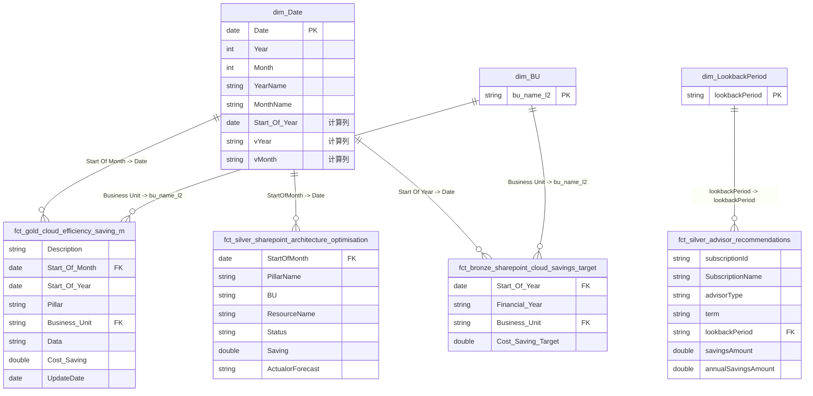
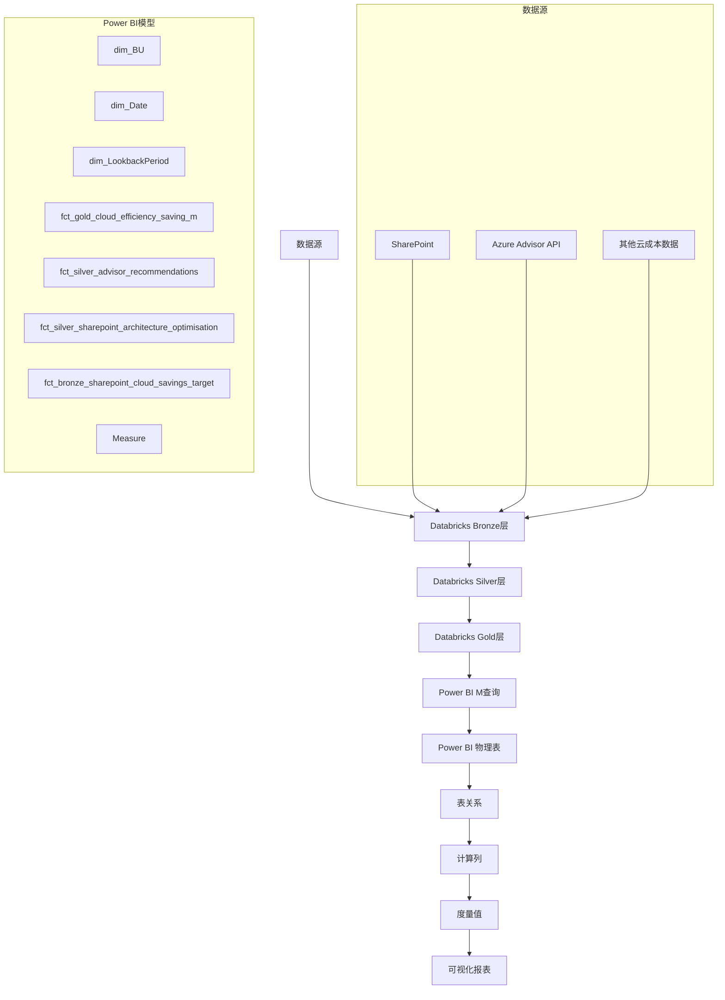

# Power BI 语义模型文档
## Cloud Efficiency Saving 模型

---

## 1. 摘要

### 1.1. 模型概述

**Cloud Efficiency Saving** 是一个用于跟踪和分析云成本节省的 Power BI 语义模型。该模型整合了来自多个数据源的成本节省数据，包括：

- **FinOps 成本节省数据**：来自 Databricks 数据仓库的金层（Gold）数据
- **Azure Advisor 推荐**：来自 Databricks 银层（Silver）的顾问推荐数据
- **架构优化数据**：来自 SharePoint 和 Databricks 的架构优化节省记录
- **成本节省目标**：来自 SharePoint 的年度成本节省目标数据

模型采用星型架构设计，包含维度表和事实表，支持多维度分析和时间序列分析。

### 1.2. 执行摘要

本模型的核心目标是：

1. **成本节省跟踪**：实时跟踪和报告云资源优化带来的成本节省
2. **目标管理**：监控实际节省与年度目标的对比
3. **预测分析**：基于历史数据预测未来成本节省趋势
4. **多维度分析**：支持按业务单元（BU）、时间、节省类型等维度进行分析

**数据来源**：
- 主要数据源：Azure Databricks（`cedm-datamart-dev` 数据库）
- 数据层次：Bronze（原始数据）→ Silver（清洗数据）→ Gold（聚合数据）
- 数据更新频率：每月更新（通常在每月14日）

### 1.3. 核心能力

1. **多数据源整合**：整合 Databricks、SharePoint 等多个数据源
2. **时间智能分析**：支持年度至今（YTD）、财年预测等时间维度分析
3. **动态计算**：通过 DAX 度量值实现复杂的业务逻辑计算
4. **实时数据连接**：通过 Databricks 连接器实现实时数据访问
5. **数据分层架构**：遵循 Bronze-Silver-Gold 数据分层原则

### 1.4. 核心业务价值

1. **成本优化决策支持**：为管理层提供数据驱动的成本优化决策依据
2. **目标达成监控**：实时监控成本节省目标完成情况
3. **趋势预测**：通过预测模型帮助规划未来成本节省策略
4. **资源优化识别**：识别和跟踪不同类型的成本节省机会（预留实例、资源调整、架构优化等）
5. **业务单元对比**：支持不同业务单元之间的成本节省对比分析

---

## 2. M代码分析与业务含义

### 2.1. 表分类说明

#### 2.1.1. 表命名规范

模型遵循标准的维度建模命名规范：

**维度表（Dimension Tables）**：
- 前缀：`dim_`
- 用途：存储描述性属性，用于分析和筛选
- 示例：`dim_BU`、`dim_Date`、`dim_LookbackPeriod`

**事实表（Fact Tables）**：
- 前缀：`fct_`
- 数据层次标识：
  - `bronze_`：原始数据层
  - `silver_`：清洗和转换后的数据层
  - `gold_`：聚合和业务就绪的数据层
- 示例：
  - `fct_bronze_sharepoint_cloud_savings_target`（原始目标数据）
  - `fct_silver_advisor_recommendations`（清洗后的顾问推荐）
  - `fct_silver_sharepoint_architecture_optimisation`（清洗后的架构优化）
  - `fct_gold_cloud_efficiency_saving_m`（聚合后的月度成本节省）

**度量表（Measure Table）**：
- 名称：`Measure`
- 用途：存储所有 DAX 度量值定义

#### 2.1.2. 表分类清单

| 表名 | 类型 | 数据层次 | 主要用途 |
|------|------|----------|----------|
| `dim_BU` | 维度表 | Gold | 业务单元维度 |
| `dim_Date` | 维度表 | Gold | 时间维度 |
| `dim_LookbackPeriod` | 维度表 | 派生 | 回看期间维度 |
| `fct_gold_cloud_efficiency_saving_m` | 事实表 | Gold | 月度成本节省事实 |
| `fct_silver_advisor_recommendations` | 事实表 | Silver | Azure Advisor 推荐事实 |
| `fct_silver_sharepoint_architecture_optimisation` | 事实表 | Silver | 架构优化事实 |
| `fct_bronze_sharepoint_cloud_savings_target` | 事实表 | Bronze | 成本节省目标事实 |
| `Measure` | 度量表 | - | DAX 度量值定义 |

---

### 2.2. 模型所有表ETL逻辑

#### 2.2.1. dim_BU（业务单元维度表）

**表说明**：
业务单元维度表，存储组织内各业务单元的信息。

**业务含义**：
用于按业务单元对成本节省进行分组和分析，支持不同业务单元之间的对比。

**M代码**：
```m
let
    Source = Databricks.Catalogs(#"Server Hostname", #"HTTP Path", [Catalog=null, Database=null, EnableAutomaticProxyDiscovery=null]),
    #"cedm-datamart-dev_Database" = Source{[Name=Database,Kind="Database"]}[Data],
    gold_Schema = #"cedm-datamart-dev_Database"{[Name="gold",Kind="Schema"]}[Data],
    dim_bu_Table = gold_Schema{[Name="dim_bu_l2",Kind="Table"]}[Data]
in
    dim_bu_Table
```

**ETL逻辑流程**：
1. **连接 Databricks**：使用参数化的服务器主机名和 HTTP 路径连接到 Databricks
2. **选择数据库**：从目录中选择 `cedm-datamart-dev` 数据库
3. **选择架构**：选择 `gold` 架构（金层数据）
4. **选择表**：从架构中选择 `dim_bu_l2` 表
5. **直接加载**：无需额外转换，直接加载维度数据

**关键业务指标**：
- `bu_name_l2`：二级业务单元名称（用于与事实表关联）

---

#### 2.2.2. dim_Date（日期维度表）

**表说明**：
完整的日期维度表，包含年、季度、月份、周等时间层次结构。

**业务含义**：
提供时间智能分析的基础，支持年度至今（YTD）、季度对比、月度趋势等分析。

**M代码**：
```m
let
    Source = Databricks.Catalogs(#"Server Hostname", #"HTTP Path", [Catalog=null, Database=null, EnableAutomaticProxyDiscovery=null]),
    #"cedm-datamart-dev_Database" = Source{[Name=Database,Kind="Database"]}[Data],
    gold_Schema = #"cedm-datamart-dev_Database"{[Name="gold",Kind="Schema"]}[Data],
    dim_date_Table = gold_Schema{[Name="dim_date",Kind="Table"]}[Data]
in
    dim_date_Table
```

**ETL逻辑流程**：
1. **连接 Databricks**：连接到 Databricks 数据仓库
2. **选择数据库和架构**：选择 `cedm-datamart-dev` 数据库的 `gold` 架构
3. **加载日期表**：从 `dim_date` 表加载完整的日期维度数据

**关键业务指标**：
- `Date`：日期（主键）
- `Year`、`Quarter`、`Month`：时间层次
- `YearName`、`QuarterName`、`MonthName`：时间名称
- `Y&M`、`Y&MIndex`：年月组合和索引
- `Start Of Year`：年度开始日期（计算列）
- `Last Updated`：最后更新标识（计算列）
- `IsLastYear`：是否最后一年（计算列）
- `vYear`、`vMonth`：动态年份和月份显示（计算列）
- `ActualCostYear`：实际成本年份标识（计算列）

**特殊计算列说明**：
- `Start Of Year`：使用 DAX 公式 `DATE(YEAR(dim_Date[Date]), 1, 1)` 计算年度开始日期
- `Last Updated`：标识日期是否在最后更新日期之前
- `vYear`：动态显示当前年份为 "Current Year"，其他年份显示年份名称
- `vMonth`：动态显示当前月份为 "Current Month"，其他月份显示月份名称

---

#### 2.2.3. dim_LookbackPeriod（回看期间维度表）

**表说明**：
从顾问推荐事实表中派生出的回看期间维度。

**业务含义**：
用于分析不同回看期间（如 7 天、30 天、90 天）的顾问推荐数据。

**M代码**：
```m
let
    Source = fct_silver_advisor_recommendations,
    #"Removed Other Columns" = Table.SelectColumns(Source,{"lookbackPeriod"}),
    #"Removed Duplicates" = Table.Distinct(#"Removed Other Columns")
in
    #"Removed Duplicates"
```

**ETL逻辑流程**：
1. **源表引用**：从 `fct_silver_advisor_recommendations` 表获取数据
2. **列选择**：仅选择 `lookbackPeriod` 列
3. **去重**：使用 `Table.Distinct` 去除重复值
4. **生成维度**：创建唯一的回看期间列表

**关键业务指标**：
- `lookbackPeriod`：回看期间值（如 "7d"、"30d"、"90d"）

---

#### 2.2.4. fct_gold_cloud_efficiency_saving_m（月度成本节省事实表）

**表说明**：
聚合后的月度成本节省事实表，包含不同节省类型（预留实例、资源调整、架构优化等）的月度节省金额。

**业务含义**：
这是模型的核心事实表，用于跟踪和报告各类云成本节省的月度数据，支持实际值与预测值的对比。

**M代码**：
```m
let
    Source = Databricks.Catalogs(#"Server Hostname",#"HTTP Path", [Catalog=null, Database=null, EnableAutomaticProxyDiscovery=null]),
    #"cedm-datamart-dev_Database" = Source{[Name=Database,Kind="Database"]}[Data],
    Schema = #"cedm-datamart-dev_Database"{[Name="gold",Kind="Schema"]}[Data],
    Table = Schema{[Name="gold_cloud_efficiency_saving_m",Kind="Table"]}[Data],
    #"Renamed Columns" = Table.RenameColumns(Table,{{"PillarName", "Pillar"}, {"BU", "Business Unit"}, {"ActualorForecast", "Data"}, {"Saving", "Cost Saving"}, {"report_month", "UpdateDate"}, {"StartOfMonth", "Start Of Month"}, {"StartOfYear", "Start Of Year"}}),
    #"Changed Type" = Table.TransformColumnTypes(#"Renamed Columns",{{"Cost Saving", type number}, {"UpdateDate", type date}})
in
    #"Changed Type"
```

**ETL逻辑流程**：
1. **连接 Databricks**：连接到 Databricks 数据仓库
2. **选择数据源**：选择 `cedm-datamart-dev` 数据库的 `gold` 架构
3. **加载表**：从 `gold_cloud_efficiency_saving_m` 表加载数据
4. **列重命名**：将源列名重命名为业务友好的名称
   - `PillarName` → `Pillar`（支柱名称）
   - `BU` → `Business Unit`（业务单元）
   - `ActualorForecast` → `Data`（实际或预测标识）
   - `Saving` → `Cost Saving`（成本节省）
   - `report_month` → `UpdateDate`（更新日期）
   - `StartOfMonth` → `Start Of Month`（月份开始日期）
   - `StartOfYear` → `Start Of Year`（年度开始日期）
5. **类型转换**：将 `Cost Saving` 和 `UpdateDate` 转换为正确的数据类型

**关键业务指标**：
- `Description`：节省类型描述（如 "Reservation"、"Rightsizing"、"Top50 Reselection"、"Architecture Optimisation"）
- `Start Of Month`：月份开始日期（用于时间维度关联）
- `Start Of Year`：年度开始日期（用于年度分析）
- `Pillar`：成本节省支柱分类
- `Business Unit`：业务单元（用于与 dim_BU 关联）
- `Data`：数据类型（"Actual" 或 "Forecast"）
- `Cost Saving`：成本节省金额（核心度量值）
- `UpdateDate`：数据更新日期
- `ingestion_date`、`notebook_name`：数据血缘追踪字段

**业务规则**：
- `Data` 字段区分实际值和预测值，用于支持实际与预测的对比分析
- `Description` 字段标识不同的节省类型，支持按类型进行分组分析

---

#### 2.2.5. fct_silver_advisor_recommendations（Azure Advisor 推荐事实表）

**表说明**：
来自 Azure Advisor 的优化推荐数据，包含推荐类型、影响、节省金额等信息。

**业务含义**：
跟踪 Azure Advisor 提供的成本优化建议，包括预留实例、资源调整等推荐。

**M代码**：
```m
let
    Source = Databricks.Catalogs(#"Server Hostname",#"HTTP Path", [Catalog=null, Database=null, EnableAutomaticProxyDiscovery=null]),
    #"cedm-datamart-dev_Database" = Source{[Name="cedm-datamart-dev",Kind="Database"]}[Data],
    silver_Schema = #"cedm-datamart-dev_Database"{[Name="silver",Kind="Schema"]}[Data],
    silver_advisor_recommendations_Table = silver_Schema{[Name="silver_advisor_recommendations",Kind="Table"]}[Data],
    #"Changed Type" = Table.TransformColumnTypes(silver_advisor_recommendations_Table,{{"savingsAmount", type number}, {"annualSavingsAmount", type number}}),
    #"Renamed Columns" = Table.RenameColumns(#"Changed Type",{{"subscriptionName", "SubscriptionName"}}),
    #"Filtered Rows" = Table.SelectRows(#"Renamed Columns", each ([advisorType] <> "Savings Plan"))
in
    #"Filtered Rows"
```

**ETL逻辑流程**：
1. **连接 Databricks**：连接到 Databricks 数据仓库
2. **选择数据源**：选择 `cedm-datamart-dev` 数据库的 `silver` 架构
3. **加载表**：从 `silver_advisor_recommendations` 表加载数据
4. **类型转换**：将 `savingsAmount` 和 `annualSavingsAmount` 转换为数字类型
5. **列重命名**：将 `subscriptionName` 重命名为 `SubscriptionName`
6. **数据过滤**：过滤掉 `advisorType` 为 "Savings Plan" 的记录（业务规则：不包含 Savings Plan 类型的推荐）

**关键业务指标**：
- `subscriptionId`、`SubscriptionName`：Azure 订阅信息
- `id`、`type`、`name`：推荐标识信息
- `category`、`impact`、`impactedField`、`impactedValue`：推荐影响信息
- `recommendationTypeId`、`advisorType`、`impactType`：推荐类型分类
- `problem`、`solution`、`action`：推荐描述信息
- `savingsAmount`：节省金额（月度）
- `annualSavingsAmount`：年度节省金额
- `term`：期限（如 "P1Y" 一年期、"P3Y" 三年期）
- `lookbackPeriod`：回看期间（用于与 dim_LookbackPeriod 关联）
- `BU_Name`、`region`：业务单元和区域信息

**业务规则**：
- 排除 "Savings Plan" 类型的推荐（可能因为业务需求或数据质量问题）
- 支持按期限（P1Y/P3Y）和顾问类型（Reservation/Right Size/Other）进行分析

---

#### 2.2.6. fct_silver_sharepoint_architecture_optimisation（架构优化事实表）

**表说明**：
来自 SharePoint 的架构优化成本节省数据，记录具体的资源优化项目和节省金额。

**业务含义**：
跟踪通过架构优化实现的成本节省，包括资源名称、环境、状态、完成日期等详细信息。

**M代码**：
```m
let
    Source = Databricks.Catalogs(#"Server Hostname",#"HTTP Path", [Catalog=null, Database=null, EnableAutomaticProxyDiscovery=null]),
    #"cedm-datamart-dev_Database" = Source{[Name=Database,Kind="Database"]}[Data],
    Schema = #"cedm-datamart-dev_Database"{[Name="silver",Kind="Schema"]}[Data],
    Table = Schema{[Name="silver_sharepoint_architecture_optimisation",Kind="Table"]}[Data]
in
    Table
```

**ETL逻辑流程**：
1. **连接 Databricks**：连接到 Databricks 数据仓库
2. **选择数据源**：选择 `cedm-datamart-dev` 数据库的 `silver` 架构
3. **加载表**：从 `silver_sharepoint_architecture_optimisation` 表直接加载数据
4. **无需转换**：数据已在 Silver 层完成清洗，直接使用

**关键业务指标**：
- `StartOfMonth`：月份开始日期（用于与 dim_Date 关联）
- `Y-M`：年月组合
- `PillarName`：支柱名称
- `BU`：业务单元
- `ResourceName`：资源名称
- `Env`：环境（如 Dev、Test、Prod）
- `Remark`：备注信息
- `CostSavings_Month`：成本节省月份
- `Status`：状态（如 Completed、In Progress）
- `Comp_Date`：完成日期
- `BASELINE`：基线信息
- `Saving`：节省金额（核心度量值）
- `ActualorForecast`：实际或预测标识

**业务规则**：
- `ActualorForecast` 字段区分已实现的节省（Actual）和预测的节省（Forecast）
- 支持按状态、环境、业务单元等维度进行分析

---

#### 2.2.7. fct_bronze_sharepoint_cloud_savings_target（成本节省目标事实表）

**表说明**：
来自 SharePoint 的年度成本节省目标数据，记录各业务单元在不同财年的成本节省目标。

**业务含义**：
用于设定和跟踪成本节省目标，支持目标与实际节省的对比分析。

**M代码**：
```m
let
    Source = Databricks.Catalogs(#"Server Hostname",#"HTTP Path", [Catalog=null, Database=null, EnableAutomaticProxyDiscovery=null]),
    #"cedm-datamart-dev_Database" = Source{[Name=Database,Kind="Database"]}[Data],
    bronze_Schema = #"cedm-datamart-dev_Database"{[Name="bronze",Kind="Schema"]}[Data],
    bronze_sharepoint_cloud_savings_target_Table = bronze_Schema{[Name="bronze_sharepoint_cloud_savings_target",Kind="Table"]}[Data],
    #"Added Custom" = Table.AddColumn(bronze_sharepoint_cloud_savings_target_Table, "Start Of Year", each [FinancialYear] & "/" & "1/1"),
    #"Changed Type" = Table.TransformColumnTypes(#"Added Custom",{{"Start Of Year", type date}, {"CostSavingTarget", type number}}),
    #"Renamed Columns" = Table.RenameColumns(#"Changed Type",{{"CostSavingTarget", "Cost Saving Target"}, {"BusinessUnit", "Business Unit"}, {"FinancialYear", "Financial Year"}})
in
    #"Renamed Columns"
```

**ETL逻辑流程**：
1. **连接 Databricks**：连接到 Databricks 数据仓库
2. **选择数据源**：选择 `cedm-datamart-dev` 数据库的 `bronze` 架构
3. **加载表**：从 `bronze_sharepoint_cloud_savings_target` 表加载数据
4. **添加计算列**：创建 `Start Of Year` 列，将财年转换为日期格式（格式：`[FinancialYear]/1/1`）
5. **类型转换**：将 `Start Of Year` 转换为日期类型，`CostSavingTarget` 转换为数字类型
6. **列重命名**：将列名重命名为业务友好的名称
   - `CostSavingTarget` → `Cost Saving Target`
   - `BusinessUnit` → `Business Unit`
   - `FinancialYear` → `Financial Year`

**关键业务指标**：
- `Start Of Year`：财年开始日期（用于与 dim_Date 关联）
- `Financial Year`：财年（如 "2023/2024"）
- `Business Unit`：业务单元（用于与 dim_BU 关联）
- `Cost Saving Target`：成本节省目标金额（核心度量值）
- `ingestion_file_name`、`ingestion_date`、`notebook_name`：数据血缘追踪字段

**业务规则**：
- 目标数据按财年和业务单元设定
- `Start Of Year` 用于与日期维度关联，支持时间序列分析

---

#### 2.2.8. Measure（度量值表）

**表说明**：
存储所有 DAX 度量值定义的表，不包含实际数据行。

**业务含义**：
集中管理所有业务度量值，包括成本节省汇总、YTD 计算、预测计算等。

**M代码**：
```m
let
    Source = Table.FromRows(Json.Document(Binary.Decompress(Binary.FromText("i44FAA==", BinaryEncoding.Base64), Compression.Deflate)), let _t = ((type nullable text) meta [Serialized.Text = true]) in type table [Column1 = _t]),
    #"Removed Columns" = Table.RemoveColumns(Source,{"Column1"})
in
    #"Removed Columns"
```

**ETL逻辑流程**：
1. **创建空表**：从压缩的 JSON 数据创建一个空表结构
2. **移除列**：移除默认列，创建一个完全空的表
3. **用途**：此表仅用于存储度量值定义，不包含数据

**度量值说明**：
- 模型共包含 **43个度量值**，详细清单请参见 [3.2. 模型所有表度量值](#32-模型所有表度量值) 章节
- 度量值按功能分为：总成本节省、预留实例节省、资源调整节省、Top50重选节省、架构优化节省、Azure Advisor推荐、目标管理等类别

---

### 2.3. 模型所有参数表ETL逻辑

#### 2.3.1. Server Hostname（服务器主机名参数）

**类型**：文本参数（Text Parameter）

**M代码**：
```m
expression 'Server Hostname' = "adb-3085800437590429.9.azuredatabricks.net" 
    meta [IsParameterQuery=true, Type="Text", IsParameterQueryRequired=true]
```

**用途**：
指定 Databricks 服务器的连接地址。

**使用场景**：
- 所有通过 Databricks 连接器访问数据的查询都需要此参数
- 用于环境切换（开发/测试/生产环境）

**业务含义**：
集中管理数据源连接配置，便于在不同环境间切换。

---

#### 2.3.2. HTTP Path（HTTP 路径参数）

**类型**：文本参数（Text Parameter）

**M代码**：
```m
expression 'HTTP Path' = "/sql/1.0/warehouses/b709e878048ab49a" 
    meta [IsParameterQuery=true, Type="Text", IsParameterQueryRequired=true]
```

**用途**：
指定 Databricks SQL 仓库的 HTTP 路径。

**使用场景**：
- 与 Server Hostname 配合使用，建立完整的 Databricks 连接
- 用于访问特定的 SQL 仓库

**业务含义**：
指向具体的数据仓库资源，支持多仓库管理。

---

#### 2.3.3. Database（数据库参数）

**类型**：文本参数（Text Parameter）

**M代码**：
```m
expression Database = "cedm-datamart-dev" 
    meta [IsParameterQuery=true, Type="Text", IsParameterQueryRequired=true]
```

**用途**：
指定要访问的 Databricks 数据库名称。

**使用场景**：
- 所有表查询都需要此参数来选择正确的数据库
- 支持在不同数据库环境间切换

**业务含义**：
标识数据所在的数据库，支持多数据库管理。

---

#### 2.3.4. dim_Date_Filter（日期过滤表达式）

**类型**：表表达式（Table Expression）

**M代码**：
```m
expression dim_Date_Filter =
    let
        Source = dim_Date,
        SourceTable = Table.SelectColumns(Source,{"Date", "Year", "YearName"}),
        #"2027" = Table.SelectRows( Table.AddColumn(SourceTable, "YearF", each 2027) , each ([Year] < 2027)),
        #"2026" = Table.SelectRows( Table.AddColumn(SourceTable, "YearF", each 2026) , each ([Year] < 2026)),
        #"2025" = Table.SelectRows( Table.AddColumn(SourceTable, "YearF", each 2025) , each ([Year] < 2025)),
        #"2024" = Table.SelectRows( Table.AddColumn(SourceTable, "YearF", each 2024) , each ([Year] < 2024)),
        #"2023" = Table.SelectRows( Table.AddColumn(SourceTable, "YearF", each 2024) , each ([Year] < 2023)),
        #"2022" = Table.SelectRows( Table.AddColumn(SourceTable, "YearF", each 2022) , each ([Year] < 2022)),
        #"Appended Query" = Table.Combine({#"2022", #"2023",#"2024",#"2025",#"2026",#"2027"})
    in
        #"Appended Query"
```

**用途**：
为每个年份创建历史数据视图，用于支持年度对比分析。

**使用场景**：
- 用于创建年度对比报表
- 支持"去年同期"类型的分析

**业务含义**：
通过为每个历史年份创建数据副本，支持跨年度的对比分析，帮助识别年度趋势。

**ETL逻辑流程**：
1. **源表选择**：从 `dim_Date` 表选择 `Date`、`Year`、`YearName` 列
2. **年份过滤**：为每个目标年份（2022-2027）创建过滤后的数据
   - 为每行添加 `YearF` 列，标识目标年份
   - 过滤出小于目标年份的所有日期
3. **数据合并**：将所有年份的数据合并成一个表

**注意**：此表达式位于 `Achived` 查询组，表示这是一个已归档的查询，可能不再使用。

---

### 2.4. 模型所有自定义函数逻辑

**说明**：
在当前模型中，未发现独立的 M 自定义函数。所有数据处理逻辑都直接嵌入在表的 M 查询中。

**可能的原因**：
1. 数据处理逻辑相对简单，不需要抽象为函数
2. 函数可能定义在其他位置（如 Databricks 端）
3. 复杂的业务逻辑通过 DAX 度量值实现，而非 M 函数

**建议**：
如果未来需要重用某些 M 代码逻辑，可以考虑创建自定义函数，例如：
- 统一的 Databricks 连接函数
- 通用的列重命名函数
- 数据类型转换函数

---

### 2.5. ETL流程总结

#### 2.5.1. 数据流向

**说明**：详细的数据流向图请参见 [4.6. 数据流向](#46-数据流向) 章节。

**简要流程**：
1. **数据源层**：SharePoint、Azure Advisor API、其他云成本数据源
2. **Databricks Bronze层**：原始数据存储，最小化转换
3. **Databricks Silver层**：数据清洗、验证、标准化
4. **Databricks Gold层**：业务就绪数据，聚合和汇总
5. **Power BI语义模型**：通过Databricks连接器加载，M查询转换，DAX度量值计算
6. **Power BI报表层**：可视化报表和仪表盘

#### 2.5.2. 关键ETL模式

**1. 参数化连接模式**：
- 使用参数（Server Hostname、HTTP Path、Database）实现连接配置的集中管理
- 便于在不同环境间切换

**2. 分层数据访问模式**：
- Bronze → Silver → Gold 三层架构
- 每层承担不同的数据质量责任
- Power BI 主要从 Gold 层读取数据

**3. 列重命名和标准化模式**：
- 将技术列名转换为业务友好的名称
- 统一命名规范（如 "Business Unit" 而非 "BU"）

**4. 类型转换模式**：
- 确保数值列为数字类型
- 确保日期列为日期类型
- 在 M 查询中完成类型转换，而非在 DAX 中

**5. 数据过滤模式**：
- 在 M 查询中过滤不需要的数据（如排除 "Savings Plan"）
- 减少加载到模型中的数据量

**6. 派生维度模式**：
- `dim_LookbackPeriod` 从事实表派生
- 减少对源系统的依赖

**7. 计算列模式**：
- 在 DAX 中创建计算列（如 `dim_Date` 表中的多个计算列）
- 支持复杂的业务逻辑计算

---

### 2.6. 表关系说明

#### 2.6.1. 关系图

**说明**：详细的数据模型关系图请参见 [4.1. 数据模型图](#41-数据模型图) 章节（包含Mermaid ER图）。

**简要关系结构**：
- `dim_Date` 与多个事实表关联（`fct_gold_cloud_efficiency_saving_m`、`fct_silver_sharepoint_architecture_optimisation`、`fct_bronze_sharepoint_cloud_savings_target`）
- `dim_BU` 与事实表关联（`fct_gold_cloud_efficiency_saving_m`、`fct_bronze_sharepoint_cloud_savings_target`）
- `dim_LookbackPeriod` 与 `fct_silver_advisor_recommendations` 关联

#### 2.6.2. 关系详细说明

**1. dim_Date ↔ fct_gold_cloud_efficiency_saving_m**
- **关系ID**：`87c4c949-5282-77a1-a816-aeb13211ec84`
- **类型**：一对多（One-to-Many）
- **从列**：`fct_gold_cloud_efficiency_saving_m[Start Of Month]`
- **到列**：`dim_Date[Date]`
- **业务含义**：将成本节省事实与日期维度关联，支持时间序列分析

**2. dim_Date ↔ fct_silver_sharepoint_architecture_optimisation**
- **关系ID**：`edfbd468-d283-5444-6db1-fc5d26df940a`
- **类型**：一对多（One-to-Many）
- **从列**：`fct_silver_sharepoint_architecture_optimisation[StartOfMonth]`
- **到列**：`dim_Date[Date]`
- **业务含义**：将架构优化事实与日期维度关联

**3. dim_Date ↔ fct_bronze_sharepoint_cloud_savings_target**
- **关系ID**：`73dad43b-e99f-040d-5490-01dce326fab4`
- **类型**：一对多（One-to-Many）
- **从列**：`fct_bronze_sharepoint_cloud_savings_target[Start Of Year]`
- **到列**：`dim_Date[Date]`
- **业务含义**：将成本节省目标与日期维度关联，支持目标与实际值的对比

**4. dim_BU ↔ fct_gold_cloud_efficiency_saving_m**
- **关系ID**：`ca1d0154-5845-1a1e-7a9f-570ebbe93766`
- **类型**：一对多（One-to-Many）
- **从列**：`fct_gold_cloud_efficiency_saving_m[Business Unit]`
- **到列**：`dim_BU[bu_name_l2]`
- **业务含义**：将成本节省事实与业务单元维度关联，支持按业务单元分析

**5. dim_BU ↔ fct_bronze_sharepoint_cloud_savings_target**
- **关系ID**：`1ff8b9ae-59f0-bcdd-198d-72ab3970165e`
- **类型**：一对多（One-to-Many）
- **从列**：`fct_bronze_sharepoint_cloud_savings_target[Business Unit]`
- **到列**：`dim_BU[bu_name_l2]`
- **业务含义**：将成本节省目标与业务单元维度关联

**6. dim_LookbackPeriod ↔ fct_silver_advisor_recommendations**
- **关系ID**：`e4ab3a5c-45dd-d157-2295-9921630aab27`
- **类型**：一对多（One-to-Many），多对多基数
- **从列**：`fct_silver_advisor_recommendations[lookbackPeriod]`
- **到列**：`dim_LookbackPeriod[lookbackPeriod]`
- **业务含义**：将顾问推荐事实与回看期间维度关联，支持按回看期间分析推荐数据

#### 2.6.3. 关系设计原则

1. **星型架构**：采用标准的星型架构设计，维度表围绕事实表
2. **单一事实表焦点**：`fct_gold_cloud_efficiency_saving_m` 是核心事实表，与多个维度表关联
3. **日期维度重要性**：日期维度是分析的基础，多个事实表都与其关联
4. **业务单元维度**：支持按业务单元进行多维度分析
5. **派生维度**：`dim_LookbackPeriod` 从事实表派生，减少数据冗余

---

### 2.7. 数据质量保证

#### 2.7.1. 错误处理机制

**1. 数据类型验证**：
- 在 M 查询中使用 `Table.TransformColumnTypes` 确保数据类型正确
- 如果类型转换失败，查询会报错，便于及时发现数据质量问题

**2. 空值处理**：
- 模型设置中启用 `returnErrorValuesAsNull`，将错误值转换为 NULL
- 在 DAX 度量值中使用 `IF(ISBLANK(...))` 处理空值情况

**3. 数据过滤**：
- 在 M 查询中过滤无效数据（如排除 "Savings Plan" 类型的推荐）
- 减少无效数据对分析的影响

**4. 数据血缘追踪**：
- 所有事实表都包含 `ingestion_date`、`notebook_name` 等字段
- 便于追踪数据来源和加载时间

#### 2.7.2. 数据验证

**1. 业务规则验证**：
- **数据类型区分**：通过 `Data` 字段区分 "Actual" 和 "Forecast"
- **节省类型分类**：通过 `Description` 字段确保节省类型正确分类
- **时间一致性**：确保 `Start Of Month` 和 `Start Of Year` 的一致性

**2. 完整性检查**：
- 维度表完整性：确保维度表包含所有需要的值
- 关系完整性：通过关系确保事实表的外键在维度表中存在

**3. 数据范围验证**：
- 日期范围：确保日期在合理范围内
- 金额范围：通过 DAX 度量值中的 `IF(ABS(saving) > 0.01, saving, BLANK())` 过滤极小值

**4. 一致性检查**：
- 列重命名一致性：确保所有表使用统一的列名规范
- 数据类型一致性：确保相同含义的列使用相同的数据类型

#### 2.7.3. 数据质量监控建议

1. **定期数据质量检查**：
   - 检查空值比例
   - 检查数据范围异常
   - 检查关系完整性

2. **数据更新监控**：
   - 监控 `UpdateDate` 字段，确保数据及时更新
   - 设置数据刷新失败告警

3. **业务规则验证**：
   - 定期验证业务规则（如节省类型分类）的正确性
   - 检查预测值与实际值的合理性

---

### 2.8. 性能优化建议

#### 2.8.1. 数据加载优化

**1. 查询优化**：
- ✅ **已实现**：在 M 查询中使用 `Table.SelectRows` 过滤不需要的数据
- ✅ **已实现**：仅选择必要的列，减少数据传输量
- **建议**：考虑在 Databricks 端创建物化视图，减少查询时间

**2. 数据类型优化**：
- ✅ **已实现**：在 M 查询中完成类型转换，而非在 DAX 中
- **建议**：确保 Databricks 表中的数据类型与 Power BI 需求一致

**3. 增量刷新**：
- **建议**：考虑实现增量刷新策略，仅加载新增或变更的数据
- **前提**：需要在源表中添加时间戳或变更标识字段

#### 2.8.2. 模型优化

**1. 列优化**：
- ✅ **已实现**：隐藏不需要的列（如 `ingestion_date`、`notebook_name` 等技术字段）
- **建议**：进一步审查并隐藏更多技术字段，减少模型大小

**2. 度量值优化**：
- ✅ **已实现**：使用 `CALCULATE` 和过滤器优化度量值性能
- **建议**：避免在度量值中使用 `ALLSELECTED` 等可能影响性能的函数
- **建议**：考虑使用计算表存储常用的聚合结果

**3. 关系优化**：
- ✅ **已实现**：使用正确的关系基数（一对多）
- **建议**：确保关系列已建立索引（在 Databricks 端）

#### 2.8.3. 查询优化

**1. DAX 查询优化**：
- ✅ **已实现**：使用 `REMOVEFILTERS` 清除不需要的过滤器
- ✅ **已实现**：使用 `FILTER` 和 `ALL` 优化上下文
- **建议**：避免在度量值中使用嵌套的 `CALCULATE`，考虑使用变量简化逻辑

**2. 可视化优化**：
- **建议**：限制可视化中的数据点数量
- **建议**：使用聚合表而非明细表进行展示

#### 2.8.4. 连接优化

**1. DirectQuery vs Import**：
- ✅ **当前模式**：Import 模式，数据已加载到 Power BI
- **优势**：查询性能快，支持复杂的 DAX 计算
- **劣势**：数据刷新需要时间，模型大小受限
- **建议**：如果数据量持续增长，考虑使用 DirectQuery 或混合模式

**2. 连接参数优化**：
- ✅ **已实现**：使用参数化连接，便于管理
- **建议**：考虑使用连接池或缓存机制

#### 2.8.5. 具体优化建议清单

**高优先级**：
1. ✅ 实现增量刷新（如果数据量持续增长）
2. ✅ 在 Databricks 端创建索引和分区
3. ✅ 优化 DAX 度量值，减少嵌套计算

**中优先级**：
1. ✅ 审查并隐藏更多技术字段
2. ✅ 创建聚合表存储常用查询结果
3. ✅ 优化可视化，减少数据点数量

**低优先级**：
1. ✅ 考虑使用计算组简化度量值管理
2. ✅ 实现数据质量监控仪表盘
3. ✅ 文档化性能基准和监控指标

---

## 3. DAX代码分析与业务含义

本章节深入分析模型中的所有DAX代码，包括度量值、计算列的计算逻辑、业务含义、依赖关系和最佳实践。

---

### 3.1. 数据沿袭分析方法

数据沿袭（Data Lineage）是理解Power BI模型的关键，它描述了数据元素之间的依赖关系，帮助开发者理解数据如何从源表流向最终的可视化。

#### 3.1.1. 依赖类型

在 Power BI 语义模型中，数据沿袭描述了数据元素之间的依赖关系。本模型中的依赖类型包括：

**1. 表依赖（Table Dependencies）**
- **事实表 → 维度表**：通过关系连接，事实表依赖维度表提供筛选上下文
  - 示例：`fct_gold_cloud_efficiency_saving_m` 通过关系依赖 `dim_Date` 和 `dim_BU`
- **派生表 → 源表**：派生表从源表获取数据
  - 示例：`dim_LookbackPeriod` 派生自 `fct_silver_advisor_recommendations`

**2. 列依赖（Column Dependencies）**
- **计算列 → 源列**：计算列依赖其引用的源列进行计算
  - 示例：`dim_Date[Start Of Year]` 依赖 `dim_Date[Date]`
- **计算列 → 其他计算列**：计算列可以依赖其他计算列
  - 示例：`dim_Date[vYear]` 依赖 `dim_Date[Year]` 和事实表中的数据
- **计算列 → 度量值**：不推荐，但技术上可行（会在行上下文计算，可能导致性能问题）

**3. 度量值依赖（Measure Dependencies）**
- **度量值 → 表列**：度量值依赖表中的列进行计算
  - 示例：`SavingAmount = SUM('fct_silver_advisor_recommendations'[savingsAmount])`
- **度量值 → 其他度量值**：度量值可以引用其他度量值（度量值链）
  - 示例：`Total Cost Saving YTD` 依赖 `Total Cost Saving`
- **度量值 → 计算列**：度量值可以使用计算列作为筛选或计算依据
  - 示例：度量值可以使用 `dim_Date[vYear]` 进行筛选

**4. 关系依赖（Relationship Dependencies）**
- **关系 → 表**：关系连接两个表，建立依赖关系
- **关系 → 列**：关系基于特定列建立
  - 示例：`dim_Date[Date]` 与 `fct_gold_cloud_efficiency_saving_m[Start Of Month]` 的关系

#### 3.1.2. 识别模式

**模式1：直接依赖**
```
度量值 → 直接引用表列
```
**示例**：
```dax
SavingAmount = SUM('fct_silver_advisor_recommendations'[savingsAmount])
```
**特点**：最简单的依赖模式，性能最优。

**模式2：间接依赖（通过关系）**
```
度量值 → 通过关系访问相关表
```
**示例**：
```dax
-- 通过 dim_Date 关系访问 fct_gold_cloud_efficiency_saving_m
Total Cost Saving YTD = CALCULATE([Total Cost Saving], DATESYTD(dim_Date[Date]))
```
**特点**：利用表关系进行跨表计算，需要理解筛选上下文传播。

**模式3：度量值链依赖**
```
度量值A → 度量值B → 表列
```
**示例**：
```dax
Total Cost Saving YTD → Total Cost Saving → fct_gold_cloud_efficiency_saving_m[Cost Saving]
```
**特点**：构建可重用的度量值层次结构，但需要注意性能影响。

**模式4：计算列依赖**
```
计算列 → 源列 + 其他计算列/度量值
```
**示例**：
```dax
dim_Date[vYear] → dim_Date[Year] + fct_gold_cloud_efficiency_saving_m[Start Of Year]
```
**特点**：计算列在数据加载时计算，占用存储空间，但查询时性能好。

**模式5：复杂筛选依赖**
```
度量值 → CALCULATE + 多个筛选条件 + 关系
```
**示例**：
```dax
Total Cost Saving (FY Projection) = 
    VAR Forecast = CALCULATE(..., REMOVEFILTERS(...), FILTER(...))
    VAR Actual = [Total Cost Saving YTD]
    RETURN Actual + Forecast
```
**特点**：使用CALCULATE进行筛选上下文转换，需要深入理解上下文传播规则。

---

### 3.2. 模型所有表度量值

#### 3.2.1. 度量值分类概览

模型共包含 **43个度量值**，按功能分类如下：

| 分类 | 数量 | 主要用途 |
|------|------|---------|
| **总成本节省** | 5 | 核心KPI，总节省金额及YTD、预测等 |
| **预留实例节省** | 6 | 预留实例类型的节省分析 |
| **资源调整节省** | 4 | 资源调整类型的节省分析 |
| **Top50重选节省** | 4 | Top50重选类型的节省分析 |
| **架构优化节省** | 4 | 架构优化类型的节省分析 |
| **Azure Advisor推荐** | 12 | 顾问推荐的潜在节省分析 |
| **架构优化（SharePoint）** | 2 | SharePoint架构优化数据 |
| **目标管理** | 6 | 成本节省目标相关 |

#### 3.2.2. Measure 表度量值完整清单

**说明**：以下表格列出了所有43个度量值的详细信息。度量值按显示文件夹分组，便于查找。

##### 总成本节省度量值组（fct_gold_cloud_efficiency_saving_m）

| 度量值名称 | 类型 | 显示文件夹 | 定义 | 计算公式 | 依赖关系 | 业务含义 | 用法 |
|-----------|------|-----------|------|---------|---------|---------|------|
| Total Cost Saving | 数字 | fct_gold_cloud_efficiency_saving_m | 总成本节省 | 排除预测值的总节省 | fct_gold_cloud_efficiency_saving_m[Cost Saving], fct_gold_cloud_efficiency_saving_m[Data] | 汇总所有实际成本节省 | 核心KPI，显示总节省金额 |
| Total Cost Saving YTD | 货币 | fct_gold_cloud_efficiency_saving_m | 年度至今总成本节省 | 年度至今累计节省 | Total Cost Saving, dim_Date[Date], DATESYTD | 计算从年初到当前日期的累计节省 | 用于YTD分析 |
| Total Cost Saving (FY Projection) | 货币 | fct_gold_cloud_efficiency_saving_m | 财年预测总成本节省 | 实际YTD + 预测值 | Total Cost Saving YTD, fct_gold_cloud_efficiency_saving_m | 预测整个财年的总节省 | 用于财年目标预测 |
| Total Cost Saving (FY Projection) % Complete | 百分比 | fct_gold_cloud_efficiency_saving_m | 财年预测完成百分比 | 预测值/目标值 | Total Cost Saving (FY Projection), FinOps Cost Saving Target Value | 显示目标完成进度 | 用于仪表盘显示完成率 |
| Total Cost Saving (for visual) | 数字 | fct_gold_cloud_efficiency_saving_m | 可视化用总成本节省 | 处理空值 | Total Cost Saving | 处理空值显示 | 用于可视化，避免显示空白 |

##### 预留实例节省度量值组（fct_gold_cloud_efficiency_saving_m）

| 度量值名称 | 类型 | 显示文件夹 | 定义 | 计算公式 | 依赖关系 | 业务含义 | 用法 |
|-----------|------|-----------|------|---------|---------|---------|------|
| Total Reservation Saving | 货币 | fct_gold_cloud_efficiency_saving_m | 预留实例总节省 | 预留实例类型节省汇总 | fct_gold_cloud_efficiency_saving_m[Cost Saving], fct_gold_cloud_efficiency_saving_m[Description] | 汇总预留实例带来的节省 | 按节省类型分析 |
| Total Reservation Saving YTD | 货币 | fct_gold_cloud_efficiency_saving_m | 预留实例年度至今节省 | 预留实例YTD累计 | Total Reservation Saving, dim_Date[Date], DATESYTD | 预留实例YTD累计节省 | 预留实例YTD分析 |
| Total Reservation Saving HTLY | 货币 | fct_gold_cloud_efficiency_saving_m | 预留实例去年至今节省 | 去年至今累计 | Total Reservation Saving, dim_Date[Date] | 计算去年同期的节省 | 用于同比分析 |
| Total Reservation Saving HTD | 数字 | fct_gold_cloud_efficiency_saving_m | 预留实例历史至今节省 | 历史累计 | Total Reservation Saving, dim_Date[Date] | 所有历史预留实例节省 | 历史累计分析 |
| Total Reservation Saving (FY Projection) YTD | 货币 | fct_gold_cloud_efficiency_saving_m | 预留实例财年预测YTD | 实际+预测 | Total Reservation Saving YTD, fct_gold_cloud_efficiency_saving_m | 预留实例财年预测 | 预留实例预测分析 |
| Total Reservation Saving (for visual) | 货币 | fct_gold_cloud_efficiency_saving_m | 可视化用预留实例节省 | 处理空值 | Total Reservation Saving | 处理空值 | 可视化显示 |

##### 资源调整节省度量值组（fct_gold_cloud_efficiency_saving_m）

| 度量值名称 | 类型 | 显示文件夹 | 定义 | 计算公式 | 依赖关系 | 业务含义 | 用法 |
|-----------|------|-----------|------|---------|---------|---------|------|
| Total Rightsizing Saving | 数字 | fct_gold_cloud_efficiency_saving_m | 资源调整总节省 | 资源调整类型节省汇总 | fct_gold_cloud_efficiency_saving_m[Cost Saving], fct_gold_cloud_efficiency_saving_m[Description] | 汇总资源调整带来的节省 | 按节省类型分析 |
| Total Rightsizing Saving YTD | 货币 | fct_gold_cloud_efficiency_saving_m | 资源调整年度至今节省 | 资源调整YTD累计 | Total Rightsizing Saving, dim_Date[Date], DATESYTD | 资源调整YTD累计节省 | 资源调整YTD分析 |
| Total Rightsizing Saving (FY Projection) YTD | 货币 | fct_gold_cloud_efficiency_saving_m | 资源调整财年预测YTD | 实际+预测 | Total Rightsizing Saving YTD, fct_gold_cloud_efficiency_saving_m | 资源调整财年预测 | 资源调整预测分析 |
| Total Rightsizing Saving (for visual) | 货币 | fct_gold_cloud_efficiency_saving_m | 可视化用资源调整节省 | 处理空值 | Total Rightsizing Saving | 处理空值 | 可视化显示 |

##### Top50重选节省度量值组（fct_gold_cloud_efficiency_saving_m）

| 度量值名称 | 类型 | 显示文件夹 | 定义 | 计算公式 | 依赖关系 | 业务含义 | 用法 |
|-----------|------|-----------|------|---------|---------|---------|------|
| Total Top50 Reselection Saving | 数字 | fct_gold_cloud_efficiency_saving_m | Top50重选总节省 | Top50重选类型节省汇总 | fct_gold_cloud_efficiency_saving_m[Cost Saving], fct_gold_cloud_efficiency_saving_m[Description] | 汇总Top50重选带来的节省 | 按节省类型分析 |
| Total Top50 Reselection Saving YTD | 货币 | fct_gold_cloud_efficiency_saving_m | Top50重选年度至今节省 | Top50重选YTD累计 | Total Top50 Reselection Saving, dim_Date[Date], DATESYTD | Top50重选YTD累计节省 | Top50重选YTD分析 |
| Total Top50 Reselection Saving (FY Projection) YTD | 货币 | fct_gold_cloud_efficiency_saving_m | Top50重选财年预测YTD | 实际+预测 | Total Top50 Reselection Saving YTD, fct_gold_cloud_efficiency_saving_m | Top50重选财年预测 | Top50重选预测分析 |
| Total Top50 Reselection Saving (for visual) | 货币 | fct_gold_cloud_efficiency_saving_m | 可视化用Top50重选节省 | 处理空值 | Total Top50 Reselection Saving | 处理空值 | 可视化显示 |

##### 架构优化节省度量值组（fct_gold_cloud_efficiency_saving_m）

| 度量值名称 | 类型 | 显示文件夹 | 定义 | 计算公式 | 依赖关系 | 业务含义 | 用法 |
|-----------|------|-----------|------|---------|---------|---------|------|
| Total Architecture Optimisation Saving | 货币 | fct_gold_cloud_efficiency_saving_m | 架构优化总节省 | 架构优化类型节省汇总 | fct_gold_cloud_efficiency_saving_m[Cost Saving], fct_gold_cloud_efficiency_saving_m[Description] | 汇总架构优化带来的节省 | 按节省类型分析 |
| Total Architecture Optimisation Saving YTD | 货币 | fct_gold_cloud_efficiency_saving_m | 架构优化年度至今节省 | 架构优化YTD累计 | Total Architecture Optimisation Saving, dim_Date[Date], DATESYTD | 架构优化YTD累计节省 | 架构优化YTD分析 |
| Total Architecture Optimisation Saving (FY Projection) YTD | 货币 | fct_gold_cloud_efficiency_saving_m | 架构优化财年预测YTD | 实际+预测 | Total Architecture Optimisation Saving YTD, fct_gold_cloud_efficiency_saving_m | 架构优化财年预测 | 架构优化预测分析 |
| Total Architecture Optimisation Saving (for visual) | 货币 | fct_gold_cloud_efficiency_saving_m | 可视化用架构优化节省 | 处理空值 | Total Architecture Optimisation Saving | 处理空值 | 可视化显示 |

##### 目标管理度量值组（fct_bronze_sharepoint_cloud_savings_target）

| 度量值名称 | 类型 | 显示文件夹 | 定义 | 计算公式 | 依赖关系 | 业务含义 | 用法 |
|-----------|------|-----------|------|---------|---------|---------|------|
| Total Cost Saving Target | 数字 | fct_bronze_sharepoint_cloud_savings_target | 总成本节省目标 | SUM(目标值) | fct_bronze_sharepoint_cloud_savings_target[Cost Saving Target] | 汇总所有成本节省目标 | 用于目标管理 |
| FinOps Cost Saving Target Value | 货币 | fct_bronze_sharepoint_cloud_savings_target | FinOps成本节省目标值 | 目标值（清除月份筛选） | Total Cost Saving Target, dim_Date[vMonth] | 获取年度目标值 | 用于目标对比 |
| Gauge Axis Max Value | 数字 | fct_bronze_sharepoint_cloud_savings_target | 仪表盘轴最大值 | 目标值×4 | Total Cost Saving Target | 设置仪表盘最大值 | 用于仪表盘可视化 |
| FinOps Cost Saving Last Update Date | 日期 | fct_gold_cloud_efficiency_saving_m | FinOps成本节省最后更新日期 | 最后实际数据日期 | fct_gold_cloud_efficiency_saving_m[Start Of Month], fct_gold_cloud_efficiency_saving_m[Data] | 显示数据最后更新日期 | 用于显示数据新鲜度 |
| FinOps Cost Saving Date Note Message | 文本 | fct_gold_cloud_efficiency_saving_m | FinOps成本节省日期备注消息 | 格式化日期消息 | FinOps Cost Saving Last Update Date, FORMAT | 显示数据截止日期消息 | 用于报表说明 |
| FinOps Cost Saving Target Title | 文本 | fct_gold_cloud_efficiency_saving_m | 成本节省目标标题 | 财年标题 | dim_Date[Year] | 动态生成财年标题 | 用于报表标题显示 |

##### Azure Advisor推荐度量值组（fct_silver_advisor_recommendations）

| 度量值名称 | 类型 | 显示文件夹 | 定义 | 计算公式 | 依赖关系 | 业务含义 | 用法 |
|-----------|------|-----------|------|---------|---------|---------|------|
| SavingAmount | 货币 | fct_silver_advisor_recommendations | Azure Advisor推荐节省金额 | SUM(节省金额) | fct_silver_advisor_recommendations[savingsAmount] | 汇总所有顾问推荐的月度节省金额 | 用于显示Azure Advisor推荐的潜在节省 |
| AnnualSavingAmount | 货币 | fct_silver_advisor_recommendations | Azure Advisor推荐年度节省金额 | SUM(年度节省金额) | fct_silver_advisor_recommendations[annualSavingsAmount] | 汇总所有顾问推荐的年度节省金额 | 用于显示年度潜在节省 |
| SavingAmount P1Y | 数字 | fct_silver_advisor_recommendations | 一年期推荐节省金额 | 一年期节省汇总 | SavingAmount, fct_silver_advisor_recommendations[term] | 按期限分类的节省 | 按期限分析 |
| SavingAmount P3Y | 数字 | fct_silver_advisor_recommendations | 三年期推荐节省金额 | 三年期节省汇总 | SavingAmount, fct_silver_advisor_recommendations[term] | 按期限分类的节省 | 按期限分析 |
| AnnualSavingAmount P1Y | 货币 | fct_silver_advisor_recommendations | 一年期推荐年度节省金额 | 一年期年度节省汇总 | AnnualSavingAmount, fct_silver_advisor_recommendations[term] | 按期限分类的年度节省 | 按期限分析 |
| AnnualSavingAmount P3Y | 数字 | fct_silver_advisor_recommendations | 三年期推荐年度节省金额 | 三年期年度节省汇总 | AnnualSavingAmount, fct_silver_advisor_recommendations[term] | 按期限分类的年度节省 | 按期限分析 |
| SavingAmount Reservation | 货币 | fct_silver_advisor_recommendations | 预留实例推荐节省金额 | 预留实例类型节省汇总 | SavingAmount, fct_silver_advisor_recommendations[advisorType] | 按顾问类型分类的节省 | 按类型分析 |
| SavingAmount Right Size | 货币 | fct_silver_advisor_recommendations | 资源调整推荐节省金额 | 资源调整类型节省汇总 | SavingAmount, fct_silver_advisor_recommendations[advisorType] | 按顾问类型分类的节省 | 按类型分析 |
| SavingAmount Other | 货币 | fct_silver_advisor_recommendations | 其他推荐节省金额 | 其他类型节省汇总 | SavingAmount, fct_silver_advisor_recommendations[advisorType] | 按顾问类型分类的节省 | 按类型分析 |
| AnnualSavingAmount Reservation | 货币 | fct_silver_advisor_recommendations | 预留实例推荐年度节省金额 | 预留实例类型年度节省汇总 | AnnualSavingAmount, fct_silver_advisor_recommendations[advisorType] | 按顾问类型分类的年度节省 | 按类型分析 |
| AnnualSavingAmount Right Size | 货币 | fct_silver_advisor_recommendations | 资源调整推荐年度节省金额 | 资源调整类型年度节省汇总 | AnnualSavingAmount, fct_silver_advisor_recommendations[advisorType] | 按顾问类型分类的年度节省 | 按类型分析 |
| AnnualSavingAmount Other | 货币 | fct_silver_advisor_recommendations | 其他推荐年度节省金额 | 其他类型年度节省汇总 | AnnualSavingAmount, fct_silver_advisor_recommendations[advisorType] | 按顾问类型分类的年度节省 | 按类型分析 |

##### 架构优化度量值组（fct_silver_sharepoint_architecture_optimisation）

| 度量值名称 | 类型 | 显示文件夹 | 定义 | 计算公式 | 依赖关系 | 业务含义 | 用法 |
|-----------|------|-----------|------|---------|---------|---------|------|
| Savings Achieved To Date | 货币 | fct_silver_sharepoint_architecture_optimisation | 已实现节省金额 | 实际节省汇总 | fct_silver_sharepoint_architecture_optimisation[Saving], fct_silver_sharepoint_architecture_optimisation[ActualorForecast] | 汇总已实现的架构优化节省 | 用于显示已实现节省 |
| Potential Saving Lost/M | 货币 | fct_silver_sharepoint_architecture_optimisation | 每月潜在损失节省 | 预测节省汇总 | fct_silver_sharepoint_architecture_optimisation[Saving], fct_silver_sharepoint_architecture_optimisation[ActualorForecast] | 汇总未实现的潜在节省 | 用于显示潜在损失 |

##### 可视化辅助度量值组（Vis\Ttp）

| 度量值名称 | 类型 | 显示文件夹 | 定义 | 计算公式 | 依赖关系 | 业务含义 | 用法 |
|-----------|------|-----------|------|---------|---------|---------|------|
| Updated | 文本 | Vis\Ttp | 显示最后刷新时间 | 当前UTC日期 | UTCTODAY() | 显示数据最后更新时间 | 用于报表页脚显示数据新鲜度 |
| Tooltips | 文本 | Vis\Ttp | 工具提示信息 | 组合提示文本 | UNICHAR(10) | 提供仪表盘使用说明 | 用于可视化工具提示 |
| UserAccount | 文本 | Vis\Ttp | 用户欢迎信息 | 从用户主体名提取用户名 | USERPRINCIPALNAME() | 个性化用户体验 | 显示当前登录用户欢迎信息 |

---

### 3.3. 模型所有表计算表

**说明**：当前模型中未发现计算表（Calculated Tables）。所有表都是通过 M 查询从数据源加载的物理表。

**原因分析**：
- 模型采用 Import 模式，数据已加载到 Power BI
- 所有数据转换在 M 查询阶段完成
- 复杂的业务逻辑通过度量值实现，而非计算表

**建议**：如果未来需要创建计算表，可以考虑：
- 创建日期范围表
- 创建业务规则映射表
- 创建聚合汇总表

---

### 3.4. 模型所有表计算列

#### 3.4.1. dim_Date 表计算列

| 计算列名称 | 位置 | 定义 | 计算公式 | DAX代码 | 依赖关系 | 业务含义 | 用法 |
|-----------|------|------|---------|---------|---------|---------|------|
| Start Of Year | dim_Date | 年度开始日期 | DATE(年份, 1, 1) | `DATE(YEAR(dim_Date[Date]), 1, 1)` | dim_Date[Date], YEAR, DATE | 计算每个日期所在年度的第一天 | 用于年度分析和与事实表关联 |
| Last Updated | dim_Date | 最后更新标识 | 日期是否在最后更新日期之前 | `IF('dim_Date'[Date] < MAX('fct_gold_cloud_efficiency_saving_m'[UpdateDate]), 1, 0)` | dim_Date[Date], fct_gold_cloud_efficiency_saving_m[UpdateDate], MAX | 标识日期是否有最新数据 | 用于数据新鲜度筛选 |
| IsLastYear | dim_Date | 是否最后一年 | 年份是否等于最大年份 | 见下方代码 | dim_Date[Year], fct_gold_cloud_efficiency_saving_m[Start Of Year], YEAR, MAX | 标识是否为最新年份 | 用于年份筛选 |
| vYear | dim_Date | 动态年份显示 | 当前年份显示为"Current Year" | 见下方代码 | dim_Date[Year], dim_Date[YearName], fct_gold_cloud_efficiency_saving_m[Start Of Year] | 动态显示年份，当前年份特殊标识 | 用于可视化显示 |
| vMonth | dim_Date | 动态月份显示 | 当前月份显示为"Current Month" | 见下方代码 | dim_Date[Y&M], dim_Date[MonthInEnglish], fct_gold_cloud_efficiency_saving_m[Start Of Month] | 动态显示月份，当前月份特殊标识 | 用于可视化显示 |
| ActualCostYear | dim_Date | 实际成本年份标识 | 年份是否等于实际成本年份 | 见下方代码 | dim_Date[Year], fct_gold_cloud_efficiency_saving_m[Start Of Month], RELATEDTABLE, YEAR, MAXX | 标识年份是否有实际成本数据 | 用于年份筛选 |

**详细DAX代码**：

**IsLastYear**：
```dax
VAR A = YEAR(MAX('fct_gold_cloud_efficiency_saving_m'[Start Of Year]))
RETURN IF('dim_Date'[Year] = A, 1, 0)
```

**vYear**：
```dax
VAR MaxYear = YEAR(MAX('fct_gold_cloud_efficiency_saving_m'[Start Of Year]))
VAR Result = IF(
    'dim_Date'[Year] = MaxYear,
    "Current Year",
    'dim_Date'[YearName]
)
RETURN Result
```

**vMonth**：
```dax
VAR MaxStartOfMonth = CALCULATE(
    MAX('fct_gold_cloud_efficiency_saving_m'[Start Of Month]),
    'fct_gold_cloud_efficiency_saving_m'[Data] = "Actual",
    REMOVEFILTERS(dim_Date)
)
VAR MaxYM = YEAR(MaxStartOfMonth) * 100 + MONTH(MaxStartOfMonth)
VAR Result = IF(
    'dim_Date'[Y&M] = MaxYM,
    "Current Month",
    'dim_Date'[MonthInEnglish]
)
RETURN Result
```

**ActualCostYear**：
```dax
VAR ActualYear = YEAR(
    MAXX(
        RELATEDTABLE('fct_gold_cloud_efficiency_saving_m'),
        'fct_gold_cloud_efficiency_saving_m'[Start Of Month]
    )
)
VAR Result = 'dim_Date'[Year] = ActualYear
RETURN Result
```

---

### 3.5. 依赖关系汇总

#### 3.5.1. 数据流

```
数据源 (Databricks)
    ↓
M查询层 (ETL转换)
    ↓
物理表 (Import模式)
    ├── dim_BU
    ├── dim_Date (包含计算列)
    ├── dim_LookbackPeriod (派生表)
    ├── fct_gold_cloud_efficiency_saving_m
    ├── fct_silver_advisor_recommendations
    ├── fct_silver_sharepoint_architecture_optimisation
    └── fct_bronze_sharepoint_cloud_savings_target
    ↓
关系层 (表关系)
    ├── dim_Date ↔ fct_gold_cloud_efficiency_saving_m
    ├── dim_Date ↔ fct_silver_sharepoint_architecture_optimisation
    ├── dim_Date ↔ fct_bronze_sharepoint_cloud_savings_target
    ├── dim_BU ↔ fct_gold_cloud_efficiency_saving_m
    ├── dim_BU ↔ fct_bronze_sharepoint_cloud_savings_target
    └── dim_LookbackPeriod ↔ fct_silver_advisor_recommendations
    ↓
计算层 (DAX)
    ├── 计算列 (dim_Date表)
    └── 度量值 (Measure表)
    ↓
可视化层 (报表)
```

#### 3.5.2. 依赖关系矩阵

| 元素类型 | 依赖的表 | 依赖的列 | 依赖的度量值 | 被依赖的度量值 |
|---------|---------|---------|------------|--------------|
| Total Cost Saving | fct_gold_cloud_efficiency_saving_m | Cost Saving, Data | - | Total Cost Saving YTD, Total Cost Saving (FY Projection), Total Cost Saving (for visual) |
| Total Cost Saving YTD | dim_Date | Date | Total Cost Saving | Total Cost Saving (FY Projection) |
| Total Reservation Saving | fct_gold_cloud_efficiency_saving_m | Cost Saving, Description, Data | - | Total Reservation Saving YTD, Total Reservation Saving (FY Projection) YTD, Total Reservation Saving (for visual) |
| SavingAmount | fct_silver_advisor_recommendations | savingsAmount | - | SavingAmount P1Y, SavingAmount P3Y, SavingAmount Reservation, SavingAmount Right Size, SavingAmount Other |
| AnnualSavingAmount | fct_silver_advisor_recommendations | annualSavingsAmount | - | AnnualSavingAmount P1Y, AnnualSavingAmount P3Y, AnnualSavingAmount Reservation, AnnualSavingAmount Right Size, AnnualSavingAmount Other |
| dim_Date[Start Of Year] | dim_Date | Date | - | 关系关联 |
| dim_Date[vYear] | dim_Date, fct_gold_cloud_efficiency_saving_m | Year, YearName, Start Of Year | - | 筛选上下文 |
| dim_Date[vMonth] | dim_Date, fct_gold_cloud_efficiency_saving_m | Y&M, MonthInEnglish, Start Of Month | - | 筛选上下文 |

---

### 3.6. 数据沿袭详细分析

#### 3.6.1. 计算表数据沿袭

**当前状态**：无计算表

#### 3.6.2. 计算列数据沿袭

**dim_Date[Start Of Year]**：
```
源列：dim_Date[Date]
    ↓
函数：YEAR()
    ↓
函数：DATE()
    ↓
结果：年度开始日期
```

**dim_Date[vYear]**：
```
源列：dim_Date[Year], dim_Date[YearName]
    ↓
事实表：fct_gold_cloud_efficiency_saving_m[Start Of Year]
    ↓
函数：MAX(), YEAR()
    ↓
逻辑：IF(Year = MaxYear, "Current Year", YearName)
    ↓
结果：动态年份显示
```

**dim_Date[vMonth]**：
```
源列：dim_Date[Y&M], dim_Date[MonthInEnglish]
    ↓
事实表：fct_gold_cloud_efficiency_saving_m[Start Of Month]
    ↓
函数：CALCULATE(), MAX(), YEAR(), MONTH()
    ↓
逻辑：IF(Y&M = MaxYM, "Current Month", MonthInEnglish)
    ↓
结果：动态月份显示
```

#### 3.6.3. 度量值数据沿袭

**Total Cost Saving**：
```
度量值：Total Cost Saving
    ↓
表：fct_gold_cloud_efficiency_saving_m
    ↓
列：Cost Saving, Data
    ↓
函数：CALCULATE(), SUM(), IF(), ABS()
    ↓
筛选：Data <> "Forecast"
    ↓
结果：总成本节省（排除预测）
```

**Total Cost Saving YTD**：
```
度量值：Total Cost Saving YTD
    ↓
依赖度量值：Total Cost Saving
    ↓
表：dim_Date
    ↓
列：Date
    ↓
函数：CALCULATE(), DATESYTD()
    ↓
结果：年度至今总成本节省
```

**Total Cost Saving (FY Projection)**：
```
度量值：Total Cost Saving (FY Projection)
    ↓
依赖度量值：Total Cost Saving YTD
    ↓
表：fct_gold_cloud_efficiency_saving_m, dim_Date
    ↓
列：Cost Saving, Data, UpdateDate, Year, Month
    ↓
函数：CALCULATE(), SUM(), FILTER(), ALL(), REMOVEFILTERS(), DATE(), SELECTEDVALUE()
    ↓
筛选：Data = "Forecast", 特定UpdateDate和Year
    ↓
结果：财年预测总成本节省
```

---

### 3.7. 度量值依赖关系图

```mermaid
graph TD
    A[Total Cost Saving] --> B[Total Cost Saving YTD]
    A --> C[Total Cost Saving for visual]
    B --> D[Total Cost Saving FY Projection]
    D --> E[Total Cost Saving FY Projection % Complete]
    
    F[Total Reservation Saving] --> G[Total Reservation Saving YTD]
    F --> H[Total Reservation Saving for visual]
    F --> I[Total Reservation Saving HTLY]
    F --> J[Total Reservation Saving HTD]
    G --> K[Total Reservation Saving FY Projection YTD]
    
    L[Total Rightsizing Saving] --> M[Total Rightsizing Saving YTD]
    L --> N[Total Rightsizing Saving for visual]
    M --> O[Total Rightsizing Saving FY Projection YTD]
    
    P[Total Top50 Reselection Saving] --> Q[Total Top50 Reselection Saving YTD]
    P --> R[Total Top50 Reselection Saving for visual]
    Q --> S[Total Top50 Reselection Saving FY Projection YTD]
    
    T[Total Architecture Optimisation Saving] --> U[Total Architecture Optimisation Saving YTD]
    T --> V[Total Architecture Optimisation Saving for visual]
    U --> W[Total Architecture Optimisation Saving FY Projection YTD]
    
    X[SavingAmount] --> Y[SavingAmount P1Y]
    X --> Z[SavingAmount P3Y]
    X --> AA[SavingAmount Reservation]
    X --> AB[SavingAmount Right Size]
    X --> AC[SavingAmount Other]
    
    AD[AnnualSavingAmount] --> AE[AnnualSavingAmount P1Y]
    AD --> AF[AnnualSavingAmount P3Y]
    AD --> AG[AnnualSavingAmount Reservation]
    AD --> AH[AnnualSavingAmount Right Size]
    AD --> AI[AnnualSavingAmount Other]
    
    AJ[Total Cost Saving Target] --> AK[FinOps Cost Saving Target Value]
    AJ --> AL[Gauge Axis Max Value]
    AK --> E
    
    AM[FinOps Cost Saving Last Update Date] --> AN[FinOps Cost Saving Date Note Message]
```



---

### 3.8. 注意事项与最佳实践

#### 3.8.1. 度量值命名规范

**原则**：
1. **使用描述性名称**：名称应清晰表达度量值的用途
   - ✅ 好：`Total Cost Saving YTD`
   - ❌ 差：`TCS_YTD`

2. **区分基础度量值和派生度量值**：
   - 基础度量值：`Total Cost Saving`
   - 派生度量值：`Total Cost Saving YTD`、`Total Cost Saving (FY Projection)`

3. **使用统一后缀**：
   - `YTD`：年度至今
   - `(FY Projection)`：财年预测
   - `(for visual)`：可视化专用
   - `HTLY`：去年至今
   - `HTD`：历史至今

4. **避免缩写**：除非是行业标准（如YTD、FY）

#### 3.8.2. 性能优化建议

**1. 避免嵌套CALCULATE**：
```dax
-- ❌ 不推荐：嵌套CALCULATE
Measure = CALCULATE(CALCULATE(SUM(...), ...), ...)

-- ✅ 推荐：使用变量
Measure = 
    VAR FilteredValue = CALCULATE(SUM(...), ...)
    RETURN CALCULATE(FilteredValue, ...)
```

**2. 使用REMOVEFILTERS而非ALL**：
```dax
-- ✅ 推荐：精确清除筛选器
CALCULATE(..., REMOVEFILTERS(dim_Date[vMonth]))

-- ⚠️ 谨慎使用：清除所有筛选器
CALCULATE(..., ALL(dim_Date))
```

**3. 使用变量提高性能**：
```dax
-- ✅ 推荐：使用变量避免重复计算
Measure = 
    VAR BaseValue = SUM(...)
    VAR FilteredValue = CALCULATE(BaseValue, ...)
    RETURN FilteredValue
```

**4. 避免在度量值中使用迭代函数**：
```dax
-- ❌ 不推荐：在度量值中使用SUMX
Measure = SUMX(Table, [Column1] * [Column2])

-- ✅ 推荐：在源表中创建计算列
-- 或使用更高效的聚合函数
```

#### 3.8.3. 空值处理策略

**1. 使用IF(ISBLANK())处理空值**：
```dax
-- ✅ 推荐：明确处理空值
Measure = 
    VAR Value = SUM(...)
    RETURN IF(ISBLANK(Value), 0, Value)
```

**2. 可视化专用度量值**：
```dax
-- ✅ 推荐：为可视化提供默认值
Measure (for visual) = 
    VAR Value = [Base Measure]
    RETURN IF(ISBLANK(Value), "$0", Value)
```

**3. 避免返回空值导致的问题**：
- 空值可能导致图表不显示
- 空值可能导致计算错误
- 使用BLANK()时要明确业务意图

#### 3.8.4. 筛选上下文理解

**1. CALCULATE的筛选上下文转换**：
```dax
-- CALCULATE会转换筛选上下文
Measure = CALCULATE(
    SUM(...),
    Table[Column] = "Value"  -- 这会覆盖外部筛选器
)
```

**2. REMOVEFILTERS的使用**：
```dax
-- 清除特定列的筛选器
CALCULATE(..., REMOVEFILTERS(dim_Date[vMonth]))

-- 清除整个表的筛选器
CALCULATE(..., REMOVEFILTERS(dim_Date))
```

**3. ALL vs ALLSELECTED**：
```dax
-- ALL：清除所有筛选器（包括视觉筛选）
CALCULATE(..., ALL(Table))

-- ALLSELECTED：保持视觉筛选，清除其他筛选器
CALCULATE(..., ALLSELECTED(Table))
```

#### 3.8.5. 计算列 vs 度量值

**计算列适用场景**：
- ✅ 需要用于表关系
- ✅ 需要用于筛选器
- ✅ 需要用于排序
- ✅ 计算逻辑简单，不依赖其他度量值

**度量值适用场景**：
- ✅ 需要聚合计算
- ✅ 需要动态计算（基于筛选上下文）
- ✅ 需要重用逻辑
- ✅ 需要节省存储空间

**性能对比**：
| 特性 | 计算列 | 度量值 |
|------|--------|--------|
| 计算时机 | 数据加载时 | 查询时 |
| 存储空间 | 占用 | 不占用 |
| 查询性能 | 快（已计算） | 取决于复杂度 |
| 灵活性 | 低（固定值） | 高（动态） |

#### 3.8.6. 常见错误与解决方案

**错误1：循环依赖**
```dax
-- ❌ 错误：度量值A依赖度量值B，度量值B依赖度量值A
Measure A = [Measure B] + 1
Measure B = [Measure A] + 1

-- ✅ 解决：重构逻辑，消除循环依赖
```

**错误2：在计算列中使用度量值**
```dax
-- ⚠️ 不推荐：计算列中使用度量值
Calculated Column = [Measure]  -- 会在行上下文计算，可能不是预期结果

-- ✅ 推荐：在计算列中使用直接计算
Calculated Column = SUMX(RELATEDTABLE(...), ...)
```

**错误3：过度使用ALL**
```dax
-- ⚠️ 可能有问题：清除所有筛选器
CALCULATE(..., ALL(Table))  -- 可能清除需要的筛选器

-- ✅ 推荐：精确清除筛选器
CALCULATE(..., REMOVEFILTERS(Table[Column]))
```

**错误4：忽略筛选上下文**
```dax
-- ⚠️ 可能有问题：忽略外部筛选器
Measure = SUM(Table[Column])  -- 可能不是预期结果

-- ✅ 推荐：明确筛选逻辑
Measure = CALCULATE(SUM(Table[Column]), ...)
```

---

### 3.9. 扩展说明与高级主题

#### 3.9.1. 度量值分类模式

**模式1：基础度量值（Base Measures）**
```dax
-- 直接汇总事实表列
SavingAmount = SUM('fct_silver_advisor_recommendations'[savingsAmount])
```
**特点**：
- 最简单的聚合计算
- 性能最优
- 作为其他度量值的基础

**模式2：筛选度量值（Filtered Measures）**
```dax
-- 基于基础度量值添加筛选条件
SavingAmount P1Y = CALCULATE([SavingAmount], fct_silver_advisor_recommendations[term] = "P1Y")
```
**特点**：
- 重用基础度量值
- 通过CALCULATE添加筛选
- 保持一致性

**模式3：时间智能度量值（Time Intelligence Measures）**
```dax
-- 使用时间函数
Total Cost Saving YTD = CALCULATE([Total Cost Saving], DATESYTD(dim_Date[Date]))
```
**特点**：
- 使用时间智能函数（DATESYTD、DATEADD等）
- 自动处理时间边界
- 支持财年/日历年的切换

**模式4：预测度量值（Forecast Measures）**
```dax
-- 结合实际值和预测值
Total Cost Saving (FY Projection) = 
    VAR Forecast = CALCULATE(..., 'fct_gold_cloud_efficiency_saving_m'[Data] = "Forecast")
    VAR Actual = [Total Cost Saving YTD]
    RETURN Actual + Forecast
```
**特点**：
- 结合多个数据源
- 使用变量组织逻辑
- 支持复杂的预测逻辑

**模式5：可视化辅助度量值（Visual Helper Measures）**
```dax
-- 处理空值和格式化
Total Cost Saving (for visual) = 
    VAR saving = [Total Cost Saving]
    RETURN IF(ISBLANK(saving), "$0", saving)
```
**特点**：
- 专门用于可视化
- 处理空值和格式化
- 改善用户体验

**模式6：条件度量值（Conditional Measures）**
```dax
-- 基于条件返回不同值
Measure = 
    IF(
        ISBLANK([Target]) || [Target] = 0,
        BLANK(),
        [Actual] / [Target]
    )
```
**特点**：
- 使用IF处理条件逻辑
- 避免除零错误
- 提供默认值

#### 3.9.2. DAX函数使用指南

**聚合函数**：
- `SUM()`：求和，最常用的聚合函数
- `AVERAGE()`：平均值
- `COUNT()`：计数
- `DISTINCTCOUNT()`：去重计数
- `MIN()` / `MAX()`：最小值/最大值

**筛选函数**：
- `CALCULATE()`：最重要的函数，用于筛选上下文转换
- `FILTER()`：创建筛选表
- `ALL()`：清除所有筛选器
- `ALLSELECTED()`：保持视觉筛选
- `REMOVEFILTERS()`：清除特定筛选器

**时间智能函数**：
- `DATESYTD()`：年度至今
- `DATEADD()`：日期加减
- `SAMEPERIODLASTYEAR()`：去年同期
- `TOTALYTD()`：年度总计

**逻辑函数**：
- `IF()`：条件判断
- `SWITCH()`：多条件判断
- `ISBLANK()`：判断是否为空
- `AND()` / `OR()`：逻辑运算

**文本函数**：
- `FORMAT()`：格式化
- `CONCATENATE()` / `&`：字符串连接
- `LEFT()` / `RIGHT()`：提取子字符串

**关系函数**：
- `RELATED()`：获取相关表的列（在行上下文中）
- `RELATEDTABLE()`：获取相关表（在筛选上下文中）
- `USERELATIONSHIP()`：使用特定关系

#### 3.9.3. 度量值组织最佳实践

**1. 使用显示文件夹**：
```
fct_gold_cloud_efficiency_saving_m/
  ├── Total Cost Saving
  ├── Total Cost Saving YTD
  └── Total Cost Saving (FY Projection)
```

**2. 命名一致性**：
- 基础度量值：`Total Cost Saving`
- YTD度量值：`Total Cost Saving YTD`
- 预测度量值：`Total Cost Saving (FY Projection)`
- 可视化度量值：`Total Cost Saving (for visual)`

**3. 文档化**：
```dax
-- 在复杂度量值中添加注释
Measure = 
    -- 步骤1：计算预测值
    VAR Forecast = CALCULATE(...)
    -- 步骤2：获取实际值
    VAR Actual = [Base Measure]
    -- 步骤3：返回结果
    RETURN Actual + Forecast
```

**4. 测试策略**：
- 在不同筛选上下文下测试
- 测试边界情况（空值、零值等）
- 验证与预期结果的一致性
- 性能测试（使用DAX Studio）

#### 3.9.4. 性能优化技巧

**1. 使用变量避免重复计算**：
```dax
-- ❌ 不推荐：重复计算
Measure = 
    IF([Base] > 0, [Base] * 1.1, [Base] * 0.9)  -- Base被计算两次

-- ✅ 推荐：使用变量
Measure = 
    VAR BaseValue = [Base]
    RETURN IF(BaseValue > 0, BaseValue * 1.1, BaseValue * 0.9)
```

**2. 避免不必要的CALCULATE嵌套**：
```dax
-- ❌ 不推荐：嵌套CALCULATE
Measure = CALCULATE(CALCULATE(SUM(...), ...), ...)

-- ✅ 推荐：合并筛选条件
Measure = CALCULATE(SUM(...), ..., ...)
```

**3. 使用适当的筛选函数**：
```dax
-- ✅ 推荐：精确清除筛选器
REMOVEFILTERS(Table[Column])

-- ⚠️ 谨慎：清除所有筛选器
ALL(Table)
```

**4. 优化迭代函数**：
```dax
-- ❌ 不推荐：在度量值中使用SUMX
Measure = SUMX(Table, [Column1] * [Column2])

-- ✅ 推荐：在源表中创建计算列，然后使用SUM
```

#### 3.9.5. 业务场景示例

**场景1：计算完成率**
```dax
Completion Rate = 
    IF(
        ISBLANK([Target]) || [Target] = 0,
        BLANK(),
        DIVIDE([Actual], [Target])
    )
```

**场景2：同比分析**
```dax
YoY Growth = 
    VAR CurrentYear = [Total Cost Saving YTD]
    VAR LastYear = CALCULATE(
        [Total Cost Saving YTD],
        DATEADD(dim_Date[Date], -1, YEAR)
    )
    RETURN DIVIDE(CurrentYear - LastYear, LastYear)
```

**场景3：动态标题**
```dax
Dynamic Title = 
    "FY" & SELECTEDVALUE(dim_Date[Year]) & " Cloud Efficiency Saving"
```

**场景4：条件格式化**
```dax
Status = 
    IF(
        [Actual] >= [Target],
        "On Track",
        "Behind Schedule"
    )
```

---

## 4. 数据模型分析

### 4.1. 数据模型图



### 4.2. 统计信息

| 统计项 | 数量 |
|--------|------|
| 总表数 | 8 |
| 维度表 | 3 |
| 事实表 | 4 |
| 度量值表 | 1 |
| 总列数 | 约 100+ |
| 计算列数 | 6 (全部在 dim_Date 表) |
| 度量值数 | 43 |
| 关系数 | 6 |
| 参数数 | 4 |

### 4.3. 表分类

| 分类 | 表名 | 数量 |
|------|------|------|
| 维度表 | dim_BU, dim_Date, dim_LookbackPeriod | 3 |
| 事实表（Gold层） | fct_gold_cloud_efficiency_saving_m | 1 |
| 事实表（Silver层） | fct_silver_advisor_recommendations, fct_silver_sharepoint_architecture_optimisation | 2 |
| 事实表（Bronze层） | fct_bronze_sharepoint_cloud_savings_target | 1 |
| 度量值表 | Measure | 1 |

### 4.4. 存储模式

**当前模式**：Import（导入模式）

**特点**：
- 所有数据加载到 Power BI 内存中
- 支持复杂的 DAX 计算
- 查询性能快
- 数据刷新需要重新加载

**优势**：
- 查询性能优异
- 支持离线分析
- 支持复杂计算

**劣势**：
- 模型大小受限
- 数据刷新需要时间
- 需要足够的存储空间

### 4.5. 架构模式

**架构类型**：星型架构（Star Schema）

**特点**：
- 中心事实表：`fct_gold_cloud_efficiency_saving_m`
- 多个维度表围绕事实表
- 维度表之间无直接关系
- 支持快速查询和分析

**优势**：
- 查询性能好
- 易于理解和维护
- 支持多维度分析

### 4.6. 数据流向



---

## 5. 数据字典

### 5.1. 模型所有表统计

| 表名 | 位置 | 列数 | 度量值数 | 描述 |
|------|------|------|---------|------|
| dim_BU | 模型根目录 | 1 | 0 | 业务单元维度表，存储二级业务单元信息，用于按业务单元进行成本节省分析 |
| dim_Date | 模型根目录 | 30+ | 0 | 日期维度表，包含完整的时间层次结构（年、季度、月、周等），支持时间智能分析 |
| dim_LookbackPeriod | 模型根目录 | 1 | 0 | 回看期间维度表，从顾问推荐事实表派生，用于分析不同回看期间的推荐数据 |
| fct_gold_cloud_efficiency_saving_m | 模型根目录 | 10 | 0 | 月度成本节省事实表（金层），聚合后的业务就绪数据，包含不同节省类型的月度节省金额 |
| fct_silver_advisor_recommendations | 模型根目录 | 25+ | 0 | Azure Advisor推荐事实表（银层），包含顾问推荐的详细信息，如推荐类型、影响、节省金额等 |
| fct_silver_sharepoint_architecture_optimisation | 模型根目录 | 15+ | 0 | 架构优化事实表（银层），记录通过架构优化实现的成本节省，包含资源、环境、状态等信息 |
| fct_bronze_sharepoint_cloud_savings_target | 模型根目录 | 7 | 0 | 成本节省目标事实表（青铜层），存储各业务单元在不同财年的成本节省目标 |
| Measure | 模型根目录 | 0 | 43 | 度量值表，存储所有DAX度量值定义，不包含实际数据行 |

**总计**：
- 表数：8
- 总列数：约 100+
- 总度量值数：43

---

### 5.2. 模型所有表列统计

由于列数较多，以下按表分组列出关键列：

#### dim_BU 表列

| 列名 | 数据类型 | 文件夹位置 | 描述 |
|------|---------|-----------|------|
| bu_name_l2 | string | 根目录 | 二级业务单元名称，主键，用于与事实表关联 |

#### dim_Date 表列（部分关键列）

| 列名 | 数据类型 | 文件夹位置 | 描述 |
|------|---------|-----------|------|
| Date | dateTime | 根目录 | 日期，主键，用于与事实表关联 |
| Year | int64 | 根目录 | 年份 |
| Quarter | int64 | 根目录 | 季度 |
| Month | int64 | 根目录 | 月份 |
| Day | int64 | 根目录 | 日 |
| YearName | string | 根目录 | 年份名称 |
| QuarterName | string | 根目录 | 季度名称 |
| MonthName | string | 根目录 | 月份名称 |
| MonthInEnglish | string | 根目录 | 英文月份名称 |
| Y&M | int64 | 根目录 | 年月组合（YYYYMM格式） |
| Start Of Year | dateTime | 根目录 | 年度开始日期（计算列） |
| Last Updated | int64 | 根目录 | 最后更新标识（计算列） |
| IsLastYear | int64 | 根目录 | 是否最后一年（计算列） |
| vYear | string | 根目录 | 动态年份显示（计算列） |
| vMonth | string | 根目录 | 动态月份显示（计算列） |
| ActualCostYear | boolean | 根目录 | 实际成本年份标识（计算列） |

#### dim_LookbackPeriod 表列

| 列名 | 数据类型 | 文件夹位置 | 描述 |
|------|---------|-----------|------|
| lookbackPeriod | string | 根目录 | 回看期间值（如"7d"、"30d"、"90d"），主键 |

#### fct_gold_cloud_efficiency_saving_m 表列

| 列名 | 数据类型 | 文件夹位置 | 描述 |
|------|---------|-----------|------|
| Description | string | 根目录 | 节省类型描述（如"Reservation"、"Rightsizing"等） |
| Start Of Month | dateTime | 根目录 | 月份开始日期，外键关联dim_Date |
| Start Of Year | dateTime | 根目录 | 年度开始日期 |
| Pillar | string | 根目录 | 成本节省支柱分类 |
| Business Unit | string | 根目录 | 业务单元，外键关联dim_BU |
| Data | string | 根目录 | 数据类型（"Actual"或"Forecast"） |
| Cost Saving | double | 根目录 | 成本节省金额，核心度量值 |
| UpdateDate | dateTime | 根目录 | 数据更新日期 |
| ingestion_date | string | 根目录 | 数据摄取日期（技术字段） |
| notebook_name | string | 根目录 | 数据来源Notebook名称（技术字段） |

#### fct_silver_advisor_recommendations 表列（部分关键列）

| 列名 | 数据类型 | 文件夹位置 | 描述 |
|------|---------|-----------|------|
| subscriptionId | string | 根目录 | Azure订阅ID |
| SubscriptionName | string | 根目录 | Azure订阅名称 |
| advisorType | string | 根目录 | 顾问类型（如"Reservation"、"Right Size"等） |
| term | string | 根目录 | 期限（如"P1Y"一年期、"P3Y"三年期） |
| lookbackPeriod | string | 根目录 | 回看期间，外键关联dim_LookbackPeriod |
| savingsAmount | double | 根目录 | 节省金额（月度） |
| annualSavingsAmount | double | 根目录 | 年度节省金额 |
| BU_Name | string | 根目录 | 业务单元名称 |
| region | string | 根目录 | 区域 |

#### fct_silver_sharepoint_architecture_optimisation 表列

| 列名 | 数据类型 | 文件夹位置 | 描述 |
|------|---------|-----------|------|
| StartOfMonth | dateTime | 根目录 | 月份开始日期，外键关联dim_Date |
| Y-M | string | 根目录 | 年月组合 |
| PillarName | string | 根目录 | 支柱名称 |
| BU | string | 根目录 | 业务单元 |
| ResourceName | string | 根目录 | 资源名称 |
| Env | string | 根目录 | 环境（如Dev、Test、Prod） |
| Status | string | 根目录 | 状态（如Completed、In Progress） |
| Saving | double | 根目录 | 节省金额 |
| ActualorForecast | string | 根目录 | 实际或预测标识 |

#### fct_bronze_sharepoint_cloud_savings_target 表列

| 列名 | 数据类型 | 文件夹位置 | 描述 |
|------|---------|-----------|------|
| Start Of Year | dateTime | 根目录 | 财年开始日期，外键关联dim_Date |
| Financial Year | string | 根目录 | 财年（如"2023/2024"） |
| Business Unit | string | 根目录 | 业务单元，外键关联dim_BU |
| Cost Saving Target | double | 根目录 | 成本节省目标金额 |
| ingestion_file_name | string | 根目录 | 摄取文件名（技术字段） |
| ingestion_date | string | 根目录 | 摄取日期（技术字段） |
| notebook_name | string | 根目录 | Notebook名称（技术字段） |

---

## 6. 行级筛选器

### 6.1. 角色名称

**当前状态**：模型中未配置行级安全性（Row-Level Security, RLS）角色。

**说明**：所有用户都可以访问模型中的所有数据。

### 6.2. 模型权限

**当前权限模式**：无限制访问

- 所有用户：完全访问所有表和数据
- 无数据隔离：所有用户看到相同的数据

### 6.3. 表权限

**当前状态**：所有表无权限限制

| 表名 | 权限状态 | 说明 |
|------|---------|------|
| dim_BU | 无限制 | 所有用户可访问 |
| dim_Date | 无限制 | 所有用户可访问 |
| dim_LookbackPeriod | 无限制 | 所有用户可访问 |
| fct_gold_cloud_efficiency_saving_m | 无限制 | 所有用户可访问 |
| fct_silver_advisor_recommendations | 无限制 | 所有用户可访问 |
| fct_silver_sharepoint_architecture_optimisation | 无限制 | 所有用户可访问 |
| fct_bronze_sharepoint_cloud_savings_target | 无限制 | 所有用户可访问 |
| Measure | 无限制 | 所有用户可访问 |

### 6.4. 筛选表达式

**当前状态**：无筛选表达式

### 6.5. 业务含义

**当前设计**：模型设计为共享分析模型，所有用户看到相同的成本节省数据。

**适用场景**：
- 组织级成本节省分析
- 跨业务单元对比分析
- 统一的目标管理

**潜在需求**：
如果未来需要实现数据隔离，可以考虑：
- 按业务单元隔离：不同BU用户只能看到自己BU的数据
- 按角色隔离：不同角色看到不同粒度的数据
- 按区域隔离：不同区域用户只能看到自己区域的数据

### 6.6. 影响范围

**当前影响**：无RLS，无影响

**如果实施RLS的影响**：
- 需要为每个角色定义筛选表达式
- 可能影响现有报表和可视化
- 需要测试确保筛选正确工作
- 可能影响性能（取决于筛选复杂度）

---

## 7. 模型文件夹组织结构

### 7.1. 度量值文件夹结构

| 显示文件夹路径 | 度量值数量 | 说明 |
|--------------|-----------|------|
| Vis\Ttp | 3 | 可视化和工具提示相关度量值（Updated, Tooltips, UserAccount） |
| fct_gold_cloud_efficiency_saving_m | 20+ | 核心成本节省度量值，包括总节省、按类型分类的节省、YTD、预测等 |
| fct_silver_advisor_recommendations | 12 | Azure Advisor推荐相关度量值，包括节省金额、年度节省、按期限和类型分类 |
| fct_silver_sharepoint_architecture_optimisation | 2 | 架构优化相关度量值（已实现节省、潜在损失） |
| fct_bronze_sharepoint_cloud_savings_target | 3 | 成本节省目标相关度量值（目标值、目标标题、仪表盘最大值） |

**组织原则**：
- 按事实表分组：相关度量值放在对应事实表的文件夹下
- 功能分组：可视化辅助度量值单独分组
- 便于查找：文件夹名称清晰反映内容

### 7.2. 表组织

**当前组织方式**：
- 所有表位于模型根目录
- 无文件夹嵌套
- 表名遵循命名规范（dim_、fct_前缀）

**建议**：
- 可以考虑按数据层次创建文件夹（Bronze、Silver、Gold）
- 可以考虑按功能域创建文件夹（维度、事实、辅助）

---

## 8. 附录

### 8.1. 术语表

| 术语 | 英文 | 定义 |
|------|------|------|
| 成本节省 | Cost Saving | 通过云资源优化实现的成本减少金额 |
| 预留实例 | Reservation | Azure预留实例，通过预付费获得折扣 |
| 资源调整 | Rightsizing | 根据实际使用情况调整资源大小 |
| 架构优化 | Architecture Optimisation | 通过架构改进实现的成本优化 |
| 年度至今 | YTD (Year-To-Date) | 从年初到当前日期的累计值 |
| 财年预测 | FY Projection | 基于实际值和预测值计算的整个财年预期值 |
| 回看期间 | Lookback Period | 用于分析的历史数据时间范围（如7天、30天、90天） |
| 业务单元 | Business Unit (BU) | 组织内的业务部门或单元 |
| 支柱 | Pillar | 成本节省的分类维度 |
| 实际值 | Actual | 已实现的成本节省 |
| 预测值 | Forecast | 预测的未来成本节省 |
| Bronze层 | Bronze Layer | 数据仓库中的原始数据层 |
| Silver层 | Silver Layer | 数据仓库中的清洗和转换数据层 |
| Gold层 | Gold Layer | 数据仓库中的业务就绪数据层 |
| 星型架构 | Star Schema | 一种数据仓库设计模式，中心事实表连接多个维度表 |
| 度量值 | Measure | DAX计算表达式，用于聚合和分析数据 |
| 计算列 | Calculated Column | 基于DAX表达式计算的列，在数据加载时计算 |
| 关系 | Relationship | 表之间的连接，用于建立数据关联 |

### 8.2. 版本历史

| 版本 | 日期 | 变更说明 | 作者 |
|------|------|---------|------|
| 2.1 | 2024年12月 | 文档优化：删除重复内容（度量值分类列表、数据流向图、表关系图），删除章节导航，简化文档结构 | 数据团队 |
| 2.0 | 2024年12月 | 扩展DAX代码分析章节，添加数据沿袭分析、度量值依赖关系图、最佳实践等内容 | 数据团队 |
| 1.0 | 2024年12月 | 初始文档版本，包含完整的模型文档 | 数据团队 |

### 8.3. 联系信息

**数据团队**：
- 如有问题或建议，请联系数据团队
- 模型维护：数据工程团队
- 业务支持：FinOps团队

### 8.4. 相关资源

- Power BI Desktop 版本：2.142.1277.0
- 模型兼容性级别：1567
- 数据源：Azure Databricks
- 数据库：cedm-datamart-dev

### 8.5. 模型配置信息

| 配置项 | 值 |
|--------|-----|
| 模型名称 | Cloud Efficiency Saving |
| 文化设置 | en-US |
| 数据源版本 | powerBI_V3 |
| 查询文化 | en-US |
| 时间智能 | 禁用 |
| 自动恢复 | 启用 |
| 错误值处理 | 返回NULL |
| 存储模式 | Import |

### 8.6. 数据源信息

| 数据源 | 类型 | 连接信息 | 更新频率 |
|--------|------|---------|---------|
| Azure Databricks | Databricks连接器 | Server: adb-3085800437590429.9.azuredatabricks.net<br>HTTP Path: /sql/1.0/warehouses/b709e878048ab49a<br>Database: cedm-datamart-dev | 每月（通常在14日） |

### 8.7. 维护建议

1. **定期数据刷新**：
   - 确保数据按计划刷新
   - 监控刷新失败情况
   - 验证数据质量

2. **性能监控**：
   - 监控模型大小
   - 监控查询性能
   - 优化慢查询

3. **文档更新**：
   - 模型变更时更新文档
   - 记录业务规则变更
   - 维护数据字典

4. **安全审查**：
   - 定期审查访问权限
   - 考虑实施RLS（如需要）
   - 审查敏感数据访问

5. **备份和恢复**：
   - 定期备份模型文件
   - 测试恢复流程
   - 保留版本历史

### 8.8. 常见问题

**Q1: 数据多久更新一次？**  
A: 数据每月更新，通常在每月14日更新。

**Q2: 为什么有些度量值显示为空白？**  
A: 度量值可能因为筛选条件或数据缺失而显示为空白。检查筛选器和数据范围。

**Q3: 如何理解"Forecast"和"Actual"的区别？**  
A: "Actual"是已实现的成本节省，"Forecast"是预测的未来成本节省。

**Q4: 如何按业务单元筛选数据？**  
A: 使用dim_BU表中的bu_name_l2列进行筛选。

**Q5: 模型支持增量刷新吗？**  
A: 当前使用Import模式，不支持增量刷新。如需增量刷新，需要配置增量刷新策略。

**Q6: 如何添加新的节省类型？**  
A: 需要在源数据中添加新的Description值，然后刷新模型。

**Q7: 度量值的计算逻辑在哪里？**  
A: 所有度量值定义在Measure表中，可以通过Power BI Desktop查看和编辑。

**Q8: 如何理解数据沿袭？**  
A: 数据沿袭描述了数据元素之间的依赖关系，帮助理解数据如何从源表流向最终的可视化。

---

**文档版本**：2.0  
**最后更新日期**：2024年  
**维护者**：数据团队

