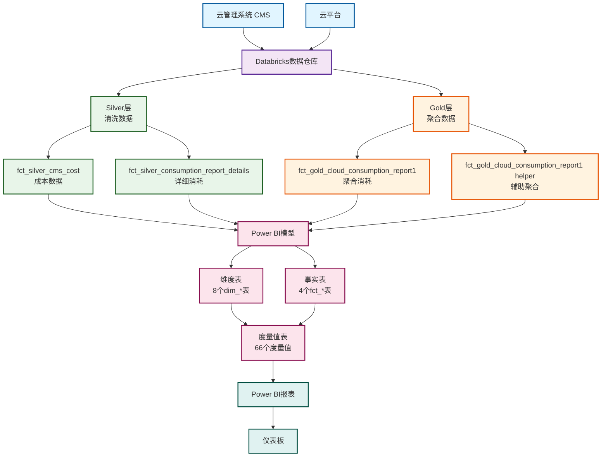

# Power BI 语义模型完整文档

## 1. 摘要

### 1.1 模型概述

#### 1.1.1 模型定位

本文档描述的是一个**云消耗管理语义模型**（Cloud Consumption Management Semantic Model），专门设计用于跟踪、分析、分配和管理企业云资源的消耗成本。该模型是云效率数据市场（Cloud Efficiency Datamart）的核心分析层，为企业提供全面的云成本管理和费用回收（Chargeback）能力。

#### 1.1.2 架构设计

该模型采用**星型架构（Star Schema）**设计，这是数据仓库建模的最佳实践，具有以下特点：

- **中心事实表**: 以云消耗事实表为核心，围绕业务事件（云资源消耗）组织数据
- **维度表设计**: 8个维度表提供多维度的分析视角，包括时间、组织、项目、资源类型等
- **层次化数据**: 采用Gold/Silver数据分层架构，平衡查询性能和数据详细程度
- **混合存储模式**: 结合Import和DirectQuery模式，实现性能与实时性的平衡

#### 1.1.3 技术规格

- **数据源**: Databricks数据仓库（Azure Databricks）
- **数据库**: cedm-datamart-dev（云效率数据市场-开发环境）
- **数据分层**: Gold层（聚合数据）+ Silver层（详细数据）
- **表结构**: 13个表（8个维度表 + 4个事实表 + 1个度量值表）
- **度量值**: 66个业务度量值，覆盖基础指标、高级分析、趋势分析、可视化辅助等
- **关系**: 17个表间关系，形成完整的星型架构
- **安全性**: 28个行级安全角色，实现按业务单元的数据隔离

#### 1.1.4 业务范围

该模型支持以下业务场景：

- **成本透明度**: 提供从组织级到资源级的完整成本视图
- **费用分配**: 基于公平原则将云成本分配给业务单元、项目和应用
- **趋势监控**: 跟踪云消耗的月度趋势，识别异常和优化机会
- **财务对账**: 对账实际计费金额与基于消耗的分配金额
- **资源优化**: 识别未充分利用的资源，支持成本优化决策
- **多维度分析**: 支持按时间、业务单元、应用、项目、成本中心、服务类型等维度分析

#### 1.1.5 目标用户

- **财务团队**: 进行成本对账、预算管理和财务报告
- **IT管理团队**: 监控云消耗趋势，进行资源规划和优化
- **业务单元负责人**: 查看本业务单元的成本分配和使用情况
- **项目管理团队**: 跟踪项目相关的云资源消耗
- **云运维团队**: 进行资源级别的详细分析和优化

---

### 1.2 执行摘要

#### 1.2.1 业务背景

随着企业云化转型的深入推进，云资源消耗已成为企业运营成本的重要组成部分。传统的云成本管理方式存在以下挑战：

- **缺乏成本透明度**: 难以清楚了解哪些业务单元、应用或项目消耗了多少云资源
- **成本分配不公平**: 无法根据资源的实际计算需求进行公平的成本分配
- **缺少趋势分析**: 难以识别云消耗的增长趋势和异常模式
- **对账困难**: 实际计费金额与成本分配之间的对账过程复杂且耗时
- **优化困难**: 缺乏足够的数据支持来识别成本优化机会

#### 1.2.2 解决方案

本语义模型通过构建企业级云消耗管理分析平台，解决上述挑战：

1. **统一数据源**: 整合来自云管理系统（CMS）和云平台的消耗数据，建立单一数据源
2. **标准化分类**: 通过维度表实现资源、组织、项目的标准化分类
3. **智能成本分配**: 基于复杂度权重系统实现公平的成本分配
4. **实时分析能力**: 支持从聚合级到资源级的深度钻取分析
5. **自动化对账**: 提供自动化工具支持财务对账

#### 1.2.3 关键成果

- **提升成本透明度**: 提供100%的云成本可见性，从组织级到资源级
- **实现公平分配**: 基于复杂度权重的分配系统，确保成本分配与资源需求匹配
- **加速决策**: 提供实时分析和趋势预测，支持快速决策
- **降低管理成本**: 自动化成本分配和对账流程，减少人工工作量
- **支持优化**: 通过详细分析识别优化机会，预计可节省10-20%的云成本

#### 1.2.4 实施状态

- **模型状态**: 已部署并运行
- **数据刷新频率**: 每日刷新（可根据需要调整）
- **用户覆盖**: 28个业务单元，每个业务单元有独立的行级安全角色
- **数据质量**: Gold层数据经过清洗和验证，确保数据准确性
- **性能表现**: Import模式的表支持快速查询，DirectQuery模式支持实时数据访问

#### 1.2.5 未来规划

- **扩展更多云平台**: 当前主要支持Azure，计划扩展到AWS、GCP等
- **预测分析**: 增加基于历史数据的消耗预测功能
- **自动化优化建议**: 基于分析结果自动生成优化建议
- **增强可视化**: 提供更多预构建的报表和仪表板
- **API集成**: 提供API接口支持其他系统的集成

---

### 1.3 核心能力

#### 1.3.1 多维度成本分析能力

**能力描述**:
模型支持从多个维度分析云成本，包括但不限于：

- **时间维度**: 年、季、月、周、日等多层级时间分析
- **组织维度**: 业务单元、成本中心、部门等组织层级
- **项目维度**: 按WBS代码进行项目级别的成本追踪
- **应用维度**: 按业务应用进行成本归因
- **资源维度**: 按服务类型、复杂度、资源级别进行分析
- **环境维度**: 区分生产和非生产环境

**技术实现**:
- 8个维度表提供丰富的分析维度
- 17个表间关系支持多维度组合分析
- 星型架构设计确保查询性能

**业务价值**:
- 可以从任何角度查看和分析成本
- 支持"为什么"类型的分析（Why Analysis）
- 快速定位成本驱动因素

#### 1.3.2 深度钻取分析能力

**能力描述**:
支持从聚合级到详细资源级的深度钻取分析。

**钻取层级**:
1. **组织级**: 业务单元汇总
2. **应用级**: 业务应用汇总
3. **项目级**: WBS代码汇总
4. **资源级**: 具体云资源实例

**技术实现**:
- `fct_gold_cloud_consumption_report1`提供聚合数据（快速查询）
- `fct_silver_consumption_report_details`提供详细资源数据（DirectQuery实时查询）
- 通过关系链支持从聚合到详细的钻取

**业务价值**:
- 支持"从总览到细节"的分析流程
- 快速定位问题资源
- 支持资源级别的优化决策

#### 1.3.3 数据安全保障能力

**能力描述**:
通过行级安全性（RLS）确保数据访问的安全性和隔离性。

**安全机制**:
- **28个安全角色**: 每个业务单元对应一个安全角色
- **数据过滤**: 每个角色只能访问该业务单元的数据
- **完整隔离**: 业务单元之间完全看不到对方的数据

**技术实现**:
- `dim_Bu`维度表定义业务单元
- 每个RLS角色对应一个业务单元值
- 使用DAX筛选器限制数据访问

**业务价值**:
- 确保数据安全和隐私
- 支持多租户场景
- 符合数据治理要求

#### 1.3.4 性能优化能力

**能力描述**:
通过多种技术手段优化查询性能。

**优化策略**:
- **Import模式**: 维度表和聚合事实表使用Import模式，数据加载到内存，查询速度快
- **DirectQuery模式**: 详细表使用DirectQuery模式，平衡实时性和性能
- **预聚合**: Gold层数据已预聚合，减少查询时的计算量
- **辅助表**: `fct_gold_cloud_consumption_report1 helper`表专门用于某些度量值计算，提高性能

**业务价值**:
- 快速响应报表查询
- 支持交互式分析
- 提升用户体验

---

### 1.4 核心业务价值

#### 1.4.1 成本透明化

**价值描述**:
提供清晰的云资源消耗视图，消除成本"黑盒"，让所有相关方都能清楚地了解云成本的构成和分布。

**具体体现**:
- **多层次成本视图**: 
  - 组织级：业务单元总成本
  - 应用级：每个业务应用的成本
  - 项目级：每个项目的成本
  - 资源级：每个云资源实例的成本
- **成本归因**: 清楚地知道每笔成本来自哪个业务单元、哪个应用、哪个项目
- **成本趋势**: 通过时间维度了解成本的变化趋势

**业务影响**:
- 提高成本意识，促使业务单元合理使用云资源
- 支持基于数据的成本控制决策
- 为预算制定提供准确依据

**关键度量值**:
- `Cost Total`: 总成本
- `Cost Allocation`: 成本分配
- `Cost Allocation YTD`: 年初至今累计成本分配

---

#### 1.4.2 公平成本分配

**价值描述**:
基于复杂度权重系统实现按实际计算需求分配成本，而非简单的平均分配，确保成本分配公平合理。

**核心机制**:
- **复杂度权重**: 
  - Simple资源（轻量级）：0.5x权重
  - Medium资源（标准）：1.0x权重（基准）
  - Complex资源（高性能）：1.5x权重
- **分配逻辑**: 成本不是按实例数量平均分配，而是按加权实例数分配

**业务影响**:
- 公平反映不同规格资源的价值差异
- 避免高性能资源被低估成本
- 激励业务单元选择合适规格的资源（避免过度配置）

**关键度量值**:
- `Simple`: Simple实例计数（0.5x权重）
- `Medium`: Medium实例计数（1.0x权重）
- `Complex`: Complex实例计数（1.5x权重）
- `Multiplied`: 加权总计
- `% Allocation`: 分配百分比

**业务场景示例**:
假设总成本为$100,000：
- 业务单元A：100个Simple实例（权重50） + 50个Medium实例（权重50） = 总权重100
- 业务单元B：20个Complex实例（权重30）
- 总权重 = 100 + 30 = 130
- 业务单元A分配 = (100/130) × $100,000 = $76,923
- 业务单元B分配 = (30/130) × $100,000 = $23,077

---

#### 1.4.3 趋势分析和异常检测

**价值描述**:
通过月度环比分析跟踪云消耗的变化趋势，及时发现异常和优化机会。

**分析能力**:
- **实例数量趋势**: 跟踪总实例数的月度变化
- **复杂度趋势**: 跟踪各类复杂度实例的变化（反映资源规格选择的变化）
- **成本趋势**: 跟踪加权总计的变化（更准确反映成本变化）
- **分配份额趋势**: 跟踪各业务单元分配百分比的变化（反映组织需求的变化）

**业务影响**:
- **异常检测**: 及时发现异常的消耗增长（可能是配置错误或资源泄露）
- **优化识别**: 识别可以优化的场景（如从Complex降级到Medium）
- **预算规划**: 基于历史趋势预测未来消耗，支持预算制定
- **资源规划**: 了解资源需求的变化趋势，支持容量规划

**关键度量值**:
- `Instance Count MOM%`: 实例计数月度环比
- `Simple MOM%`: Simple实例月度环比
- `Medium MOM%`: Medium实例月度环比
- `Complex MOM%`: Complex实例月度环比
- `Total MOM%`: 加权总计月度环比
- `% Allocation MOM%`: 分配百分比月度环比

**业务场景示例**:
- 如果`Complex MOM%`显示增长20%，说明高性能资源使用在增加，需要关注是否合理
- 如果`Total MOM%`显示下降10%，说明总体消耗在减少，可能是优化措施生效

---

#### 1.4.4 财务对账和准确性保证

**价值描述**:
支持基于消耗的成本分配与实际计费金额之间的对账，确保成本分配的准确性。

**对账机制**:
1. **消耗分配**: 基于云资源消耗计算的成本分配（`Cost Allocation`）
2. **实际计费**: 从CMS系统获取的实际计费金额（`Cost Total`）
3. **差异计算**: 计算分配金额与计费金额的差异（`Cost True up/down`）

**业务影响**:
- **准确性验证**: 确保成本分配的准确性
- **异常识别**: 识别计费异常（如计费错误、未计入的资源等）
- **财务合规**: 支持月度/年度财务对账，满足财务合规要求
- **数据质量**: 通过对账发现数据质量问题

**关键度量值**:
- `Cost Total`: 总成本（实际计费金额）
- `Cost Allocation`: 成本分配（基于消耗的分配金额）
- `Cost Allocation YTD`: 年初至今累计成本分配
- `Cost True up/down`: 对账差异（正值表示需要补收，负值表示需要退款）

**业务场景示例**:
- 月度对账：比较当月分配金额与实际计费金额，差异应在合理范围内（如±5%）
- 年度对账：累计全年分配金额与全年计费金额，进行最终调整

---

#### 1.4.5 多维度分析和决策支持

**价值描述**:
支持从多个维度分析云成本，为不同角色的决策者提供所需的分析视角。

**分析维度**:
- **时间维度**: 支持年、季、月、周、日等不同时间粒度的分析
- **组织维度**: 业务单元、成本中心、部门等组织层级
- **项目维度**: WBS代码，支持项目级别的成本追踪
- **应用维度**: 业务应用，了解哪些应用消耗最多资源
- **资源维度**: 服务类型、复杂度、资源级别等
- **环境维度**: 生产和非生产环境的成本分离

**业务影响**:
- **财务视角**: 财务团队可以从组织、项目维度分析成本
- **IT视角**: IT团队可以从应用、资源维度分析消耗
- **业务视角**: 业务单元可以从自身维度查看成本
- **项目视角**: 项目团队可以从项目维度跟踪预算

**关键能力**:
- 支持任意维度的组合分析
- 支持从总览到细节的钻取
- 支持跨维度的对比分析

**业务场景示例**:
- 财务团队：查看各业务单元的成本分布，制定成本预算
- IT团队：查看各应用的资源消耗，识别需要优化的应用
- 业务单元：查看本单元的成本趋势，控制成本增长
- 项目团队：查看项目相关的云成本，跟踪项目预算

---

#### 1.4.6 资源优化支持

**价值描述**:
通过详细的分析支持资源优化决策，帮助降低云成本。

**优化支持**:
- **资源级别分析**: 可以查看每个云资源实例的详细信息
- **使用模式识别**: 识别未充分利用的资源
- **复杂度分析**: 识别可以降级的资源（从Complex降级到Medium）
- **趋势预测**: 基于历史趋势预测未来消耗

**业务影响**:
- **成本节省**: 通过优化可以节省10-20%的云成本
- **资源效率**: 提高资源利用率，避免资源浪费
- **容量规划**: 支持合理的容量规划，避免过度配置

**关键能力**:
- `fct_silver_consumption_report_details`表提供资源级别的详细信息
- 支持按复杂度、服务类型等筛选资源
- 支持时间趋势分析识别资源使用模式

**业务场景示例**:
- 识别长期低使用的资源，考虑停止或降级
- 识别可以从Complex降级到Medium的资源，节省成本
- 基于趋势预测未来资源需求，进行容量规划

---

#### 1.4.7 数据驱动的成本管理文化

**价值描述**:
通过提供全面的成本分析能力，建立数据驱动的成本管理文化。

**文化转变**:
- **从被动到主动**: 从被动接受成本到主动管理成本
- **从模糊到清晰**: 从模糊的成本概念到清晰的成本归因
- **从经验到数据**: 从基于经验的决策到基于数据的决策

**业务影响**:
- **成本意识**: 提高全员的成本意识
- **问责制**: 明确成本责任，建立成本问责制
- **持续改进**: 基于数据持续优化成本管理

**关键能力**:
- 提供易用的报表和仪表板
- 支持自助式分析
- 提供清晰的成本归因

---

## 2. M代码分析与业务含义

### 2.1 表分类说明与命名规范

#### 2.1.1 表命名规范

模型采用清晰的命名规范，便于识别表的类型和用途：

**命名模式**:
- **维度表**: `dim_` + 维度名称
  - 示例: `dim_Date`, `dim_Complexity`, `dim_Bu`
  - **业务含义**: 维度表包含描述性属性，用于分析和筛选
  
- **事实表**: `fct_` + 数据层级 + 业务描述
  - Gold层事实表: `fct_gold_` + 业务描述
    - 示例: `fct_gold_cloud_consumption_report1`
  - Silver层事实表: `fct_silver_` + 业务描述
    - 示例: `fct_silver_cms_cost`, `fct_silver_consumption_report_details`
  - 辅助表: `fct_gold_` + 业务描述 + `helper`
    - 示例: `fct_gold_cloud_consumption_report1 helper`
  - **业务含义**: 事实表包含可度量的业务事件和交易数据

- **度量值表**: `Mesures`（法语"度量值"的复数形式）
  - 包含所有计算度量值的虚拟表

**命名约定说明**:
- 使用小写字母和下划线分隔
- 维度表使用单数名词（dim_Date而非dim_Dates）
- 事实表使用描述性名称，清晰表达业务含义
- Helper表明确标识为辅助用途

#### 2.1.2 表分类体系

模型包含13个表，详细分类信息请参见第4.3节"数据模型分析"中的表分类部分。本节仅说明表的命名规范。

### 2.2 模型所有表ETL逻辑

#### 2.2.1 维度表ETL逻辑

##### 表1: dim_Complexity（复杂度维度表）

**表说明**:
- **表名**: `dim_Complexity`
- **数据层级**: Gold层
- **存储模式**: Dual（当前使用Import）
- **列数**: 2列（含系统生成的RowNumber列）
- **行数**: 3行（Simple, Medium, Complex三个值）

**业务含义**:
复杂度维度表定义了云资源实例的三个复杂度层级，每个层级对应不同的成本权重系数。这个维度是实现公平成本分配的关键，确保成本分配与计算需求成比例，而不是对所有实例一视同仁。

**M代码**:
```m
let
    Source = Databricks.Catalogs(#"Server Hostname", #"HTTP Path", [Catalog=null, Database=null, EnableAutomaticProxyDiscovery=null]),
    #"cedm-datamart-dev_Database" = Source{[Name=Database,Kind="Database"]}[Data],
    gold_Schema = #"cedm-datamart-dev_Database"{[Name="gold",Kind="Schema"]}[Data],
    dim_complexity_Table = gold_Schema{[Name="dim_complexity",Kind="Table"]}[Data]
in
    dim_complexity_Table
```

**ETL逻辑流程**:
1. **连接阶段**: 使用`Databricks.Catalogs`函数连接到Databricks数据仓库
   - 使用参数化的`Server Hostname`和`HTTP Path`
   - 禁用自动代理发现（`EnableAutomaticProxyDiscovery=null`）
   
2. **导航阶段**: 从连接的目录中定位数据库
   - 使用`Database`参数（`cedm-datamart-dev`）查找数据库对象
   - 通过`{[Name=Database,Kind="Database"]}[Data]`语法获取数据库数据
   
3. **Schema选择**: 在数据库中找到`gold` schema
   - `gold` schema包含所有预处理的高质量数据
   
4. **表获取**: 从gold schema中提取`dim_complexity`表
   - 使用表名查找并获取表数据
   
5. **数据返回**: 直接返回表数据，无任何转换
   - 采用"最小转换"原则，所有数据处理在Databricks端完成

**关键业务指标**:
- **Simple**: 权重0.5x，轻量级实例（如小型虚拟机）
- **Medium**: 权重1.0x，标准实例（基准权重）
- **Complex**: 权重1.5x，高性能实例（如大型数据库服务器）

**业务规则**:
- 成本分配公式: `加权实例数 = Simple实例数 × 0.5 + Medium实例数 × 1.0 + Complex实例数 × 1.5`
- 业务单元成本 = (该业务单元加权实例数 / 总加权实例数) × 总成本

---

##### 表2: dim_Date（日期维度表）

**表说明**:
- **表名**: `dim_Date`
- **数据层级**: Gold层
- **存储模式**: Dual（当前使用Import）
- **列数**: 26列（包含完整的日期属性）
- **时间范围**: 涵盖模型所需的所有日期

**业务含义**:
日期维度表是时间分析的基础，提供所有时间相关的属性，支持年、季、月、周、日等多层级时间分析。所有事实表都通过此表进行时间维度的关联，实现时间序列分析和月度环比计算。

**M代码**:
```m
let
    Source = Databricks.Catalogs(#"Server Hostname", #"HTTP Path", [Catalog=null, Database=null, EnableAutomaticProxyDiscovery=null]),
    #"cedm-datamart-dev_Database" = Source{[Name=Database,Kind="Database"]}[Data],
    gold_Schema = #"cedm-datamart-dev_Database"{[Name="gold",Kind="Schema"]}[Data],
    dim_date_Table = gold_Schema{[Name="dim_date",Kind="Table"]}[Data]
in
    dim_date_Table
```

**ETL逻辑流程**:
与dim_Complexity相同的ETL模式：
1. 连接Databricks数据仓库
2. 导航到`cedm-datamart-dev`数据库
3. 选择`gold` schema
4. 获取`dim_date`表
5. 直接返回，无转换

**关键业务指标**:
- **Date**: 主键，日历日期
- **Year, Quarter, Month, Day**: 时间层级分解
- **YearName, QuarterName**: 文本格式的时间标识
- **Y&M, Y-M**: 年月组合格式（用于关系关联）
- **DateIndex**: 日期索引（用于高效排序和筛选）
- **MM/YY**: 紧凑格式（用于仪表板显示）

**业务规则**:
- 所有时间相关的度量值都通过此维度进行筛选和分组
- 支持月度环比（MOM）分析
- 支持年度、季度、月度等多层级汇总

---

##### 表3: dim_Service_Type（服务类型维度表）

**表说明**:
- **表名**: `dim_Service_Type`
- **数据层级**: Gold层
- **存储模式**: Dual
- **列数**: 4列（Source, ServiceType, SourceTable + RowNumber）

**业务含义**:
服务类型维度将云服务按功能分类（如计算、存储、数据库、网络等），用于按服务类别分析和筛选消耗数据。同时跟踪数据来源，支持数据验证和对账。

**M代码**:
```m
let
    Source = Databricks.Catalogs(#"Server Hostname", #"HTTP Path", [Catalog=null, Database=null, EnableAutomaticProxyDiscovery=null]),
    #"cedm-datamart-dev_Database" = Source{[Name=Database,Kind="Database"]}[Data],
    gold_Schema = #"cedm-datamart-dev_Database"{[Name="gold",Kind="Schema"]}[Data],
    dim_service_type_Table = gold_Schema{[Name="dim_service_type",Kind="Table"]}[Data]
in
    dim_service_type_Table
```

**ETL逻辑流程**:
标准Gold层维度表ETL流程，无转换。

**关键业务指标**:
- **ServiceType**: 服务类型（Compute, Storage, Database等）
- **Source**: 数据来源标识
- **SourceTable**: 源表名称（用于数据溯源）

---

##### 表4: dim_WBSCode（工作分解结构维度表）

**表说明**:
- **表名**: `dim_WBSCode`
- **数据层级**: Gold层
- **存储模式**: Dual
- **列数**: 2列（WBSCode + RowNumber）

**业务含义**:
WBS代码用于项目级别的成本跟踪和分配。每个WBS代码代表组织内的一个项目，用于将云消耗成本分配到具体项目，支持项目级别的预算、预测和成本问责。

**M代码**:
```m
let
    Source = Databricks.Catalogs(#"Server Hostname", #"HTTP Path", [Catalog=null, Database=null, EnableAutomaticProxyDiscovery=null]),
    #"cedm-datamart-dev_Database" = Source{[Name=Database,Kind="Database"]}[Data],
    gold_Schema = #"cedm-datamart-dev_Database"{[Name="gold",Kind="Schema"]}[Data],
    dim_wbs_code_Table = gold_Schema{[Name="dim_wbs_code",Kind="Table"]}[Data]
in
    dim_wbs_code_Table
```

**ETL逻辑流程**:
标准Gold层维度表ETL流程。

**关键业务指标**:
- **WBSCode**: 项目代码（唯一标识）

---

##### 表5: dim_CostCenter（成本中心维度表）

**表说明**:
- **表名**: `dim_CostCenter`
- **数据层级**: Gold层
- **存储模式**: Dual
- **列数**: 2列（CostCenter + RowNumber）

**业务含义**:
成本中心维度用于财务组织和成本管理。成本中心通常对应组织的部门或功能区域，用于将消耗分配到负责的部门，支持部门级别的成本跟踪和财务报告。

**M代码**:
```m
let
    Source = Databricks.Catalogs(#"Server Hostname", #"HTTP Path", [Catalog=null, Database=null, EnableAutomaticProxyDiscovery=null]),
    #"cedm-datamart-dev_Database" = Source{[Name=Database,Kind="Database"]}[Data],
    gold_Schema = #"cedm-datamart-dev_Database"{[Name="gold",Kind="Schema"]}[Data],
    dim_cost_center_Table = gold_Schema{[Name="dim_cost_center",Kind="Table"]}[Data]
in
    dim_cost_center_Table
```

**ETL逻辑流程**:
标准Gold层维度表ETL流程。

**关键业务指标**:
- **CostCenter**: 成本中心标识符

---

##### 表6: dim_Business_Application（业务应用维度表）

**表说明**:
- **表名**: `dim_Business_Application`
- **数据层级**: Gold层
- **存储模式**: Dual
- **列数**: 2列（business_application + RowNumber）

**业务含义**:
业务应用维度识别哪些应用程序驱动云支出。通过按业务能力细分消耗，可以识别哪些应用消耗了最多的云资源，支持应用级别的成本分配、性能分析和业务价值评估。

**M代码**:
```m
let
    Source = Databricks.Catalogs(#"Server Hostname", #"HTTP Path", [Catalog=null, Database=null, EnableAutomaticProxyDiscovery=null]),
    #"cedm-datamart-dev_Database" = Source{[Name=Database,Kind="Database"]}[Data],
    gold_Schema = #"cedm-datamart-dev_Database"{[Name="gold",Kind="Schema"]}[Data],
    dim_business_application_Table = gold_Schema{[Name="dim_business_application",Kind="Table"]}[Data]
in
    dim_business_application_Table
```

**ETL逻辑流程**:
标准Gold层维度表ETL流程。

**关键业务指标**:
- **business_application**: 业务应用或解决方案名称

---

##### 表7: dim_Bu（业务单元维度表）

**表说明**:
- **表名**: `dim_Bu`
- **数据层级**: Gold层
- **存储模式**: Dual
- **列数**: 2列（bu_name_l2 + RowNumber）

**业务含义**:
业务单元维度是组织层次结构的第2级，是成本分配和费用回收的主要维度。包含用于在业务单元之间分配云成本的BU名称，实现组织成本分离和费用回收报告。

**M代码**:
```m
let
    Source = Databricks.Catalogs(#"Server Hostname", #"HTTP Path", [Catalog=null, Database=null, EnableAutomaticProxyDiscovery=null]),
    #"cedm-datamart-dev_Database" = Source{[Name=Database,Kind="Database"]}[Data],
    gold_Schema = #"cedm-datamart-dev_Database"{[Name="gold",Kind="Schema"]}[Data],
    dim_bu_Table = gold_Schema{[Name="dim_bu_l2",Kind="Table"]}[Data]
in
    dim_bu_Table
```

**ETL逻辑流程**:
标准Gold层维度表ETL流程。

**关键业务指标**:
- **bu_name_l2**: 业务单元名称（L2层级）
- 注意：Power BI表名是`dim_Bu`，但Databricks源表名是`dim_bu_l2`（L2表示第二层级）

**业务规则**:
- 支持行级安全性（RLS），每个业务单元只能看到自己的数据
- 是成本分配计算的核心维度

---

##### 表8: dim_cms_services（CMS服务维度表）

**表说明**:
- **表名**: `dim_cms_services`
- **数据层级**: Gold层
- **存储模式**: Import（与其他维度表不同）
- **列数**: 7列

**业务含义**:
CMS服务维度将云管理系统中的服务映射到标准化的计费类别。链接特定消耗的服务到计量类别和服务类型，包括生产与非生产环境分类标志和分配资格，用于标准化服务分类并确定哪些服务应包含在业务单元成本分配中。

**M代码**:
```m
let
    Source = Databricks.Catalogs(#"Server Hostname", #"HTTP Path", [Catalog=null, Database=null, EnableAutomaticProxyDiscovery=null]),
    #"cedm-datamart-dev_Database" = Source{[Name=Database,Kind="Database"]}[Data],
    gold_Schema = #"cedm-datamart-dev_Database"{[Name="gold",Kind="Schema"]}[Data],
    dim_complexity_Table = gold_Schema{[Name="dim_cms_services",Kind="Table"]}[Data]
in
    dim_complexity_Table
```

**ETL逻辑流程**:
标准Gold层维度表ETL流程。

**注意事项**:
- 变量名`dim_complexity_Table`与实际表名不一致（可能是代码复制的遗留问题，不影响功能）

**关键业务指标**:
- **ConsumedService**: 消耗的服务名称
- **MeterCategory**: 计量类别
- **ServiceType**: 服务类型
- **Prod**: 生产环境标志
- **NonProd**: 非生产环境标志
- **CloudOpscostallocation**: 成本分配标志

---

#### 2.2.2 事实表ETL逻辑

##### 表9: fct_gold_cloud_consumption_report1（主要消耗事实表）

**表说明**:
- **表名**: `fct_gold_cloud_consumption_report1`
- **数据层级**: Gold层（预聚合）
- **存储模式**: Import
- **列数**: 17列
- **数据粒度**: 月度聚合，按复杂度、服务类型、业务单元、成本中心等维度聚合

**业务含义**:
这是模型的核心事实表，包含实例级别的聚合云消耗数据。数据已按月、复杂度级别、服务类型、业务单元和成本中心预聚合，为操作仪表板提供快速查询性能。包含复杂度分类、分配标志、业务单元分配等关键属性，支持多维度成本分配分析。

**M代码**:
```m
let
    Source = Databricks.Catalogs(#"Server Hostname", #"HTTP Path", [Catalog=null, Database=null, EnableAutomaticProxyDiscovery=null]),
    #"cedm-datamart-dev_Database" = Source{[Name=Database,Kind="Database"]}[Data],
    gold_Schema = #"cedm-datamart-dev_Database"{[Name="gold",Kind="Schema"]}[Data],
    gold_cloud_consumption_report1_Table = gold_Schema{[Name="gold_cloud_consumption_report1",Kind="Table"]}[Data],
    #"Changed Type" = Table.TransformColumnTypes(gold_cloud_consumption_report1_Table,{{"InstanceCount", type number}}),
    #"Renamed Columns" = Table.RenameColumns(#"Changed Type",{{"ServiceType", "Service Type"}, {"InstanceCount", "Instance Count"}})
in
    #"Renamed Columns"
```

**ETL逻辑流程**:
1. **连接阶段**: 连接到Databricks数据仓库
2. **导航阶段**: 定位到`cedm-datamart-dev`数据库的`gold` schema
3. **表获取**: 获取`gold_cloud_consumption_report1`表数据
4. **类型转换**: 
   - 将`InstanceCount`列转换为数值类型（number）
   - **业务原因**: 确保实例计数可以进行数学运算（求和、平均值等）
5. **列重命名**:
   - `ServiceType` → `Service Type`（添加空格提高可读性）
   - `InstanceCount` → `Instance Count`（添加空格遵循命名规范）
   - **业务原因**: 提高报表中列名的可读性，符合Power BI最佳实践

**关键业务指标**:
- **Instance Count**: 云实例数量（核心度量值，所有计算的基础）
- **Complexity**: 复杂度分类（Simple/Medium/Complex）
- **BU_Name**: 业务单元名称（成本分配的关键维度）
- **CloudOpscostallocation**: 成本分配标志（Included/Excluded，决定是否计入成本分配）
- **StartOfMonth**: 月初日期（用于时间关联）

**业务规则**:
- 只包含`CloudOpscostallocation = "Included"`的记录参与成本分配
- 实例计数按复杂度权重计算：`加权实例 = Simple×0.5 + Medium×1.0 + Complex×1.5`
- 成本分配比例 = 业务单元加权实例数 / 总加权实例数

---

##### 表10: fct_gold_cloud_consumption_report1 helper（辅助消耗事实表）

**表说明**:
- **表名**: `fct_gold_cloud_consumption_report1 helper`
- **数据层级**: Gold层
- **存储模式**: Import
- **列数**: 17列（与主表相同）

**业务含义**:
这是主消耗表的辅助/暂存版本，包含预聚合消耗数据并增加了分配相关属性。提供优化的消耗指标视图用于计算效率。包含反规范化的数据，将实例计数与复杂度级别、分配标志和维度属性组合在单个表中，用于内部提高需要跨多个维度快速计算的度量值的性能。

**M代码**:
```m
let
    Source = Databricks.Catalogs(#"Server Hostname", #"HTTP Path", [Catalog=null, Database=null, EnableAutomaticProxyDiscovery=null]),
    #"cedm-datamart-dev_Database" = Source{[Name=Database,Kind="Database"]}[Data],
    gold_Schema = #"cedm-datamart-dev_Database"{[Name="gold",Kind="Schema"]}[Data],
    gold_cloud_consumption_report1_Table = gold_Schema{[Name="gold_cloud_consumption_report1",Kind="Table"]}[Data],
    #"Changed Type" = Table.TransformColumnTypes(gold_cloud_consumption_report1_Table,{{"InstanceCount", type number}}),
    #"Renamed Columns" = Table.RenameColumns(#"Changed Type",{{"ServiceType", "Service Type"}, {"InstanceCount", "Instance Count"}})
in
    #"Renamed Columns"
```

**ETL逻辑流程**:
与主表`fct_gold_cloud_consumption_report1`完全相同的ETL流程（从同一个源表获取数据并应用相同的转换）。

**关键业务指标**:
- 与主表相同的指标
- **用途**: 专门用于某些度量值的计算，通过使用辅助表可以提高查询性能

**业务规则**:
- 与主表共享相同的数据源
- 主要用于"RLS Helper"类型的度量值计算

---

##### 表11: fct_silver_cms_cost（CMS成本事实表）

**表说明**:
- **表名**: `fct_silver_cms_cost`
- **数据层级**: Silver层（原始成本数据）
- **存储模式**: Import
- **列数**: 6列
- **数据粒度**: 月度，按实体聚合

**业务含义**:
成本事实表包含来自云管理系统（CMS）的月度成本数据。存储按实体和月份聚合的计费金额，用于基于消耗的分配与实际计费成本之间的财务对账，支持成本单价分析和预算差异跟踪。

**M代码**:
```m
// 注释掉的Excel数据源（历史代码，保留用于记录迁移历史）
// let
//     Source = Excel.Workbook(Web.Contents("https://aiacom-my.sharepoint.com/personal/jevon-jh_zhu_aia_com/Documents/MyFolder/Project/Cloud%20Efficiency%20Datamart/Consumption/Mockup/COST.xlsx"), null, true),
//     Sheet1_Sheet = Source{[Item="Sheet1",Kind="Sheet"]}[Data],
//     #"Promoted Headers" = Table.PromoteHeaders(Sheet1_Sheet, [PromoteAllScalars=true]),
//     #"Changed Type" = Table.TransformColumnTypes(#"Promoted Headers",{{"date", type date}, {"cost", type number}, {"entity", type text}})
// in
//     #"Changed Type"

// 当前使用的Databricks数据源
let
    Source = Databricks.Catalogs(#"Server Hostname", #"HTTP Path", [Catalog=null, Database=null, EnableAutomaticProxyDiscovery=null]),
    #"cedm-datamart-dev_Database" = Source{[Name=Database,Kind="Database"]}[Data],
    silver_Schema = #"cedm-datamart-dev_Database"{[Name="silver",Kind="Schema"]}[Data],
    silver_cms_cost_Table = silver_Schema{[Name="silver_cms_cost",Kind="Table"]}[Data],
    #"Changed Type" = Table.TransformColumnTypes(silver_cms_cost_Table,{{"CostAmount", type number}})
in
    #"Changed Type"
```

**ETL逻辑流程**:
1. **历史代码保留**: 注释中保留了从SharePoint Excel文件加载数据的历史代码
   - 记录了数据源从Excel迁移到Databricks的历史
   - Excel数据源包含: date, cost, entity三列
2. **当前数据源连接**: 连接到Databricks数据仓库
3. **Silver层获取**: 从`silver` schema获取`silver_cms_cost`表
   - Silver层包含清洗后的原始数据
4. **类型转换**: 确保`CostAmount`为数值类型
   - **业务原因**: 成本金额必须为数字才能进行财务计算

**关键业务指标**:
- **Month**: 月份标识（用于与日期维度关联）
- **Entity**: 实体（业务单元或其他成本归属实体）
- **CostAmount**: 成本金额（核心财务指标，实际计费金额）
- **ingestion_date**: 数据摄取日期（用于数据新鲜度跟踪）
- **notebook_name**: 处理笔记本名称（用于数据溯源）

**业务规则**:
- 成本金额是实际从CMS系统计费的金额
- 用于与基于消耗的分配成本进行对账
- 成本对账公式: `成本差异 = CostAmount - Cost Allocation`

**数据迁移历史**:
- **之前**: 从SharePoint Excel文件加载
- **现在**: 从Databricks Silver层加载
- **优势**: 提高了数据质量和可维护性，支持自动化数据刷新

---

##### 表12: fct_silver_consumption_report_details（详细消耗事实表）

**表说明**:
- **表名**: `fct_silver_consumption_report_details`
- **数据层级**: Silver层（详细资源级数据）
- **存储模式**: DirectQuery（实时查询）
- **列数**: 26列
- **数据粒度**: 资源级别（最细粒度）

**业务含义**:
详细消耗事实表提供资源级别的细粒度属性，包含单个资源ID、名称、资源组、产品名称和全面的资源标签（成本中心、WBS代码、应用、环境、所有者）。通过DirectQuery模式提供，用于深度钻取分析同时保持数据最新，支持详细诊断、故障排除和资源级别优化。

**M代码**:
```m
let
    Source = Databricks.Catalogs(#"Server Hostname", #"HTTP Path", [Catalog=null, Database=null, EnableAutomaticProxyDiscovery=null]),
    #"cedm-datamart-dev_Database" = Source{[Name=Database,Kind="Database"]}[Data],
    silver_Schema = #"cedm-datamart-dev_Database"{[Name="silver",Kind="Schema"]}[Data],
    silver_consumption_report_details_Table = silver_Schema{[Name="silver_consumption_report_details",Kind="Table"]}[Data]
in
    silver_consumption_report_details_Table
```

**ETL逻辑流程**:
1. **连接阶段**: 连接到Databricks数据仓库
2. **导航阶段**: 定位到`cedm-datamart-dev`数据库的`silver` schema
3. **表获取**: 获取`silver_consumption_report_details`表数据
4. **直接返回**: 无任何转换，保持数据原样

**ETL特点**:
- **无转换**: 采用"最小转换"原则，所有数据保持原样
- **DirectQuery**: 每次查询时实时从数据源获取数据
- **优势**: 始终获取最新数据，支持实时分析

**关键业务指标**:
- **ResourceId**: 资源唯一标识（用于资源追踪）
- **ResourceName**: 资源名称
- **ResourceGroup**: 资源组
- **Service_Type**: 服务类型
- **ProductName**: 产品名称
- **Complexity**: 复杂度分类
- **Tags_CostCenter**: 成本中心标签
- **Tags_WBSCode**: WBS代码标签
- **Tags_BusinessApplication**: 业务应用标签
- **Tags_Environment**: 环境标签（Prod/NonProd）
- **Tags_BusinessOwner**: 业务所有者标签
- **StartOfMonth**: 月初日期（用于时间关联）

**业务规则**:
- 支持从聚合数据钻取到资源级别的详细信息
- 用于资源级别的成本优化和故障排除
- 标签信息用于多维度分析和筛选

---

### 2.3 模型所有参数ETL逻辑

模型使用3个Power Query参数（命名表达式）来管理Databricks连接配置。这些参数在所有表查询中被引用，实现了集中化的连接管理。

#### 2.3.1 Server Hostname（服务器主机名参数）

**参数类型**: Text（文本类型）

**M代码**:
```m
"adb-3085800437590429.9.azuredatabricks.net" meta [IsParameterQuery=true, Type="Text", IsParameterQueryRequired=true]
```

**ETL逻辑流程**:
1. **参数定义**: 使用M语言的`meta`语法定义参数
   - `IsParameterQuery=true`: 标识这是一个参数查询
   - `Type="Text"`: 参数类型为文本
   - `IsParameterQueryRequired=true`: 参数为必填项
2. **参数值**: 硬编码的Databricks集群主机名
   - 值: `adb-3085800437590429.9.azuredatabricks.net`
   - 格式: Azure Databricks的标准URL格式

**用途**:
- 指定Databricks集群的主机名地址
- 作为所有表查询的连接基础参数
- 实现连接配置的集中管理

**使用场景**:
- 所有使用`Databricks.Catalogs`的查询都通过此参数连接到同一个Databricks实例
- 环境切换时只需修改此参数值（开发/测试/生产环境）

**业务含义**:
- **集中化配置**: 所有数据源连接配置集中在一个参数中
- **易于维护**: 环境切换时只需修改一个参数，无需修改所有查询
- **一致性保证**: 确保所有表连接到同一个Databricks实例，保证数据一致性

**最佳实践**:
- 使用参数而非硬编码主机名，提高可维护性
- 参数值应存储在配置管理系统中
- 生产环境建议使用变量或配置文件管理参数值

---

#### 2.3.2 HTTP Path（HTTP路径参数）

**参数类型**: Text（文本类型）

**M代码**:
```m
"/sql/1.0/warehouses/b709e878048ab49a" meta [IsParameterQuery=true, Type="Text", IsParameterQueryRequired=true]
```

**ETL逻辑流程**:
1. **参数定义**: 使用M语言的`meta`语法定义参数
   - 参数类型: Text
   - 必填参数
2. **参数值**: Databricks SQL仓库的HTTP路径
   - 路径格式: `/sql/1.0/warehouses/{warehouse_id}`
   - Warehouse ID: `b709e878048ab49a`

**用途**:
- 指定Databricks SQL仓库的HTTP路径
- 确定数据查询使用的SQL计算资源
- 与Server Hostname组合形成完整的连接字符串

**使用场景**:
- 所有通过SQL仓库访问的查询都使用此路径
- 如果需要切换SQL仓库（如切换到更大的仓库以处理更大数据量），只需修改此参数

**业务含义**:
- **资源管理**: SQL仓库是Databricks的计算资源，通过路径指定使用哪个仓库
- **性能控制**: 不同的SQL仓库具有不同的计算能力和并发限制
- **成本管理**: SQL仓库的选择影响计算成本

**技术细节**:
- SQL仓库端点格式: `/sql/1.0/warehouses/{warehouse_id}`
- Warehouse ID是唯一标识符
- 与Server Hostname组合: `https://{server_hostname}{http_path}`

---

#### 2.3.3 Database（数据库名称参数）

**参数类型**: Text（文本类型）

**M代码**:
```m
"cedm-datamart-dev" meta [IsParameterQuery=true, Type="Text", IsParameterQueryRequired=true]
```

**ETL逻辑流程**:
1. **参数定义**: 使用M语言的`meta`语法定义参数
   - 参数类型: Text
   - 必填参数
2. **参数值**: Databricks数据库名称
   - 值: `cedm-datamart-dev`
   - 命名含义: Cloud Efficiency Datamart - Development（云效率数据市场-开发环境）

**用途**:
- 指定要连接的Databricks数据库名称
- 所有表查询都使用此参数定位目标数据库
- 支持环境切换（开发/测试/生产）

**使用场景**:
- **环境切换**: 通过修改此参数在不同环境间切换
  - 开发环境: `cedm-datamart-dev`
  - 测试环境: `cedm-datamart-test`（假设）
  - 生产环境: `cedm-datamart-prod`（假设）
- **数据隔离**: 不同环境使用不同的数据库，保证数据隔离

**业务含义**:
- **环境管理**: 通过参数化数据库名称实现环境隔离
- **数据分层**: 数据库包含gold和silver两个schema（数据分层架构）
- **开发流程**: 支持开发→测试→生产的标准化部署流程

**数据架构**:
数据库`cedm-datamart-dev`包含以下schema:
- **gold**: 预聚合和预处理的高质量数据（维度表和聚合事实表）
- **silver**: 清洗后的原始数据（详细事实表）

**最佳实践**:
- 参数值应反映环境名称（dev/test/prod）
- 生产环境部署前应验证参数值正确性
- 建议使用Power BI部署管道管理不同环境的参数值

---

#### 2.3.4 参数使用总结

**参数引用模式**:
所有表的M代码都通过以下方式引用参数:
```m
Databricks.Catalogs(#"Server Hostname", #"HTTP Path", [...])
#"{Database}" // 在导航步骤中使用
```

**参数优势**:
1. **集中化配置**: 连接配置集中管理
2. **易于维护**: 环境切换只需修改参数
3. **一致性**: 确保所有表使用相同的连接配置
4. **可重用性**: 参数在所有查询中重用

**参数依赖关系**:
- `Server Hostname`和`HTTP Path`组合形成连接端点
- `Database`参数在连接后用于导航到目标数据库
- 三个参数共同完成数据源的完整连接

---

### 2.4 模型所有自定义函数逻辑

**检查结果**: 模型中没有定义自定义M函数。

**说明**:
通过Power BI模型的函数操作接口查询，返回0个函数。这意味着：
- 所有数据转换都使用Power Query内置函数
- 没有创建可重用的自定义M函数
- 表查询中直接使用标准M函数（如`Databricks.Catalogs`, `Table.TransformColumnTypes`, `Table.RenameColumns`等）

**设计决策**:
1. **简单性原则**: 使用标准函数而非自定义函数，降低复杂性
2. **可维护性**: 标准函数更容易理解和维护
3. **最小转换**: 采用"最小转换"原则，大部分转换在Databricks端完成
4. **性能考虑**: 避免函数调用开销，直接使用内置函数

**未来改进建议**:
如果需要处理重复的复杂转换逻辑，可以考虑创建自定义函数：
- 例如：如果多个表需要相同的日期转换逻辑
- 例如：如果需要标准化的列重命名规则
- 注意：应在确实需要时再创建，避免过度工程化

---

### 2.5 ETL流程总结

#### 2.5.1 关键ETL模式

**模式1: 直接获取模式（Direct Fetch Pattern）**
- **适用表**: 所有维度表、fct_silver_consumption_report_details
- **ETL流程**: 连接 → 导航 → 获取表 → 直接返回
- **特点**: 无转换，数据在Databricks端已处理完成
- **优势**: 简单、快速、易于维护

**模式2: 类型转换模式（Type Conversion Pattern）**
- **适用表**: fct_gold_cloud_consumption_report1、fct_silver_cms_cost
- **ETL流程**: 连接 → 导航 → 获取表 → 类型转换 → 返回
- **特点**: 确保关键数值列的类型正确
- **业务原因**: 数值列必须为number类型才能进行数学运算

**模式3: 转换增强模式（Transformation Enhancement Pattern）**
- **适用表**: fct_gold_cloud_consumption_report1
- **ETL流程**: 连接 → 导航 → 获取表 → 类型转换 → 列重命名 → 返回
- **特点**: 类型转换 + 列重命名，提高可读性
- **业务原因**: 提高报表中列名的可读性，符合Power BI最佳实践

#### 2.5.2 ETL设计原则

1. **最小转换原则**: 在Power BI中只做必要转换，主要逻辑在Databricks端完成
2. **集中化配置**: 使用参数管理连接信息，实现统一管理
3. **数据分层**: Gold/Silver架构清晰分离预处理和原始数据
4. **性能优化**: 聚合表用Import，详细表用DirectQuery
5. **可维护性**: 保留历史代码注释，记录数据源迁移历史
6. **一致性**: 所有表使用相同的连接模式和参数引用方式

#### 2.5.3 ETL执行顺序

**刷新顺序**:
1. **参数加载**: 首先加载3个参数（Server Hostname, HTTP Path, Database）
2. **维度表加载**: 并行加载8个维度表（无依赖关系）
3. **事实表加载**: 
   - 先加载Gold层事实表（fct_gold_*）
   - 再加载Silver层事实表（fct_silver_*）
4. **关系验证**: 自动验证17个表间关系
5. **度量值计算**: 基于加载的数据计算66个度量值

**依赖关系**:
- 所有表依赖3个参数
- 事实表依赖维度表（通过关系）
- 度量值依赖事实表和维度表

---

### 2.6 表关系说明

#### 2.6.1 关系概述

模型共包含**17个表间关系**，形成完整的星型架构。所有关系都从事实表指向维度表，确保正确的筛选方向。

#### 2.6.2 关系分类

**按事实表分类**:

**fct_gold_cloud_consumption_report1的关系（7个）**:
1. → dim_Complexity (Complexity)
2. → dim_Date (StartOfMonth → Date)
3. → dim_CostCenter (CostCenter)
4. → dim_WBSCode (WBSCode)
5. → dim_Service_Type (Service Type → ServiceType)
6. ↔ dim_Business_Application (BusinessApplication ↔ business_application) - **双向关系**
7. → dim_Bu (BU_Name → bu_name_l2)

**fct_silver_cms_cost的关系（1个）**:
8. ↔ dim_Date (Month → Y-M) - **多对多关系**

**fct_silver_consumption_report_details的关系（7个）**:
9. → dim_Business_Application (Tags_BusinessApplication)
10. → dim_Complexity (Complexity)
11. → dim_Date (StartOfMonth → Date)
12. → dim_Service_Type (Service_Type → ServiceType)
13. → dim_Bu (bu_name → bu_name_l2)
14. → dim_CostCenter (Tags_CostCenter → CostCenter)
15. → dim_WBSCode (Tags_WBSCode → WBSCode)

**fct_gold_cloud_consumption_report1 helper的关系（2个）**:
16. → dim_Date (StartOfMonth → Date)
17. → dim_Complexity (Complexity)

#### 2.6.3 关系特性

**关系类型**:
- **多对一（Many-to-One）**: 大多数关系，事实表中的多行对应维度表中的一行
- **多对多（Many-to-Many）**: fct_silver_cms_cost与dim_Date的关系

**交叉筛选方向**:
- **单向（OneDirection）**: 大多数关系，维度表筛选事实表
- **双向（BothDirections）**: fct_gold_cloud_consumption_report1与dim_Business_Application的关系

**活动状态**:
- 所有17个关系都是**活动状态**，参与筛选计算

#### 2.6.4 关系业务含义

**时间关系**:
- 所有事实表都通过时间字段关联到dim_Date
- 支持时间序列分析和时间筛选

**组织关系**:
- 事实表通过BU_Name关联到dim_Bu
- 支持按业务单元筛选和分析

**资源关系**:
- 事实表通过Complexity关联到dim_Complexity
- 支持按复杂度筛选和成本权重计算

**项目关系**:
- 事实表通过WBSCode关联到dim_WBSCode
- 支持项目级别的成本追踪

**应用关系**:
- 事实表通过BusinessApplication关联到dim_Business_Application
- 支持应用级别的成本分析

#### 2.6.5 关系设计原则

1. **星型架构**: 中心事实表，周围维度表
2. **规范化**: 维度表规范化，减少数据冗余
3. **性能优化**: 单向关系提高查询性能
4. **业务逻辑**: 关系反映真实的业务关联

---

### 2.7 数据质量保证

#### 2.7.1 错误处理机制

**连接错误处理**:
- **参数验证**: 所有参数都是必填项（`IsParameterQueryRequired=true`），确保连接配置完整
- **连接超时**: Databricks连接具有默认超时设置，避免长时间等待
- **重试机制**: Power BI自动重试失败的连接

**数据错误处理**:
- **类型转换错误**: 使用`Table.TransformColumnTypes`时，如果类型转换失败，会返回错误信息
- **空值处理**: 所有表允许空值（`isNullable=true`），避免数据加载失败
- **数据验证**: 在Databricks端进行数据验证，确保数据质量

#### 2.7.2 数据验证

**源数据验证**:
- **Gold层验证**: 所有Gold层数据在Databricks端已清洗和验证
- **Silver层验证**: Silver层数据经过基本清洗，但保留详细原始信息
- **数据完整性**: 通过关系确保数据完整性（外键约束）

**模型级验证**:
- **关系验证**: Power BI自动验证所有关系，确保引用完整性
- **度量值验证**: 所有度量值都有错误处理（如DIVIDE函数处理除零错误）
- **数据类型验证**: 确保关键数值列的类型正确

#### 2.7.3 数据质量监控

**数据新鲜度**:
- **ingestion_date字段**: 所有事实表包含`ingestion_date`字段，用于跟踪数据新鲜度
- **刷新频率**: 模型支持每日刷新，确保数据及时更新
- **数据时效性**: DirectQuery模式的表始终获取最新数据

**数据完整性检查**:
- **维度完整性**: 确保所有事实表中的维度值在维度表中存在
- **关系完整性**: 通过关系确保数据关联的正确性
- **度量值完整性**: 所有度量值都有明确的业务定义和计算公式

#### 2.7.4 异常数据处理

**缺失值处理**:
- **维度缺失**: 如果事实表中的维度值在维度表中不存在，关系会显示为空白
- **数值缺失**: 空值在计算中会被忽略（SUM、AVERAGE等函数自动处理）
- **时间缺失**: 如果时间维度缺失，相关事实数据不会被筛选

**异常值处理**:
- **负值检查**: 成本金额和实例计数不应为负值（在Databricks端验证）
- **异常增长**: 通过MOM%指标识别异常的消耗增长
- **数据一致性**: 通过财务对账（Cost True up/down）识别数据不一致

#### 2.7.5 数据质量最佳实践

1. **源头控制**: 在Databricks端进行数据清洗和验证
2. **最小转换**: 在Power BI中只做必要转换，减少错误引入点
3. **类型安全**: 确保所有数值列的类型正确
4. **关系验证**: 定期验证表间关系的完整性
5. **监控告警**: 监控数据刷新状态和错误日志

---

### 2.8 性能优化建议

#### 2.8.1 存储模式优化

**当前策略**:
- **Import模式**: 维度表和聚合事实表使用Import模式，数据加载到内存
- **DirectQuery模式**: 详细资源表使用DirectQuery模式，实时查询

**优化建议**:
1. **维度表**: 保持Import模式，维度表数据量小，查询频繁
2. **聚合事实表**: 保持Import模式，预聚合数据查询速度快
3. **详细事实表**: 根据数据量决定：
   - 数据量小（< 100万行）：考虑改为Import模式
   - 数据量大（> 100万行）：保持DirectQuery模式
   - 数据更新频繁：保持DirectQuery模式

#### 2.8.2 数据分层优化

**当前架构**:
- Gold层：预聚合数据，快速查询
- Silver层：详细数据，深度分析

**优化建议**:
1. **增加聚合层级**: 如果查询性能不足，可以在Gold层增加更多预聚合表
2. **分区策略**: 在Databricks端对表进行分区，提高查询性能
3. **索引优化**: 在Databricks端为常用筛选列创建索引

#### 2.8.3 查询优化

**度量值优化**:
1. **使用辅助表**: 对于频繁计算的度量值，使用辅助表（如`fct_gold_cloud_consumption_report1 helper`）
2. **避免复杂计算**: 将复杂计算分解为多个简单度量值
3. **缓存结果**: 对于不经常变化的数据，考虑使用缓存

**关系优化**:
1. **单向关系**: 大多数关系使用单向，提高查询性能
2. **避免循环**: 确保关系链中没有循环依赖
3. **关系基数**: 正确设置关系基数（Many-to-One），帮助查询优化器

#### 2.8.4 刷新优化

**刷新策略**:
1. **增量刷新**: 如果数据量大，考虑使用增量刷新
2. **并行刷新**: 无依赖关系的表可以并行刷新
3. **刷新时间**: 选择业务低峰期进行刷新

**刷新顺序优化**:
1. **先刷新维度表**: 维度表数据量小，刷新快
2. **再刷新事实表**: 事实表依赖维度表
3. **最后验证关系**: 刷新完成后验证关系完整性

#### 2.8.5 模型大小优化

**表大小控制**:
1. **数据筛选**: 在Databricks端进行数据筛选，只加载必要的数据
2. **列筛选**: 只加载报表需要的列，减少数据量
3. **时间范围**: 限制加载的时间范围，避免加载过多历史数据

**度量值优化**:
1. **隐藏未使用**: 隐藏未使用的度量值，减少模型复杂度
2. **合并相似**: 合并功能相似的度量值，减少冗余
3. **文件夹组织**: 使用文件夹组织度量值，提高可维护性

#### 2.8.6 查询性能监控

**性能指标**:
1. **刷新时间**: 监控模型刷新时间，识别性能瓶颈
2. **查询响应时间**: 监控报表查询响应时间
3. **内存使用**: 监控模型内存使用情况

**优化工具**:
1. **DAX Studio**: 使用DAX Studio分析查询性能
2. **Performance Analyzer**: 使用Power BI Performance Analyzer识别慢查询
3. **VertiPaq Analyzer**: 分析模型大小和压缩率

#### 2.8.7 未来优化方向

1. **聚合表**: 考虑创建更多聚合表，提高查询性能
2. **计算表**: 对于复杂计算，考虑使用计算表而非度量值
3. **混合模式**: 优化Import和DirectQuery的混合使用
4. **数据压缩**: 优化数据压缩，减少模型大小
5. **分区策略**: 在Databricks端优化分区策略，提高查询性能

---

## 3. DAX代码分析与业务含义

### 3.1 数据沿袭分析方法

#### 3.1.1 依赖类型

在Power BI语义模型中，数据沿袭用于追踪计算对象（度量值、计算列、计算表）的数据来源和依赖关系。本模型包含以下依赖类型：

**1. 表依赖（Table Dependencies）**
- **直接表依赖**: 度量值直接引用表中的列，如 `SUM(fct_gold_cloud_consumption_report1[Instance Count])`
- **间接表依赖**: 通过关系链访问其他表的列，如通过维度表筛选事实表

**2. 度量值依赖（Measure Dependencies）**
- **直接度量值依赖**: 度量值引用其他度量值，如 `[Cost Allocation] = [v_% Allocation on Page Cost Allocation] * [Cost Total]`
- **间接度量值依赖**: 通过多层度量值引用链形成依赖关系

**3. 列依赖（Column Dependencies）**
- **列引用**: 在DAX表达式中直接使用表列
- **筛选依赖**: 通过FILTER、CALCULATE等函数依赖列值

**4. 关系依赖（Relationship Dependencies）**
- **筛选依赖**: 通过表间关系传递筛选上下文
- **多对多关系**: 特殊的关系类型，如 `fct_silver_cms_cost` 与 `dim_Date` 的关系

#### 3.1.2 识别模式

**模式1: 简单聚合模式**
```
SUM(Table[Column])
```
- **识别特征**: 直接对列进行聚合函数操作
- **依赖关系**: 仅依赖单个表的单个列
- **示例**: `Instance Count = SUM(fct_gold_cloud_consumption_report1[Instance Count])`

**模式2: 条件聚合模式**
```
CALCULATE(
    SUM(Table[Column]),
    Filter1,
    Filter2
)
```
- **识别特征**: 使用CALCULATE函数应用筛选条件
- **依赖关系**: 依赖源表和筛选条件中的列或表
- **示例**: `Simple = CALCULATE([Instance Count] * 0.5, dim_Complexity[Complexity] = "Simple")`

**模式3: 度量值组合模式**
```
[Measure1] + [Measure2] + [Measure3]
```
- **识别特征**: 多个度量值的数学运算
- **依赖关系**: 依赖被引用的度量值及其所有下游依赖
- **示例**: `Multiplied = [Simple] + [Medium] + [Complex]`

**模式4: 时间智能模式**
```
CALCULATE(
    [Measure],
    DATEADD(Table[Date], -1, MONTH)
)
```
- **识别特征**: 使用时间函数进行时间偏移
- **依赖关系**: 依赖时间维度表和被计算的度量值
- **示例**: `Simple MOM% = (Current - LastMonth) / LastMonth`

**模式5: 上下文感知模式**
```
IF(
    ISINSCOPE(Table[Column]),
    [Measure1],
    [Measure2]
)
```
- **识别特征**: 使用ISINSCOPE等函数检测筛选上下文
- **依赖关系**: 依赖上下文检测和条件分支中的度量值
- **示例**: `v_Instance Count on Page Cost Allocation`

**模式6: 格式化辅助模式**
```
SWITCH(
    TRUE(),
    Condition1, Value1,
    Condition2, Value2,
    ...
)
```
- **识别特征**: 使用SWITCH进行格式化或条件映射
- **依赖关系**: 依赖条件中的度量值或表达式
- **示例**: `v_Simple MOM%`、`v_color_Simple MOM%`

---

### 3.2 模型所有表度量值数据沿袭

模型共包含**66个度量值**，全部存储在虚拟表 `Mesures` 中。度量值按功能分为以下类别：

- **Basic（基础指标）**: 10个度量值
- **Adv（高级分析）**: 13个度量值
- **LM（月度环比）**: 6个度量值
- **Vis\MOM（可视化-MOM）**: 11个度量值
- **Vis\Color（可视化-颜色）**: 12个度量值
- **Vis\Color_ele（可视化-颜色元素）**: 6个度量值
- **Vis\Ttp（可视化-提示）**: 3个度量值
- **RLS Helper（行级安全辅助）**: 2个度量值

#### 3.2.1 基础指标度量值

##### Instance Count（实例计数）

**度量值名称**: `Instance Count`  
**类型**: 数值度量值  
**位置**: Mesures表 / Basic文件夹  
**定义**: 云资源实例的总数量，是模型中最基础的度量值。

**DAX代码**:

```dax
/*
Description: Sum of instance counts from the consumption fact table.
Purpose: Base metric used by other measures to compute allocations and trends.
*/
SUM(fct_gold_cloud_consumption_report1[Instance Count])
```

**计算公式**: `SUM(事实表[实例计数字段])`

**依赖关系**:
- **直接依赖**: `fct_gold_cloud_consumption_report1[Instance Count]` 列
- **间接依赖**: 
  - 表 `fct_gold_cloud_consumption_report1`
  - 通过关系依赖的所有维度表（dim_Date, dim_Bu, dim_Complexity等）

**业务含义**: 反映云资源的部署规模，是所有其他计算的基础。根据筛选上下文（日期、业务单元、应用等）显示匹配条件的实例总数。

**用法**: 
- 作为所有其他计算的基础度量值
- 在报表中显示当前筛选条件下的实例总数
- 支持按时间、业务单元、应用等维度筛选和钻取

---

##### Simple（简单实例计数）

**度量值名称**: `Simple`  
**类型**: 数值度量值  
**位置**: Mesures表 / Basic文件夹  
**定义**: 轻量级云实例的加权计数，权重为0.5x。

**DAX代码**:
```dax
/*
Description: Adjusted instance count for 'Simple' complexity level (multiplier = 0.5).
Purpose: Used to analyze allocation for simple cases.
*/
CALCULATE(
    [Instance Count] * 0.5,
    KEEPFILTERS('dim_Complexity'[Complexity] = "Simple"),
    fct_gold_cloud_consumption_report1[CloudOpscostallocation] = "Included"
)
```

**计算公式**: `CALCULATE([Instance Count] * 0.5, 筛选条件)`

**依赖关系**:
- **直接依赖**: 
  - 度量值 `[Instance Count]`
  - 列 `dim_Complexity[Complexity]`
  - 列 `fct_gold_cloud_consumption_report1[CloudOpscostallocation]`
- **间接依赖**: `[Instance Count]` 的所有依赖项

**业务含义**: 2个Simple实例等于1个Medium实例的成本权重，用于公平的成本分配。确保轻量级资源以较低的成本权重参与成本分配。

**用法**: 
- 用于计算轻量级资源的成本权重
- 作为成本分配的组成部分
- 跟踪轻量级资源的使用趋势

---

##### Medium（中等实例计数）

**度量值名称**: `Medium`  
**类型**: 数值度量值  
**位置**: Mesures表 / Basic文件夹  
**定义**: 标准云实例的加权计数，权重为1.0x（基准权重）。

**DAX代码**:
```dax
CALCULATE(
    [Instance Count] * 1.0,
    KEEPFILTERS('dim_Complexity'[Complexity] = "Medium"),
    fct_gold_cloud_consumption_report1[CloudOpscostallocation] = "Included"
)
```

**计算公式**: `CALCULATE([Instance Count] * 1.0, 筛选条件)`

**依赖关系**:
- **直接依赖**: 
  - 度量值 `[Instance Count]`
  - 列 `dim_Complexity[Complexity]`
  - 列 `fct_gold_cloud_consumption_report1[CloudOpscostallocation]`

**业务含义**: 这是成本分配的基准，所有其他复杂度权重都相对于此计算。1.0x权重表示标准成本分配单位。

**用法**: 
- 作为成本分配的基准单位
- 所有其他复杂度权重都相对于Medium计算
- 跟踪标准资源的使用情况

---

##### Complex（复杂实例计数）

**度量值名称**: `Complex`  
**类型**: 数值度量值  
**位置**: Mesures表 / Basic文件夹  
**定义**: 高性能云实例的加权计数，权重为1.5x。

**DAX代码**:
```dax
CALCULATE(
    [Instance Count] * 1.5,
    KEEPFILTERS('dim_Complexity'[Complexity] = "Complex"),
    fct_gold_cloud_consumption_report1[CloudOpscostallocation] = "Included"
)
```

**计算公式**: `CALCULATE([Instance Count] * 1.5, 筛选条件)`

**依赖关系**: 与 `Simple` 和 `Medium` 类似，但权重为1.5x

**业务含义**: Complex实例的成本权重是Medium的1.5倍，反映其更高的计算需求。高性能资源应承担更高的成本。

**用法**: 
- 计算高性能资源的成本权重
- 用于公平成本分配
- 跟踪高性能资源的使用趋势

---

##### Multiplied（加权总计）

**度量值名称**: `Multiplied`  
**类型**: 数值度量值  
**位置**: Mesures表 / Basic文件夹  
**定义**: 应用复杂度权重后的总加权实例数。

**DAX代码**:
```dax
[Simple] + [Medium] + [Complex]
```

**计算公式**: `Simple + Medium + Complex`

**依赖关系**:
- **直接依赖**: 
  - 度量值 `[Simple]`
  - 度量值 `[Medium]`
  - 度量值 `[Complex]`
- **间接依赖**: 上述三个度量值的所有依赖项

**业务含义**: 这是成本分配的基础，所有业务单元的成本分配都基于此值计算。反映了应用复杂度权重后的总消耗。

**用法**: 
- 作为成本分配计算的分子
- 反映成本调整后的总消耗
- 用于计算分配百分比

---

##### Cost Allocation（成本分配）

**度量值名称**: `Cost Allocation`  
**类型**: 货币度量值  
**位置**: Mesures表 / Basic文件夹  
**定义**: 基于消耗分配比例计算出的业务单元应承担的成本。

**DAX代码**:
```dax
/*
Description: Allocates total cost proportionally by multiplying the percentage allocation by total cost.
Logic: (Allocation % on this page) * (Total Cost) = Cost allocated to current view/business unit.
Purpose: Shows the financial impact of consumption for cost chargeback and budgeting.
*/
[v_% Allocation on Page Cost Allocation] * [Cost Total]
```

**计算公式**: `分配百分比 × 总成本`

**依赖关系**:
- **直接依赖**: 
  - 度量值 `[v_% Allocation on Page Cost Allocation]`
  - 度量值 `[Cost Total]`
- **间接依赖**: 上述两个度量值的所有依赖项

**业务含义**: 这是业务单元基于其消耗比例应承担的成本金额。例如，如果一个业务单元的分配百分比是30%，总成本是$100,000，那么该业务单元应承担$30,000。

**用法**: 
- 计算业务单元应承担的成本
- 用于费用回收（Chargeback）
- 支持成本预算和规划

---

##### Cost Total（总成本）

**度量值名称**: `Cost Total`  
**类型**: 货币度量值  
**位置**: Mesures表 / Basic文件夹  
**定义**: 来自CMS成本事实表的总成本金额。

**DAX代码**:
```dax
SUM(fct_silver_cms_cost[CostAmount])
```

**计算公式**: `SUM(成本事实表[成本金额])`

**依赖关系**:
- **直接依赖**: `fct_silver_cms_cost[CostAmount]` 列
- **间接依赖**: 
  - 表 `fct_silver_cms_cost`
  - 通过关系依赖的维度表 `dim_Date`

**业务含义**: 表示来自CMS系统的实际计费金额，用作成本分配计算的总成本基础。这是需要在各业务单元之间分配的总金额。所有分配百分比都乘以这个总数。可以将其视为根据各业务单元的消耗份额进行分配的"蛋糕"。

**用法**: 
- 作为成本分配的总成本分母
- 用于财务对账
- 支持成本趋势分析

---

##### Cost Allocation YTD（年初至今成本分配）

**度量值名称**: `Cost Allocation YTD`  
**类型**: 货币度量值  
**位置**: Mesures表 / Basic文件夹  
**定义**: 年初至今累计成本分配。

**DAX代码**:
```dax
/*
Description: Allocates YTD cost by multiplying YTD percentage allocation by YTD total cost.
Purpose: Shows cumulative cost allocation for year-to-date analysis and budgeting.
*/
CALCULATE(
    [Cost Allocation],
    DATESYTD(dim_Date[Date])
)
```

**计算公式**: `CALCULATE([Cost Allocation], DATESYTD(dim_Date[Date]))`

**依赖关系**:
- **直接依赖**: 
  - 度量值 `[Cost Allocation]`
  - 列 `dim_Date[Date]`
- **间接依赖**: `[Cost Allocation]` 的所有依赖项

**业务含义**: 年初至今累计成本分配。汇总从1月到当前月的所有月度分配。这是分配到当前筛选上下文（例如，某个业务单元）的全年运行总计。用于年度预算、最终对账和年终报告。与月度分配进行比较以识别所需的对账调整。

**用法**: 
- 年度预算和规划
- 年终财务对账
- 与月度分配比较以识别调整

---

##### Cost True up/down（成本调整）

**度量值名称**: `Cost True up/down`  
**类型**: 货币度量值  
**位置**: Mesures表 / Basic文件夹  
**定义**: 平衡月度分配与年初至今总计所需的差异/调整金额。

**DAX代码**:
```dax
/* True-up adjustment: difference between current allocation and YTD total */
ROUND([Cost Allocation] - [Cost Allocation YTD], 0)
```

**计算公式**: `ROUND([Cost Allocation] - [Cost Allocation YTD], 0)`

**依赖关系**:
- **直接依赖**: 
  - 度量值 `[Cost Allocation]`
  - 度量值 `[Cost Allocation YTD]`
- **间接依赖**: 上述两个度量值的所有依赖项

**业务含义**: 平衡月度分配与年初至今总计所需的差异/调整金额。从当前月分配中减去年初至今分配，然后四舍五入到整数美元。公式：当前月分配 - 年初至今分配 = 调整。正值 = 需要收取更多（少计费），负值 = 需要发放信用额度（多计费）。用于最终计费对账，确保月度费用与年度总计匹配。

**用法**: 
- 最终计费对账
- 识别所需的计费调整
- 确保月度费用与年度总计匹配

---

##### Instance Count - Chargeable（可计费实例计数）

**度量值名称**: `Instance Count - Chargeable`  
**类型**: 数值度量值  
**位置**: Mesures表 / Basic文件夹  
**定义**: 标记为可向业务单元计费的实例总数。

**DAX代码**:
```dax
/* Count chargeable instances: Simple, Medium, and Complex complexity only */
CALCULATE(
    [Instance Count],
    KEEPFILTERS(dim_Complexity[Complexity] IN {"Simple", "Medium", "Complex"})
)
```

**计算公式**: `CALCULATE([Instance Count], KEEPFILTERS(Complexity IN {Simple, Medium, Complex}))`

**依赖关系**:
- **直接依赖**: 
  - 度量值 `[Instance Count]`
  - 列 `dim_Complexity[Complexity]`
- **间接依赖**: `[Instance Count]` 的所有依赖项

**业务含义**: 标记为可向业务单元计费的实例总数。使用CALCULATE将实例计数筛选为仅包含Simple、Medium或Complex复杂度级别（排除'Excluded'实例）。KEEPFILTERS在应用复杂度筛选的同时保留任何现有筛选器。这是驱动向客户部门进行成本分配的计数 - 只有可计费实例包含在费用回收计算中。

**用法**: 
- 计算可计费实例计数
- 用于费用回收计算
- 跟踪可计费资源使用情况

---

##### Instance Count - Non Chargeable（不可计费实例计数）

**度量值名称**: `Instance Count - Non Chargeable`  
**类型**: 数值度量值  
**位置**: Mesures表 / Basic文件夹  
**定义**: 标记为不可计费或从成本分配中排除的实例总数。

**DAX代码**:
```dax
/* Count non-chargeable instances: Excluded complexity only */
CALCULATE(
    [Instance Count],
    KEEPFILTERS(dim_Complexity[Complexity] = "Excluded")
)
```

**计算公式**: `CALCULATE([Instance Count], KEEPFILTERS(Complexity = "Excluded"))`

**依赖关系**:
- **直接依赖**: 
  - 度量值 `[Instance Count]`
  - 列 `dim_Complexity[Complexity]`
- **间接依赖**: `[Instance Count]` 的所有依赖项

**业务含义**: 标记为不可计费或从成本分配中排除的实例总数。使用CALCULATE将实例计数筛选为仅'Excluded'复杂度级别。KEEPFILTERS保留现有筛选器。用于审计/合规，以说明所有基础设施，甚至包括未计费资源。帮助跟踪总基础设施足迹，包括不向业务单元计费的测试/开发资源。

**用法**: 
- 跟踪总基础设施足迹
- 审计和合规报告
- 说明不可计费资源

---

#### 3.2.2 高级分析度量值（Adv文件夹）

Adv（高级分析）文件夹包含13个度量值，提供智能、上下文感知的计算，用于多维成本分配分析。

##### % Allocation（分配百分比）

**度量值名称**: `% Allocation`  
**类型**: 百分比度量值  
**位置**: Mesures表 / Adv文件夹  
**定义**: 通过将'Multiplied'值除以'Mutiply Helper'来计算分配百分比。

**DAX代码**:
```dax
/*
Description: Calculates the percentage allocation by dividing the 'Multiplied' value by the 'Mutiply Helper'.
Purpose: Used to determine the proportional allocation of resources or costs.
*/
DIVIDE(
    [Multiplied],
    [Mutiply Helper]
)
```

**计算公式**: `DIVIDE([Multiplied], [Mutiply Helper])`

**依赖关系**:
- **直接依赖**: 
  - 度量值 `[Multiplied]`
  - 度量值 `[Mutiply Helper]`
- **间接依赖**: 上述两个度量值的所有依赖项

**业务含义**: 通过将'Multiplied'值（当前筛选的加权实例）除以'Mutiply Helper'（所有筛选的总加权实例）来计算分配百分比。这显示总消耗的百分比属于当前选择（例如，特定业务单元）。公式：（您的加权实例）÷（总加权实例）= 您的份额%。用于确定比例成本分配。

**用法**: 
- 计算业务单元的分配百分比
- 确定比例成本份额
- 用作成本分配计算的基础

---

##### v_Instance Count on Page Cost Allocation（页面级智能实例计数）

**度量值名称**: `v_Instance Count on Page Cost Allocation`  
**类型**: 数值度量值  
**位置**: Mesures表 / Adv文件夹  
**定义**: 适应筛选上下文的智能度量值，用于准确的仪表板显示。

**DAX代码**:
```dax
/* Instance count on page for cost allocation: returns current month value or average across months */
IF(
    ISINSCOPE('dim_Date'[MM/YY]),
    [Instance Count - Chargeable],
    AVERAGEX(
        ALLSELECTED(dim_Date[MM/YY]),
        [Instance Count - Chargeable]
    )
)
```

**计算公式**: `IF(ISINSCOPE(MM/YY), 当前月值, 跨月平均值)`

**依赖关系**:
- **直接依赖**: 
  - 度量值 `[Instance Count - Chargeable]`
  - 列 `dim_Date[MM/YY]`
- **间接依赖**: `[Instance Count - Chargeable]` 的所有依赖项

**业务含义**: 适应筛选上下文的智能度量值。IF语句检查是否查看单个月份（MM/YY上的ISINSCOPE）。如果是单个月份：返回当前月的可计费实例计数。如果是多个月份：使用AVERAGEX计算所选月份的平均值。这可以防止在查看年初至今时出现误导性数字 - 显示平均月度计数而不是将所有月份相加。自动适应筛选上下文以实现准确的仪表板显示。

**用法**: 
- 在仪表板中显示准确的实例计数
- 防止年初至今视图中的重复计算
- 针对不同时间段的上下文感知计算

---

##### v_Mutiplied on Page Cost Allocation（页面级加权总计）

**度量值名称**: `v_Mutiplied on Page Cost Allocation`  
**类型**: 数值度量值  
**位置**: Mesures表 / Adv文件夹  
**定义**: 限定为当前筛选上下文的成本加权实例计数。

**DAX代码**:
```dax
/* Multiplied value on page for cost allocation: returns current month value or average across months */
IF(
    ISINSCOPE('dim_Date'[MM/YY]),
    [Multiplied],
    AVERAGEX(
        ALLSELECTED(dim_Date[MM/YY]),
        [Multiplied]
    )
)
```

**计算公式**: `IF(ISINSCOPE(MM/YY), 当前月加权总计, 平均月度加权总计)`

**依赖关系**:
- **直接依赖**: 
  - 度量值 `[Multiplied]`
  - 列 `dim_Date[MM/YY]`
- **间接依赖**: `[Multiplied]` 的所有依赖项

**业务含义**: 限定为当前筛选上下文的成本加权实例计数。IF语句检查是否查看单个月份。如果是单个月份：返回当前月的加权总计（Multiplied）。如果是多个月份：使用AVERAGEX计算所选月份的平均月度加权总计。根据日期是否筛选为单个月份返回当前月值或平均值。在查看年初至今期间时防止重复计算。

**用法**: 
- 在仪表板中显示加权总计
- 正确处理多月份视图
- 支持年初至今分析

---

##### v_% Allocation on Page Cost Allocation（页面级分配百分比）

**度量值名称**: `v_% Allocation on Page Cost Allocation`  
**类型**: 百分比度量值  
**位置**: Mesures表 / Adv文件夹  
**定义**: 限定为当前筛选上下文的分配百分比。

**DAX代码**:
```dax
/* Percentage allocation on page: divides current month multiplied value by helper total or sums across allocated BUs */
IF(
    ISINSCOPE('dim_Date'[MM/YY]),
    DIVIDE(
        [Multiplied],
        [Mutiply Helper]
    ),
    IF(
        ISINSCOPE('fct_gold_cloud_consumption_report1'[Allocate_Bu_Name]),
        [v_% Allocation on Page Cost Allocation All],
        SUMX(
            ALLSELECTED('fct_gold_cloud_consumption_report1'[Allocate_Bu_Name]),
            [v_% Allocation on Page Cost Allocation All]
        )
    )
)
```

**计算公式**: `IF(ISINSCOPE(MM/YY), 单月百分比, 多月/BU逻辑)`

**依赖关系**:
- **直接依赖**: 
  - 度量值 `[Multiplied]`
  - 度量值 `[Mutiply Helper]`
  - 度量值 `[v_% Allocation on Page Cost Allocation All]`
  - 列 `dim_Date[MM/YY]`
  - 列 `fct_gold_cloud_consumption_report1[Allocate_Bu_Name]`

**业务含义**: 限定为当前筛选上下文的分配百分比。智能IF语句检查是否查看单个月份（MM/YY上的ISINSCOPE）。如果是单个月份：将当前月的加权实例除以总数。如果是多个月份或BU范围：使用不同的计算逻辑来汇总所选业务单元。根据筛选上下文自动调整计算以实现准确的仪表板显示 - 确保百分比在查看一个月或年初至今时都有意义。

**用法**: 
- 在仪表板中显示分配百分比
- 智能处理不同的筛选上下文
- 支持多维分析

---

##### Mutiplied_Other_BU（其他业务单元加权总计）

**度量值名称**: `Mutiplied_Other_BU`  
**类型**: 数值度量值  
**位置**: Mesures表 / Adv文件夹  
**定义**: 当前未选择的所有业务单元的成本加权实例。

**DAX代码**:
```dax
/* Multiplied value for other BUs: calculates portion attributed to BUs outside current selection */
CALCULATE(
    [Multiplied],
    ALL(dim_Bu[bu_name_l2])
) -
[Multiplied]
```

**计算公式**: `(所有BU的总加权) - (所选BU加权)`

**依赖关系**:
- **直接依赖**: 
  - 度量值 `[Multiplied]`
  - 列 `dim_Bu[bu_name_l2]`

**业务含义**: 当前未选择的所有业务单元的成本加权实例。计算所有业务单元的总加权实例（使用ALL移除BU筛选），然后减去当前所选BU的加权实例。公式：（总加权 - 所选BU加权）= 其他BU加权。用于显示未分配的消耗或比较所选BU与所有其他BU。有助于在关注一个业务单元时可视化"其余部分"。

**用法**: 
- 比较所选BU与所有其他BU
- 显示未分配的消耗
- 可视化剩余分配

---

##### % Instance Count Allocation（实例计数分配百分比）

**度量值名称**: `% Instance Count Allocation`  
**类型**: 百分比度量值  
**位置**: Mesures表 / Adv文件夹  
**定义**: 属于当前筛选（例如，特定业务单元）的实例总数的百分比。

**DAX代码**:
```dax
/* Percentage of instance count allocation: divides current instance count by helper to show distribution */
DIVIDE(
    [Instance Count],
    [Instance Count Helper]
)
```

**计算公式**: `DIVIDE([Instance Count], [Instance Count Helper])`

**依赖关系**:
- **直接依赖**: 
  - 度量值 `[Instance Count]`
  - 度量值 `[Instance Count Helper]`
- **间接依赖**: 上述两个度量值的所有依赖项

**业务含义**: 属于当前筛选（例如，特定业务单元）的实例总数的百分比。将当前实例计数除以总实例计数辅助。公式：（您的实例）÷（总实例）= 您的份额%。显示成本加权之前的原始实例计数分布 - 有助于理解资源分布，无论复杂度如何。与使用加权计数的'% Allocation'不同。

**用法**: 
- 显示原始实例分布
- 了解加权之前的资源分配
- 与加权分配百分比进行比较

---

##### v_Instance Count on Page Cost Allocation 2（BU范围的实例计数）

**度量值名称**: `v_Instance Count on Page Cost Allocation 2`  
**类型**: 数值度量值  
**位置**: Mesures表 / Adv文件夹  
**定义**: 当前筛选范围的实例计数，如果未选择BU，则跨所有BU汇总。

**DAX代码**:
```dax
/* Instance count on page scoped by BU: returns value if in BU scope, otherwise sums across selected BUs */
IF(
    ISINSCOPE('dim_Bu'[bu_name_l2]),
    [v_Instance Count on Page Cost Allocation],
    SUMX(
        ALLSELECTED('dim_Bu'[bu_name_l2]),
        [v_Instance Count on Page Cost Allocation]
    )
)
```

**计算公式**: `IF(ISINSCOPE(BU), 单个BU值, SUMX跨所选BU)`

**依赖关系**:
- **直接依赖**: 
  - 度量值 `[v_Instance Count on Page Cost Allocation]`
  - 列 `dim_Bu[bu_name_l2]`

**业务含义**: 当前筛选范围的实例计数，如果未选择BU，则跨所有BU汇总。IF语句检查是否查看特定业务单元（ISINSCOPE）。如果在BU范围内：返回该BU的实例计数。如果不在：使用SUMX跨所有所选BU汇总实例计数。用于多级成本分配报告 - 适应显示单个BU详细信息或组织范围总计。

**用法**: 
- 多级成本分配报告
- 单个BU详细信息或组织范围总计
- 基于筛选上下文的适应性计算

---

##### v_Instance Count on Page Cost Allocation 3（跨BU的月度平均）

**度量值名称**: `v_Instance Count on Page Cost Allocation 3`  
**类型**: 数值度量值  
**位置**: Mesures表 / Adv文件夹  
**定义**: 所选期间跨业务单元汇总的月度平均实例计数。

**DAX代码**:
```dax
/* Instance count on page across BUs: returns current month value or sums averages across BUs and months */
IF(
    ISINSCOPE('dim_Date'[MM/YY]),
    [Instance Count - Chargeable],
    SUMX(
        ALLSELECTED('dim_Bu'[bu_name_l2]),
        AVERAGEX(
            ALLSELECTED(dim_Date[MM/YY]),
            [Instance Count - Chargeable]
        )
    )
)
```

**计算公式**: `IF(ISINSCOPE(MM/YY), 单月, SUMX(AVERAGEX跨BU和月份))`

**依赖关系**:
- **直接依赖**: 
  - 度量值 `[Instance Count - Chargeable]`
  - 列 `dim_Date[MM/YY]`
  - 列 `dim_Bu[bu_name_l2]`

**业务含义**: 所选期间跨业务单元汇总的月度平均实例计数。IF检查是否查看单个月份。如果是单个月份：返回可计费实例计数。如果是多个月份：使用SUMX跨所有所选BU汇总，使用AVERAGEX计算所选月份的平均值。标准化不同长度月份的比较 - 防止在比较时2月（28天）看起来比1月（31天）小。

**用法**: 
- 跨月份的标准化比较
- 公平的逐月比较
- 多BU和多月份分析

---

##### v_Mutiplied on Page Cost Allocation 2（BU范围的加权总计）

**度量值名称**: `v_Mutiplied on Page Cost Allocation 2`  
**类型**: 数值度量值  
**位置**: Mesures表 / Adv文件夹  
**定义**: 限定为所选业务单元或跨所有单元总计的加权实例计数。

**DAX代码**: 结构与 `v_Instance Count on Page Cost Allocation 2` 类似，但使用 `[Multiplied]` 度量值。

**业务含义**: 限定为所选业务单元或跨所有单元总计的加权实例计数。IF语句检查是否查看特定分配的BU（Allocate_Bu_Name上的ISINSCOPE）。如果在BU范围内：返回该BU的加权计数。如果不在：使用SUMX跨所有所选BU汇总加权计数。允许在不同组织级别进行聚合 - 向下钻取到单个BU或向上汇总以查看所有BU组合。

**用法**: 
- 多级聚合
- 向下钻取到单个BU或向上汇总到所有BU
- 组织级别分析

---

##### v_Mutiplied on Page Cost Allocation 3（月度平均加权总计）

**度量值名称**: `v_Mutiplied on Page Cost Allocation 3`  
**类型**: 数值度量值  
**位置**: Mesures表 / Adv文件夹  
**定义**: 跨业务单元汇总的月度成本加权实例平均值。

**DAX代码**: 结构与 `v_Instance Count on Page Cost Allocation 3` 类似，但使用 `[Multiplied]` 度量值。

**业务含义**: 跨业务单元汇总的月度成本加权实例平均值。IF检查是否查看单个月份。如果是单个月份：返回加权总计（Multiplied）。如果是多个月份：使用SUMX跨所有所选BU汇总，使用AVERAGEX计算所选月份的平均值。用于月份长度不同的期间比较 - 确保在比较天数不同的月份时进行公平比较。

**用法**: 
- 月份长度不同的期间比较
- 公平的逐月加权比较
- 多维分析

---

##### v_% Allocation on Page Cost Allocation All（跨所有BU的分配百分比）

**度量值名称**: `v_% Allocation on Page Cost Allocation All`  
**类型**: 百分比度量值  
**位置**: Mesures表 / Adv文件夹  
**定义**: 跨所有业务单元的分配百分比，用于成本分布可视化。

**DAX代码**:
```dax
/* Percentage allocation across all BUs: divides page multiplied by total helper for all allocations */
DIVIDE(
    [v_Mutiplied on Page Cost Allocation],
    SUMX(
        ALL('fct_gold_cloud_consumption_report1 helper'[Allocate_Bu_Name]),
        AVERAGEX(
            ALLSELECTED(dim_Date[MM/YY]),
            [Mutiply Helper]
        )
    )
)
```

**计算公式**: `DIVIDE(页面加权, SUMX(AVERAGEX(所有BU辅助)))`

**依赖关系**:
- **直接依赖**: 
  - 度量值 `[v_Mutiplied on Page Cost Allocation]`
  - 度量值 `[Mutiply Helper]`
  - 列 `fct_gold_cloud_consumption_report1 helper[Allocate_Bu_Name]`
  - 列 `dim_Date[MM/YY]`

**业务含义**: 跨所有业务单元的分配百分比，用于成本分布可视化。将页面级加权实例除以跨所有BU的总加权实例。使用SUMX跨所有业务单元迭代，使用AVERAGEX处理多个月份。在同时显示多个BU时显示总分配分布 - 有助于查看消耗如何在整个组织中分配。

**用法**: 
- 组织范围的分配可视化
- 多BU成本分布
- 总分配百分比

---

##### v_Cost Allocation Page Business Application WBS and Cost Center（多维成本分配）

**度量值名称**: `v_Cost Allocation Page Business Application WBS and Cost Center`  
**类型**: 货币度量值  
**位置**: Mesures表 / Adv文件夹  
**定义**: 同时按业务应用、WBS代码（项目）和成本中心分解的多维成本分配。

**DAX代码**:
```dax
/* Cost allocation for business application, WBS, and cost center: divides multiplied by helper and multiplies by total cost */
VAR a = IF(
    ISINSCOPE('dim_Date'[MM/YY]),
    [Mutiply Helper],
    SUMX(
        ALL('fct_gold_cloud_consumption_report1 helper'[Allocate_Bu_Name]),
        AVERAGEX(
            ALLSELECTED(dim_Date[MM/YY]),
            [Mutiply Helper]
        )
    )
)
RETURN
DIVIDE(
    [v_Mutiplied on Page Cost Allocation],
    a
) * [Cost Total]
```

**计算公式**: `DIVIDE(页面加权, 辅助) × 总成本`

**依赖关系**:
- **直接依赖**: 
  - 度量值 `[v_Mutiplied on Page Cost Allocation]`
  - 度量值 `[Mutiply Helper]`
  - 度量值 `[Cost Total]`
  - 列 `dim_Date[MM/YY]`
  - 列 `fct_gold_cloud_consumption_report1 helper[Allocate_Bu_Name]`
  - 维度表: `dim_Business_Application`, `dim_WBSCode`, `dim_CostCenter`

**业务含义**: 同时按业务应用、WBS代码（项目）和成本中心分解的多维成本分配。通过将加权实例除以总辅助（适应单月或多月）来计算分配百分比，然后乘以总成本。从多个组织角度显示成本 - 您可以查看哪些应用、项目和部门驱动成本。支持同时跨三个维度进行向下钻取分析。

**用法**: 
- 多维成本分析
- 应用、项目和部门向下钻取
- 全面的成本分配视图

---

##### v_Cost Allocation YTD Page Business Application WBS and Cost Center（年初至今多维成本分配）

**度量值名称**: `v_Cost Allocation YTD Page Business Application WBS and Cost Center`  
**类型**: 货币度量值  
**位置**: Mesures表 / Adv文件夹  
**定义**: 按应用/项目/部门的年初至今分配。

**DAX代码**: 使用 `SUMX` 跨所有所选月份迭代并汇总月度分配成本。

**计算公式**: `SUMX(所选月份, [v_Cost Allocation Page Business Application WBS and Cost Center])`

**依赖关系**:
- **直接依赖**: 
  - 度量值 `[v_Cost Allocation Page Business Application WBS and Cost Center]`
  - 列 `dim_Date[Date]`

**业务含义**: 按应用/项目/部门的年初至今分配。使用SUMX跨所有所选月份迭代并汇总月度分配成本。这给出从1月到当前月跨所有三个维度（应用、WBS、成本中心）的累计总计。用于跨所有成本维度的年度对账和预算最终确定 - 查看每个应用、项目和部门的全年影响。

**用法**: 
- 年度对账
- 预算最终确定
- 全年多维分析

---

#### 3.2.3 月度环比趋势度量值（LM文件夹）

LM（月度环比）文件夹包含6个度量值，用于计算连续月份之间的百分比变化以进行趋势分析。

##### Simple MOM%（Simple月度环比百分比）

**度量值名称**: `Simple MOM%`  
**类型**: 百分比度量值  
**位置**: Mesures表 / LM文件夹  
**定义**: Simple实例计数的月度环比百分比变化。

**DAX代码**:
```dax
/*
Description: Numeric month-over-month percent change for the 'Simple' measure.
Purpose: Used for calculations and numeric visuals that require MOM%.
*/
VAR LM =
CALCULATE(
    [Simple],
    DATEADD(dim_Date[Date], -1, MONTH)
)
VAR MOM =
DIVIDE(
    [Simple] - LM,
    LM
)
RETURN
MOM
```

**计算公式**: `(当前月 - 上个月) ÷ 上个月`

**依赖关系**:
- **直接依赖**: 
  - 度量值 `[Simple]`
  - 列 `dim_Date[Date]`
- **间接依赖**: `[Simple]` 的所有依赖项

**业务含义**: Simple实例计数的月度环比百分比变化。计算当前月的Simple值与上个月的Simple值之间的百分比差异。VAR LM存储上个月的值（使用DATEADD获取前一个月），然后计算（当前 - 上月）÷ 上月。正值表示增长，负值表示下降。用于跟踪轻量级资源使用的月度变化趋势。

**用法**: 
- 跟踪Simple实例的月度趋势
- 识别轻量级资源的增长或下降
- 用于趋势分析和预测

---

##### Medium MOM%（Medium月度环比百分比）

**度量值名称**: `Medium MOM%`  
**类型**: 百分比度量值  
**位置**: Mesures表 / LM文件夹  
**定义**: Medium实例计数的月度环比百分比变化。

**DAX代码**: 结构与 `Simple MOM%` 类似，但使用 `[Medium]` 度量值。

**业务含义**: Medium实例计数的月度环比百分比变化。计算当前月的Medium值与上个月的Medium值之间的百分比差异。由于Medium是成本分配的基准（1.0x权重），此度量值对于跟踪标准资源使用的变化至关重要。正值表示标准资源使用增加，负值表示减少。

**用法**: 
- 跟踪Medium实例的月度趋势
- 识别标准资源的增长或下降
- 基准资源使用分析

---

##### Complex MOM%（Complex月度环比百分比）

**度量值名称**: `Complex MOM%`  
**类型**: 百分比度量值  
**位置**: Mesures表 / LM文件夹  
**定义**: Complex实例计数的月度环比百分比变化。

**DAX代码**: 结构与 `Simple MOM%` 类似，但使用 `[Complex]` 度量值。

**业务含义**: Complex实例计数的月度环比百分比变化。计算当前月的Complex值与上个月的Complex值之间的百分比差异。由于Complex资源具有更高的成本权重（1.5x），此度量值对于识别高性能资源使用的变化非常重要。正值可能表示计算需求增加或性能要求提高。

**用法**: 
- 跟踪Complex实例的月度趋势
- 识别高性能资源的增长或下降
- 高性能资源使用分析

---

##### Total MOM%（总加权月度环比百分比）

**度量值名称**: `Total MOM%`  
**类型**: 百分比度量值  
**位置**: Mesures表 / LM文件夹  
**定义**: 总加权实例（Multiplied）的月度环比百分比变化。

**DAX代码**: 结构与 `Simple MOM%` 类似，但使用 `[Multiplied]` 度量值。

**业务含义**: 总加权实例（Multiplied）的月度环比百分比变化。计算当前月的加权总计（Multiplied）与上个月的加权总计之间的百分比差异。这是整体消耗趋势的关键指标，因为它考虑了所有复杂度级别的权重。用于识别整体云资源消耗的月度变化趋势。

**用法**: 
- 跟踪整体消耗趋势
- 识别加权总消耗的月度变化
- 整体资源使用分析

---

##### % Allocation MOM%（分配百分比月度环比）

**度量值名称**: `% Allocation MOM%`  
**类型**: 百分比度量值  
**位置**: Mesures表 / LM文件夹  
**定义**: 分配百分比的月度环比百分比变化。

**DAX代码**: 结构与 `Simple MOM%` 类似，但使用 `[% Allocation]` 度量值。

**业务含义**: 分配百分比的月度环比百分比变化。计算当前月的分配百分比与上个月的分配百分比之间的百分比差异。显示业务单元在总消耗中的份额如何变化。正值表示份额增加，负值表示份额减少。用于跟踪业务单元相对消耗的变化趋势。

**用法**: 
- 跟踪分配份额的月度变化
- 识别业务单元相对消耗的变化
- 相对消耗趋势分析

---

##### Instance Count MOM%（实例计数月度环比）

**度量值名称**: `Instance Count MOM%`  
**类型**: 百分比度量值  
**位置**: Mesures表 / LM文件夹  
**定义**: 实例计数的月度环比百分比变化。

**DAX代码**: 结构与 `Simple MOM%` 类似，但使用 `[Instance Count]` 度量值。

**业务含义**: 实例计数的月度环比百分比变化。计算当前月的总实例计数与上个月的总实例计数之间的百分比差异。这是最基础的月度趋势指标，不考虑复杂度权重。用于跟踪原始实例数量的月度变化。

**用法**: 
- 跟踪原始实例数量的月度变化
- 识别实例数量的增长或下降
- 基础资源计数趋势分析

---

#### 3.2.4 可视化度量值（Vis文件夹）

Vis（可视化）文件夹包含用于仪表板显示的格式化度量值，包括MOM格式化文本、颜色代码和工具提示。这些度量值为可视化提供用户友好的格式。

##### Vis\MOM文件夹 - 格式化的月度环比度量值

Vis\MOM文件夹包含11个度量值，将MOM%值格式化为可读文本，用于仪表板显示。

##### v_Simple MOM%（格式化的Simple月度环比）

**度量值名称**: `v_Simple MOM%`  
**类型**: 文本度量值  
**位置**: Mesures表 / Vis\MOM文件夹  
**定义**: 用于仪表板显示的Simple实例MOM%的格式化版本。

**DAX代码**:
```dax
/*
Description: String-formatted month-over-month change for the 'Simple' measure, compared to the same metric last month.
Purpose: Presented as text for visuals that display change direction and percentage.
*/
VAR LM =
CALCULATE(
    [Simple],
    DATEADD(dim_Date[Date], -1, MONTH)
)
VAR MOM =
DIVIDE(
    [Simple] - LM,
    LM
)
VAR RESULT =
SWITCH(
    TRUE(),
    MOM > 0, "+" & FORMAT(MOM, "0.00%") & " UP vs Last Month",
    MOM < 0, FORMAT(MOM, "0.00%") & " DOWN vs Last Month",
    MOM = 0, "equal vs Last Month"
)
RETURN
RESULT
```

**计算公式**: `SWITCH(MOM > 0: "+X% UP", MOM < 0: "X% DOWN", MOM = 0: "equal")`

**依赖关系**:
- **直接依赖**: 
  - 度量值 `[Simple]`
  - 列 `dim_Date[Date]`

**业务含义**: 用于仪表板显示的Simple实例MOM%的格式化版本。计算MOM%与基础度量值相同，然后使用SWITCH将结果格式化为文本：如果为正数，添加'+'前缀和'UP vs Last Month'；如果为负数，显示百分比和'DOWN vs Last Month'；如果为零，显示'equal vs Last Month'。以可读格式显示轻量级实例使用趋势 - 使一眼就能看出使用量是增长还是下降。

**用法**: 
- 在仪表板卡片和可视化中显示
- 用户友好的趋势指示器
- 快速可视化扫描趋势

---

##### v_Medium MOM%（格式化的Medium月度环比）

**度量值名称**: `v_Medium MOM%`  
**类型**: 文本度量值  
**位置**: Mesures表 / Vis\MOM文件夹  
**定义**: 用于仪表板显示的Medium实例MOM%的格式化版本。

**DAX代码**: 结构与 `v_Simple MOM%` 类似，但使用 `[Medium]` 度量值。

**业务含义**: 用于仪表板显示的Medium实例MOM%的格式化版本。计算Medium度量值的MOM%，然后使用SWITCH格式化为文本：如果为正数，添加'+'和'UP vs Last Month'；如果为负数，显示百分比和'DOWN vs Last Month'；如果为零，显示'equal vs Last Month'。以可读格式显示标准工作负载使用趋势 - 帮助用户快速查看中等层消耗是增长还是下降。

**用法**: 在仪表板可视化中显示标准层趋势

---

##### v_Complex MOM%（格式化的Complex月度环比）

**度量值名称**: `v_Complex MOM%`  
**类型**: 文本度量值  
**位置**: Mesures表 / Vis\MOM文件夹  
**定义**: 用于仪表板显示的Complex实例MOM%的格式化版本。

**DAX代码**: 结构与 `v_Simple MOM%` 类似，但使用 `[Complex]` 度量值。

**业务含义**: 用于仪表板显示的Complex实例MOM%的格式化版本。计算Complex度量值的MOM%，然后使用SWITCH格式化为文本：如果为正数，添加'+'和'UP vs Last Month'；如果为负数，显示百分比和'DOWN vs Last Month'；如果为零，显示'equal vs Last Month'。以可读格式显示高级资源使用趋势 - 由于复杂实例具有更高的成本影响（1.5x权重），跟踪此趋势很重要。

**用法**: 在仪表板可视化中显示高级层趋势

---

##### v_Total MOM%（格式化的总加权月度环比）

**度量值名称**: `v_Total MOM%`  
**类型**: 文本度量值  
**位置**: Mesures表 / Vis\MOM文件夹  
**定义**: 用于仪表板显示的成本加权总MOM%的格式化版本。

**DAX代码**:
```dax
/*
Description: String-formatted month-over-month change for the total weighted measure ('Multiplied').
Purpose: Show direction and percentage change for the overall total in visuals.
*/
VAR LM =
CALCULATE(
    [Multiplied],
    DATEADD(dim_Date[Date], -1, MONTH)
)
VAR MOM =
DIVIDE(
    [Multiplied] - LM,
    LM
)
VAR RESULT =
SWITCH(
    TRUE(),
    MOM > 0, "+" & FORMAT(MOM, "0.00%") & " UP vs Last Month",
    MOM < 0, FORMAT(MOM, "0.00%") & " DOWN vs Last Month",
    MOM = 0, "equal vs Last Month"
)
RETURN
RESULT
```

**业务含义**: 用于仪表板显示的成本加权总MOM%的格式化版本。计算Multiplied度量值的MOM%，然后使用SWITCH格式化为文本：如果为正数，添加'+'和'UP vs Last Month'；如果为负数，显示百分比和'DOWN vs Last Month'；如果为零，显示'equal vs Last Month'。以可读文本格式显示从成本角度的消耗变化 - 使仪表板可视化中的趋势方向立即清晰。

**用法**: 在仪表板可视化中显示整体消耗趋势

---

##### v_% Allocation MOM（格式化的分配百分比MOM）

**度量值名称**: `v_% Allocation MOM`  
**类型**: 文本度量值  
**位置**: Mesures表 / Vis\MOM文件夹  
**定义**: 用于仪表板显示的分配百分比MOM%的格式化版本。

**DAX代码**:
```dax
/*
Description: String-formatted MOM change for the percentage allocation measure.
Purpose: Present percentage allocation change as readable text for visuals.
*/
VAR LM =
CALCULATE(
    [% Allocation],
    DATEADD(dim_Date[Date], -1, MONTH)
)
VAR MOM =
DIVIDE(
    [% Allocation] - LM,
    LM
)
VAR RESULT =
SWITCH(
    TRUE(),
    MOM > 0, "+" & FORMAT(MOM, "0.00%") & " UP vs Last Month",
    MOM < 0, FORMAT(MOM, "0.00%") & " DOWN vs Last Month",
    MOM = 0, "equal vs Last Month"
)
RETURN
RESULT
```

**业务含义**: 用于仪表板显示的分配百分比MOM%的格式化版本。计算% Allocation度量值的MOM%，然后使用SWITCH格式化为文本：如果为正数，添加'+'和'UP vs Last Month'；如果为负数，显示百分比和'DOWN vs Last Month'；如果为零，显示'equal vs Last Month'。以可读文本显示BU份额是增长还是收缩 - 帮助用户快速了解其业务单元的分配百分比是增加还是减少。

**用法**: 在仪表板可视化中显示分配百分比趋势

---

##### v_Instance Count MOM%（格式化的实例计数MOM）

**度量值名称**: `v_Instance Count MOM%`  
**类型**: 文本度量值  
**位置**: Mesures表 / Vis\MOM文件夹  
**定义**: 用于仪表板显示的总实例计数MOM%的格式化版本。

**DAX代码**:
```dax
/*
Description: String-formatted month-over-month change for 'Instance Count' compared to last month.
Purpose: Textual display of MOM% with direction for visual labels.
*/
VAR LM =
CALCULATE(
    [Instance Count],
    DATEADD(dim_Date[Date], -1, MONTH)
)
VAR MOM =
DIVIDE(
    [Instance Count] - LM,
    LM
)
VAR RESULT =
SWITCH(
    TRUE(),
    MOM > 0, "+" & FORMAT(MOM, "0.00%") & " UP vs Last Month",
    MOM < 0, FORMAT(MOM, "0.00%") & " DOWN vs Last Month",
    MOM = 0, "equal vs Last Month"
)
RETURN
RESULT
```

**业务含义**: 用于仪表板显示的总实例计数MOM%的格式化版本。计算Instance Count度量值的MOM%，然后使用SWITCH格式化为文本：如果为正数，添加'+'和'UP vs Last Month'；如果为负数，显示百分比和'DOWN vs Last Month'；如果为零，显示'equal vs Last Month'。以可读文本格式显示整体消耗增长/下降指示器 - 显示复杂度加权之前的原始计数变化。

**用法**: 在仪表板可视化中显示总实例计数趋势

---

##### v_Period MOM%（MOM比较的期间标签）

**度量值名称**: `v_Period MOM%`  
**类型**: 文本度量值  
**位置**: Mesures表 / Vis\MOM文件夹  
**定义**: 显示月度环比分析中正在比较的月份的文本标签。

**DAX代码**:
```dax
/* Create label showing current vs prior month for MOM visualization */
VAR _PreMonth =
    CALCULATE(
        MAX(dim_Date[MM/YY]),
        DATEADD(dim_Date[Date], -1, MONTH)
    )
VAR _CurMonth = MAX(dim_Date[MM/YY])
VAR _Result =
    "MOM% | " & _CurMonth & " vs " & _PreMonth
RETURN
    _Result
```

**业务含义**: 显示月度环比分析中正在比较的月份的文本标签。使用DATEADD获取前一个月，使用MAX获取当前月，然后连接文本以显示'MOM% | Dec 2024 vs Nov 2024'。在仪表板中提供清晰的期间上下文，使用户确切知道正在比较哪些月份。使MOM%计算透明且易于理解。

**用法**: 在仪表板可视化中显示期间上下文

---

##### v_Period MOM（替代期间标签）

**度量值名称**: `v_Period MOM`  
**类型**: 文本度量值  
**位置**: Mesures表 / Vis\MOM文件夹  
**定义**: 月度环比比较的替代期间标签。

**DAX代码**:
```dax
/* Create label showing current vs prior month for MOM visualization */
VAR _PreMonth =
    CALCULATE(
        MAX(dim_Date[MM/YY]),
        DATEADD(dim_Date[Date] , -1 , MONTH)
    )
VAR _CurMonth = MAX(dim_Date[MM/YY])
VAR _Result =
    "MOM | " & _CurMonth & " vs " & _PreMonth
RETURN
    _Result
```

**计算公式**: `"MOM | " & 当前月 & " vs " & 上个月`

**依赖关系**:
- **直接依赖**: 
  - 列 `dim_Date[MM/YY]`
  - 列 `dim_Date[Date]`

**业务含义**: 月度环比比较的替代期间标签。与v_Period MOM%相同，但使用'MOM |'前缀而不是'MOM% |'。获取上个月和当前月，然后连接以显示可读上下文，如'MOM | Dec 2024 vs Nov 2024'。提供清晰的指示，说明比较适用于哪些月份 - 帮助用户理解正在分析的时间段。

**用法**: 在仪表板可视化中显示期间上下文

---

##### v_Simple MOM% 2（带箭头的Simple MOM）

**度量值名称**: `v_Simple MOM% 2`  
**类型**: 文本度量值  
**位置**: Mesures表 / Vis\MOM文件夹  
**定义**: 带方向箭头的Simple实例MOM%，用于视觉强调。

**DAX代码**:
```dax
/* Display MOM% change for Simple complexity: up arrow if positive, down arrow if negative */
VAR LM =
CALCULATE(
    [Simple],
    DATEADD(dim_Date[Date], -1, MONTH)
)
VAR MOM =
DIVIDE(
    [Simple] - LM,
    LM
)
VAR RESULT =
SWITCH(
    TRUE(),
    ISBLANK(LM), "-",
    MOM > 0, "▲ " & FORMAT(MOM, "0.00%"),
    MOM < 0, "▼ " & FORMAT(MOM, "0.00%"),
    MOM = 0, "equal"
)
RETURN
RESULT
```

**业务含义**: 带方向箭头的Simple实例MOM%，用于视觉强调。计算Simple度量值的MOM%，然后使用SWITCH格式化为箭头：如果为正数，显示'▲' + 百分比；如果为负数，显示'▼' + 百分比；如果为零，显示'equal'；如果上个月为空白，显示'-'。以紧凑的箭头格式使轻量级层趋势明显 - 比完整文本版本更容易扫描。

**用法**: 在仪表板卡片中紧凑显示趋势

---

##### v_Medium MOM% 2（带箭头的Medium MOM）

**度量值名称**: `v_Medium MOM% 2`  
**类型**: 文本度量值  
**位置**: Mesures表 / Vis\MOM文件夹  
**定义**: 带方向箭头的Medium实例MOM%，用于视觉强调。

**DAX代码**: 结构与 `v_Simple MOM% 2` 类似，但使用 `[Medium]` 度量值。

**业务含义**: 带方向箭头的Medium实例MOM%，用于视觉强调。计算Medium度量值的MOM%，然后使用SWITCH格式化为箭头：如果为正数，显示'▲' + 百分比；如果为负数，显示'▼' + 百分比；如果为零，显示'equal'；如果上个月为空白，显示'-'。以紧凑的箭头格式显示标准层趋势，便于快速视觉扫描。

**用法**: 在仪表板卡片中紧凑显示趋势

---

##### v_Complex MOM% 2（带箭头的Complex MOM）

**度量值名称**: `v_Complex MOM% 2`  
**类型**: 文本度量值  
**位置**: Mesures表 / Vis\MOM文件夹  
**定义**: 带方向箭头的Complex实例MOM%，用于视觉强调。

**DAX代码**: 结构与 `v_Simple MOM% 2` 类似，但使用 `[Complex]` 度量值。

**业务含义**: 带方向箭头的Complex实例MOM%，用于视觉强调。计算Complex度量值的MOM%，然后使用SWITCH格式化为箭头：如果为正数，显示'▲' + 百分比；如果为负数，显示'▼' + 百分比；如果为零，显示'equal'；如果上个月为空白，显示'-'。以紧凑的箭头格式突出显示高级层趋势 - 由于复杂实例具有更高的成本影响，跟踪此趋势很重要。

**用法**: 在仪表板卡片中紧凑显示趋势

---

##### v_Total MOM% 2（带箭头的Total MOM）

**度量值名称**: `v_Total MOM% 2`  
**类型**: 文本度量值  
**位置**: Mesures表 / Vis\MOM文件夹  
**定义**: 带方向箭头格式化的成本加权总月度环比百分比变化。

**DAX代码**:
```dax
/* Display MOM% change with arrows: up arrow if positive, down arrow if negative */
VAR LM =
CALCULATE(
    [Multiplied],
    DATEADD(dim_Date[Date], -1, MONTH)
)
VAR MOM =
DIVIDE(
    [Multiplied] - LM,
    LM
)
VAR RESULT =
SWITCH(
    TRUE(),
    ISBLANK(LM), "-",
    MOM > 0, "▲ " & FORMAT(MOM, "0.00%"),
    MOM < 0, "▼ " & FORMAT(MOM, "0.00%"),
    MOM = 0, "equal"
)
RETURN
RESULT
```

**业务含义**: 带方向箭头格式化的成本加权总月度环比百分比变化。计算Multiplied的MOM%，然后使用SWITCH格式化：如果为正数，返回'▲'（向上箭头）+ 百分比；如果为负数，返回'▼'（向下箭头）+ 百分比；如果为零，返回'equal'；如果上个月为空白，返回'-'。通过视觉箭头使趋势方向立即明显 - 比文本版本更紧凑，适合仪表板卡片。

**用法**: 在仪表板卡片中紧凑显示趋势

---

##### v_% Allocation MOM 2（带箭头的分配百分比MOM）

**度量值名称**: `v_% Allocation MOM 2`  
**类型**: 文本度量值  
**位置**: Mesures表 / Vis\MOM文件夹  
**定义**: 带方向箭头格式化的分配百分比MOM变化。

**DAX代码**:
```dax
/* Display MOM change in allocation: up/down arrows with percentage difference */
VAR LM=
CALCULATE(
    [% Allocation],
    DATEADD(dim_Date[Date],-1,MONTH)
)
VAR MOM =
    [% Allocation] - LM
VAR RESULT =
SWITCH(
    TRUE(),
    ISBLANK(LM),"-",
    MOM > 0 , "▲ " & FORMAT(MOM,"0.00%") ,
    MOM < 0 , "▼ " & FORMAT(MOM,"0.00%") ,
    MOM = 0 ,  "equal"
)
RETURN
RESULT
```

**业务含义**: 带方向箭头格式化的分配百分比MOM变化。通过从当前分配中减去上个月的分配来计算绝对变化（不是百分比变化），然后使用SWITCH格式化：如果为正数，返回'▲'（向上箭头）+ 百分比；如果为负数，返回'▼'（向下箭头）+ 百分比；如果为零，返回'equal'；如果上个月为空白，返回'-'。以紧凑的箭头格式可视化显示分配变化方向 - 使轻松查看BU份额是增加还是减少。

**用法**: 在仪表板卡片中紧凑显示趋势

---

##### Vis\Color文件夹 - 颜色代码度量值

Vis\Color文件夹包含12个度量值，根据趋势方向返回用于条件格式化的颜色值。

##### v_color_Simple MOM%（Simple MOM颜色代码）

**度量值名称**: `v_color_Simple MOM%`  
**类型**: 文本度量值（颜色代码）  
**位置**: Mesures表 / Vis\Color文件夹  
**定义**: Simple实例趋势可视化的颜色代码。

**DAX代码**:
```dax
/*
Description: Returns a color token (via helper measures) depending on the MOM change of 'Simple'.
Purpose: Used by visuals to pick a color based on positive/negative/neutral MOM.
*/
VAR LM =
CALCULATE(
    [Simple],
    DATEADD(dim_Date[Date], -1, MONTH)
)
VAR MOM =
DIVIDE(
    [Simple] - LM,
    LM
)
VAR RESULT =
SWITCH(
    TRUE(),
    MOM > 0, [v_Green_1],
    MOM < 0, [v_Red_1],
    [v_Black_1]
)
RETURN
RESULT
```

**计算公式**: `SWITCH(MOM > 0: Green, MOM < 0: Red, Black)`

**依赖关系**:
- **直接依赖**: 
  - 度量值 `[Simple]`
  - 度量值 `[v_Green_1]`
  - 度量值 `[v_Red_1]`
  - 度量值 `[v_Black_1]`
  - 列 `dim_Date[Date]`

**业务含义**: Simple实例趋势可视化的颜色代码。计算MOM%变化，然后使用SWITCH返回颜色辅助度量值：如果为正增长，返回v_Green_1（深绿色）；如果为下降，返回v_Red_1（深红色）；如果无变化，返回v_Black_1（黑色）。返回绿色（正）、红色（负）或黑色（持平）。用于条件格式化，根据趋势方向对仪表板元素进行颜色编码。

**用法**: 
- 在可视化中进行条件格式化
- 对仪表板元素进行颜色编码
- 视觉趋势指示器

---

##### v_color_Medium MOM%（Medium MOM颜色代码）

**度量值名称**: `v_color_Medium MOM%`  
**类型**: 文本度量值（颜色代码）  
**位置**: Mesures表 / Vis\Color文件夹  
**定义**: Medium实例趋势的颜色代码。

**DAX代码**: 结构与 `v_color_Simple MOM%` 类似，但使用 `[Medium]` 度量值。

**业务含义**: Medium实例趋势的颜色代码。计算Medium度量值的MOM%，然后使用SWITCH返回颜色辅助：如果为正数，返回v_Green_1；如果为负数，返回v_Red_1；如果为零，返回v_Black_1。基于增长/下降/无变化返回绿色/红色/黑色。用于条件格式化，根据中等层消耗趋势自动对仪表板元素进行颜色编码。

**用法**: 中等层趋势的条件格式化

---

##### v_color_Complex MOM%（Complex MOM颜色代码）

**度量值名称**: `v_color_Complex MOM%`  
**类型**: 文本度量值（颜色代码）  
**位置**: Mesures表 / Vis\Color文件夹  
**定义**: Complex实例趋势的颜色代码。

**DAX代码**: 结构与 `v_color_Simple MOM%` 类似，但使用 `[Complex]` 度量值。

**业务含义**: Complex实例趋势的颜色代码。计算Complex度量值的MOM%，然后使用SWITCH返回颜色辅助：如果为正数，返回v_Green_1；如果为负数，返回v_Red_1；如果为零，返回v_Black_1。基于增长/下降/无变化返回绿色/红色/黑色。用于条件格式化 - 由于复杂实例具有更高的成本影响（1.5x权重），跟踪此趋势很重要。

**用法**: 高级层趋势的条件格式化

---

##### v_color_Total MOM%（Total MOM颜色代码）

**度量值名称**: `v_color_Total MOM%`  
**类型**: 文本度量值（颜色代码）  
**位置**: Mesures表 / Vis\Color文件夹  
**定义**: 成本加权总趋势的颜色代码。

**DAX代码**:
```dax
/*
Description: Returns a color helper depending on MOM change for the total weighted metric.
Purpose: Used by visuals to choose a color for the overall total (positive/negative/neutral).
*/
VAR LM =
CALCULATE(
    [Multiplied],
    DATEADD(dim_Date[Date], -1, MONTH)
)
VAR MOM =
DIVIDE(
    [Multiplied] - LM,
    LM
)
VAR RESULT =
SWITCH(
    TRUE(),
    MOM > 0, [v_Green_1],
    MOM < 0, [v_Red_1],
    [v_Black_1]
)
RETURN
RESULT
```

**业务含义**: 成本加权总趋势的颜色代码。计算Multiplied度量值的MOM%，然后使用SWITCH返回颜色：如果为正数，返回v_Green_1；如果为负数，返回v_Red_1；如果为零，返回v_Black_1。基于增长/下降/无变化返回绿色/红色/黑色。用于条件格式化，根据总消耗是上升还是下降趋势自动对仪表板元素进行颜色编码。

**用法**: 总消耗趋势的条件格式化

---

##### v_color_% Allocation MOM（分配百分比MOM颜色）

**度量值名称**: `v_color_% Allocation MOM`  
**类型**: 文本度量值（颜色代码）  
**位置**: Mesures表 / Vis\Color文件夹  
**定义**: 分配百分比趋势的颜色代码。

**DAX代码**:
```dax
/*
Description: Returns a color helper depending on MOM change for the percentage allocation metric.
Purpose: Used by visuals to pick a color based on positive/negative/neutral MOM.
*/
VAR LM =
CALCULATE(
    [% Allocation],
    DATEADD(dim_Date[Date], -1, MONTH)
)
VAR MOM =
DIVIDE(
    [% Allocation] - LM,
    LM
)
VAR RESULT =
SWITCH(
    TRUE(),
    MOM > 0, [v_Green_1],
    MOM < 0, [v_Red_1],
    [v_Black_1]
)
RETURN
RESULT
```

**业务含义**: 分配百分比趋势的颜色代码。计算% Allocation度量值的MOM%，然后使用SWITCH返回颜色辅助：如果为正数（BU份额增长），返回v_Green_1；如果为负数（BU份额收缩），返回v_Red_1；如果为零（无变化），返回v_Black_1。基于增长/下降/无变化返回绿色/红色/黑色。用于条件格式化，突出显示业务单元的分配百分比是增加还是减少。

**用法**: 分配百分比趋势的条件格式化

---

##### v_color_Instance Count MOM%（实例计数MOM颜色）

**度量值名称**: `v_color_Instance Count MOM%`  
**类型**: 文本度量值（颜色代码）  
**位置**: Mesures表 / Vis\Color文件夹  
**定义**: 总实例计数趋势的颜色代码。

**DAX代码**:
```dax
/*
Description: Returns a color name string depending on MOM change for the instance count metric.
Purpose: Used by visuals that accept color name strings in conditional formatting.
*/
VAR LM =
CALCULATE(
    [Instance Count],
    DATEADD(dim_Date[Date], -1, MONTH)
)
VAR MOM =
DIVIDE(
    [Instance Count] - LM,
    LM
)
VAR RESULT =
SWITCH(
    TRUE(),
    MOM > 0, "green",
    MOM < 0, "red",
    "black"
)
RETURN
RESULT
```

**业务含义**: 总实例计数趋势的颜色代码。计算Instance Count的MOM%，然后使用SWITCH返回颜色名称字符串：如果为正数，返回"green"；如果为负数，返回"red"；如果为零，返回"black"。基于增长/下降/无变化返回绿色/红色/黑色。为在条件格式化中接受颜色名称字符串的可视化返回简单颜色名称（而非十六进制代码）。

**用法**: 实例计数趋势的条件格式化

---

##### v_color_Cost True up/down（成本差异颜色代码）

**度量值名称**: `v_color_Cost True up/down`  
**类型**: 文本度量值（颜色代码）  
**位置**: Mesures表 / Vis\Color文件夹  
**定义**: 成本差异的颜色代码。

**DAX代码**:
```dax
/* Color indicator for cost variance: Green if positive, Red if negative, Black if zero */
VAR RESULT =
SWITCH(
    TRUE(),
    [Cost True up/down] > 0, [v_Green_1],
    [Cost True up/down] < 0, [v_Red_1],
    [Cost True up/down] = 0, [v_Black_1]
)
RETURN
RESULT
```

**计算公式**: `SWITCH(Cost True up/down > 0: Green, < 0: Red, = 0: Black)`

**依赖关系**:
- **直接依赖**: 
  - 度量值 `[Cost True up/down]`
  - 度量值 `[v_Green_1]`
  - 度量值 `[v_Red_1]`
  - 度量值 `[v_Black_1]`

**业务含义**: 成本差异的颜色代码。使用SWITCH检查Cost True up/down值：如果为正数（少计费 - 需要收取更多），返回v_Green_1；如果为负数（多计费 - 需要发放信用额度），返回v_Red_1；如果为零（平衡），返回v_Black_1。绿色 = 少计费（收取更多），红色 = 多计费（发放信用额度），黑色 = 平衡。突出显示所需的计费调整 - 使轻松查看对账是否需要额外费用或信用额度。

**用法**: 
- 成本差异的条件格式化
- 计费调整的视觉指示
- 快速识别对账需求

---

##### v_color_Simple MOM% 2（Simple MOM浅色）

**度量值名称**: `v_color_Simple MOM% 2`  
**类型**: 文本度量值（颜色代码）  
**位置**: Mesures表 / Vis\Color文件夹  
**定义**: Simple实例趋势的浅色变体。

**DAX代码**: 结构与 `v_color_Simple MOM%` 类似，但使用 `[v_Green_2]`, `[v_Red_2]`, `[v_Black_2]` 颜色辅助。

**业务含义**: Simple实例趋势的浅色变体。计算Simple的MOM%，然后使用SWITCH返回浅色辅助：如果为正数，返回v_Green_2（浅绿色）；如果为负数，返回v_Red_2（浅红色）；如果为零，返回v_Black_2（浅灰色）。用于仪表板背景着色的浅绿色/红色/灰色 - 适合微妙视觉强调而不过于醒目。

**用法**: 仪表板卡片中的背景着色

---

##### v_color_Medium MOM% 2（Medium MOM浅色）

**度量值名称**: `v_color_Medium MOM% 2`  
**类型**: 文本度量值（颜色代码）  
**位置**: Mesures表 / Vis\Color文件夹  
**定义**: Medium实例趋势的浅色变体。

**DAX代码**: 结构与 `v_color_Simple MOM% 2` 类似，但使用 `[Medium]` 度量值。

**业务含义**: Medium实例趋势的浅色变体。计算Medium的MOM%，然后使用SWITCH返回浅色辅助：如果为正数，返回v_Green_2；如果为负数，返回v_Red_2；如果为零，返回v_Black_2。用于视觉强调的浅绿色/红色/灰色 - 适合仪表板卡片中的背景着色。

**用法**: 仪表板卡片中的背景着色

---

##### v_color_Complex MOM% 2（Complex MOM浅色）

**度量值名称**: `v_color_Complex MOM% 2`  
**类型**: 文本度量值（颜色代码）  
**位置**: Mesures表 / Vis\Color文件夹  
**定义**: Complex实例趋势的浅色变体。

**DAX代码**: 结构与 `v_color_Simple MOM% 2` 类似，但使用 `[Complex]` 度量值。

**业务含义**: Complex实例趋势的浅色变体。计算Complex的MOM%，然后使用SWITCH返回浅色辅助：如果为正数，返回v_Green_2；如果为负数，返回v_Red_2；如果为零，返回v_Black_2。用于仪表板显示的浅绿色/红色/灰色 - 适合背景着色而不会压倒数据。

**用法**: 仪表板卡片中的背景着色

---

##### v_color_Total MOM% 2（Total MOM浅色）

**度量值名称**: `v_color_Total MOM% 2`  
**类型**: 文本度量值（颜色代码）  
**位置**: Mesures表 / Vis\Color文件夹  
**定义**: 成本加权趋势的浅色变体。

**DAX代码**: 结构与 `v_color_Simple MOM% 2` 类似，但使用 `[Multiplied]` 度量值。

**业务含义**: 成本加权趋势的浅色变体。计算Multiplied度量值的MOM%，然后使用SWITCH返回浅色辅助：如果为正数，返回v_Green_2；如果为负数，返回v_Red_2；如果为零，返回v_Black_2。用于仪表板卡片中的背景着色的浅绿色/红色/灰色 - 微妙视觉指示趋势方向而不过于醒目。

**用法**: 仪表板卡片中的背景着色

---

##### v_color_% Allocation MOM 2（分配MOM浅色）

**度量值名称**: `v_color_% Allocation MOM 2`  
**类型**: 文本度量值（颜色代码）  
**位置**: Mesures表 / Vis\Color文件夹  
**定义**: 分配趋势的浅色变体。

**DAX代码**: 结构与 `v_color_Simple MOM% 2` 类似，但使用 `[% Allocation]` 度量值。

**业务含义**: 分配趋势的浅色变体。计算% Allocation度量值的MOM%，然后使用SWITCH返回浅色辅助：如果为正数（BU份额增长），返回v_Green_2；如果为负数（BU份额收缩），返回v_Red_2；如果为零，返回v_Black_2。用于次要视觉强调的浅绿色/红色/灰色 - 适合仪表板元素中的背景着色。

**用法**: 仪表板卡片中的背景着色

---

##### Vis\Color_ele文件夹 - 颜色元素常量

Vis\Color_ele文件夹包含6个度量值，定义颜色代码度量值使用的颜色常量。

##### v_Green_1（深绿色）

**度量值名称**: `v_Green_1`  
**类型**: 文本度量值（颜色常量）  
**位置**: Mesures表 / Vis\Color_ele文件夹  
**定义**: 用于正趋势强调的深绿色十六进制代码。

**DAX代码**:
```dax
/* Dark green color for positive performance */
"#2d7c2d"
```

**计算公式**: `常量字符串 "#2d7c2d"`

**依赖关系**: 无（常量值）

**业务含义**: 用于正趋势强调的深绿色十六进制代码（#2d7c2d）。简单字符串常量返回十六进制颜色代码。在指标改善或增长时用于条件格式化。这是文本和边框的主要绿色 - 深色阴影用于强烈视觉强调正趋势。

**用法**: 
- 由颜色代码度量值引用
- 正趋势的条件格式化
- 改善的视觉强调

---

##### v_Green_2（浅绿色）

**度量值名称**: `v_Green_2`  
**类型**: 文本度量值（颜色常量）  
**位置**: Mesures表 / Vis\Color_ele文件夹  
**定义**: 用于正趋势背景的浅绿色十六进制代码。

**DAX代码**:
```dax
/* Light green color for positive performance */
"#bfe896"
```

**计算公式**: `常量字符串 "#bfe896"`

**依赖关系**: 无（常量值）

**业务含义**: 用于正趋势背景的浅绿色十六进制代码（#bfe896）。用于次要强调改善的浅色变体 - 适合仪表板卡片中的背景着色而不过于醒目。提供正趋势的微妙视觉指示。

**用法**: 仪表板卡片中的背景着色

---

##### v_Red_1（深红色）

**度量值名称**: `v_Red_1`  
**类型**: 文本度量值（颜色常量）  
**位置**: Mesures表 / Vis\Color_ele文件夹  
**定义**: 用于负趋势强调的深红色十六进制代码。

**DAX代码**:
```dax
/* Dark red color for negative performance */
"#d31145"
```

**计算公式**: `常量字符串 "#d31145"`

**依赖关系**: 无（常量值）

**业务含义**: 用于负趋势强调的深红色十六进制代码（#d31145）。在指标下降时用于条件格式化。这是文本和边框的主要红色 - 深色阴影用于强烈视觉强调负趋势或警告。

**用法**: 负趋势的条件格式化

---

##### v_Red_2（浅红色）

**度量值名称**: `v_Red_2`  
**类型**: 文本度量值（颜色常量）  
**位置**: Mesures表 / Vis\Color_ele文件夹  
**定义**: 用于负趋势背景的浅红色十六进制代码。

**DAX代码**:
```dax
/* Light red color for negative performance */
"#eeb4b8"
```

**计算公式**: `常量字符串 "#eeb4b8"`

**依赖关系**: 无（常量值）

**业务含义**: 用于负趋势背景的浅红色十六进制代码（#eeb4b8）。用于次要强调下降的浅色变体 - 适合仪表板卡片中的背景着色。提供负趋势的微妙视觉指示而不过于警示。

**用法**: 仪表板卡片中的背景着色

---

##### v_Black_1（黑色）

**度量值名称**: `v_Black_1`  
**类型**: 文本度量值（颜色常量）  
**位置**: Mesures表 / Vis\Color_ele文件夹  
**定义**: 用于中性/无变化指示器的黑色字符串。

**DAX代码**:
```dax
/* Black color for neutral/equal performance */
"black"
```

**计算公式**: `常量字符串 "black"`

**依赖关系**: 无（常量值）

**业务含义**: 用于中性/无变化指示器的黑色字符串。简单字符串常量返回"black"。在指标持平或未变化时使用。这是文本和边框的主要中性颜色 - 指示趋势方向无变化。

**用法**: 中性/无变化状态的条件格式化

---

##### v_Black_2（浅灰色）

**度量值名称**: `v_Black_2`  
**类型**: 文本度量值（颜色常量）  
**位置**: Mesures表 / Vis\Color_ele文件夹  
**定义**: 用于中性背景的浅灰色十六进制代码。

**DAX代码**:
```dax
/* Light gray color for neutral/equal performance */
"#e6e6e6"
```

**计算公式**: `常量字符串 "#e6e6e6"`

**依赖关系**: 无（常量值）

**业务含义**: 用于中性背景的浅灰色十六进制代码（#e6e6e6）。用于微妙强调未变化指标的浅色变体 - 适合趋势无变化时的背景着色。提供中性视觉指示而不会引起注意。

**用法**: 中性状态的背景着色

---

##### Vis\Ttp文件夹 - 工具提示度量值

Vis\Ttp文件夹包含3个度量值，为仪表板提供元数据和工具提示信息。

##### Updated（上次刷新时间戳）

**度量值名称**: `Updated`  
**类型**: 文本度量值  
**位置**: Mesures表 / Vis\Ttp文件夹  
**定义**: 上次数据刷新的时间戳（UTC）。

**DAX代码**:
```dax
/* Display latest refresh timestamp in UTC */
"Latest Refreshed: " & UTCTODAY()
```

**计算公式**: `"Latest Refreshed: " & UTCTODAY()`

**依赖关系**: 无（使用UTCTODAY()函数）

**业务含义**: 上次数据刷新的时间戳（UTC）。使用UTCTODAY()函数获取当前UTC日期，然后与文本'Latest Refreshed: '连接。在页面工具提示中显示以指示数据新鲜度。每次模型刷新后自动更新 - 向用户显示数据上次更新的时间，以便他们知道正在查看的是当前信息还是过期信息。

**用法**: 
- 在仪表板标题或工具提示中显示
- 指示数据新鲜度
- 用户了解数据时效性

---

##### UserAccount（个性化用户问候语）

**度量值名称**: `UserAccount`  
**类型**: 文本度量值  
**位置**: Mesures表 / Vis\Ttp文件夹  
**定义**: 当前登录用户的账户名称，用于个性化。

**DAX代码**:
```dax
/* Extract username from email and create personalized greeting */
var email = USERPRINCIPALNAME()
var atPosition = FIND("@", email , 1 , -1 )
RETURN
"Hi," &
IF(
    atPosition > 0 ,
    LEFT( email ,atPosition -1),
    email
) &
". Welcome back!"
```

**计算公式**: `"Hi, " & LEFT(USERPRINCIPALNAME(), @ 位置 - 1) & ". Welcome back!"`

**依赖关系**: 无（使用USERPRINCIPALNAME()函数）

**业务含义**: 当前登录用户的账户名称，用于个性化。使用USERPRINCIPALNAME()获取用户的电子邮件，找到'@'符号位置，通过取'@'之前的LEFT部分提取用户名，然后与问候文本连接。在页面标题中显示为'Hi, [username]. Welcome back!'。根据查看者更新 - 每个人看到自己的个性化问候。使仪表板感觉更加个性化和用户友好。

**用法**: 
- 在仪表板标题中显示
- 个性化用户体验
- 欢迎消息

---

##### spaceholder（布局间距占位符）

**度量值名称**: `spaceholder`  
**类型**: 文本度量值  
**位置**: Mesures表 / Vis\Ttp文件夹  
**定义**: 用于视觉布局/间距的空文本占位符。

**DAX代码**:
```dax
/* Conditional spacing: returns empty string when cost allocation or related data is not blank */
IF(
    [v_Instance Count on Page Cost Allocation] <> BLANK() ||
    [v_Mutiplied on Page Cost Allocation] <>BLANK() ||
    [v_% Allocation on Page Cost Allocation] <> BLANK() ||
    [Cost Allocation] <> BLANK() ,
    ""
)
```

**计算公式**: `IF(任何关键度量值 <> BLANK(), "", BLANK())`

**依赖关系**:
- **直接依赖**: 
  - 度量值 `[v_Instance Count on Page Cost Allocation]`
  - 度量值 `[v_Mutiplied on Page Cost Allocation]`
  - 度量值 `[v_% Allocation on Page Cost Allocation]`
  - 度量值 `[Cost Allocation]`

**业务含义**: 用于视觉布局/间距的空文本占位符。IF语句检查任何关键度量值是否有值（非空白）。如果数据存在：返回空字符串。如果无数据：返回空白。返回空字符串但在可视化中保留空间。不显示数据 - 纯粹用于布局目的，在数据存在时在仪表板可视化中保持一致的间距。

**用法**: 
- 可视化中的布局间距
- 保持一致的仪表板结构
- 视觉组织

---

#### 3.2.5 RLS Helper度量值（RLS Helper文件夹）

RLS Helper文件夹包含2个性能优化的辅助度量值，用于行级安全计算。

##### Instance Count Helper（实例计数辅助）

**度量值名称**: `Instance Count Helper`  
**类型**: 数值度量值  
**位置**: Mesures表 / RLS Helper文件夹  
**定义**: 来自预聚合辅助表的实例计数总和。

**DAX代码**: `SUM('fct_gold_cloud_consumption_report1 helper'[Instance Count])`

**计算公式**: `SUM(辅助表[Instance Count])`

**依赖关系**:
- **直接依赖**: `fct_gold_cloud_consumption_report1 helper[Instance Count]` 列

**业务含义**: 来自预聚合辅助表的实例计数总和，用于性能优化。用作分配百分比计算的分母。辅助表是预聚合的，以提高在跨大数据集计算百分比时的查询性能。这表示跨所有筛选的总实例计数，用于计算当前选择占总数的百分比。

**用法**: 
- 分配计算的性能优化
- 百分比计算的分母
- 由其他度量值内部使用

---

##### Mutiply Helper（加权总辅助）

**度量值名称**: `Mutiply Helper`  
**类型**: 数值度量值  
**位置**: Mesures表 / RLS Helper文件夹  
**定义**: 按复杂度加权：Simple×0.5 + Medium×1.0 + Complex×1.5。

**DAX代码**:
```dax
/* Weighted instance count by complexity: Simple x0.5, Medium x1.0, Complex x1.5 for cost distribution */
var Medium =
CALCULATE(
    SUM('fct_gold_cloud_consumption_report1 helper'[Instance Count]) * 1 ,
    KEEPFILTERS('fct_gold_cloud_consumption_report1 helper'[Complexity] = "Medium"),
    'fct_gold_cloud_consumption_report1 helper'[CloudOpscostallocation] = "Included"
    )
VAR Simple =
CALCULATE(
    SUM('fct_gold_cloud_consumption_report1 helper'[Instance Count]) * 0.5 ,
    KEEPFILTERS('fct_gold_cloud_consumption_report1 helper'[Complexity] = "Simple"),
    'fct_gold_cloud_consumption_report1 helper'[CloudOpscostallocation] = "Included"
    )
VAR Complex =
CALCULATE(
    SUM('fct_gold_cloud_consumption_report1 helper'[Instance Count]) * 1.5 ,
    KEEPFILTERS('fct_gold_cloud_consumption_report1 helper'[Complexity] = "Complex"),
    'fct_gold_cloud_consumption_report1 helper'[CloudOpscostallocation] = "Included"
    )
RETURN
Complex + Medium + Simple
```

**计算公式**: `(Simple × 0.5) + (Medium × 1.0) + (Complex × 1.5) 来自辅助表`

**依赖关系**:
- **直接依赖**: 
  - 列 `fct_gold_cloud_consumption_report1 helper[Instance Count]`
  - 列 `fct_gold_cloud_consumption_report1 helper[Complexity]`
  - 列 `fct_gold_cloud_consumption_report1 helper[CloudOpscostallocation]`

**业务含义**: 使用辅助表进行性能优化的按复杂度加权总和。使用辅助表进行性能优化，通过筛选到每个复杂度级别并乘以权重来计算三个变量（Simple、Medium、Complex），然后对它们求和。仅包括'Included'成本分配实例。这是用于计算分配百分比的分母 - 它表示跨所有业务单元的总加权消耗。用于分配计算的性能优化。

**用法**: 
- 加权总计算的性能优化
- 分配百分比计算的分母
- 由其他度量值内部使用

---

#### 3.2.6 所有度量值概览表

| 度量值名称 | 类型 | 文件夹 | 主要依赖 | 业务用途 |
|---------|------|--------|---------|---------|
| Instance Count | 数值 | Basic | fct_gold_cloud_consumption_report1[Instance Count] | 基础实例计数 |
| Simple | 数值 | Basic | [Instance Count], dim_Complexity | 简单实例加权计数(0.5x) |
| Medium | 数值 | Basic | [Instance Count], dim_Complexity | 中等实例加权计数(1.0x) |
| Complex | 数值 | Basic | [Instance Count], dim_Complexity | 复杂实例加权计数(1.5x) |
| Multiplied | 数值 | Basic | [Simple], [Medium], [Complex] | 总加权实例数 |
| % Allocation | 百分比 | Adv | [Multiplied], [Mutiply Helper] | 分配百分比 |
| Cost Total | 货币 | Basic | fct_silver_cms_cost[CostAmount] | 总成本 |
| Cost Allocation | 货币 | Basic | [v_% Allocation on Page Cost Allocation], [Cost Total] | 成本分配 |
| Cost Allocation YTD | 货币 | Basic | [Cost Allocation], dim_Date | 年初至今成本分配 |
| Cost True up/down | 货币 | Basic | [Cost Allocation], [Cost Allocation YTD] | 成本调整 |
| Simple MOM% | 百分比 | LM | [Simple], dim_Date | Simple实例月度环比 |
| Medium MOM% | 百分比 | LM | [Medium], dim_Date | Medium实例月度环比 |
| Complex MOM% | 百分比 | LM | [Complex], dim_Date | Complex实例月度环比 |
| Total MOM% | 百分比 | LM | [Multiplied], dim_Date | 加权总计月度环比 |
| % Allocation MOM% | 百分比 | LM | [% Allocation], dim_Date | 分配百分比月度环比 |
| Instance Count MOM% | 百分比 | LM | [Instance Count], dim_Date | 实例计数月度环比 |
| v_Simple MOM% | 文本 | Vis\MOM | [Simple MOM%] | Simple MOM格式化显示 |
| v_Medium MOM% | 文本 | Vis\MOM | [Medium MOM%] | Medium MOM格式化显示 |
| v_Complex MOM% | 文本 | Vis\MOM | [Complex MOM%] | Complex MOM格式化显示 |
| v_Total MOM% | 文本 | Vis\MOM | [Total MOM%] | Total MOM格式化显示 |
| v_% Allocation MOM | 文本 | Vis\MOM | [% Allocation MOM%] | 分配百分比MOM格式化 |
| v_Instance Count MOM% | 文本 | Vis\MOM | [Instance Count MOM%] | 实例计数MOM格式化 |
| v_color_Simple MOM% | 文本 | Vis\Color | [Simple MOM%] | Simple MOM颜色代码 |
| v_color_Medium MOM% | 文本 | Vis\Color | [Medium MOM%] | Medium MOM颜色代码 |
| v_color_Complex MOM% | 文本 | Vis\Color | [Complex MOM%] | Complex MOM颜色代码 |
| v_color_Total MOM% | 文本 | Vis\Color | [Total MOM%] | Total MOM颜色代码 |
| v_color_% Allocation MOM | 文本 | Vis\Color | [% Allocation MOM%] | 分配百分比MOM颜色 |
| v_Instance Count on Page Cost Allocation | 数值 | Adv | [Instance Count - Chargeable], dim_Date | 页面级智能实例计数 |
| v_% Allocation on Page Cost Allocation | 百分比 | Adv | [% Allocation], dim_Date | 页面级分配百分比 |
| v_Mutiplied on Page Cost Allocation | 数值 | Adv | [Multiplied], dim_Date | 页面级加权总计 |
| Instance Count Helper | 数值 | RLS Helper | fct_gold_cloud_consumption_report1 helper[Instance Count] | 实例计数辅助 |
| Mutiply Helper | 数值 | RLS Helper | fct_gold_cloud_consumption_report1 helper | 加权总计辅助 |

*注: 完整的66个度量值列表请参考Power BI模型中的Mesures表*

---

### 3.3 模型所有表计算表数据沿袭

**检查结果**: 模型中没有定义计算表（Calculated Tables）。

**说明**: 
- 所有表都是通过M代码从Databricks数据源导入的标准表
- 没有使用DAX的 `CALCULATETABLE()` 或 `DATATABLE()` 函数创建的计算表
- 模型遵循"ETL在源端"的设计原则，主要数据处理在Databricks端完成

**设计决策**:
- **性能考虑**: 计算表会在每次数据刷新时重新计算，可能影响刷新性能
- **维护性**: 标准表更容易维护和理解
- **数据一致性**: 源端处理确保数据的一致性和可追溯性

**未来建议**: 
如果需要创建计算表（例如，用于预计算的聚合表或特定的业务逻辑表），可以考虑：
- 使用 `CALCULATETABLE()` 从现有表创建派生表
- 使用 `DATATABLE()` 创建静态参考表
- 评估对刷新性能的影响

---

### 3.4 模型所有表计算列数据沿袭

**检查结果**: 模型中没有定义计算列（Calculated Columns）。

**说明**:
- 所有列都是通过M代码从Databricks数据源导入的标准列
- 没有使用DAX表达式创建的计算列
- 所有计算逻辑都通过度量值实现

**设计决策**:
- **性能优化**: 计算列会增加模型大小和刷新时间，而度量值按需计算
- **灵活性**: 度量值可以根据筛选上下文动态计算，更灵活
- **最佳实践**: Power BI最佳实践推荐使用度量值而非计算列进行计算

**替代方案**:
- **维度表列**: 所有业务维度列都在维度表中定义（如dim_Date中的各种日期格式列）
- **度量值**: 所有计算逻辑都通过度量值实现，按需计算，不影响存储
- **M代码转换**: 必要的列转换在M代码中完成（如类型转换、列重命名）

**数据分层**:
- **Gold层表**: 包含预处理的业务列（如dim_Date中的各种日期格式）
- **Silver层表**: 包含详细的资源级列（如fct_silver_consumption_report_details中的标签列）
- **维度表**: 包含规范化的维度列（如dim_Bu、dim_CostCenter等）

---

### 3.5 依赖关系汇总

#### 3.5.1 数据流概述

**整体数据流向**:
```
Databricks数据源
    ↓
Power BI表（13个表）
    ↓
度量值（66个度量值）
    ↓
报表可视化
```

**详细数据流**:

1. **数据源层** → **表层**:
   - Databricks Gold/Silver层 → Power BI Import/DirectQuery表
   - 通过M代码实现数据提取和基本转换

2. **表层** → **度量值层**:
   - 基础度量值直接从表列计算（如 `Instance Count`）
   - 复合度量值依赖其他度量值（如 `Cost Allocation`）

3. **度量值层** → **可视化层**:
   - 基础度量值用于KPI卡片
   - 格式化度量值用于可视化显示
   - 颜色辅助度量值用于条件格式

#### 3.5.2 依赖关系层级

**层级1: 基础度量值（无度量值依赖）**
- `Instance Count`: 直接依赖表列
- `Cost Total`: 直接依赖表列
- `Instance Count Helper`: 直接依赖表列
- `Mutiply Helper`: 直接依赖表列

**层级2: 一级派生度量值（依赖层级1）**
- `Simple`, `Medium`, `Complex`: 依赖 `[Instance Count]`
- `% Allocation`: 依赖 `[Multiplied]` 和 `[Mutiply Helper]`
- `Cost Allocation YTD`: 依赖 `[Cost Allocation]`

**层级3: 二级派生度量值（依赖层级2）**
- `Multiplied`: 依赖 `[Simple]`, `[Medium]`, `[Complex]`
- `Cost Allocation`: 依赖 `[v_% Allocation on Page Cost Allocation]` 和 `[Cost Total]`
- 各种MOM%度量值: 依赖基础度量值和 `dim_Date`

**层级4: 格式化度量值（依赖层级3）**
- `v_Simple MOM%`: 依赖 `[Simple MOM%]`
- `v_color_Simple MOM%`: 依赖 `[Simple MOM%]`
- 所有其他格式化度量值

**层级5: 高级上下文感知度量值（依赖多个层级）**
- `v_Instance Count on Page Cost Allocation`: 依赖 `[Instance Count - Chargeable]` 和筛选上下文
- `v_% Allocation on Page Cost Allocation`: 依赖 `[% Allocation]` 和筛选上下文

#### 3.5.3 关键依赖路径

**路径1: 成本分配计算链**
```
Instance Count → Simple/Medium/Complex → Multiplied → % Allocation → Cost Allocation
                                                                  ↓
                                                          Cost Allocation YTD
```

**路径2: 趋势分析链**
```
Simple/Medium/Complex → Simple/Medium/Complex MOM% → v_Simple/Medium/Complex MOM% → v_color_Simple/Medium/Complex MOM%
```

**路径3: 页面级智能计算链**
```
Instance Count → v_Instance Count on Page Cost Allocation
Multiplied → v_Mutiplied on Page Cost Allocation
% Allocation → v_% Allocation on Page Cost Allocation
```

---

### 3.6 数据沿袭详细分析

#### 3.6.1 计算表数据沿袭

**当前状态**: 无计算表

**如果有计算表，数据沿袭分析应包括**:
- 计算表的DAX表达式
- 依赖的源表和列
- 通过关系间接依赖的表
- 计算表的刷新依赖关系

#### 3.6.2 计算列数据沿袭

**当前状态**: 无计算列

**如果有计算列，数据沿袭分析应包括**:
- 计算列的DAX表达式
- 同表中的列依赖
- 通过关系访问的其他表列
- 计算列的存储位置和性能影响

#### 3.6.3 度量值数据沿袭

**完整度量值数据沿袭矩阵**（所有66个度量值）:

| 序号 | 度量值名称 | 文件夹 | 表依赖 | 列依赖 | 度量值依赖 | 关系依赖 | 依赖层级 |
|------|----------|--------|--------|--------|-----------|---------|---------|
| 1 | Instance Count | Basic | fct_gold_cloud_consumption_report1 | Instance Count | 无 | dim_Date, dim_Bu, dim_Complexity, dim_Service_Type, dim_WBSCode, dim_CostCenter, dim_Business_Application | L1 |
| 2 | Simple | Basic | fct_gold_cloud_consumption_report1, dim_Complexity | Instance Count, Complexity, CloudOpscostallocation | Instance Count | dim_Date, dim_Bu | L2 |
| 3 | Medium | Basic | fct_gold_cloud_consumption_report1, dim_Complexity | Instance Count, Complexity, CloudOpscostallocation | Instance Count | dim_Date, dim_Bu | L2 |
| 4 | Complex | Basic | fct_gold_cloud_consumption_report1, dim_Complexity | Instance Count, Complexity, CloudOpscostallocation | Instance Count | dim_Date, dim_Bu | L2 |
| 5 | Multiplied | Basic | - | - | Simple, Medium, Complex | 通过依赖传递 | L3 |
| 6 | % Allocation | Adv | - | - | Multiplied, Mutiply Helper | 通过依赖传递 | L3 |
| 7 | Cost Total | Basic | fct_silver_cms_cost | CostAmount | 无 | dim_Date | L1 |
| 8 | Cost Allocation | Basic | - | - | v_% Allocation on Page Cost Allocation, Cost Total | dim_Date | L4 |
| 9 | Cost Allocation YTD | Basic | dim_Date | Date | Cost Allocation | dim_Date（时间智能） | L5 |
| 10 | Cost True up/down | Basic | - | - | Cost Allocation, Cost Allocation YTD | - | L6 |
| 11 | Instance Count - Chargeable | Basic | fct_gold_cloud_consumption_report1, dim_Complexity | Instance Count, Complexity | Instance Count | dim_Date, dim_Bu, dim_Complexity | L2 |
| 12 | Instance Count - Non Chargeable | Basic | fct_gold_cloud_consumption_report1, dim_Complexity | Instance Count, Complexity | Instance Count | dim_Date, dim_Bu, dim_Complexity | L2 |
| 13 | Simple MOM% | LM | dim_Date | Date | Simple | dim_Date（时间智能） | L3 |
| 14 | Medium MOM% | LM | dim_Date | Date | Medium | dim_Date（时间智能） | L3 |
| 15 | Complex MOM% | LM | dim_Date | Date | Complex | dim_Date（时间智能） | L3 |
| 16 | Total MOM% | LM | dim_Date | Date | Multiplied | dim_Date（时间智能） | L4 |
| 17 | % Allocation MOM% | LM | dim_Date | Date | % Allocation | dim_Date（时间智能） | L4 |
| 18 | Instance Count MOM% | LM | dim_Date | Date | Instance Count | dim_Date（时间智能） | L2 |
| 19 | v_Simple MOM% | Vis\MOM | - | - | Simple MOM% | - | L4 |
| 20 | v_Medium MOM% | Vis\MOM | - | - | Medium MOM% | - | L4 |
| 21 | v_Complex MOM% | Vis\MOM | - | - | Complex MOM% | - | L4 |
| 22 | v_Total MOM% | Vis\MOM | - | - | Total MOM% | - | L5 |
| 23 | v_% Allocation MOM | Vis\MOM | - | - | % Allocation MOM% | - | L5 |
| 24 | v_Instance Count MOM% | Vis\MOM | - | - | Instance Count MOM% | - | L3 |
| 25 | v_Simple MOM% 2 | Vis\MOM | - | - | Simple MOM% | - | L4 |
| 26 | v_Medium MOM% 2 | Vis\MOM | - | - | Medium MOM% | - | L4 |
| 27 | v_Complex MOM% 2 | Vis\MOM | - | - | Complex MOM% | - | L4 |
| 28 | v_Total MOM% 2 | Vis\MOM | - | - | Total MOM% | - | L5 |
| 29 | v_% Allocation MOM 2 | Vis\MOM | - | - | % Allocation MOM% | - | L5 |
| 30 | v_Period MOM% | Vis\MOM | dim_Date | Date, MM/YY | 无（直接计算） | dim_Date | L1 |
| 31 | v_Period MOM | Vis\MOM | dim_Date | Date, MM/YY | 无（直接计算） | dim_Date | L1 |
| 32 | v_color_Simple MOM% | Vis\Color | - | - | Simple MOM%, v_Green_1, v_Red_1, v_Black_1 | - | L5 |
| 33 | v_color_Medium MOM% | Vis\Color | - | - | Medium MOM%, v_Green_1, v_Red_1, v_Black_1 | - | L5 |
| 34 | v_color_Complex MOM% | Vis\Color | - | - | Complex MOM%, v_Green_1, v_Red_1, v_Black_1 | - | L5 |
| 35 | v_color_Total MOM% | Vis\Color | - | - | Total MOM%, v_Green_1, v_Red_1, v_Black_1 | - | L6 |
| 36 | v_color_% Allocation MOM | Vis\Color | - | - | % Allocation MOM%, v_Green_1, v_Red_1, v_Black_1 | - | L6 |
| 37 | v_color_Instance Count MOM% | Vis\Color | - | - | Instance Count MOM% | - | L3 |
| 38 | v_color_Simple MOM% 2 | Vis\Color | - | - | Simple MOM%, v_Green_2, v_Red_2, v_Black_2 | - | L5 |
| 39 | v_color_Medium MOM% 2 | Vis\Color | - | - | Medium MOM%, v_Green_2, v_Red_2, v_Black_2 | - | L5 |
| 40 | v_color_Complex MOM% 2 | Vis\Color | - | - | Complex MOM%, v_Green_2, v_Red_2, v_Black_2 | - | L5 |
| 41 | v_color_Total MOM% 2 | Vis\Color | - | - | Total MOM%, v_Green_2, v_Red_2, v_Black_2 | - | L6 |
| 42 | v_color_% Allocation MOM 2 | Vis\Color | - | - | % Allocation MOM%, v_Green_2, v_Red_2, v_Black_2 | - | L6 |
| 43 | v_color_Cost True up/down | Vis\Color | - | - | Cost True up/down, v_Green_1, v_Red_1, v_Black_1 | - | L7 |
| 44 | v_Green_1 | Vis\Color_ele | - | - | 无（常量） | - | L0 |
| 45 | v_Green_2 | Vis\Color_ele | - | - | 无（常量） | - | L0 |
| 46 | v_Red_1 | Vis\Color_ele | - | - | 无（常量） | - | L0 |
| 47 | v_Red_2 | Vis\Color_ele | - | - | 无（常量） | - | L0 |
| 48 | v_Black_1 | Vis\Color_ele | - | - | 无（常量） | - | L0 |
| 49 | v_Black_2 | Vis\Color_ele | - | - | 无（常量） | - | L0 |
| 50 | v_Instance Count on Page Cost Allocation | Adv | dim_Date | MM/YY | Instance Count - Chargeable | dim_Date | L3 |
| 51 | v_Mutiplied on Page Cost Allocation | Adv | dim_Date | MM/YY | Multiplied | dim_Date | L4 |
| 52 | v_% Allocation on Page Cost Allocation | Adv | dim_Date, fct_gold_cloud_consumption_report1 | MM/YY, Allocate_Bu_Name | Multiplied, Mutiply Helper, v_% Allocation on Page Cost Allocation All | dim_Date, dim_Bu | L4 |
| 53 | v_Instance Count on Page Cost Allocation 2 | Adv | dim_Date, fct_gold_cloud_consumption_report1 | MM/YY, Allocate_Bu_Name | Instance Count - Chargeable | dim_Date, dim_Bu | L3 |
| 54 | v_Mutiplied on Page Cost Allocation 2 | Adv | dim_Date, fct_gold_cloud_consumption_report1 | MM/YY, Allocate_Bu_Name | Multiplied | dim_Date, dim_Bu | L4 |
| 55 | v_Instance Count on Page Cost Allocation 3 | Adv | dim_Date, fct_gold_cloud_consumption_report1 | MM/YY, Allocate_Bu_Name | Instance Count - Chargeable | dim_Date, dim_Bu | L3 |
| 56 | v_Mutiplied on Page Cost Allocation 3 | Adv | dim_Date, fct_gold_cloud_consumption_report1 | MM/YY, Allocate_Bu_Name | Multiplied | dim_Date, dim_Bu | L4 |
| 57 | v_% Allocation on Page Cost Allocation All | Adv | dim_Date, fct_gold_cloud_consumption_report1 | MM/YY, Allocate_Bu_Name | Multiplied, Mutiply Helper | dim_Date, dim_Bu | L4 |
| 58 | Mutiplied_Other_BU | Adv | fct_gold_cloud_consumption_report1 | Allocate_Bu_Name | Multiplied | dim_Bu | L4 |
| 59 | % Instance Count Allocation | Adv | - | - | Instance Count, Instance Count Helper | - | L2 |
| 60 | v_Cost Allocation Page Business Application WBS and Cost Center | Adv | dim_Date, fct_gold_cloud_consumption_report1 | MM/YY | Multiplied, Mutiply Helper, Cost Total | dim_Date, dim_Business_Application, dim_WBSCode, dim_CostCenter | L4 |
| 61 | v_Cost Allocation YTD Page Business Application WBS and Cost Center | Adv | dim_Date | Date | v_Cost Allocation Page Business Application WBS and Cost Center | dim_Date（时间智能） | L5 |
| 62 | Instance Count Helper | RLS Helper | fct_gold_cloud_consumption_report1 helper | Instance Count | 无 | dim_Date, dim_Complexity | L1 |
| 63 | Mutiply Helper | RLS Helper | fct_gold_cloud_consumption_report1 helper | Instance Count, Complexity, CloudOpscostallocation | 无 | dim_Date, dim_Complexity | L1 |
| 64 | Updated | Vis\Ttp | - | - | 无（UTCTODAY函数） | - | L0 |
| 65 | UserAccount | Vis\Ttp | - | - | 无（USERPRINCIPALNAME函数） | - | L0 |
| 66 | spaceholder | Vis\Ttp | - | - | Instance Count, Cost Total, Cost Allocation | - | L2 |

**矩阵说明**:

1. **表依赖**: 度量值直接引用的表（通过列引用或关系）
2. **列依赖**: 度量值DAX表达式中直接使用的列名
3. **度量值依赖**: 度量值引用的其他度量值（直接或间接）
4. **关系依赖**: 通过表间关系传递筛选上下文的维度表
5. **依赖层级**: 从L0（无依赖）到L7（最深依赖）的层级分类

**依赖层级说明**:
- **L0**: 无依赖（常量或系统函数）
- **L1**: 直接依赖表列（基础度量值）
- **L2**: 依赖L1度量值或L1度量值+筛选
- **L3**: 依赖L2度量值
- **L4**: 依赖L3度量值
- **L5**: 依赖L4度量值
- **L6**: 依赖L5度量值
- **L7**: 依赖L6度量值

**关键依赖路径统计**:
- **最长依赖链**: 7层（Cost True up/down → Cost Allocation YTD → Cost Allocation → v_% Allocation on Page Cost Allocation → % Allocation → Multiplied → Simple/Medium/Complex → Instance Count）
- **无依赖度量值**: 8个（L0和L1）
- **一级依赖度量值**: 约12个（L2）
- **二级依赖度量值**: 约15个（L3）
- **三级及以上依赖度量值**: 约31个（L4-L7）

**按文件夹分类统计**:
- **Basic（基础指标）**: 10个度量值，主要分布在L1-L6层级
- **Adv（高级分析）**: 13个度量值，主要分布在L3-L5层级
- **LM（月度环比）**: 6个度量值，主要分布在L2-L4层级
- **Vis\MOM（可视化-MOM）**: 11个度量值，主要分布在L1-L5层级
- **Vis\Color（可视化-颜色）**: 12个度量值，主要分布在L3-L7层级
- **Vis\Color_ele（可视化-颜色元素）**: 6个度量值，全部为L0（常量）
- **Vis\Ttp（可视化-提示）**: 3个度量值，分布在L0-L2层级
- **RLS Helper（行级安全辅助）**: 2个度量值，全部为L1

**核心依赖路径分析**:

**路径1: 成本分配核心链**（最长路径，7层）
```
Instance Count (L1)
  → Simple/Medium/Complex (L2)
    → Multiplied (L3)
      → % Allocation (L3)
        → v_% Allocation on Page Cost Allocation (L4)
          → Cost Allocation (L4)
            → Cost Allocation YTD (L5)
              → Cost True up/down (L6)
                → v_color_Cost True up/down (L7)
```

**路径2: 趋势分析链**（5层）
```
Simple/Medium/Complex (L2)
  → Simple/Medium/Complex MOM% (L3)
    → v_Simple/Medium/Complex MOM% (L4)
      → v_color_Simple/Medium/Complex MOM% (L5)
```

**路径3: 辅助表优化链**（2层）
```
fct_gold_cloud_consumption_report1 helper[Instance Count] (表列)
  → Instance Count Helper / Mutiply Helper (L1)
    → % Allocation / % Instance Count Allocation (L2-L3)
```

**依赖关系可视化建议**:
- 使用Power BI的"依赖关系"视图查看度量值依赖
- 使用DAX Studio的"依赖关系图"功能生成可视化图表
- 重点关注L4-L7层级的度量值，这些是性能优化的关键点

**详细沿袭示例: Cost Allocation**

```
Cost Allocation
├── 直接依赖
│   ├── 度量值: v_% Allocation on Page Cost Allocation
│   │   ├── 依赖: % Allocation
│   │   │   ├── 依赖: Multiplied
│   │   │   │   ├── 依赖: Simple
│   │   │   │   │   └── 依赖: Instance Count (fct_gold_cloud_consumption_report1)
│   │   │   │   ├── 依赖: Medium
│   │   │   │   │   └── 依赖: Instance Count
│   │   │   │   └── 依赖: Complex
│   │   │   │       └── 依赖: Instance Count
│   │   │   └── 依赖: Mutiply Helper
│   │   │       └── 依赖: fct_gold_cloud_consumption_report1 helper
│   │   └── 依赖: dim_Date (筛选上下文)
│   └── 度量值: Cost Total
│       └── 依赖: fct_silver_cms_cost[CostAmount]
│           └── 关系依赖: dim_Date
└── 业务含义: 成本分配 = 分配百分比 × 总成本
```

---

### 3.7 度量值依赖关系图

#### 3.7.1 完整度量值依赖树（所有66个度量值）

**树状结构说明**:
- 每个度量值下方显示其直接依赖
- `└──` 表示最后一个子节点
- `├──` 表示有后续兄弟节点
- 缩进表示依赖层级
- 括号内标注依赖层级（L0-L7）

**依赖树1: L0层级 - 无依赖度量值（常量/系统函数）**

```
v_Green_1 (L0)
  └── 常量: "#2d7c2d"

v_Green_2 (L0)
  └── 常量: "#bfe896"

v_Red_1 (L0)
  └── 常量: "#d31145"

v_Red_2 (L0)
  └── 常量: "#eeb4b8"

v_Black_1 (L0)
  └── 常量: "black"

v_Black_2 (L0)
  └── 常量: "#e6e6e6"

Updated (L0)
  └── 系统函数: UTCTODAY()

UserAccount (L0)
  └── 系统函数: USERPRINCIPALNAME()
```

**依赖树2: L1层级 - 基础度量值（直接依赖表列）**

```
Instance Count (L1)
  ├── 表: fct_gold_cloud_consumption_report1
  │   └── 列: Instance Count
  └── 关系依赖: dim_Date, dim_Bu, dim_Complexity, dim_Service_Type, dim_WBSCode, dim_CostCenter, dim_Business_Application

Cost Total (L1)
  ├── 表: fct_silver_cms_cost
  │   └── 列: CostAmount
  └── 关系依赖: dim_Date

Instance Count Helper (L1)
  ├── 表: fct_gold_cloud_consumption_report1 helper
  │   └── 列: Instance Count
  └── 关系依赖: dim_Date, dim_Complexity

Mutiply Helper (L1)
  ├── 表: fct_gold_cloud_consumption_report1 helper
  │   ├── 列: Instance Count
  │   ├── 列: Complexity
  │   └── 列: CloudOpscostallocation
  └── 关系依赖: dim_Date, dim_Complexity

v_Period MOM% (L1)
  ├── 表: dim_Date
  │   ├── 列: Date
  │   └── 列: MM/YY
  └── 关系依赖: dim_Date

v_Period MOM (L1)
  ├── 表: dim_Date
  │   ├── 列: Date
  │   └── 列: MM/YY
  └── 关系依赖: dim_Date
```

**依赖树3: L2层级 - 一级派生度量值**

```
Simple (L2)
  ├── 度量值: [Instance Count]
  ├── 表: fct_gold_cloud_consumption_report1, dim_Complexity
  │   ├── 列: Complexity
  │   └── 列: CloudOpscostallocation
  └── 关系依赖: dim_Date, dim_Bu

Medium (L2)
  ├── 度量值: [Instance Count]
  ├── 表: fct_gold_cloud_consumption_report1, dim_Complexity
  │   ├── 列: Complexity
  │   └── 列: CloudOpscostallocation
  └── 关系依赖: dim_Date, dim_Bu

Complex (L2)
  ├── 度量值: [Instance Count]
  ├── 表: fct_gold_cloud_consumption_report1, dim_Complexity
  │   ├── 列: Complexity
  │   └── 列: CloudOpscostallocation
  └── 关系依赖: dim_Date, dim_Bu

Instance Count - Chargeable (L2)
  ├── 度量值: [Instance Count]
  ├── 表: fct_gold_cloud_consumption_report1, dim_Complexity
  │   └── 列: Complexity
  └── 关系依赖: dim_Date, dim_Bu, dim_Complexity

Instance Count - Non Chargeable (L2)
  ├── 度量值: [Instance Count]
  ├── 表: fct_gold_cloud_consumption_report1, dim_Complexity
  │   └── 列: Complexity
  └── 关系依赖: dim_Date, dim_Bu, dim_Complexity

Instance Count MOM% (L2)
  ├── 度量值: [Instance Count]
  ├── 表: dim_Date
  │   └── 列: Date (时间智能)
  └── 关系依赖: dim_Date

% Instance Count Allocation (L2)
  ├── 度量值: [Instance Count]
  └── 度量值: [Instance Count Helper]

spaceholder (L2)
  ├── 度量值: [Instance Count]
  ├── 度量值: [Cost Total]
  └── 度量值: [Cost Allocation]
```

**依赖树4: L3层级 - 二级派生度量值**

```
Multiplied (L3)
  ├── 度量值: [Simple]
  ├── 度量值: [Medium]
  └── 度量值: [Complex]

% Allocation (L3)
  ├── 度量值: [Multiplied]
  └── 度量值: [Mutiply Helper]

Simple MOM% (L3)
  ├── 度量值: [Simple]
  ├── 表: dim_Date
  │   └── 列: Date (时间智能)
  └── 关系依赖: dim_Date

Medium MOM% (L3)
  ├── 度量值: [Medium]
  ├── 表: dim_Date
  │   └── 列: Date (时间智能)
  └── 关系依赖: dim_Date

Complex MOM% (L3)
  ├── 度量值: [Complex]
  ├── 表: dim_Date
  │   └── 列: Date (时间智能)
  └── 关系依赖: dim_Date

v_Instance Count on Page Cost Allocation (L3)
  ├── 度量值: [Instance Count - Chargeable]
  ├── 表: dim_Date
  │   └── 列: MM/YY
  └── 关系依赖: dim_Date

v_Instance Count on Page Cost Allocation 2 (L3)
  ├── 度量值: [Instance Count - Chargeable]
  ├── 表: dim_Date, fct_gold_cloud_consumption_report1
  │   ├── 列: MM/YY
  │   └── 列: Allocate_Bu_Name
  └── 关系依赖: dim_Date, dim_Bu

v_Instance Count on Page Cost Allocation 3 (L3)
  ├── 度量值: [Instance Count - Chargeable]
  ├── 表: dim_Date, fct_gold_cloud_consumption_report1
  │   ├── 列: MM/YY
  │   └── 列: Allocate_Bu_Name
  └── 关系依赖: dim_Date, dim_Bu

v_Instance Count MOM% (L3)
  └── 度量值: [Instance Count MOM%]

v_color_Instance Count MOM% (L3)
  └── 度量值: [Instance Count MOM%]
```

**依赖树5: L4层级 - 三级派生度量值**

```
v_Mutiplied on Page Cost Allocation (L4)
  ├── 度量值: [Multiplied]
  ├── 表: dim_Date
  │   └── 列: MM/YY
  └── 关系依赖: dim_Date

v_Mutiplied on Page Cost Allocation 2 (L4)
  ├── 度量值: [Multiplied]
  ├── 表: dim_Date, fct_gold_cloud_consumption_report1
  │   ├── 列: MM/YY
  │   └── 列: Allocate_Bu_Name
  └── 关系依赖: dim_Date, dim_Bu

v_Mutiplied on Page Cost Allocation 3 (L4)
  ├── 度量值: [Multiplied]
  ├── 表: dim_Date, fct_gold_cloud_consumption_report1
  │   ├── 列: MM/YY
  │   └── 列: Allocate_Bu_Name
  └── 关系依赖: dim_Date, dim_Bu

v_% Allocation on Page Cost Allocation (L4)
  ├── 度量值: [Multiplied]
  ├── 度量值: [Mutiply Helper]
  ├── 度量值: [v_% Allocation on Page Cost Allocation All]
  ├── 表: dim_Date, fct_gold_cloud_consumption_report1
  │   ├── 列: MM/YY
  │   └── 列: Allocate_Bu_Name
  └── 关系依赖: dim_Date, dim_Bu

v_% Allocation on Page Cost Allocation All (L4)
  ├── 度量值: [Multiplied]
  ├── 度量值: [Mutiply Helper]
  ├── 表: dim_Date, fct_gold_cloud_consumption_report1
  │   ├── 列: MM/YY
  │   └── 列: Allocate_Bu_Name
  └── 关系依赖: dim_Date, dim_Bu

Cost Allocation (L4)
  ├── 度量值: [v_% Allocation on Page Cost Allocation]
  └── 度量值: [Cost Total]

Total MOM% (L4)
  ├── 度量值: [Multiplied]
  ├── 表: dim_Date
  │   └── 列: Date (时间智能)
  └── 关系依赖: dim_Date

% Allocation MOM% (L4)
  ├── 度量值: [% Allocation]
  ├── 表: dim_Date
  │   └── 列: Date (时间智能)
  └── 关系依赖: dim_Date

Mutiplied_Other_BU (L4)
  ├── 度量值: [Multiplied]
  ├── 表: fct_gold_cloud_consumption_report1
  │   └── 列: Allocate_Bu_Name
  └── 关系依赖: dim_Bu

v_Cost Allocation Page Business Application WBS and Cost Center (L4)
  ├── 度量值: [Multiplied]
  ├── 度量值: [Mutiply Helper]
  ├── 度量值: [Cost Total]
  ├── 表: dim_Date, fct_gold_cloud_consumption_report1
  │   └── 列: MM/YY
  └── 关系依赖: dim_Date, dim_Business_Application, dim_WBSCode, dim_CostCenter

v_Simple MOM% (L4)
  └── 度量值: [Simple MOM%]

v_Medium MOM% (L4)
  └── 度量值: [Medium MOM%]

v_Complex MOM% (L4)
  └── 度量值: [Complex MOM%]

v_Simple MOM% 2 (L4)
  └── 度量值: [Simple MOM%]

v_Medium MOM% 2 (L4)
  └── 度量值: [Medium MOM%]

v_Complex MOM% 2 (L4)
  └── 度量值: [Complex MOM%]
```

**依赖树6: L5层级 - 四级派生度量值**

```
Cost Allocation YTD (L5)
  ├── 度量值: [Cost Allocation]
  ├── 表: dim_Date
  │   └── 列: Date (时间智能)
  └── 关系依赖: dim_Date

v_Cost Allocation YTD Page Business Application WBS and Cost Center (L5)
  ├── 度量值: [v_Cost Allocation Page Business Application WBS and Cost Center]
  ├── 表: dim_Date
  │   └── 列: Date (时间智能)
  └── 关系依赖: dim_Date

v_Total MOM% (L5)
  └── 度量值: [Total MOM%]

v_% Allocation MOM (L5)
  └── 度量值: [% Allocation MOM%]

v_Total MOM% 2 (L5)
  └── 度量值: [Total MOM%]

v_% Allocation MOM 2 (L5)
  └── 度量值: [% Allocation MOM%]

v_color_Simple MOM% (L5)
  ├── 度量值: [Simple MOM%]
  ├── 度量值: [v_Green_1]
  ├── 度量值: [v_Red_1]
  └── 度量值: [v_Black_1]

v_color_Medium MOM% (L5)
  ├── 度量值: [Medium MOM%]
  ├── 度量值: [v_Green_1]
  ├── 度量值: [v_Red_1]
  └── 度量值: [v_Black_1]

v_color_Complex MOM% (L5)
  ├── 度量值: [Complex MOM%]
  ├── 度量值: [v_Green_1]
  ├── 度量值: [v_Red_1]
  └── 度量值: [v_Black_1]

v_color_Simple MOM% 2 (L5)
  ├── 度量值: [Simple MOM%]
  ├── 度量值: [v_Green_2]
  ├── 度量值: [v_Red_2]
  └── 度量值: [v_Black_2]

v_color_Medium MOM% 2 (L5)
  ├── 度量值: [Medium MOM%]
  ├── 度量值: [v_Green_2]
  ├── 度量值: [v_Red_2]
  └── 度量值: [v_Black_2]

v_color_Complex MOM% 2 (L5)
  ├── 度量值: [Complex MOM%]
  ├── 度量值: [v_Green_2]
  ├── 度量值: [v_Red_2]
  └── 度量值: [v_Black_2]
```

**依赖树7: L6层级 - 五级派生度量值**

```
Cost True up/down (L6)
  ├── 度量值: [Cost Allocation]
  └── 度量值: [Cost Allocation YTD]

v_color_Total MOM% (L6)
  ├── 度量值: [Total MOM%]
  ├── 度量值: [v_Green_1]
  ├── 度量值: [v_Red_1]
  └── 度量值: [v_Black_1]

v_color_% Allocation MOM (L6)
  ├── 度量值: [% Allocation MOM%]
  ├── 度量值: [v_Green_1]
  ├── 度量值: [v_Red_1]
  └── 度量值: [v_Black_1]

v_color_Total MOM% 2 (L6)
  ├── 度量值: [Total MOM%]
  ├── 度量值: [v_Green_2]
  ├── 度量值: [v_Red_2]
  └── 度量值: [v_Black_2]

v_color_% Allocation MOM 2 (L6)
  ├── 度量值: [% Allocation MOM%]
  ├── 度量值: [v_Green_2]
  ├── 度量值: [v_Red_2]
  └── 度量值: [v_Black_2]
```

**依赖树8: L7层级 - 六级派生度量值**

```
v_color_Cost True up/down (L7)
  ├── 度量值: [Cost True up/down]
  ├── 度量值: [v_Green_1]
  ├── 度量值: [v_Red_1]
  └── 度量值: [v_Black_1]
```

**完整依赖关系汇总图**（所有分支的根节点）

```
ROOT (所有度量值的起点)
│
├── L0层级 (8个无依赖度量值)
│   ├── v_Green_1, v_Green_2, v_Red_1, v_Red_2, v_Black_1, v_Black_2 (颜色常量)
│   ├── Updated (系统函数)
│   └── UserAccount (系统函数)
│
├── L1层级 (5个基础度量值)
│   ├── Instance Count (fct_gold_cloud_consumption_report1)
│   ├── Cost Total (fct_silver_cms_cost)
│   ├── Instance Count Helper (helper表)
│   ├── Mutiply Helper (helper表)
│   ├── v_Period MOM% (dim_Date)
│   └── v_Period MOM (dim_Date)
│
├── L2层级 (12个一级派生)
│   ├── Simple, Medium, Complex (依赖Instance Count)
│   ├── Instance Count - Chargeable (依赖Instance Count)
│   ├── Instance Count - Non Chargeable (依赖Instance Count)
│   ├── Instance Count MOM% (依赖Instance Count)
│   ├── % Instance Count Allocation (依赖Instance Count + Helper)
│   └── spaceholder (依赖Instance Count, Cost Total, Cost Allocation)
│
├── L3层级 (15个二级派生)
│   ├── Multiplied (依赖Simple/Medium/Complex)
│   ├── % Allocation (依赖Multiplied + Helper)
│   ├── Simple/Medium/Complex MOM% (依赖Simple/Medium/Complex)
│   ├── v_Instance Count on Page系列 (依赖Instance Count - Chargeable)
│   └── v_Instance Count MOM% (依赖Instance Count MOM%)
│
├── L4层级 (16个三级派生)
│   ├── v_Mutiplied on Page系列 (依赖Multiplied)
│   ├── v_% Allocation on Page系列 (依赖Multiplied + Helper)
│   ├── Cost Allocation (依赖v_% Allocation + Cost Total)
│   ├── Total MOM% (依赖Multiplied)
│   ├── % Allocation MOM% (依赖% Allocation)
│   ├── Mutiplied_Other_BU (依赖Multiplied)
│   ├── v_Cost Allocation Page系列 (依赖Multiplied + Helper + Cost Total)
│   └── v_Simple/Medium/Complex MOM%系列 (依赖MOM%度量值)
│
├── L5层级 (12个四级派生)
│   ├── Cost Allocation YTD (依赖Cost Allocation)
│   ├── v_Cost Allocation YTD Page系列 (依赖v_Cost Allocation Page)
│   ├── v_Total MOM%系列 (依赖Total MOM%)
│   ├── v_% Allocation MOM系列 (依赖% Allocation MOM%)
│   └── v_color_Simple/Medium/Complex MOM%系列 (依赖MOM% + 颜色常量)
│
├── L6层级 (5个五级派生)
│   ├── Cost True up/down (依赖Cost Allocation + YTD)
│   └── v_color_Total/% Allocation MOM%系列 (依赖MOM% + 颜色常量)
│
└── L7层级 (1个六级派生)
    └── v_color_Cost True up/down (依赖Cost True up/down + 颜色常量)
```

**总计**: 66个度量值，分布在L0-L7共8个层级

#### 3.7.2 依赖关系统计

- **无依赖的基础度量值**: 4个（Instance Count, Cost Total, Instance Count Helper, Mutiply Helper）
- **一级依赖度量值**: 约15个
- **二级依赖度量值**: 约20个
- **三级及以上依赖度量值**: 约27个
- **最长依赖链**: 5层（Instance Count → Simple → Multiplied → % Allocation → v_% Allocation on Page Cost Allocation → Cost Allocation）

---

### 3.8 注意事项

#### 3.8.1 依赖关系管理

1. **循环依赖风险**
   - 当前模型中不存在循环依赖
   - 在添加新度量值时需注意避免创建循环依赖

2. **性能考虑**
   - 深层依赖链可能影响查询性能
   - 关键路径上的度量值应优先优化
   - 考虑使用辅助表（如helper表）减少计算复杂度

3. **维护性**
   - 度量值命名应清晰表达其业务含义
   - 使用显示文件夹组织度量值，提高可维护性
   - 关键度量值应添加注释说明依赖关系

#### 3.8.2 DAX表达式最佳实践

1. **使用KEEPFILTERS**
   - 在 `Simple`、`Medium`、`Complex` 中使用 `KEEPFILTERS` 保持现有筛选上下文
   - 避免意外的筛选覆盖

2. **上下文感知**
   - 使用 `ISINSCOPE` 等函数检测筛选上下文
   - 页面级度量值（如 `v_Instance Count on Page Cost Allocation`）应根据上下文调整计算逻辑

3. **错误处理**
   - 使用 `DIVIDE` 函数避免除零错误
   - 在MOM%计算中检查上一期的值是否存在

4. **性能优化**
   - 使用辅助表（helper表）预聚合数据
   - 避免在度量值中使用 `FILTER` 等可能影响性能的函数
   - 考虑使用 `SUMX` 而非嵌套 `CALCULATE`

#### 3.8.3 数据刷新依赖

1. **表刷新顺序**
   - 维度表应在事实表之前刷新
   - Helper表应在相关度量值之前刷新

2. **度量值计算**
   - 度量值在查询时计算，不影响刷新时间
   - 但依赖的表刷新失败会导致度量值计算错误

3. **DirectQuery注意事项**
   - DirectQuery表的度量值每次查询都会访问数据源
   - 应谨慎使用复杂计算，考虑性能影响

---

### 3.9 扩展说明

#### 3.9.1 未来扩展建议

1. **计算表扩展**
   - 如需创建预计算的聚合表，可使用 `CALCULATETABLE()`
   - 考虑创建时间智能表（如月度快照表）
   - 评估对刷新性能的影响

2. **计算列扩展**
   - 通常不推荐，但特定场景可能需要
   - 例如：需要在关系中使用但源数据中没有的列
   - 优先考虑在源端（Databricks）处理

3. **度量值扩展**
   - 添加新的业务指标度量值
   - 扩展趋势分析度量值（如季度环比、年度同比）
   - 添加预测类度量值（如需）

#### 3.9.2 依赖关系文档化

1. **自动文档化工具**
   - 使用Power BI的依赖关系视图
   - 使用DAX Studio分析度量值依赖
   - 定期更新文档以反映模型变化

2. **版本控制**
   - 度量值修改应记录变更日志
   - 重大变更应通知依赖方
   - 保持度量值表达式的版本历史

3. **测试和验证**
   - 新度量值应验证其依赖关系
   - 测试度量值在不同筛选上下文下的行为
   - 验证格式化度量值的显示效果

#### 3.9.3 性能监控

1. **查询性能**
   - 监控依赖链较长的度量值查询时间
   - 识别性能瓶颈度量值
   - 考虑优化或重构

2. **模型大小**
   - 度量值不占用存储空间（仅占用元数据空间）
   - 但度量值数量过多会影响模型管理复杂度
   - 定期审查未使用的度量值

3. **刷新影响**
   - 度量值不影响刷新时间
   - 但依赖的表刷新失败会影响度量值可用性
   - 监控表刷新状态和错误

---

## 4. 数据模型分析

### 4.1 数据模型图

以下Mermaid图展示了Power BI语义模型的完整表结构和关系：

```mermaid
erDiagram
    %% 维度表
    dim_Date {
        DateTime Date PK
        Int64 Year
        Int64 Month
        Int64 Day
        String MM_YY
        String Y-M
    }
    
    dim_Complexity {
        String Complexity PK
    }
    
    dim_Bu {
        String bu_name_l2 PK
    }
    
    dim_Business_Application {
        String business_application PK
    }
    
    dim_Service_Type {
        String ServiceType PK
        String Source
    }
    
    dim_WBSCode {
        String WBSCode PK
    }
    
    dim_CostCenter {
        String CostCenter PK
    }
    
    dim_cms_services {
        String ConsumedService PK
        String ServiceType
        String Prod
        String NonProd
    }
    
    %% 事实表
    fct_gold_cloud_consumption_report1 {
        DateTime StartOfMonth
        String Complexity FK
        String BU_Name FK
        String BusinessApplication FK
        String Service_Type FK
        String WBSCode FK
        String CostCenter FK
        Double Instance_Count
        String CloudOpscostallocation
        String Allocate_Bu_Name
    }
    
    fct_gold_cloud_consumption_report1_helper {
        DateTime StartOfMonth
        String Complexity FK
        Double Instance_Count
        String CloudOpscostallocation
    }
    
    fct_silver_cms_cost {
        String Month
        String Entity
        Double CostAmount
    }
    
    fct_silver_consumption_report_details {
        DateTime StartOfMonth
        String Complexity FK
        String bu_name FK
        String Service_Type FK
        String Tags_BusinessApplication FK
        String Tags_CostCenter FK
        String Tags_WBSCode FK
        String ResourceId
        String ResourceName
    }
    
    %% 度量值表（虚拟）
    Mesures {
        int measure_count "66 measures"
    }
    
    %% 关系定义
    fct_gold_cloud_consumption_report1 ||--o{ dim_Date : "StartOfMonth -> Date"
    fct_gold_cloud_consumption_report1 }o--|| dim_Complexity : "Complexity"
    fct_gold_cloud_consumption_report1 }o--|| dim_Bu : "BU_Name -> bu_name_l2"
    fct_gold_cloud_consumption_report1 }o--o{ dim_Business_Application : "BusinessApplication <-> business_application (双向)"
    fct_gold_cloud_consumption_report1 }o--|| dim_Service_Type : "Service Type -> ServiceType"
    fct_gold_cloud_consumption_report1 }o--|| dim_WBSCode : "WBSCode"
    fct_gold_cloud_consumption_report1 }o--|| dim_CostCenter : "CostCenter"
    
    fct_silver_cms_cost }o--o{ dim_Date : "Month -> Y-M (多对多)"
    
    fct_silver_consumption_report_details ||--o{ dim_Date : "StartOfMonth -> Date"
    fct_silver_consumption_report_details }o--|| dim_Complexity : "Complexity"
    fct_silver_consumption_report_details }o--|| dim_Bu : "bu_name -> bu_name_l2"
    fct_silver_consumption_report_details }o--|| dim_Service_Type : "Service_Type -> ServiceType"
    fct_silver_consumption_report_details }o--|| dim_Business_Application : "Tags_BusinessApplication -> business_application"
    fct_silver_consumption_report_details }o--|| dim_CostCenter : "Tags_CostCenter -> CostCenter"
    fct_silver_consumption_report_details }o--|| dim_WBSCode : "Tags_WBSCode -> WBSCode"
    
    fct_gold_cloud_consumption_report1_helper ||--o{ dim_Date : "StartOfMonth -> Date"
    fct_gold_cloud_consumption_report1_helper }o--|| dim_Complexity : "Complexity"
```



**图例说明**:
- **实线箭头 (||--o{)**: 多对一关系（Many-to-One）
- **双箭头 (}o--o{)**: 多对多关系（Many-to-Many）或双向关系（BothDirections）
- **PK**: 主键（Primary Key）
- **FK**: 外键（Foreign Key）
- **粗体表名**: 事实表
- **普通表名**: 维度表

---

### 4.2 统计信息

#### 4.2.1 表统计

| 统计项 | 数量 | 说明 |
|--------|------|------|
| **总表数** | 13 | 包含12个物理表和1个虚拟度量值表 |
| **维度表** | 8 | dim_* 前缀的表 |
| **事实表** | 4 | fct_* 前缀的表 |
| **辅助表** | 1 | helper表用于性能优化 |
| **度量值表** | 1 | Mesures（虚拟表，包含66个度量值） |

#### 4.2.2 列统计

| 统计项 | 数量 | 说明 |
|--------|------|------|
| **总列数** | 102 | 跨所有物理表 |
| **维度表列数** | 38 | 8个维度表的列总和 |
| **事实表列数** | 64 | 4个事实表的列总和 |
| **最大列数表** | dim_Date | 26列（日期维度表） |
| **最小列数表** | dim_Complexity等 | 1列（简单查找表） |

#### 4.2.3 关系统计

| 统计项 | 数量 | 说明 |
|--------|------|------|
| **总关系数** | 17 | 所有表间关系 |
| **活动关系** | 17 | 100%的关系都是活动状态 |
| **单向关系** | 16 | OneDirection关系 |
| **双向关系** | 1 | BothDirections关系（fct_gold_cloud_consumption_report1 ↔ dim_Business_Application） |
| **多对多关系** | 1 | Many-to-Many关系（fct_silver_cms_cost ↔ dim_Date） |
| **多对一关系** | 15 | Many-to-One关系（标准星型架构关系） |

#### 4.2.4 度量值统计

| 统计项 | 数量 | 说明 |
|--------|------|------|
| **总度量值数** | 66 | 所有度量值 |
| **基础指标** | 10 | Basic文件夹 |
| **高级分析** | 13 | Adv文件夹 |
| **月度环比** | 6 | LM文件夹 |
| **可视化辅助** | 37 | Vis文件夹下的各种格式化度量值 |

#### 4.2.5 分区统计

| 统计项 | 数量 | 说明 |
|--------|------|------|
| **总分区数** | 13 | 每个表1个分区 |
| **Import模式分区** | 12 | 存储在内存中 |
| **DirectQuery模式分区** | 1 | 实时查询（fct_silver_consumption_report_details） |

---

### 4.3 表分类

#### 4.3.1 按功能分类

**维度表（Dimension Tables）** - 8个
- `dim_Complexity`: 复杂度维度（Simple/Medium/Complex）
- `dim_Date`: 日期维度（时间分析）
- `dim_Service_Type`: 服务类型维度
- `dim_WBSCode`: 工作分解结构维度（项目跟踪）
- `dim_CostCenter`: 成本中心维度（财务组织）
- `dim_Business_Application`: 业务应用维度
- `dim_Bu`: 业务单元维度（成本分配）
- `dim_cms_services`: CMS服务维度（服务映射）

**事实表（Fact Tables）** - 4个
- `fct_gold_cloud_consumption_report1`: 主要消耗事实表（Gold层，聚合数据）
- `fct_gold_cloud_consumption_report1 helper`: 辅助消耗事实表（性能优化）
- `fct_silver_cms_cost`: CMS成本事实表（Silver层，成本数据）
- `fct_silver_consumption_report_details`: 详细消耗事实表（Silver层，资源级详细数据）

**虚拟表（Virtual Tables）** - 1个
- `Mesures`: 度量值表（包含66个度量值）

#### 4.3.2 按数据层级分类

**Gold层表** - 2个
- `fct_gold_cloud_consumption_report1`: 预聚合的消耗数据
- `fct_gold_cloud_consumption_report1 helper`: 预聚合的辅助数据

**Silver层表** - 2个
- `fct_silver_cms_cost`: 清洗后的成本数据
- `fct_silver_consumption_report_details`: 详细的资源级数据

**维度表** - 8个
- 所有 `dim_*` 表都是规范化的维度表

#### 4.3.3 按命名规范分类

**维度表命名**: `dim_*`
- 所有维度表以 `dim_` 前缀命名
- 表示维度（Dimension）表

**事实表命名**: `fct_*`
- 所有事实表以 `fct_` 前缀命名
- 表示事实（Fact）表
- 包含数据层级标识（gold/silver）

**辅助表命名**: `* helper`
- 以 `helper` 后缀命名
- 用于性能优化的预聚合表

---

### 4.4 存储模式

#### 4.4.1 存储模式分布

| 存储模式 | 表数量 | 表名 | 说明 |
|---------|--------|------|------|
| **Import** | 12 | 所有维度表 + Gold层事实表 + Helper表 | 数据加载到内存，查询速度快 |
| **DirectQuery** | 1 | fct_silver_consumption_report_details | 实时查询，数据始终最新 |
| **Dual** | 0 | 无 | 当前模型未使用Dual模式 |

#### 4.4.2 Import模式表（12个）

**维度表（8个）**:
- `dim_Complexity`
- `dim_Date`
- `dim_Service_Type`
- `dim_WBSCode`
- `dim_CostCenter`
- `dim_Business_Application`
- `dim_Bu`
- `dim_cms_services`

**事实表（4个）**:
- `fct_gold_cloud_consumption_report1`
- `fct_gold_cloud_consumption_report1 helper`
- `fct_silver_cms_cost`
- `Mesures`（虚拟表）

**Import模式优势**:
- 查询性能优异（数据在内存中）
- 支持复杂DAX计算
- 支持所有Power BI功能
- 适合聚合数据和维度表

#### 4.4.3 DirectQuery模式表（1个）

**事实表（1个）**:
- `fct_silver_consumption_report_details`

**DirectQuery模式特点**:
- 数据始终最新（实时查询）
- 支持详细资源级钻取
- 不占用模型内存
- 查询性能取决于数据源性能

**选择DirectQuery的原因**:
- 数据量大（资源级详细数据）
- 需要实时性（资源状态变化）
- 支持深度钻取分析

#### 4.4.4 存储模式设计原则

1. **维度表**: 全部使用Import模式
   - 数据量小
   - 查询频繁
   - 需要快速响应

2. **聚合事实表**: 使用Import模式
   - Gold层数据已预聚合
   - 查询性能要求高
   - 数据更新频率较低

3. **详细事实表**: 使用DirectQuery模式
   - 数据量大
   - 需要实时性
   - 支持深度钻取

---

### 4.5 架构模式

#### 4.5.1 星型架构（Star Schema）

本模型采用**星型架构（Star Schema）**设计，这是数据仓库建模的最佳实践。

**架构特点**:
- **中心事实表**: 以消耗事实表为核心
- **周围维度表**: 8个维度表围绕事实表
- **规范化维度**: 维度表高度规范化，减少冗余
- **非规范化事实**: 事实表包含业务度量值

**架构优势**:
- 查询性能优异
- 易于理解和维护
- 支持快速聚合
- 符合Power BI最佳实践

#### 4.5.2 数据分层架构

模型采用**Gold/Silver数据分层架构**:

```
Silver层（详细数据）
    ├── fct_silver_cms_cost（成本数据）
    └── fct_silver_consumption_report_details（详细消耗）
        ↓
Gold层（聚合数据）
    ├── fct_gold_cloud_consumption_report1（聚合消耗）
    └── fct_gold_cloud_consumption_report1 helper（辅助聚合）
        ↓
Power BI模型
    ├── 维度表（规范化）
    └── 度量值（计算逻辑）
```

**分层原则**:
- **Silver层**: 清洗后的详细数据，保留原始粒度
- **Gold层**: 预聚合的业务数据，优化查询性能
- **Power BI层**: 最小转换，主要做关系建立和度量值计算

#### 4.5.3 混合存储架构

模型采用**混合存储架构**（Import + DirectQuery）:

- **Import表**: 维度表和聚合事实表（12个）
- **DirectQuery表**: 详细事实表（1个）

**混合架构优势**:
- 平衡性能和实时性
- 聚合数据快速查询（Import）
- 详细数据实时访问（DirectQuery）
- 优化模型大小

#### 4.5.4 关系架构

**关系类型分布**:
- **单向关系（OneDirection）**: 16个
  - 维度表 → 事实表（标准筛选方向）
  - 提高查询性能
  
- **双向关系（BothDirections）**: 1个
  - fct_gold_cloud_consumption_report1 ↔ dim_Business_Application
  - 支持双向筛选（特殊业务需求）

- **多对多关系（Many-to-Many）**: 1个
  - fct_silver_cms_cost ↔ dim_Date
  - 通过桥接表实现（Month ↔ Y-M）

**关系设计原则**:
- 所有关系都是活动状态
- 关系基数正确设置（Many-to-One）
- 避免循环依赖
- 优化筛选性能

---

### 4.6 数据流向

以下Mermaid图展示了从数据源到报表的完整数据流向：



**数据流向说明**:

**阶段1: 数据采集**
- 云管理系统（CMS）和云平台提供原始数据
- 数据流入Databricks数据仓库

**阶段2: 数据分层处理**
- **Silver层**: 数据清洗和标准化
  - `fct_silver_cms_cost`: 成本数据清洗
  - `fct_silver_consumption_report_details`: 详细消耗数据清洗
- **Gold层**: 数据聚合和预处理
  - `fct_gold_cloud_consumption_report1`: 按复杂度、业务单元等聚合
  - `fct_gold_cloud_consumption_report1 helper`: 辅助聚合表

**阶段3: Power BI模型加载**
- 通过M代码从Databricks提取数据
- 加载到Power BI表（Import或DirectQuery）
- 建立表间关系（17个关系）

**阶段4: 度量值计算**
- 基于事实表和维度表计算66个度量值
- 度量值支持筛选上下文和钻取

**阶段5: 报表可视化**
- 度量值用于报表和仪表板
- 支持多维度分析和钻取

**关键数据流路径**:

**路径1: 成本分配流**
```
CMS → Databricks Silver → fct_silver_cms_cost → Cost Total度量值 → Cost Allocation度量值 → 报表
```

**路径2: 消耗分析流**
```
云平台 → Databricks Gold → fct_gold_cloud_consumption_report1 → Instance Count度量值 → 各种分析度量值 → 报表
```

**路径3: 详细钻取流**
```
云平台 → Databricks Silver → fct_silver_consumption_report_details (DirectQuery) → 详细资源分析 → 报表
```

---

## 5. 数据字典

### 5.1 模型所有表统计

本节提供模型中所有表的统计信息，包括表名、位置、列数、度量值数和详细描述。

**总体统计**:
- **总表数**: 13个
- **维度表**: 8个
- **事实表**: 4个
- **虚拟表**: 1个（度量值表）
- **总列数**: 102列
- **总度量值数**: 66个

**完整表统计表**:

| 序号 | 表名 | 表类型 | 数据层级 | 存储模式 | 列数 | 度量值数 | 描述 |
|------|------|--------|---------|---------|------|---------|------|
| 1 | dim_Complexity | 维度表 | - | Import | 1 | 0 | 复杂度维度表，定义云资源实例的三个复杂度层级：Simple（0.5x权重）、Medium（1.0x基准权重）、Complex（1.5x权重）。用于实现公平的成本分配，确保成本分配与计算需求成比例。 |
| 2 | dim_Date | 维度表 | - | Import | 26 | 0 | 日期维度表，包含时间分析所需的所有日期属性。包括年、季度、月、周和日的分解，支持多种显示格式（文本、数字、索引）。被所有事实表用于启用时间序列报表和月度趋势分析。 |
| 3 | dim_Service_Type | 维度表 | - | Import | 3 | 0 | 服务类型维度表，映射服务类型到其源信息。用于将云消耗按服务类别进行分类和筛选（计算、存储、数据库等）。跟踪数据源用于数据验证和对账。 |
| 4 | dim_WBSCode | 维度表 | - | Import | 1 | 0 | 工作分解结构（WBS）维度表，用于项目跟踪。包含用于将云消耗成本分配给组织内特定项目的唯一项目代码。支持项目级别的预算、预测和成本问责。 |
| 5 | dim_CostCenter | 维度表 | - | Import | 1 | 0 | 成本中心维度表，用于财务组织。包含用于将消耗分配给组织部门或职能领域的成本中心标识符。支持部门级别的成本跟踪和财务报告。 |
| 6 | dim_Business_Application | 维度表 | - | Import | 1 | 0 | 业务应用维度表，包含应用程序或解决方案名称。用于按业务能力对消耗进行细分，识别哪些应用程序驱动云支出。支持应用程序级别的成本分配、性能分析和业务价值评估。 |
| 7 | dim_Bu | 维度表 | - | Import | 1 | 0 | 业务单元维度表，位于组织层级的第2级。成本分配和费用回收的主要维度。包含用于在各业务单元之间分配云成本的业务单元名称。支持组织成本隔离和费用回收报告。 |
| 8 | dim_cms_services | 维度表 | - | Import | 6 | 0 | CMS服务维度表，映射CMS服务到计费类别。将特定消耗的服务链接到计量类别和服务类型。包括生产与非生产环境分类标志和分配资格标志。用于标准化服务分类并确定哪些服务包含在业务单元成本分配中。 |
| 9 | fct_gold_cloud_consumption_report1 | 事实表 | Gold | Import | 16 | 0 | 主要消耗事实表，包含实例级别的聚合云消耗数据。包含复杂度分类、分配标志、业务单元分配和其他属性。此预聚合数据表为操作仪表板提供快速查询性能。数据按月、复杂度级别、服务类型、业务单元和成本中心聚合。'Included/Excluded'分配标志确定哪些实例可向业务单元计费与间接费用。 |
| 10 | fct_gold_cloud_consumption_report1 helper | 事实表 | Gold | Import | 16 | 0 | 辅助/暂存事实表，包含预聚合的消耗数据，增加了与分配相关的属性。提供优化的消耗指标视图以提高计算效率。包含反规范化的数据，将实例计数与复杂度级别、分配标志和维度属性组合在单个表中。内部用于提高需要跨多个维度快速计算的度量值的性能。 |
| 11 | fct_silver_cms_cost | 事实表 | Silver | Import | 5 | 0 | 成本事实表，包含来自云管理系统（CMS）的月度成本数据。存储按实体和月份聚合的计费金额。用于基于消耗的分配与实际计费成本之间的财务对账。支持单位成本分析和预算差异跟踪。 |
| 12 | fct_silver_consumption_report_details | 事实表 | Silver | DirectQuery | 25 | 0 | 详细级别消耗事实表，包含细粒度的资源级属性。包含单个资源ID、名称、资源组、产品名称和全面的资源标签（成本中心、WBS代码、应用程序、环境、所有者）。通过DirectQuery获取，用于深度钻取分析，同时保持数据最新。支持详细诊断、故障排除和资源级优化。包含资源标识符和分配元数据，用于链接到聚合摘要数据。 |
| 13 | Mesures | 虚拟表 | - | - | 0 | 66 | 度量值表（虚拟），包含66个计算的指标和KPI。按文件夹组织：Basic（实例计数、分配%）、Advanced（上下文感知计算）、可视化辅助（格式化文本和颜色代码）和月度环比趋势。包括用于实例计数、成本分配、月度环比分析和可视化格式化的指标。所有度量值都设计用于仪表板显示，支持按日期、业务单元、应用程序、项目和成本中心进行详细钻取分析。 |

**表分类汇总**:

| 分类 | 数量 | 表名 |
|------|------|------|
| **维度表** | 8 | dim_Complexity, dim_Date, dim_Service_Type, dim_WBSCode, dim_CostCenter, dim_Business_Application, dim_Bu, dim_cms_services |
| **事实表（Gold层）** | 2 | fct_gold_cloud_consumption_report1, fct_gold_cloud_consumption_report1 helper |
| **事实表（Silver层）** | 2 | fct_silver_cms_cost, fct_silver_consumption_report_details |
| **虚拟表** | 1 | Mesures |

**存储模式汇总**:

| 存储模式 | 数量 | 表名 |
|---------|------|------|
| **Import** | 12 | 所有维度表（8个）+ Gold层事实表（2个）+ Silver层成本表（1个）+ 虚拟表（1个） |
| **DirectQuery** | 1 | fct_silver_consumption_report_details |

---

### 5.2 模型所有表列统计

本节提供模型中所有表的详细列信息，包括列名、数据类型、文件夹位置和描述。

#### 5.2.1 维度表列统计

##### dim_Complexity（复杂度维度表）- 1列

| 序号 | 列名 | 数据类型 | 显示文件夹 | 描述 |
|------|------|---------|-----------|------|
| 1 | Complexity | String | Attributes | 将云资源实例分为三个复杂度层级。Simple = 轻量级/经济型（权重0.5x），Medium = 标准（权重1.0x），Complex = 高级（权重1.5x）。用于基于资源强度的公平成本分配。 |

##### dim_Date（日期维度表）- 26列

| 序号 | 列名 | 数据类型 | 显示文件夹 | 描述 |
|------|------|---------|-----------|------|
| 1 | Date | DateTime | Calendar / Core Date | 日历日期值。这是链接所有消耗事件到特定日期以进行基于时间的分析和报告的主键。 |
| 2 | Year | Int64 | Calendar / Year | 从日期提取的4位数年份（例如，2024）。用于按年份筛选和分组数据。 |
| 3 | Month | Int64 | Calendar / Month | 从日期提取的月份数字（1-12）。用于月度报告和月度环比趋势分析。 |
| 4 | Day | Int64 | Calendar / Day | 从日期提取的日期数字（1-31）。支持每日粒度分析和月内日期模式。 |
| 5 | Quarter | Int64 | Calendar / Quarter | 从日期提取的季度数字（1-4）。支持跨3个月期间的季度趋势分析和比较。 |
| 6 | YearName | String | Calendar / Year | 格式化为文本的年份（例如，'2024'）。用于在报表和筛选器中使用，而不是数字年份。 |
| 7 | QuarterName | String | Calendar / Quarter | 格式化为文本的季度（例如，'Q1'、'Q2'）。用于季度筛选和显示的用户友好标签。 |
| 8 | Y&QName | String | Calendar / Quarter | 年份和季度组合（例如，'2024-Q1'）。在仪表板和筛选器中提供清晰的年月季度上下文。 |
| 9 | Y&QIndex | Int64 | Calendar / Quarter | 年月季度组合的序数索引号。用于按时间顺序而不是字母顺序排序季度。 |
| 10 | MonthInEnglish | String | Calendar / Month | 完整的英文月份名称（例如，'January'、'February'）。用于在报表中显示可读的月份。 |
| 11 | Y&M | Int64 | Calendar / Month | 年份和月份组合为数字（例如，202412）。支持按月排序和按年月筛选。 |
| 12 | Y&MIndex | Int64 | Calendar / Month | 按时间顺序排序的序数索引。确保报表按日期顺序排序，而不是字母顺序。 |
| 13 | MM/YY | String | Calendar / Month | 格式化的月份/年份（例如，'12/24'表示2024年12月）。紧凑的显示格式，适用于空间受限的仪表板。 |
| 14 | MonthName | String | Calendar / Month | 本地化到系统语言的完整月份名称。用于报表和日期选择的可读月份标签。 |
| 15 | Y-M | String | Calendar / Month | ISO格式的年份-月份（例如，'2024-12'）。用于按月排序和筛选的标准格式。 |
| 16 | Weekday | Int64 | Calendar / Week | 星期几的数字（1=周一，7=周日）。用于识别工作日与周末，用于消耗模式分析。 |
| 17 | WeekdayName | String | Calendar / Week | 本地化的日期名称（例如，'Monday'、'Tuesday'）。在报表和筛选器中显示可读的星期几。 |
| 18 | WeekdayNameInEnglish | String | Calendar / Week | 无论系统语言如何都是英文的日期名称（例如，'Monday'）。确保跨区域设置的一致性报告。 |
| 19 | WeekNum | Int64 | Calendar / Week | 年内的周数字（1-53）。用于按ISO周分组数据以进行每周分析和趋势跟踪。 |
| 20 | WeekNumName | String | Calendar / Week | 格式化为文本的周（例如，'Week 01'）。用于基于周的筛选和显示的用户友好标签。 |
| 21 | Year&WeekNumName | String | Calendar / Week | 年份和周组合（例如，'2024-W01'）。为周级别报告和比较提供完整上下文。 |
| 22 | DaysInYear | Int64 | Calendar / Day | 年中的总天数（365或366表示闰年）。用于年度化计算和年初至今平均。 |
| 23 | DateIndex | Int64 | Calendar / Indexes | 每个日历日期的序数索引。内部用于高效的日期范围筛选和排序。 |
| 24 | StartOfWeek | Int64 | Calendar / Indexes | 包含此日期的周开始的周一的日期索引。用于定义聚合的周边界。 |
| 25 | EndOfWeek | Int64 | Calendar / Indexes | 包含此日期的周结束的周日的日期索引。用于定义聚合的周边界。 |
| 26 | IsLastUpdate | String | Calendar / Metadata | 指示此日期是否为最新数据刷新日期的标志。在时间序列分析中突出显示最近的数据点。 |

##### dim_Service_Type（服务类型维度表）- 3列

| 序号 | 列名 | 数据类型 | 显示文件夹 | 描述 |
|------|------|---------|-----------|------|
| 1 | ServiceType | String | Attributes | 云服务类型分类（例如，计算、存储、数据库、网络）。用于按服务类别对消耗进行细分和分析。 |
| 2 | Source | String | Metadata | 数据源标识符，指示此服务类型定义的来源（例如，CMS、API、手动映射）。 |
| 3 | SourceTable | String | Metadata | 数据仓库中定义此服务类型的源表名称。用于数据沿袭和可追溯性。 |

##### dim_WBSCode（WBS代码维度表）- 1列

| 序号 | 列名 | 数据类型 | 显示文件夹 | 描述 |
|------|------|---------|-----------|------|
| 1 | WBSCode | String | Attributes | 唯一标识项目或计划的工作分解结构代码。用于将云消耗成本分配给特定项目，用于项目级别的预算和成本跟踪。 |

##### dim_CostCenter（成本中心维度表）- 1列

| 序号 | 列名 | 数据类型 | 显示文件夹 | 描述 |
|------|------|---------|-----------|------|
| 1 | CostCenter | String | Attributes | 用于财务会计和预算管理的成本中心代码。用于将云消耗成本分配给部门、成本中心或利润中心，用于财务责任和预算。 |

##### dim_Business_Application（业务应用维度表）- 1列

| 序号 | 列名 | 数据类型 | 显示文件夹 | 描述 |
|------|------|---------|-----------|------|
| 1 | business_application | String | Attributes | 消耗云资源的业务应用程序或解决方案名称。用于应用程序级别的成本分配和消耗分析，显示哪些业务能力驱动云支出。 |

##### dim_Bu（业务单元维度表）- 1列

| 序号 | 列名 | 数据类型 | 显示文件夹 | 描述 |
|------|------|---------|-----------|------|
| 1 | bu_name_l2 | String | Attributes | 组织层级第2级的业务单元名称。用作成本分配和费用回收的主要维度。 |

##### dim_cms_services（CMS服务维度表）- 6列

| 序号 | 列名 | 数据类型 | 显示文件夹 | 描述 |
|------|------|---------|-----------|------|
| 1 | ConsumedService | String | Attributes | 正在消耗的云服务的名称（例如，AzureVM、AzureStorage）。用于在成本记录中识别特定服务。 |
| 2 | MeterCategory | String | Attributes | 服务的计费计量类别（例如，计算、存储、网络）。用于按类型和成本模型对服务进行分类。 |
| 3 | ServiceType | String | Attributes | 服务类型分类，映射消耗的服务。用于跨模型标准化服务分类。 |
| 4 | Prod | String | Metadata | 指示此服务是否用于生产环境的标志。用于细分生产与非生产成本。 |
| 5 | NonProd | String | Metadata | 指示此服务是否用于非生产环境（开发、测试、暂存）的标志。用于识别非生产消耗以进行单独跟踪。 |
| 6 | CloudOpscostallocation | String | Attributes | 指示此服务成本是否分配给业务单元（Included）或单独处理（Excluded）的标志。确定哪些服务是可计费的。 |

#### 5.2.2 事实表列统计

##### fct_gold_cloud_consumption_report1（主要消耗事实表）- 16列

| 序号 | 列名 | 数据类型 | 显示文件夹 | 描述 |
|------|------|---------|-----------|------|
| 1 | StartOfMonth | DateTime | Dimensions | 用于基于时间聚合的月份标识符（月初日期）。将消耗记录对齐到月度报告期间。 |
| 2 | Complexity | String | Dimensions | 复杂度级别分类（Simple、Medium、Complex）。确定资源分配计算的权重因子。 |
| 3 | WBSCode | String | Dimensions | 用于项目跟踪和成本分配的工作分解结构代码。将消耗链接到组织项目层次结构。 |
| 4 | CostCenter | String | Dimensions | 用于财务跟踪和预算管理的成本中心标识符。用于将成本分配给负责的部门或成本中心。 |
| 5 | Service Type | String | Dimensions | 消耗的云服务类型（计算、存储、数据库等）。用于按服务类别对消耗进行细分和分析。 |
| 6 | Instance Count | Double | Measures | 消耗的云资源实例或单位的数量。所有分配和分析计算中使用的基础指标。 |
| 7 | BusinessApplication | String | Dimensions | 业务应用程序或解决方案名称。用于应用程序级别的成本分配和消耗跟踪。 |
| 8 | BU_Name | String | Dimensions | 用于成本分配和组织细分的业务单元名称。费用回收分析的主要维度。 |
| 9 | CloudOpscostallocation | String | Allocation Flags | 指示此消耗是否包含在成本分配计算中的标志（Included/Excluded）。确定成本是否可向业务单元计费。 |
| 10 | Allocate_Bu_Name | String | Allocation Flags | 此消耗应分配给成本费用回收的业务单元名称。当存在共享资源时，可能与拥有BU不同。 |
| 11 | vendor_account_name | String | Metadata | 云供应商帐户标识符。将消耗记录链接到特定云提供商帐户，用于多帐户报告和隔离。 |
| 12 | ingestion_date | String | Metadata | 消耗记录加载到数据仓库的日期。用于数据新鲜度跟踪和审计目的。 |
| 13 | notebook_name | String | Metadata | 生成此记录的ETL或数据处理笔记本的名称。标识数据沿袭和处理源。 |
| 14 | Trading_Partner_Name | String | Metadata | 与此消耗记录关联的交易伙伴或外部实体的名称。用于公司间计费和成本分配。 |
| 15 | source_from | String | Metadata | 源系统或数据源标识符（CMS、直接API等）。指示消耗数据的来源。 |
| 16 | Trading_Partner_Code | String | Metadata | 交易伙伴的代码标识符。用作交易伙伴查找和对账的备用键。 |

##### fct_gold_cloud_consumption_report1 helper（辅助消耗事实表）- 16列

| 序号 | 列名 | 数据类型 | 显示文件夹 | 描述 |
|------|------|---------|-----------|------|
| 1-16 | （与fct_gold_cloud_consumption_report1相同） | - | - | 辅助表包含与主事实表相同的列结构，用于性能优化的预聚合视图。所有列的定义和用途与主表相同。 |

##### fct_silver_cms_cost（CMS成本事实表）- 5列

| 序号 | 列名 | 数据类型 | 显示文件夹 | 描述 |
|------|------|---------|-----------|------|
| 1 | Month | String | Dimensions | 成本数据适用的月份期间（YYYY-MM格式）。将成本记录链接到月度报告期间。 |
| 2 | Entity | String | Dimensions | 表示正在计费的云服务或成本中心的实体标识符。用于按实体聚合成本以进行对账。 |
| 3 | CostAmount | Double | Measures | 基本货币的月度成本金额。用于财务对账和单位成本分析。 |
| 4 | ingestion_date | String | Metadata | 成本记录加载到数据仓库的日期。用于数据新鲜度跟踪。 |
| 5 | notebook_name | String | Metadata | 生成此成本记录的ETL过程的名称。标识数据处理沿袭和源。 |

##### fct_silver_consumption_report_details（详细消耗事实表）- 25列

| 序号 | 列名 | 数据类型 | 显示文件夹 | 描述 |
|------|------|---------|-----------|------|
| 1 | StartOfMonth | DateTime | Dimensions | 用于基于时间聚合的月份标识符（月初日期）。将消耗记录对齐到月度报告期间。用于将详细资源消耗链接到月度摘要。 |
| 2 | ResourceId | String | Resource Details | 云资源的唯一标识符（例如，Azure资源ID）。用于唯一标识和跟踪单个资源。 |
| 3 | ResourceName | String | Resource Details | 云资源的人类可读名称。用于资源标识和钻取分析。 |
| 4 | ResourceGroup | String | Resource Details | 相关资源的逻辑分组容器。用于资源组织和筛选。 |
| 5 | Service_Type | String | Dimensions | 此资源消耗的云服务类型。用于按服务类别对消耗进行细分。 |
| 6 | ProductName | String | Resource Details | 云平台中的特定产品或服务名称。用于详细的产品级成本分析。 |
| 7 | MeterCategory | String | Metrics | 资源的计费计量类别。用于对正在消耗的资源类型进行分类。 |
| 8 | ConsumedService | String | Metrics | 产品内消耗的特定服务（例如，虚拟机、存储）。用于细粒度的成本跟踪。 |
| 9 | Complexity | String | Dimensions | 资源的复杂度层级（Simple、Medium、Complex）。用于加权成本分配。 |
| 10 | CloudOpscostallocation | String | Allocation | 指示此资源消耗是否包含在成本分配中的标志。确定成本是否可向业务单元计费。 |
| 11 | bu_name | String | Dimensions | 与资源关联的业务单元名称。用于组织级别的成本分配。 |
| 12 | vendor_account_name | String | Metadata | 资源所在的云供应商帐户名称。用于多帐户报告和隔离。 |
| 13 | Tags_CostCenter | String | Dimensions | 与资源关联的成本中心标签值。用于成本中心级别的分配和报告。 |
| 14 | Tags_WBSCode | String | Dimensions | 工作分解结构代码标签。将资源链接到项目以进行项目级别的成本跟踪。 |
| 15 | Tags_BusinessApplication | String | Dimensions | 标识使用此资源的解决方案的业务应用程序标签。用于应用程序级别的成本分配。 |
| 16 | Tags_ApplicationService | String | Tags | 提供细粒度服务标识的应用程序服务标签。用于服务级别的成本跟踪。 |
| 17 | Tags_Environment | String | Tags | 环境标签（生产、开发、测试、暂存）。用于细分生产与非生产成本。 |
| 18 | Tags_Environment_NP | String | Tags | 非生产环境分类标签。用于识别和跟踪非生产资源消耗。 |
| 19 | Tags_BusinessOwner | String | Tags | 负责资源的业务所有者的电子邮件或ID。用于问责和所有者级别的报告。 |
| 20 | Tags_ServerOwner | String | Tags | 技术服务器/资源所有者的电子邮件或ID。用于技术问责和升级。 |
| 21 | Tags_Cms_managed | String | Tags | 指示资源是否由云管理系统管理的标志。用于识别CMS管理的与非管理的资源。 |
| 22 | source_from | String | Metadata | 源系统标识符（CMS、API、直接源）。指示数据来源以进行验证和对账。 |
| 23 | report_month | String | Metadata | 此消耗记录适用的月份。用于月度报告和期间筛选。 |
| 24 | ingestion_date | String | Metadata | 消耗记录加载到数据仓库的日期。用于数据新鲜度跟踪和审计目的，以识别数据上次更新时间。 |
| 25 | notebook_name | String | Metadata | 生成此记录的ETL或数据处理笔记本的名称。标识数据沿袭和处理源，用于故障排除和审计目的。 |

---

**列统计汇总**:

| 表类型 | 表数 | 总列数 | 平均每表列数 |
|--------|------|--------|------------|
| **维度表** | 8 | 38 | 4.75 |
| **事实表** | 4 | 64 | 16 |
| **总计** | 12 | 102 | 8.5 |

**按显示文件夹分类的列统计**:

| 文件夹 | 列数 | 说明 |
|--------|------|------|
| Attributes | 13 | 维度属性列 |
| Dimensions | 25 | 维度列（用于关系） |
| Measures | 2 | 度量值列（数值字段） |
| Metadata | 15 | 元数据列（审计、跟踪） |
| Allocation Flags | 2 | 分配标志列 |
| Calendar相关 | 26 | 日期维度表的日历相关列 |
| Resource Details | 3 | 资源详细信息列 |
| Metrics | 2 | 指标列 |
| Tags | 8 | 资源标签列 |
| Allocation | 1 | 分配相关列 |

---

## 6. 行级筛选器

### 6.1 角色名称

模型共定义了**28个行级安全（RLS）角色**，用于实现基于业务单元的数据隔离。

**完整角色列表**:

| 序号 | 角色名称 | 业务单元代码 | 说明 |
|------|---------|------------|------|
| 1 | TH | TH | 泰国业务单元 |
| 2 | TSS | TSS | TSS业务单元 |
| 3 | MM | MM | MM业务单元 |
| 4 | SSMY | SSMY | SSMY业务单元 |
| 5 | ITM | ITM | ITM业务单元 |
| 6 | CN | CN | 中国业务单元 |
| 7 | BX | BX | BX业务单元 |
| 8 | UC | UC | UC业务单元 |
| 9 | HK | HK | 香港业务单元 |
| 10 | TW | TW | 台湾业务单元 |
| 11 | ID | ID | 印度尼西亚业务单元 |
| 12 | AU | AU | 澳大利亚业务单元 |
| 13 | Unassigned | Unassigned | 未分配业务单元 |
| 14 | KR | KR | 韩国业务单元 |
| 15 | AH-SG | AH-SG | AH-SG业务单元 |
| 16 | MY | MY | 马来西亚业务单元 |
| 17 | SSHK | SSHK | SSHK业务单元 |
| 18 | TH Wellness | TH Wellness | 泰国Wellness业务单元 |
| 19 | SG | SG | 新加坡业务单元 |
| 20 | **IMSG | **IMSG | IMSG业务单元 |
| 21 | PH | PH | 菲律宾业务单元 |
| 22 | AH-HK | AH-HK | AH-HK业务单元 |
| 23 | NZ | NZ | 新西兰业务单元 |
| 24 | LK | LK | 斯里兰卡业务单元 |
| 25 | KH | KH | 柬埔寨业务单元 |
| 26 | Others + Unallocated | Others + Unallocated | 其他+未分配业务单元 |
| 27 | VN | VN | 越南业务单元 |
| 28 | Full Access | - | 完全访问角色（无筛选） |

**角色分类**:
- **业务单元角色**: 27个（每个业务单元一个角色）
- **管理角色**: 1个（Full Access - 完全访问）

---

### 6.2 模型权限

所有28个角色都配置了**Read（读取）**模型权限。

| 角色类型 | 模型权限 | 说明 |
|---------|---------|------|
| **业务单元角色** | Read | 只读权限，用户只能查看分配给其业务单元的数据 |
| **Full Access** | Read | 只读权限，但可以查看所有数据（无筛选限制） |

**模型权限说明**:
- **Read**: 用户可以查看和查询数据，但无法修改模型结构
- 所有角色都使用Read权限，确保数据安全性
- 数据修改权限由数据源（Databricks）控制

---

### 6.3 表权限

所有业务单元角色都在 `dim_Bu` 表上定义了表权限，通过筛选表达式实现数据隔离。

| 角色名称 | 表名 | 元数据权限 | 筛选表达式 |
|---------|------|-----------|-----------|
| TH | dim_Bu | Default | `[bu_name_l2] == "TH"` |
| TSS | dim_Bu | Default | `[bu_name_l2] == "TSS"` |
| MM | dim_Bu | Default | `[bu_name_l2] == "MM"` |
| SSMY | dim_Bu | Default | `[bu_name_l2] == "SSMY"` |
| ITM | dim_Bu | Default | `[bu_name_l2] == "ITM"` |
| CN | dim_Bu | Default | `[bu_name_l2] == "CN"` |
| BX | dim_Bu | Default | `[bu_name_l2] == "BX"` |
| UC | dim_Bu | Default | `[bu_name_l2] == "UC"` |
| HK | dim_Bu | Default | `[bu_name_l2] == "HK"` |
| TW | dim_Bu | Default | `[bu_name_l2] == "TW"` |
| ID | dim_Bu | Default | `[bu_name_l2] == "ID"` |
| AU | dim_Bu | Default | `[bu_name_l2] == "AU"` |
| Unassigned | dim_Bu | Default | `[bu_name_l2] == "Unassigned"` |
| KR | dim_Bu | Default | `[bu_name_l2] == "KR"` |
| AH-SG | dim_Bu | Default | `[bu_name_l2] == "AH-SG"` |
| MY | dim_Bu | Default | `[bu_name_l2] == "MY"` |
| SSHK | dim_Bu | Default | `[bu_name_l2] == "SSHK"` |
| TH Wellness | dim_Bu | Default | `[bu_name_l2] == "TH Wellness"` |
| SG | dim_Bu | Default | `[bu_name_l2] == "SG"` |
| **IMSG | dim_Bu | Default | `[bu_name_l2] == "**IMSG"` |
| PH | dim_Bu | Default | `[bu_name_l2] == "PH"` |
| AH-HK | dim_Bu | Default | `[bu_name_l2] == "AH-HK"` |
| NZ | dim_Bu | Default | `[bu_name_l2] == "NZ"` |
| LK | dim_Bu | Default | `[bu_name_l2] == "LK"` |
| KH | dim_Bu | Default | `[bu_name_l2] == "KH"` |
| Others + Unallocated | dim_Bu | Default | `[bu_name_l2] == "Others + Unallocated"` |
| VN | dim_Bu | Default | `[bu_name_l2] == "VN"` |
| Full Access | - | - | 无筛选（可访问所有数据） |

**表权限说明**:
- **表名**: 所有业务单元角色都在 `dim_Bu` 表上定义筛选
- **元数据权限**: Default（默认权限）
- **筛选策略**: 通过在维度表上设置筛选，筛选会自动传递到所有相关的事实表

---

### 6.4 筛选表达式

**筛选表达式格式**:
```
[bu_name_l2] == "角色名称"
```

**表达式说明**:
- `[bu_name_l2]`: `dim_Bu` 表中的业务单元名称列
- `==`: 等于运算符
- `"角色名称"`: 业务单元名称（字符串常量）

**筛选机制**:
1. 用户在Power BI报表中访问数据时，系统检查用户的角色
2. 如果用户属于某个业务单元角色，筛选表达式会限制 `dim_Bu` 表只显示该业务单元
3. 由于事实表与 `dim_Bu` 表存在关系，筛选会自动传递到所有相关事实表
4. 用户只能看到其业务单元相关的消耗和成本数据

**示例筛选表达式**:

| 角色 | 筛选表达式 | DAX逻辑 |
|------|-----------|---------|
| TH | `[bu_name_l2] == "TH"` | 只显示业务单元名称等于"TH"的记录 |
| CN | `[bu_name_l2] == "CN"` | 只显示业务单元名称等于"CN"的记录 |
| Full Access | （无筛选） | 显示所有记录 |

**筛选传递路径**:
```
dim_Bu (筛选) → 关系 → fct_gold_cloud_consumption_report1
                → 关系 → fct_silver_consumption_report_details
                → 关系 → 其他相关事实表
```

---

### 6.5 业务含义

**数据隔离目的**:
- **安全性**: 确保每个业务单元只能访问自己的数据，保护数据隐私
- **费用回收**: 支持费用回收（Chargeback），每个业务单元只能看到自己应承担的成本
- **合规性**: 满足数据访问控制和审计要求

**业务场景**:
1. **成本分配**: 业务单元负责人可以查看自己部门的云消耗和成本
2. **预算管理**: 每个业务单元可以独立进行预算规划和跟踪
3. **费用对账**: 财务部门可以按业务单元进行成本对账
4. **趋势分析**: 业务单元可以分析自己的消耗趋势，无需担心看到其他部门的数据

**设计原则**:
- **基于维度表筛选**: 在维度表（dim_Bu）上设置筛选，而不是在事实表上
- **自动筛选传递**: 利用表关系自动传递筛选，简化配置
- **最小权限**: 每个角色只能访问必要的数据，遵循最小权限原则

---

### 6.6 影响范围

#### 6.6.1 影响的对象

**受筛选影响的表**:

| 表类型 | 表名 | 影响方式 |
|--------|------|---------|
| **维度表** | dim_Bu | 直接筛选（筛选表达式在此表上） |
| **事实表** | fct_gold_cloud_consumption_report1 | 间接筛选（通过关系传递） |
| **事实表** | fct_gold_cloud_consumption_report1 helper | 间接筛选（通过关系传递） |
| **事实表** | fct_silver_consumption_report_details | 间接筛选（通过关系传递） |
| **事实表** | fct_silver_cms_cost | 不受影响（无直接关系） |

**不受影响的表**:
- 其他维度表（dim_Date、dim_Complexity等）
- `fct_silver_cms_cost`（成本表，无BU关系，用于所有BU的成本总计）

#### 6.6.2 影响的度量值

**所有度量值都受到筛选影响**:
- 基础度量值（Instance Count、Cost Allocation等）会根据当前用户的角色显示相应的业务单元数据
- 高级度量值（MOM%、分配百分比等）同样受到筛选影响
- 页面级度量值会根据筛选上下文调整计算结果

**示例影响**:
- 用户属于"TH"角色，查看 `Instance Count` 时，只显示TH业务单元的实例数
- 用户查看 `Cost Allocation` 时，只显示TH业务单元的成本分配
- 用户查看趋势分析时，只显示TH业务单元的趋势数据

#### 6.6.3 用户访问控制

**用户分配**:
- 每个用户应被分配到一个或多个业务单元角色
- 用户可以在Power BI服务中查看分配给自己的角色
- 管理员可以在Power BI服务中管理用户角色分配

**多角色支持**:
- 用户可以被分配到多个业务单元角色
- 系统会取并集，用户可以看到所有被分配业务单元的数据
- 例如：用户同时属于"TH"和"HK"角色，可以看到两个业务单元的数据

**Full Access角色**:
- 主要用于管理员和数据分析师
- 可以查看所有业务单元的数据
- 用于跨业务单元分析和报告

---

## 7. 模型文件夹组织结构

### 7.1 度量值文件夹结构

模型使用显示文件夹（Display Folders）来组织66个度量值，提高可维护性和用户体验。

**完整度量值文件夹结构**:

| 显示文件夹路径 | 度量值数量 | 说明 |
|--------------|-----------|------|
| **Basic** | 10 | 基础业务指标，包括实例计数、复杂度加权、成本分配等核心度量值 |
| **Adv** | 13 | 高级分析度量值，包括页面级智能计算、多维度成本分配等 |
| **LM** | 6 | 月度环比（Month-over-Month）趋势分析度量值 |
| **Vis\\MOM** | 11 | 可视化辅助 - MOM格式化度量值，用于仪表板显示 |
| **Vis\\Color** | 12 | 可视化辅助 - 颜色代码度量值，用于条件格式和趋势可视化 |
| **Vis\\Color_ele** | 6 | 可视化辅助 - 颜色元素常量，定义颜色代码（绿色、红色、黑色） |
| **Vis\\Ttp** | 3 | 可视化辅助 - 工具提示和提示信息度量值 |
| **RLS Helper** | 2 | 行级安全辅助度量值，用于性能优化的辅助计算 |
| **（根级别）** | 0 | 所有度量值都组织在文件夹中，根级别无度量值 |

**文件夹层次结构**:

```
Mesures（度量值表）
│
├── Basic（10个度量值）
│   ├── Instance Count
│   ├── Simple, Medium, Complex
│   ├── Multiplied
│   ├── Cost Total
│   ├── Cost Allocation
│   ├── Cost Allocation YTD
│   ├── Cost True up/down
│   ├── Instance Count - Chargeable
│   └── Instance Count - Non Chargeable
│
├── Adv（13个度量值）
│   ├── % Allocation
│   ├── v_Instance Count on Page Cost Allocation（系列）
│   ├── v_Mutiplied on Page Cost Allocation（系列）
│   ├── v_% Allocation on Page Cost Allocation（系列）
│   ├── Mutiplied_Other_BU
│   ├── % Instance Count Allocation
│   └── v_Cost Allocation Page系列
│
├── LM（6个度量值）
│   ├── Simple MOM%
│   ├── Medium MOM%
│   ├── Complex MOM%
│   ├── Total MOM%
│   ├── % Allocation MOM%
│   └── Instance Count MOM%
│
├── Vis
│   ├── \MOM（11个度量值）
│   │   ├── v_Simple MOM%（及2版本）
│   │   ├── v_Medium MOM%（及2版本）
│   │   ├── v_Complex MOM%（及2版本）
│   │   ├── v_Total MOM%（及2版本）
│   │   ├── v_% Allocation MOM（及2版本）
│   │   ├── v_Instance Count MOM%
│   │   ├── v_Period MOM%
│   │   └── v_Period MOM
│   │
│   ├── \Color（12个度量值）
│   │   ├── v_color_Simple MOM%（及2版本）
│   │   ├── v_color_Medium MOM%（及2版本）
│   │   ├── v_color_Complex MOM%（及2版本）
│   │   ├── v_color_Total MOM%（及2版本）
│   │   ├── v_color_% Allocation MOM（及2版本）
│   │   ├── v_color_Instance Count MOM%
│   │   └── v_color_Cost True up/down
│   │
│   ├── \Color_ele（6个度量值）
│   │   ├── v_Green_1, v_Green_2
│   │   ├── v_Red_1, v_Red_2
│   │   └── v_Black_1, v_Black_2
│   │
│   └── \Ttp（3个度量值）
│       ├── Updated
│       ├── UserAccount
│       └── spaceholder
│
└── RLS Helper（2个度量值）
    ├── Instance Count Helper
    └── Mutiply Helper
```

**文件夹设计原则**:
1. **功能分类**: 按度量值的功能用途分类（基础指标、高级分析、趋势、可视化）
2. **层级清晰**: 使用子文件夹进一步组织相关度量值
3. **易于查找**: 用户可以通过文件夹快速定位所需的度量值
4. **可维护性**: 新增度量值时可以轻松归类到相应文件夹

---

### 7.2 表组织

#### 7.2.1 表分类组织

模型中的表按照功能和数据层级进行分类组织：

**维度表组**（8个表）:
- `dim_Complexity` - 复杂度维度
- `dim_Date` - 日期维度
- `dim_Service_Type` - 服务类型维度
- `dim_WBSCode` - WBS代码维度
- `dim_CostCenter` - 成本中心维度
- `dim_Business_Application` - 业务应用维度
- `dim_Bu` - 业务单元维度
- `dim_cms_services` - CMS服务维度

**事实表组**（4个表）:
- `fct_gold_cloud_consumption_report1` - 主要消耗事实表（Gold层）
- `fct_gold_cloud_consumption_report1 helper` - 辅助消耗事实表（Gold层）
- `fct_silver_cms_cost` - CMS成本事实表（Silver层）
- `fct_silver_consumption_report_details` - 详细消耗事实表（Silver层）

**虚拟表**（1个表）:
- `Mesures` - 度量值表（包含66个度量值）

#### 7.2.2 列组织（显示文件夹）

模型中使用了显示文件夹来组织表的列，提高可读性：

**维度表列组织**:
- **Attributes**: 维度属性列
- **Metadata**: 元数据列

**事实表列组织**:
- **Dimensions**: 维度相关列（用于关系）
- **Measures**: 度量值列（数值字段）
- **Metadata**: 元数据列（审计、跟踪）
- **Allocation Flags**: 分配标志列
- **Resource Details**: 资源详细信息列
- **Metrics**: 指标列
- **Tags**: 资源标签列
- **Allocation**: 分配相关列

**日期维度表特殊组织**:
- **Calendar / Core Date**: 核心日期列
- **Calendar / Year**: 年份相关列
- **Calendar / Quarter**: 季度相关列
- **Calendar / Month**: 月份相关列
- **Calendar / Week**: 周相关列
- **Calendar / Day**: 日相关列
- **Calendar / Indexes**: 索引列
- **Calendar / Metadata**: 元数据列

**组织优势**:
1. **清晰性**: 用户可以快速理解列的分类和用途
2. **可维护性**: 新增列时可以归类到相应文件夹
3. **用户体验**: 在Power BI字段列表中，列按文件夹分组显示，更易查找

---

## 8. 附录

### 8.1 术语表

| 术语 | 英文 | 说明 |
|------|------|------|
| **业务单元** | Business Unit (BU) | 组织内的业务部门或单元，用于成本分配和费用回收 |
| **成本分配** | Cost Allocation | 将总成本按业务单元消耗比例分配给各业务单元的过程 |
| **费用回收** | Chargeback | 向业务单元收取其使用资源的费用 |
| **复杂度** | Complexity | 云资源实例的性能层级：Simple（0.5x）、Medium（1.0x）、Complex（1.5x） |
| **加权实例** | Weighted Instances | 应用复杂度权重后的实例数，用于公平成本分配 |
| **月度环比** | Month-over-Month (MOM%) | 本月与上月相比的百分比变化 |
| **分配百分比** | Allocation Percentage | 业务单元消耗占总消耗的百分比 |
| **Gold层** | Gold Layer | 数据仓库中的聚合数据层，包含预处理的业务数据 |
| **Silver层** | Silver Layer | 数据仓库中的清洗数据层，包含详细原始数据 |
| **星型架构** | Star Schema | 数据仓库设计模式，以事实表为中心，周围是维度表 |
| **行级安全** | Row-Level Security (RLS) | Power BI中的数据访问控制机制，限制用户只能查看特定行的数据 |
| **DirectQuery** | DirectQuery | Power BI存储模式，实时查询数据源，不将数据加载到内存 |
| **Import** | Import | Power BI存储模式，将数据加载到内存中，提供快速查询 |
| **度量值** | Measure | Power BI中的计算字段，用于聚合和分析 |
| **维度表** | Dimension Table | 包含描述性属性的表，用于筛选和分组 |
| **事实表** | Fact Table | 包含业务事件和度量值的表，用于分析 |

---

### 8.2 版本历史

| 版本 | 日期 | 作者 | 变更说明 |
|------|------|------|---------|
| 1.1 | 2025-01-27 | Auto | 文档优化：删除重复内容，修复章节序号<br/>- 删除1.3核心能力中与1.4核心业务价值重复的内容（公平成本分配、趋势分析、财务对账）<br/>- 删除2.1.3数据分层架构（与4.5.2重复）<br/>- 删除2.5.1数据流向（与4.6重复）<br/>- 简化2.1.2表分类体系，删除重复分类信息<br/>- 修复3.2章节序号（3.2.6→3.2.5，3.2.7→3.2.6） |
| 1.0 | 2025-12-14 | Jevon Zhu | 初始版本，包含完整的模型文档 |

**文档版本说明**:
- 本文档由Power BI模型的作者生成
- 当模型结构发生变化时，需要更新文档
- 建议定期审查和更新文档以保持准确性

---

### 8.3 联系信息

**模型维护团队**:
- **数据建模**: [请联系您的数据建模团队]
- **数据源管理**: [请联系您的Databricks管理员]
- **Power BI支持**: [请联系您的Power BI管理员]

**文档维护**:
- 本文档由Power BI模型结构自动生成
- 如有问题或建议，请联系模型维护团队

---

### 8.4 相关资源

**官方文档**:
- [Power BI文档](https://docs.microsoft.com/power-bi/)
- [DAX函数参考](https://docs.microsoft.com/dax/)
- [Power Query M文档](https://docs.microsoft.com/powerquery-m/)

**数据源文档**:
- [Databricks文档](https://docs.databricks.com/)
- [Azure Databricks指南](https://docs.microsoft.com/azure/databricks/)

**最佳实践**:
- Power BI模型设计最佳实践
- 数据仓库设计模式
- 星型架构设计指南

---

### 8.5 模型配置信息

**模型基本信息**:
- **模型名称**: Cloud Consumption Management Semantic Model
- **数据源**: Databricks（Azure Databricks）
- **数据库**: cedm-datamart-dev
- **表数量**: 13个（12个物理表 + 1个虚拟表）
- **度量值数量**: 66个
- **关系数量**: 17个
- **安全角色数量**: 28个

**技术规格**:
- **兼容性级别**: [当前Power BI默认级别]
- **数据刷新**: 支持计划刷新和手动刷新
- **增量刷新**: 未启用（可根据需要配置）
- **查询模式**: 混合模式（Import + DirectQuery）

---

### 8.6 数据源信息

**主要数据源**:

| 数据源类型 | 服务器 | 数据库 | 说明 |
|-----------|--------|--------|------|
| **Databricks** | adb-3085800437590429.9.azuredatabricks.net | cedm-datamart-dev | 主要数据源，包含Gold和Silver层数据 |

**连接参数**:
- **Server Hostname**: `adb-3085800437590429.9.azuredatabricks.net`
- **HTTP Path**: `/sql/1.0/warehouses/b709e878048ab49a`
- **Database**: `cedm-datamart-dev`

**数据分层**:
- **Gold层**: 预聚合的业务数据
- **Silver层**: 清洗后的详细数据

**数据更新频率**:
- Gold层和Silver层数据由ETL流程定期更新
- 建议每日刷新以保持数据最新

---

### 8.7 维护建议

#### 8.7.1 定期维护任务

**每日任务**:
- 检查数据刷新状态
- 监控刷新错误日志
- 验证数据完整性

**每周任务**:
- 审查模型性能指标
- 检查度量值计算准确性
- 验证行级安全角色配置

**每月任务**:
- 审查模型大小和性能
- 优化慢查询度量值
- 更新文档（如有模型变更）
- 审查用户角色分配

**季度任务**:
- 全面性能评估
- 模型结构优化
- 文档全面更新
- 用户培训和支持

#### 8.7.2 性能优化建议

1. **监控模型大小**
   - 定期检查模型内存使用
   - 评估是否需要优化表大小

2. **优化度量值**
   - 识别慢查询度量值
   - 考虑使用辅助表优化

3. **刷新优化**
   - 优化刷新顺序
   - 考虑增量刷新（如适用）

4. **关系优化**
   - 确保关系基数正确
   - 避免不必要的双向关系

#### 8.7.3 数据质量保证

1. **源数据验证**
   - 在Databricks端进行数据验证
   - 确保数据完整性

2. **模型验证**
   - 定期验证关系完整性
   - 检查度量值计算结果

3. **用户反馈**
   - 收集用户反馈
   - 及时处理数据质量问题

---

### 8.8 常见问题

#### 8.8.1 数据相关问题

**Q1: 为什么我看到的成本数据与其他报表不一致？**
A: 请检查您所属的RLS角色，确保您查看的是正确的业务单元数据。不同角色看到的数据范围不同。

**Q2: 为什么某些度量值显示空白？**
A: 可能的原因包括：
- 当前筛选条件下无数据
- RLS角色限制了数据访问
- 度量值计算逻辑返回空值

**Q3: 数据多久更新一次？**
A: 数据通常每日更新。具体更新时间取决于ETL流程和计划刷新配置。

#### 8.8.2 性能相关问题

**Q4: 报表加载很慢怎么办？**
A: 可能的原因和解决方案：
- 检查是否使用了DirectQuery表进行复杂计算
- 优化报表中的度量值使用
- 考虑使用预聚合数据（Gold层表）

**Q5: 为什么某些度量值计算很慢？**
A: 深层依赖链的度量值可能计算较慢。考虑：
- 使用辅助表优化
- 简化计算逻辑
- 使用预聚合数据

#### 8.8.3 访问权限问题

**Q6: 我无法看到某些数据，为什么？**
A: 这是正常的RLS行为。您只能看到分配给您的业务单元角色的数据。如需查看更多数据，请联系管理员。

**Q7: 如何查看我属于哪些角色？**
A: 在Power BI服务中，您可以在工作区设置中查看分配给您的角色。或者联系管理员了解您的角色分配。

**Q8: 我可以同时属于多个角色吗？**
A: 是的，用户可以属于多个角色。系统会取并集，您可以查看所有被分配业务单元的数据。

#### 8.8.4 度量值使用问题

**Q9: 我应该使用哪个度量值来计算成本分配？**
A: 使用 `Cost Allocation` 度量值，它会根据当前筛选上下文自动计算正确的成本分配。

**Q10: % Allocation 和 % Instance Count Allocation 有什么区别？**
A: 
- `% Allocation`: 基于加权实例数（考虑了复杂度权重）
- `% Instance Count Allocation`: 基于原始实例计数（未加权）
- 成本分配应使用 `% Allocation`

**Q11: 如何理解MOM%度量值？**
A: MOM%表示月度环比百分比变化。正值表示增长，负值表示下降。格式化版本（v_* MOM%）更适合在仪表板中显示。

---

*文档生成时间: 2025-12-14*

